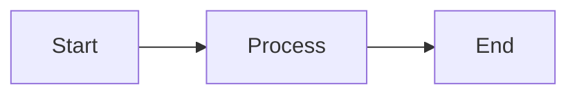
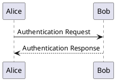
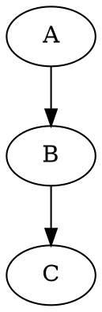

# MkDocs Material Documentation Infrastructure

A production-ready, feature-rich documentation platform built on MkDocs Material with Docker containerization. This project serves as both a **documentation infrastructure template** and a **learning playground** for exploring advanced MkDocs features.

## Project Purpose

### Purpose 1: Documentation Infrastructure

A fully-configured, reproducible documentation system with enterprise-grade features:

- **Multi-format diagram support** (Mermaid, PlantUML, Graphviz)
- **Accessibility-first** approach with automated ARIA metadata injection
- **Theme-aware diagrams** that switch seamlessly between light/dark modes
- **Interactive diagram zoom** with pan and pinch-to-zoom support
- **OpenAPI documentation** integration via Swagger UI
- **Analytics integration** with Google Analytics 4 and cookie consent
- **Custom branding** with logo and favicon support
- **Advanced navigation** with awesome-pages plugin for flexible page organization
- **Enhanced search** with highlighting, suggestions, and social sharing
- **Dockerized deployment** for consistent environments

### Purpose 2: Demo & Learning Playground

A hands-on environment for:

- Exploring MkDocs Material capabilities
- Testing diagram rendering techniques
- Learning accessibility best practices
- Experimenting with custom JavaScript/CSS/Python hooks
- Demonstrating REST API documentation patterns

### Purpose 3: Sample Content Repository

Includes practical examples:

- Country REST API documentation (OpenAPI/Swagger)
- Diagram samples across all supported formats
- Accessibility patterns and implementations
- Theme customization examples

---

## Key Features

### Advanced Diagram Support

- **Mermaid** - Flowcharts, sequence diagrams, gantt charts, git graphs
- **PlantUML** - UML diagrams with dual light/dark theme variants (local server)
- **Graphviz** - Graph visualization with DOT language support
- **Theme synchronization** - All diagrams automatically switch with site theme
- **Interactive zoom** - Click any diagram to open in lightbox with pan/zoom controls

### Accessibility Features

- **Automated ARIA injection** - Python hook adds `role="img"`, `aria-labelledby`, `tabindex="0"`
- **Semantic HTML** - Proper `<title>` and `<desc>` elements in SVGs
- **Keyboard navigation** - Full keyboard support for diagram interaction
- **Screen reader support** - Descriptive labels for assistive technologies
- **Reduced motion** - Respects `prefers-reduced-motion` preference

### Theme & UI Enhancements

- **Material Design 3** - Modern, responsive interface
- **Dark mode support** - Seamless light/dark theme switching with persistent toggle
- **Custom branding** - Custom logo (`logo.svg`) and favicon support
- **Navigation features** - Top navigation, footer links, page indexes
- **Search enhancements** - Highlighting, suggestions, social sharing
- **Code block features** - Copy button, line selection
- **Custom CSS variables** - Extensive color and typography customization (`color-vars.css`)
- **Awesome Pages** - Flexible page organization with `.pages` files
- **Open in new tab** - External links automatically open in new tabs
- **Responsive design** - Mobile-first approach

### API Documentation

- **Swagger UI integration** - Interactive API exploration via `mkdocs-swagger-ui-tag`
- **OpenAPI 3.0 support** - Full specification compatibility
- **Custom Swagger styling** - Themed Swagger UI via `swagger-custom.css`
- **Try-it-out functionality** - Test API endpoints directly in docs
- **Schema visualization** - Automatic model rendering

### Analytics & Compliance

- **Google Analytics 4** - Track documentation usage and engagement
- **Cookie consent banner** - GDPR/privacy compliance with customizable messaging
- **Privacy-focused** - User consent required before tracking
- **Effectiveness metrics** - Measure if users find what they're searching for

### Content Enhancements

- **Admonitions** - Callout boxes for notes, warnings, tips
- **Collapsible sections** - Expandable details with pymdownx.details
- **Custom fencing** - Advanced code block syntax highlighting

### Docker Integration

- **Reproducible builds** - Consistent environment across machines
- **Isolated dependencies** - No conflicts with host system
- **Easy deployment** - Single command to serve or build
- **Volume mounting** - Live reload during development
- **Local PlantUML server** - Self-hosted diagram rendering for privacy/performance

---

## Architecture

### File Structure

```
.
├── docs/                                # Documentation source
│   ├── js/                              # Custom JavaScript
│   │   ├── diagram-utils.js             # Shared utilities for diagram handling
│   │   ├── diagram-theme-switcher.js    # PlantUML/Graphviz theme switching
│   │   ├── diagram-zoom.js              # Interactive zoom/pan functionality
│   │   └── seamaiden.js                 # Mermaid theme initialization
│   ├── css/                             # Custom stylesheets
│   │   ├── diagram-zoom.css             # Lightbox styling
│   │   ├── color-vars.css               # CSS custom properties
│   │   ├── swagger-custom.css           # Swagger UI theming
│   │   ├── alphabet.css                 # Typography/font styles
│   │   └── cm-logo.css                  # Logo styling
│   ├── img/                             # Images and branding
│   │   ├── logo.svg                     # Site logo
│   │   └── favicon.ico                  # Site favicon
├── hooks/                               # Python build hooks
│   └── accessibility-injector.py        # SVG metadata injection
├── mkdocs.yml                           # MkDocs configuration
├── requirements.txt                     # Python dependencies
├── Dockerfile                           # Container definition
└── README.md                            # This file
```

### Component Interaction

```
┌─────────────────────────────────────────────────────────────┐
│                     MkDocs Build Process                     │
├─────────────────────────────────────────────────────────────┤
│  1. Markdown → HTML (MkDocs core)                           │
│  2. Diagram rendering (Mermaid/PlantUML/Graphviz plugins)   │
│     - PlantUML via local server (http://192.168.1.5:8080)   │
│  3. Accessibility injection (Python hook)                   │
│  4. Asset bundling (JavaScript/CSS)                         │
│  5. Page organization (awesome-pages plugin)                │
└─────────────────────────────────────────────────────────────┘
                              ↓
┌─────────────────────────────────────────────────────────────┐
│                    Runtime (Browser)                         │
├─────────────────────────────────────────────────────────────┤
│  diagram-utils.js     → Shared constants & helpers          │
│  seamaiden.js         → Mermaid initialization & themes     │
│  diagram-theme-switcher.js → PlantUML/Graphviz themes      │
│  diagram-zoom.js      → Interactive zoom functionality      │
│  diagram-zoom.css     → Visual styling                      │
│  Google Analytics     → Usage tracking (with consent)       │
└─────────────────────────────────────────────────────────────┘
```

## Getting Started

### Prerequisites

- Docker installed and running
- Git (for cloning the repository)
- **PlantUML Server** (required for PlantUML diagram rendering)

### Quick Start

#### 1. Start PlantUML Server

**Pull and run the PlantUML server container:**

```bash
# Pull the image (one-time)
docker pull plantuml/plantuml-server

# Run the server
docker run -d -p 8080:8080 --name plantuml-server plantuml/plantuml-server
```

**Verify it's running:**

```bash
# Check container status
docker ps | grep plantuml-server

# Test the server
curl http://localhost:8080/plantuml/
```

You should see the PlantUML web interface at `http://localhost:8080/plantuml/`

**Important:** Update `mkdocs.yml` with your PlantUML server URL:

```yaml
plugins:
  - plantuml:
      puml_url: http://192.168.1.5:8080  # Change to your server IP
```

#### 2. Clone the repository

```bash
git clone <repository-url>
cd <project-directory>
```

#### 3. Build the MkDocs Docker image

```bash
docker build -t mkdocs-material-docs .
```

#### 4. Serve locally (with live reload)

```bash
docker run --rm -p 8000:8000 -v "$(pwd)":/app mkdocs-site mkdocs serve --dev-addr=0.0.0.0:8000 --livereload
```

**Note:** The MkDocs container will connect to the PlantUML server at the configured URL. Ensure the server is accessible from the Docker container.

#### 5. Open browser

Navigate to `http://localhost:8000`

#### 6. Build static site (for deployment)

```bash
docker run --rm -v "$(pwd)":/app mkdocs-site mkdocs build --verbose && touch site/.nojekyll
```

Output will be in `./site/` directory

### Managing PlantUML Server

**Stop the server:**

```bash
docker stop plantuml-server
```

**Start the server again:**

```bash
docker start plantuml-server
```

**Remove the server:**

```bash
docker rm -f plantuml-server
```

**View server logs:**

```bash
docker logs plantuml-server
```

## Usage Guide

### Adding Diagrams

#### Mermaid Diagrams

````text

````

**Accessibility:** Use Mermaid's built-in directives:

````text

````

#### PlantUML Diagrams

````text
<!-- diagram-a11y: title="User Authentication Flow" desc="Sequence diagram showing login process" -->

````

**Note:** The HTML comment provides accessibility metadata injected during build.

#### Graphviz Diagrams

````text
<!-- diagram-a11y: title="System Architecture" desc="High-level component diagram" -->

````

### Interactive Features

- **Zoom:** Click any diagram to open in lightbox
- **Pan:** Click and drag to move zoomed diagram
- **Zoom in/out:** Mouse wheel or pinch gesture
- **Reset:** Double-click to reset zoom
- **Close:** Click outside diagram or press `Escape`

### Theme Switching

Toggle between light/dark modes using the palette icon in the header. All diagrams automatically update to match the selected theme.

### API Documentation

Include OpenAPI specifications using the Swagger UI tag:

```markdown
<swagger-ui src="path/to/openapi.yaml"/>
```

## Configuration

### Key Files

#### `mkdocs.yml`

Main configuration file. Key sections:

- `theme`: Material theme settings
- `plugins`: Enabled plugins (search, diagrams, Swagger UI)
- `extra_javascript`: Custom scripts (load order matters!)
- `extra_css`: Custom stylesheets
- `hooks`: Python build hooks

#### Script Loading Order (Critical!)

```yaml
extra_javascript:
  # 1. Load external libraries first
  - https://cdn.jsdelivr.net/npm/mermaid@10/dist/mermaid.min.js
  
  # 2. Load shared utilities
  - js/diagram-utils.js
  
  # 3. Load dependent scripts
  - js/seamaiden.js
  - js/diagram-theme-switcher.js
  - js/diagram-zoom.js
```

#### `Dockerfile`

Container configuration. Includes:
- Base Python image
- MkDocs Material and plugins
- PlantUML/Graphviz dependencies
- Working directory setup

## Development

### Local Development (without Docker)

If you prefer working without Docker:

1. **Install Python dependencies**
   ```bash
   pip install mkdocs-material mkdocs-mermaid2-plugin mkdocs-swagger-ui-tag
   pip install mkdocs-kroki-plugin  # For PlantUML/Graphviz
   pip install beautifulsoup4 lxml  # For accessibility hook
   ```

2. **Serve locally**
   ```bash
   mkdocs serve
   ```

3. **Build site**
   ```bash
   mkdocs build
   ```

### Adding New Diagrams

1. **Choose diagram type** based on use case:
   - **Mermaid** - Quick flowcharts, sequences, timelines
   - **PlantUML** - Complex UML diagrams
   - **Graphviz** - Graph theory, network diagrams

2. **Add accessibility metadata**:
   - **Mermaid**: Use `accTitle` and `accDescr` directives
   - **PlantUML/Graphviz**: Add HTML comment with `diagram-a11y:` prefix

3. **Test theme switching** - Verify diagram updates in both light/dark modes

4. **Test zoom functionality** - Ensure diagram is clickable and zoomable

### Customizing Styles

Edit `docs/css/diagram-zoom.css` to customize:
- Lightbox appearance
- Zoom animation timing
- Colors and shadows
- Dark mode variants

CSS uses custom properties for easy theming:
```css
:root {
  --mz-overlay-bg: rgba(0, 0, 0, 0.65);
  --mz-svg-bg: var(--md-default-bg-color, #fff);
  --mz-fade-duration: 0.18s;
}
```

### Extending Functionality

The modular architecture makes it easy to add features:

1. **New diagram type**: Add selector to `diagram-utils.js` CONSTANTS
2. **Custom theme**: Modify theme logic in `diagram-theme-switcher.js`
3. **New accessibility rule**: Update `accessibility-injector.py`

## Testing

### Manual Testing Checklist

- [ ] **Diagram Rendering**
  - [ ] Mermaid diagrams display correctly
  - [ ] PlantUML diagrams display correctly
  - [ ] Graphviz diagrams display correctly

- [ ] **Theme Switching**
  - [ ] Toggle light/dark mode
  - [ ] Verify all diagrams update
  - [ ] Check colors and contrast

- [ ] **Zoom Functionality**
  - [ ] Click diagram to open lightbox
  - [ ] Mouse wheel zoom works
  - [ ] Pan by dragging works
  - [ ] Pinch-to-zoom on mobile
  - [ ] Double-click resets zoom
  - [ ] Escape key closes lightbox

- [ ] **Accessibility**
  - [ ] Tab through diagrams with keyboard
  - [ ] Screen reader announces diagram titles
  - [ ] ARIA attributes present in SVGs
  - [ ] Reduced motion preference respected

- [ ] **Navigation**
  - [ ] Instant navigation works
  - [ ] Diagrams load on new pages
  - [ ] No console errors

### Browser Console Checks

Enable debug mode in scripts to see detailed logging:
```javascript
const CONFIG = {
  debugMode: true  // Set to true for verbose logging
};
```

Look for console messages:
- `[diagram-utils]` - Utility initialization
- `[diagram-theme]` - Theme switching events
- `[zoom]` - Zoom binding and interactions
- `[seamaiden]` - Mermaid initialization

## API Documentation Example

This project includes a **Country REST API** demonstration showcasing:

- **CRUD operations** - Create, Read, Update, Delete country records
- **Search & filtering** - Query by name, region, population
- **Pagination** - Efficient handling of large datasets
- **Error handling** - Standard HTTP status codes
- **Data validation** - Request/response schema validation

## Learning Resources

### Diagram Syntax References
- [Mermaid Documentation](https://mermaid.js.org/)
- [PlantUML Guide](https://plantuml.com/)
- [Graphviz Documentation](https://graphviz.org/documentation/)

### MkDocs Material
- [Official Documentation](https://squidfunk.github.io/mkdocs-material/)
- [Plugin Reference](https://squidfunk.github.io/mkdocs-material/plugins/)
- [Customization Guide](https://squidfunk.github.io/mkdocs-material/customization/)

### Accessibility
- [WAI-ARIA Authoring Practices](https://www.w3.org/WAI/ARIA/apg/)
- [SVG Accessibility](https://www.w3.org/TR/SVG-access/)
- [WCAG 2.1 Guidelines](https://www.w3.org/WAI/WCAG21/quickref/)

## Contributing

This is a template/learning project, but contributions are welcome:

1. **Report issues** - Found a bug? Open an issue
2. **Suggest features** - Ideas for improvements
3. **Submit PRs** - Code contributions welcome
4. **Share examples** - Add interesting diagram samples

## License

Yeah, right.

## Acknowledgments

Built with:
- [MkDocs Material](https://squidfunk.github.io/mkdocs-material/) by squidfunk
- [Mermaid](https://mermaid.js.org/) for diagram rendering
- [PlantUML](https://plantuml.com/) for UML diagrams
- [Graphviz](https://graphviz.org/) for graph visualization
- Various MkDocs plugins by the community

##  Support

- **Issues**: Use GitHub Issues for bug reports
- **Discussions**: Use GitHub Discussions for questions
- **Documentation**: Refer to inline code comments and this README

## Roadmap

Future enhancements:
- [ ] Add more diagram examples (state machines, ER diagrams, C4 models)
- [ ] Implement diagram export functionality
- [ ] Add CI/CD pipeline for automated builds
- [ ] Create diagram template library
- [ ] Add multilingual support examples
- [ ] Integrate more API documentation formats (AsyncAPI, GraphQL)

**Happy documenting!**


