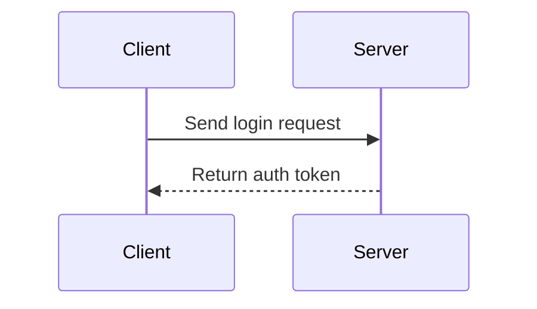
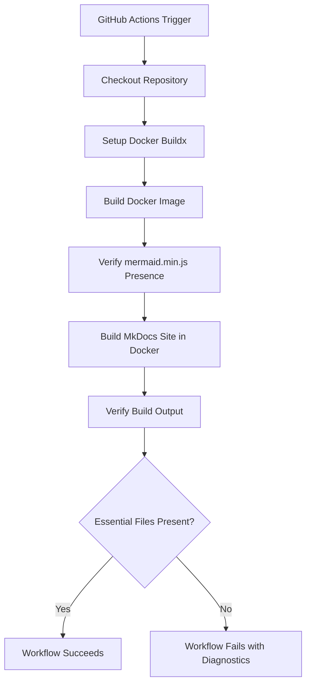

# Refactoring

## Sequence

```mermaid
sequenceDiagram
  participant Client
  participant Server
  Client->>Server: Send login request
  Server-->>Client: Return auth token
```

## Flowchart  

```mermaid
graph TD
    trigger["GitHub Actions Trigger"]
    checkout["Checkout Repository"]
    buildx["Setup Docker Buildx"]
    dockerBuild["Build Docker Image"]
    verifyMermaid["Verify mermaid.min.js Presence"]
    mkdocsBuild["Build MkDocs Site in Docker"]
    verifyOutput["Verify Build Output"]
    essentialCheck{"Essential Files Present?"}
    success["Workflow Succeeds"]
    fail["Workflow Fails with Diagnostics"]
    
    trigger --> checkout
    checkout --> buildx
    buildx --> dockerBuild
    dockerBuild --> verifyMermaid
    verifyMermaid --> mkdocsBuild
    mkdocsBuild --> verifyOutput
    verifyOutput --> essentialCheck
    essentialCheck -->|Yes| success
    essentialCheck -->|No| fail
```