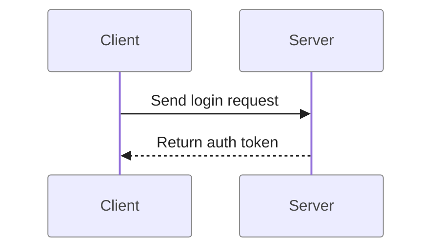
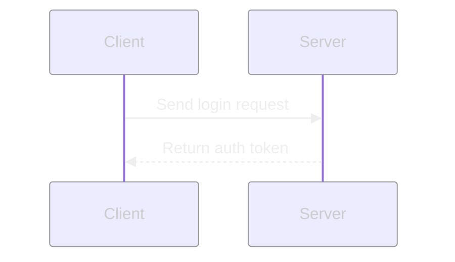
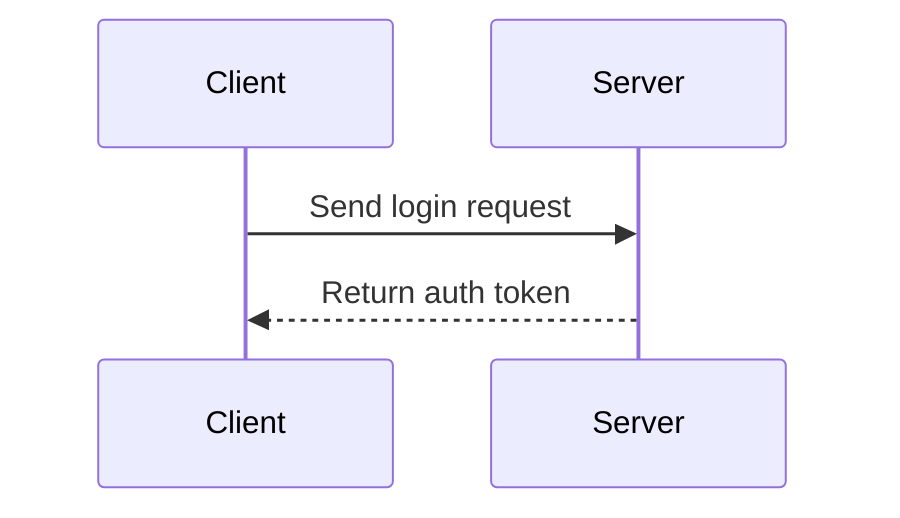
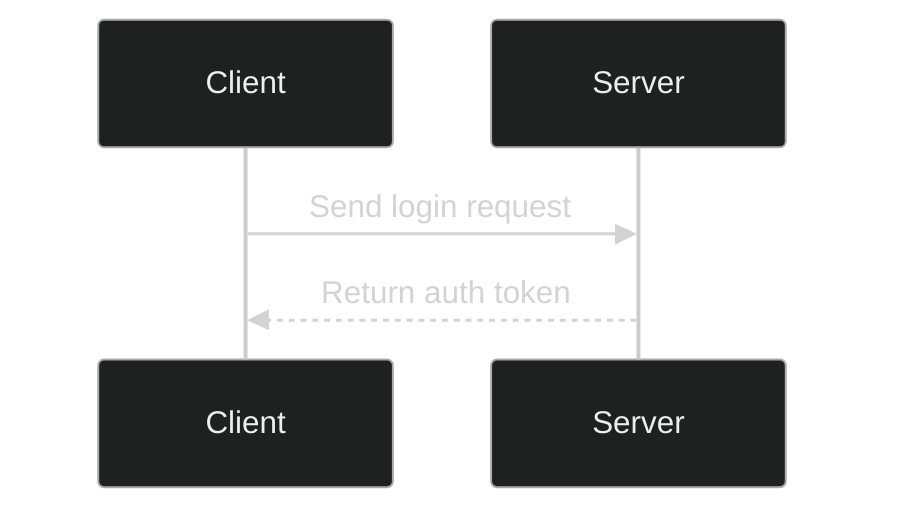
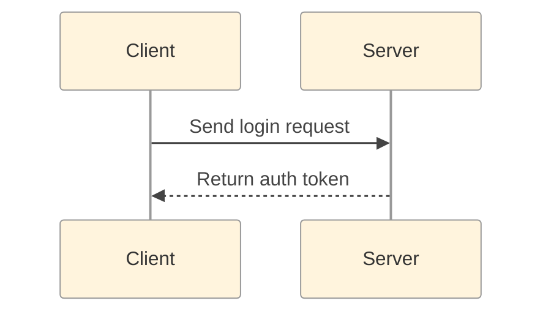
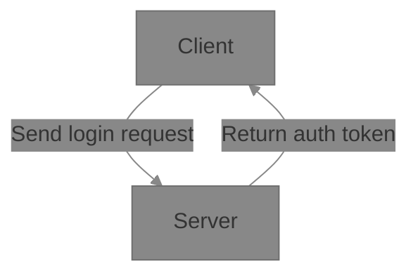
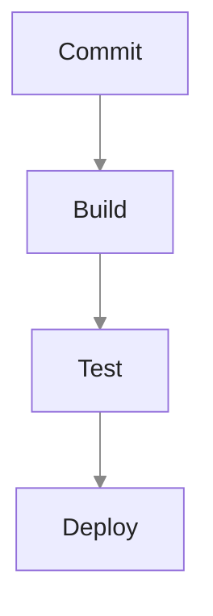

# Refactoring

## Sequence

### 1st Iteration

### 2nd Iteration

### 3rd Iteration

### 4th Iteration

### 5th Iteration

### Iteration 6

### Iteration 7
sequence diagrams as flowcharts

## Flowchart

