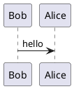
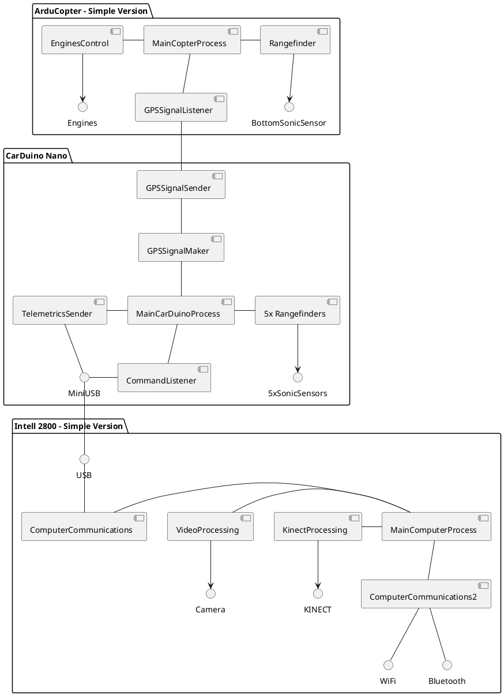
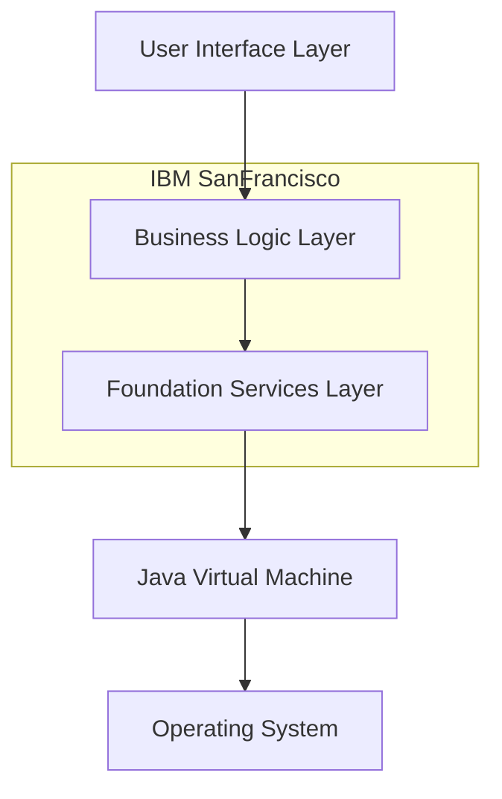
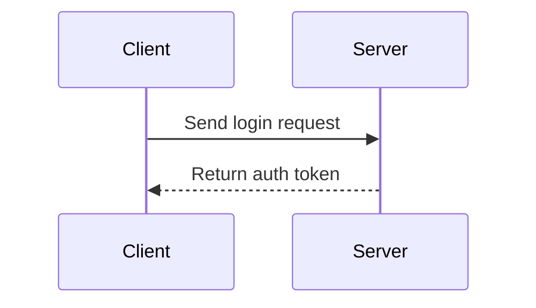
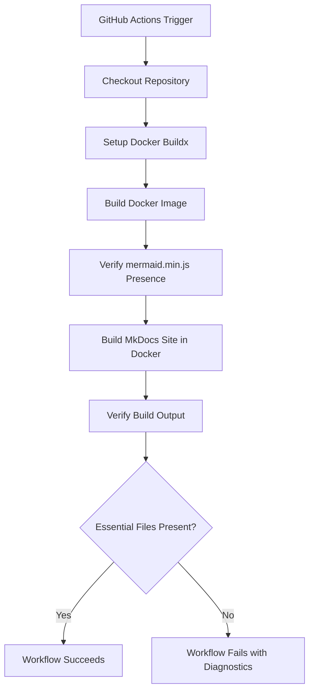

# Refactoring

## PlantUML

```puml
    @startuml
    Bob -> Alice : hello
    @enduml
```

```puml
    @startuml
    package "ArduCopter - Simple Version" {
    [EnginesControl] -down-> Engines
    [EnginesControl] - [MainCopterProcess]
    [MainCopterProcess] - [Rangefinder]
    [Rangefinder] -down-> BottomSonicSensor
    [MainCopterProcess] -down- [GPSSignalListener]
    }
    package "CarDuino Nano" {
    [GPSSignalMaker] -down- [MainCarDuinoProcess]
    [MainCarDuinoProcess] -down- [CommandListener]
    [GPSSignalMaker] -up- [GPSSignalSender]
    [MainCarDuinoProcess] - [5x Rangefinders]
    [5x Rangefinders] -down-> 5xSonicSensors
    [TelemetricsSender] - [MainCarDuinoProcess]
    [TelemetricsSender] -down- MiniUSB
    [CommandListener] -left- MiniUSB
    }
    package "Intell 2800 - Simple Version" {
    [ComputerCommunications] -up- USB
    [ComputerCommunications] - [MainComputerProcess]
    [KinectProcessing] -down-> KINECT
    [KinectProcessing] - [MainComputerProcess]
    [VideoProcessing] -down-> Camera
    [VideoProcessing] - [MainComputerProcess] 
    [ComputerCommunications2] -up- [MainComputerProcess]
    [ComputerCommunications2] -down- WiFi
    [ComputerCommunications2] -down- Bluetooth
    }
    [GPSSignalListener] -down- [GPSSignalSender]
    USB -up- MiniUSB
    @enduml
```

## With metadata

```mermaid
flowchart TB
    accTitle: IBM SanFrancisco Layered Architecture
    accDescr: Diagram showing IBM SanFrancisco's layered architecture. Arrows connect layers from top to bottom: User Interface → Business Logic → Foundation Services → JVM → Operating System. SanFrancisco encompasses the Business Logic and Foundation layers, positioned between application code and the JVM.
    
    UI[User Interface Layer] --> BL[Business Logic Layer]
    BL --> FS[Foundation Services Layer]
    FS --> JVM[Java Virtual Machine]
    JVM --> OS[Operating System]
    subgraph IBM_SanFrancisco["IBM SanFrancisco"]
        BL
        FS
    end
```

## Sequence

```mermaid
sequenceDiagram
  participant Client
  participant Server
  Client->>Server: Send login request
  Server-->>Client: Return auth token
```

## Flowchart  

```mermaid
graph TD
    trigger["GitHub Actions Trigger"]
    checkout["Checkout Repository"]
    buildx["Setup Docker Buildx"]
    dockerBuild["Build Docker Image"]
    verifyMermaid["Verify mermaid.min.js Presence"]
    mkdocsBuild["Build MkDocs Site in Docker"]
    verifyOutput["Verify Build Output"]
    essentialCheck{"Essential Files Present?"}
    success["Workflow Succeeds"]
    fail["Workflow Fails with Diagnostics"]
    
    trigger --> checkout
    checkout --> buildx
    buildx --> dockerBuild
    dockerBuild --> verifyMermaid
    verifyMermaid --> mkdocsBuild
    mkdocsBuild --> verifyOutput
    verifyOutput --> essentialCheck
    essentialCheck -->|Yes| success
    essentialCheck -->|No| fail
```