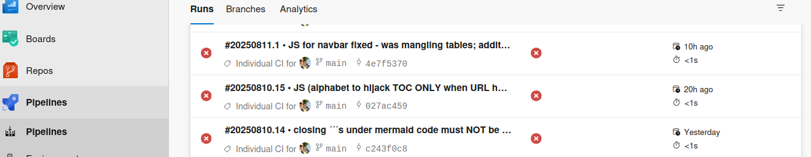
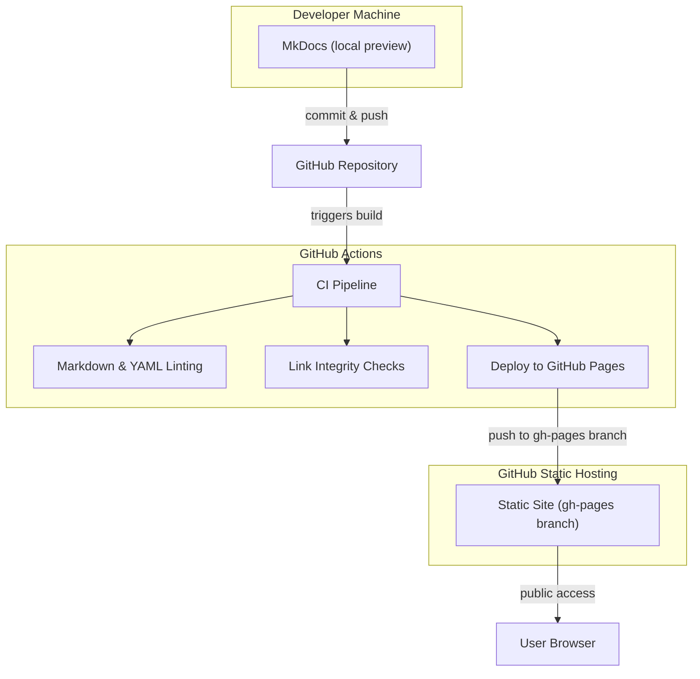

# How This Site Was Developed and Deployed

Back in 2021, while working for a cloud-native device provisioning company, I had a 'flirt' with MKdocs and GitHub, which I used to start an OSS (Operational Support Systems) glossary. And shelved it.

In August 2025, when I decided to submit this profile for consideration by — you-know-who, I unearthed what I had, created a number of new topics (see [Whats in Here?](whatsinhere.md)), 'containerized' the dynamic (development) layer and deployed the project (site) via GitHub Pages.

I had ample opportunity to play and familiarize with various features, constructs, mechanisms, processes and bugs. So, thank you, irrespective of the outcome of the 'demo'.

Much of the fun came from pretending to be a team — pulling from the remote repo to my Mac in the morning, then pushing back in the evening... followed by pulling from my Linux machine the next morning and pushing again to the remote. I just hope I don’t end up with a permanently split personality.



## Architecture Overview

This site is deployed using a hybrid static-dynamic architecture, containerized with Docker and served via GitHub. It is built with MkDocs, a Python-based static site generator/platform, and enhanced with Mermaid.js for diagram rendering.

### Static Site Layer

- **Framework**: MkDocs with Material theme
- **Content**: Markdown-based documentation rendered into static HTML/CSS/JS
- **Build Process**: Dockerized using a reproducible pipeline with `requirements.txt`
- **Serving Method**: Static assets deployed to GitHub Pages

### Dynamic Layer

- **Development Server**: MkDocs live reload enabled via polling-based file watcher
- **Environment Variable**: `MKDOCS_WATCHDOG_USE_POLLING=true` set in Dockerfile
- **Live Preview**: served via `mkdocs serve` inside Docker container
- **Plugin Support**: `mkdocs-mermaid2-plugin` installed and configured for diagram rendering
- **Enhancements and Customizations**: 1. custom JS/CSS, for 'hijacking' the native TOC at the right-hand sidebar in glossaries and replacing it with a vertical hypertext alphabet — for improved navigation; 2. Spotlight JS, to enhance diagrams with overlays/zoom capability (not working \[yet])

#### Tools Used

- **macOS**: iterm2, Docker, VS Code, BBedit, Safari, Firefox
- **Linux**: xfce4-terminal, Docker, VSCodium, xed, Chrome, Firefox

### Docker Environment

```Dockerfile
ENV PIP_ROOT_USER_ACTION=ignore
ENV PIP_DISABLE_PIP_VERSION_CHECK=1
ENV MKDOCS_WATCHDOG_USE_POLLING=true
```

- All dependencies installed via `requirements.txt`
- Clean build logs with suppressed pip notices
- Container exposes port 8000 for local development

### CI/CD Pipeline

#### Build Stage

- Docker image builds for MkDocs static site
- Site artifacts generated via `mkdocs build` inside containerized environment

#### Test Stage

- Markdown linting (`markdownlint`, `mdl`)
- Link integrity checks (`lychee`, `markdown-link-check`)
- YAML and config validation for reproducibility

#### Deployment Stage

- GitHub Actions workflow deploys:
  - Static site to GitHub Pages via `gh-pages` branch  
  - No backend container or server-side components involved

#### Monitoring Stage

- GitHub Actions logs and build artifacts retained for audit
- Manual verification of site integrity and link health
- No active container monitoring or external observability stack

### Deployment Flow

The following is the deployment flow, visually:  




## Pros

- Cross-platform reproducibility via Docker
- Modular architecture: decoupled frontend/backend
- CI/CD automation and security-first mindset

## Future Enhancements (next phase)

- **Move to Azure DevOps** as a learning exercise
- **Auth Gate**: Azure AD B2C or custom JWT-based login
- **Audit Logging**: Azure Monitor or Application Insights
- **Secrets Management**: Azure Key Vault
- **Backend Extensibility**: Modular API endpoints, possibly containerized
- **Role-based Access**: For editing, viewing, or admin tasks
- **CI/CD Enhancements**: Parallel jobs, conditional stages, test coverage
- **.JS/CSS enhancements**: Perhaps consider, for 'pure' glossaries, making the "active letter highlight" stick until the user scrolls past to the next letter. (Right now, it only changes once the next letter’s row reaches the top of the view.)
