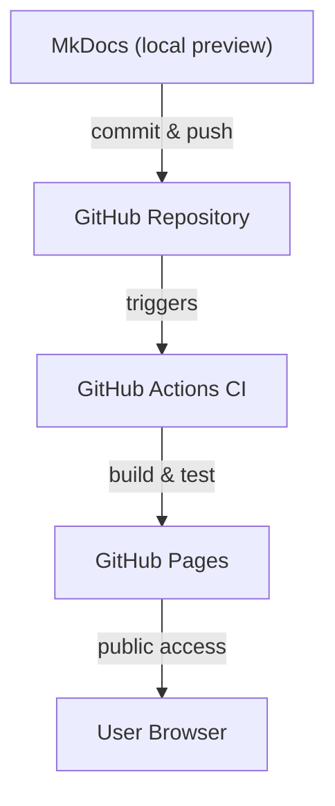

# How This Site Was Developed and Deployed

In August 2025, I revived an old MkDocs-based glossary project and transformed it into a modular, containerized showcase site. The goal: demonstrate CI/CD automation, accessibility compliance, and reproducibility. And of course, learn something new.

## Architecture Overview

This site uses a hybrid static-dynamic architecture:

### Static Layer

- **Framework**: MkDocs with Material theme
- **Content**: Markdown rendered into static HTML/CSS/JS
- **Deployment**: GitHub Pages via `gh-pages` branch
- **Enhancements**:
  - Custom JS/CSS for glossary navigation
  - Diagram spotlight/zoom via `diagram-zoom.js`
  - Alt-text injection via `alt-injector.js`
  - Focus ring, skip link, ARIA toggles, keyboard nav

### Dynamic Layer

- **Live Preview**: `mkdocs serve` inside Docker
- **Environment**: `MKDOCS_WATCHDOG_USE_POLLING=true`
- **Plugin**: `mkdocs-mermaid2-plugin` for diagrams

### Docker Environment

```Dockerfile
ENV PIP_ROOT_USER_ACTION=ignore
ENV PIP_DISABLE_PIP_VERSION_CHECK=1
ENV MKDOCS_WATCHDOG_USE_POLLING=true
```
- Dependencies via `requirements.txt`
- Port 8000 exposed for local dev

### CI/CD Pipeline (GitHub Actions)

- **Build**: Dockerized `mkdocs build`
- **Test**: Markdown linting, link checks, YAML validation
- **Deploy**: Static site pushed to GitHub Pages
- **Monitor**: Manual integrity checks, audit logs retained
### Extra Scripts

All scripts are stored in `docs/assets/js/` and loaded via `extra_javascript` in `mkdocs.yml`:

- `alphabet-auto.js`: vertical hypertexted alphabet in sidebar for navigating glossaries
- `diagram-zoom.js`: Spotlight/zoom for diagrams 
- `alt-injector.js`: injects alt-text and ARIA roles for accessibility (see also <<>>)

> **Note:** One script, `/docs/assets/py/inject_svg_metadata.py`, runs post-build by a GitHub Actions runner, to inject SVG metadata for making alternative text discoverable by screen readers.

### CSS Enhancements

Stored in `docs/assets/css/` and loaded via `extra_css`:

- `alphabet.css`: works in tandem with `alphabet-auto.js`
- `diagram-zoom.css`: works in tandem with `diagram-zoom.js`

### Deployment Flow

<!-- ALT: Diagram showing a 5-phase workflow; Phase 1 is MKdocs (local preview); a commit and push arrow moves to phase 2 (GitHub Repo); a trigger arrow moves to phase 3 (GitHub Actions CI), then a build & test arrow moves to phase 4 (GitHub Pages), from which a public access arrow moves to the final phase (User Browser) -->


## Tools Used

- **macOS**: Docker, VS Code, BBedit, Safari, Firefox
- **Linux**: Docker, VSCodium, xed, Chrome, Firefox

## Future Enhancements

- Azure DevOps migration
- Auth gate (Azure AD B2C or JWT)
- Audit logging (Azure Monitor)
- Secrets management (Key Vault)
- Role-based access
- CI/CD parallel jobs