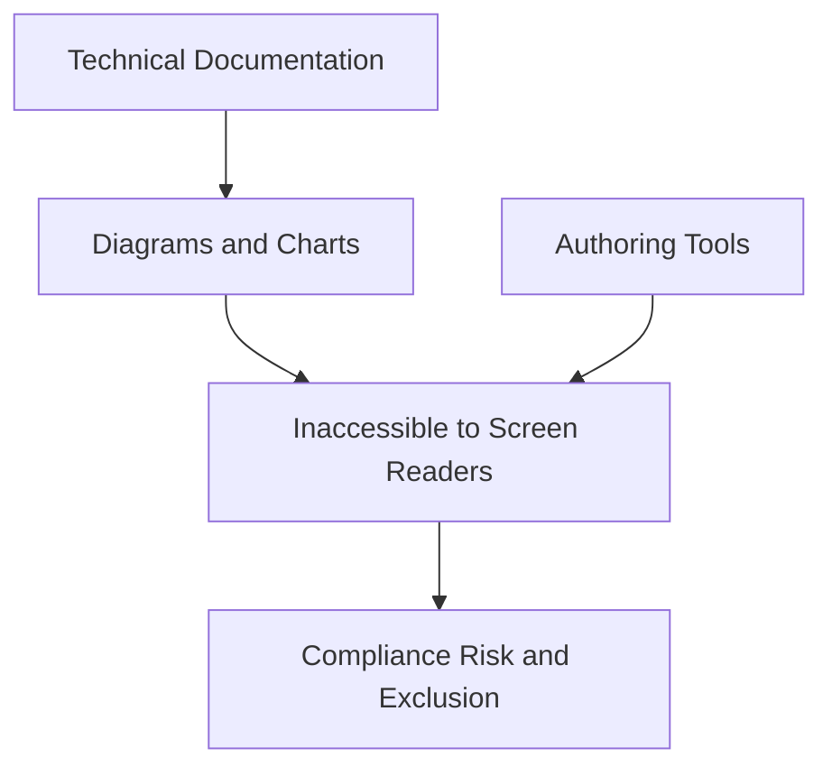
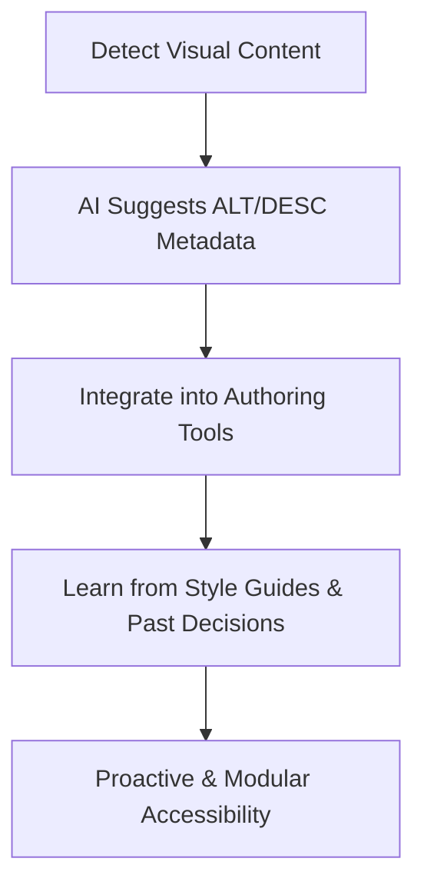
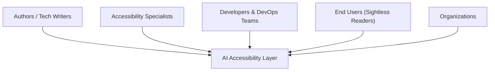
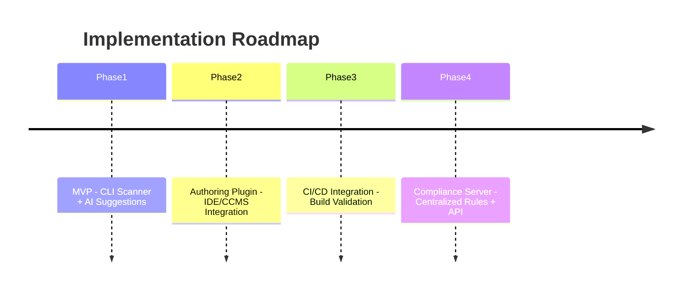
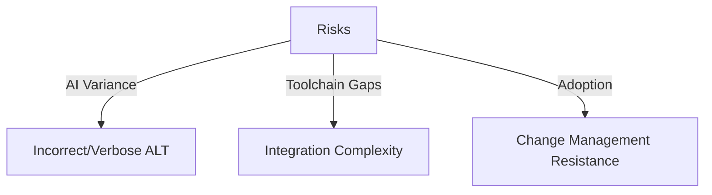
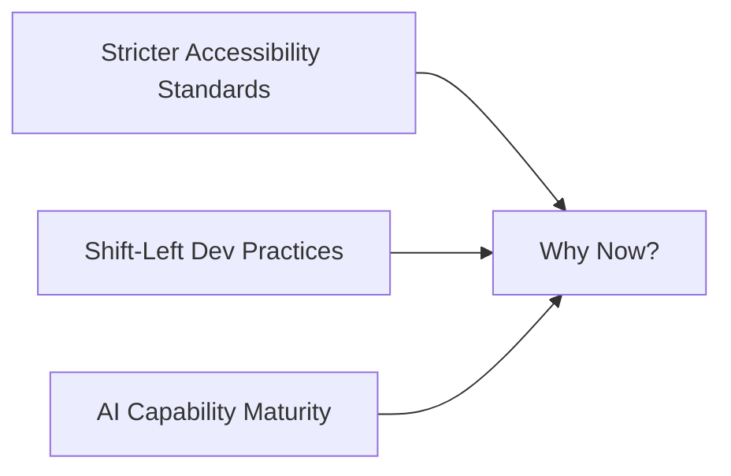

# A Concept Note: AI-Augmented Accessibility

## 1. Problem Statement

Modern technical documentation has embraced **automation and modularity** (e.g., reusable Markdown, generated diagrams, CI/CD publishing). Yet accessibility has not kept pace:

* **Visual content** — diagrams, flowcharts, SVGs, charts — remains largely inaccessible to screen readers.
* Even when ALT text exists, it is often **minimal (“flowchart of states”)** and lacks the **semantic depth** needed for real comprehension.
* Current documentation tools (MkDocs, Mermaid, PlantUML, etc.) offer limited or unreliable support for accessibility metadata.
* Authors face **high friction** : workarounds, inconsistent ARIA support, and testing overhead.
* As documentation scales, so does the **risk of inaccessible content** . This exposes organizations to compliance gaps (WCAG, AODA) and erodes inclusivity.

Accessibility today is often a **bolt-on** fix, rather than a **built-in** practice.

---

## 2. Proposed Solution

Introduce an **AI-augmented accessibility layer** that:

* **Detects** visual content across formats (Mermaid, PlantUML, SVG, PNG, Canvas).
* **Suggests** meaningful ALT and DESC metadata, leveraging retrieval-augmented generation (RAG) to use local glossary/context.
* **Integrates** into authoring tools (IDE plugins, XML editors, CCMS platforms).
* **Learns** from organizational style guides and past authoring decisions.

This ensures accessibility is **proactive, reproducible, and modular** — just like other parts of the documentation stack.

---

## 3. Value Proposition

**For Authors:**  
- Saves time by drafting metadata automatically.  
- Provides inline feedback and compliance checks during authoring.  
- Reduces the cognitive load of remembering accessibility rules.  

**For Readers (esp. sightless users):**  
- Delivers meaningful, contextual descriptions of diagrams.  
- Improves engagement and comprehension beyond bare compliance.  

**For Organizations:**  
- Reduces legal/compliance risk (ADA/AODA, WCAG 2.2).  
- Scales accessibility consistently across large doc sets.  
- Enhances inclusivity and brand reputation.  

---

## 4. Implementation Roadmap (Incremental Approach)

**Phase 1 – MVP**
* CLI tool scans Markdown/diagrams for missing ALT text.
* AI API optional suggestions.

**Phase 2 – Authoring Plugin**
* IDE/CCMS integration.
* Inline suggestions + preview.
* MCP server glossary-aware generation.

**Phase 3 – CI/CD Integration**
* GitHub Action or CLI validator.
* Accessibility failures flagged in builds.

**Phase 4 – Metadata and Compliance Server**
* Centralized enforcement.
* RAG-powered glossary/context.
* API for org-wide adoption.

---

## 5. Key Stakeholders  

The key stakeholders of the concept/proposal are:

* **Authors / Technical Writers**
* **Accessibility Specialists**
* **Developers and DevOps Teams**
* **End Users (esp. sightless readers)**
* **Organizations**

---

## 6. Risks and Considerations

* **AI quality variance** – risk of incorrect/verbose ALT text.
* **Integration complexity** – different doc toolchains.
* **Change management** – author adoption and trust.

---

## 7. Why Now

* Accessibility requirements are tightening (WCAG 2.2, AODA).
* Developer ecosystems are embracing **shift-left** quality checks.
* AI capabilities are maturing for **context-aware generation**.

---

**Conclusion:**

By embedding AI-driven accessibility checks into the authoring and publishing workflow, we can shift accessibility from a reactive fix to a proactive standard. This approach not only helps organizations comply but ensures that *all* readers — sighted or sightless — engage with technical content meaningfully.

2025.08.19