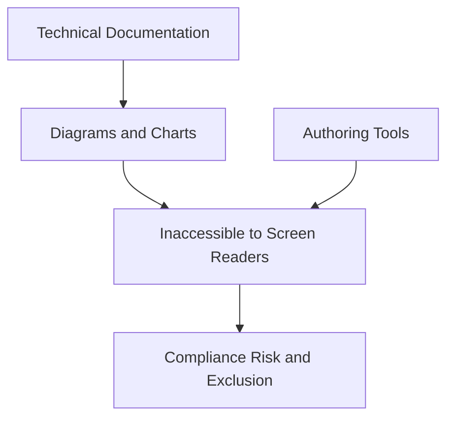
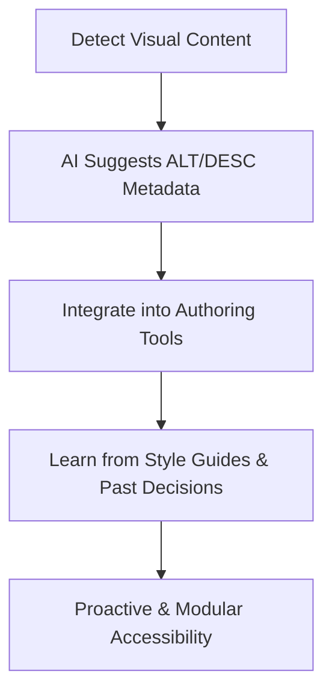
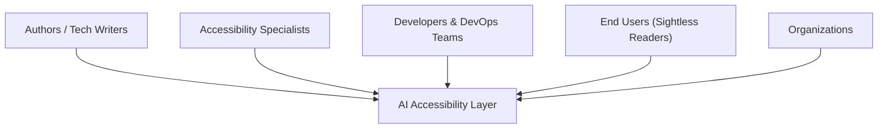
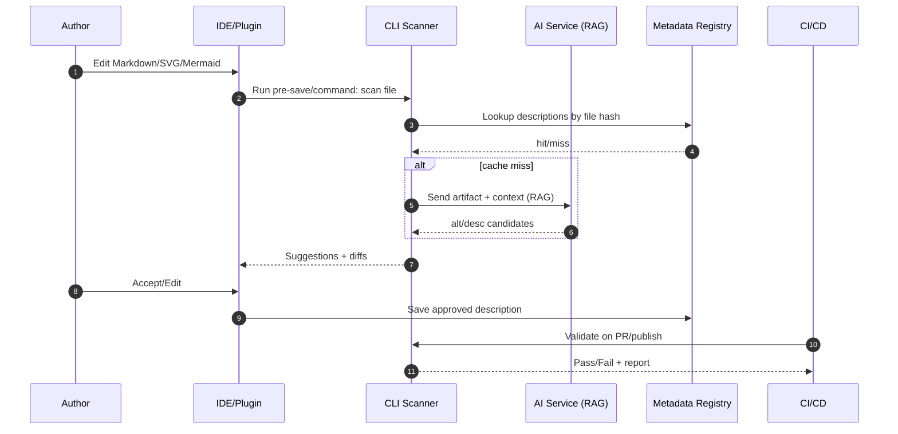
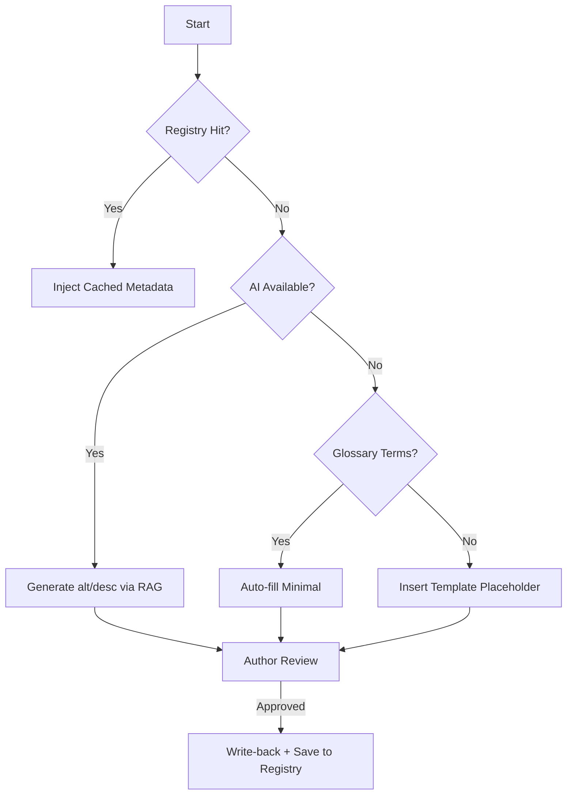
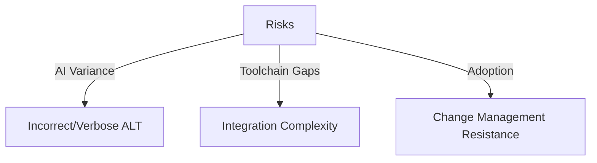
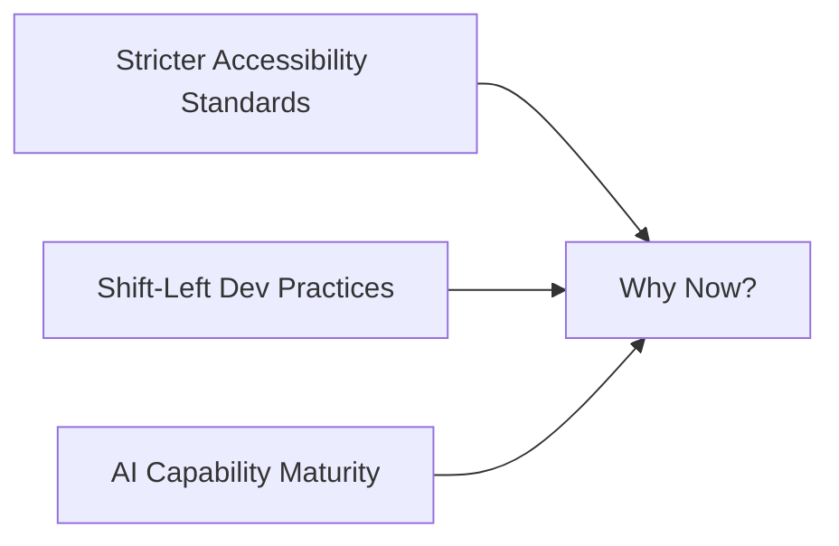

# A Concept Note: AI‑Augmented Accessibility

## 1. Problem Statement

Modern technical documentation has embraced **automation and modularity** (e.g., reusable Markdown, generated diagrams, CI/CD publishing). Yet accessibility has not kept pace:

* **Visual content** — diagrams, flowcharts, SVGs, charts — remains largely inaccessible to screen readers.
* Even when ALT text exists, it is often **minimal (“flowchart of states”)** and lacks the **semantic depth** needed for real comprehension.
* Current documentation tools (MkDocs, Mermaid, PlantUML, etc.) offer limited or unreliable support for accessibility metadata.
* Authors face **high friction** : workarounds, inconsistent ARIA support, and testing overhead.
* As documentation scales, so does the **risk of inaccessible content** . This exposes organizations to compliance gaps (WCAG, AODA) and erodes inclusivity.

Accessibility today is often a **bolt-on** fix, rather than a **built‑in** practice.



---

## 2. Proposed Solution

Introduce an **AI‑augmented accessibility layer** that:

* **Detects** visual content across formats (Mermaid, PlantUML, SVG, PNG, Canvas).
* **Suggests** meaningful ALT and DESC metadata, leveraging retrieval‑augmented generation (RAG) to use local glossary/context.
* **Integrates** into authoring tools (IDE plugins, XML editors, CCMS platforms).
* **Learns** from organizational style guides and past authoring decisions.

This ensures accessibility is **proactive, reproducible, and modular** — just like other parts of the documentation stack.



---

## 3. Value Proposition

**For Authors:**

* Saves time by drafting metadata automatically.
* Provides inline feedback and compliance checks during authoring.
* Reduces the cognitive load of remembering accessibility rules.

**For Readers (esp. sightless users):**

* Delivers meaningful, contextual descriptions of diagrams.
* Improves engagement and comprehension beyond bare compliance.

**For Organizations:**

* Reduces legal/compliance risk (ADA/AODA, WCAG 2.2).
* Scales accessibility consistently across large doc sets.
* Enhances inclusivity and brand reputation.



---

## 4. Implementation Roadmap (Incremental Approach)

**Phase 1 – MVP**

* CLI tool scans Markdown/diagrams for missing ALT text.
* AI API optional suggestions.

**Phase 2 – Authoring Plugin**

* IDE/CCMS integration.
* Inline suggestions + preview.
* MCP server glossary‑aware generation.

**Phase 3 – CI/CD Integration**

* GitHub Action or CLI validator.
* Accessibility failures flagged in builds.

**Phase 4 – Metadata and Compliance Server**

* Centralized enforcement.
* RAG‑powered glossary/context.
* API for org‑wide adoption.

| Phase   | Feature                                   | Wks from Start |
| --------- | -------------------------------------------- | :----------: |
| Phase 1 | MVP: CLI Scanner + AI Suggestions          | 4  |
| Phase 2 | Authoring Plugin: IDE/CCMS Integration     | 10  |
| Phase 3 | CICD Integration: Build Validation         | 14  |
| Phase 4 | Compliance Server: Centralized Rules + API | 18  |

---

## 4b. Metadata Injection Workflow (Technical Outline)

Accessibility metadata is injected at the point of **artifact generation** or **publication** .



### 1) Detection

* **Parsers** : Markdown, HTML, and SVG parsers (e.g., remark/rehype or custom AST) identify: ``, `<svg>`, Mermaid/PlantUML blocks, `<canvas>` snapshots.
* **Heuristics** : Missing or low‑quality `alt` (e.g., matches `/^(image|diagram|chart)/i`).
* **Context capture** : Surrounding headings/paragraphs + file path feed RAG.

**Example: minimal Python CLI detector**

```python
# detect.py
import re, sys, json, hashlib, pathlib

IMG_MD = re.compile(r"!\[(?P<alt>[^\]]*)\]\((?P<src>[^\s\)]+)(?:\s+\"(?P<title>[^\"]*)\")?\)")

LOW_ALT = re.compile(r"^(?:|image|diagram|chart|graph|figure)\b", re.I)


def hash_file(path):
    p = pathlib.Path(path)
    if not p.exists():
        return None
    h = hashlib.sha256()
    h.update(p.read_bytes())
    return h.hexdigest()


def scan_markdown(md_text, base_dir="."):
    findings = []
    for m in IMG_MD.finditer(md_text):
        alt, src = m.group("alt"), m.group("src")
        needs = (not alt) or LOW_ALT.match(alt or "")
        if needs:
            findings.append({
                "kind": "img_md",
                "span": m.span(),
                "src": src,
                "hash": hash_file(pathlib.Path(base_dir) / src)
            })
    return findings

if __name__ == "__main__":
    text = sys.stdin.read()
    print(json.dumps(scan_markdown(text), indent=2))
```

### 2) Suggestion (AI + RAG) & Author Review

* **Inputs** : artifact (SVG source or PNG), local context (heading, preceding paragraph), glossary entries.
* **Outputs** : short `alt` (<= 125 chars), longer `desc`/`longdesc` (1–5 sentences), optional `data-roles`.
* **Human‑in‑the‑loop** : IDE panel shows candidates with quick‑accept and edit.

**Pseudo‑API call**

```python
# suggest.py (pseudo)
from typing import Dict

def suggest_alt_desc(artifact_bytes: bytes, mime: str, context: Dict) -> Dict:
    payload = {
        "artifact": artifact_bytes.decode("utf-8", errors="ignore") if mime=="image/svg+xml" else None,
        "mime": mime,
        "context": context,  # {heading, paragraph, glossary_terms}
        "targets": {"alt": True, "desc": True}
    }
    # POST to AI endpoint; handle timeouts & retries
    # response = http.post(...)
    response = {
        "alt": "State machine for order lifecycle (new → paid → shipped → delivered).",
        "desc": "Flow begins at 'new', transitions to 'paid' after payment, then 'shipped', and ends at 'delivered'. Includes cancel path from 'new' and 'paid'."
    }
    return response
```

### 3) Injection (Write‑back)

* **SVG** : ensure `<title>` and `<desc>` children exist; replace or append.
* **Markdown** : rewrite image line to include alt and optional title.
* **HTML** : add/replace `alt`, `aria-label`, link to `longdesc` if produced.

**Example: inject into SVG**

```python
# inject_svg.py
import sys
import xml.etree.ElementTree as ET

svg = ET.parse(sys.argv[1])
root = svg.getroot()

# strip existing title/desc
for tag in list(root):
    if tag.tag.endswith('title') or tag.tag.endswith('desc'):
        root.remove(tag)

# inject
title = ET.Element('title'); title.text = sys.argv[2]
desc = ET.Element('desc'); desc.text  = sys.argv[3]
root.insert(0, title)
root.insert(1, desc)

svg.write(sys.argv[1], encoding='utf-8', xml_declaration=True)
```

**Example: rewrite Markdown image**

```python
# inject_md.py
import re, sys
IMG_MD = re.compile(r"!\[[^\]]*\]\(([^\s\)]+)(?:\s+\"[^\"]*\")?\)")
alt = sys.argv[1]
text = sys.stdin.read()
print(IMG_MD.sub(lambda m: f"})", text))
```

### 4) Failback Options (when AI or context is unavailable)

1. **Template** : Insert structured placeholder (explicitly actionable):
   * `alt: "Diagram – description pending; CI ticket #123"`
   * `desc: "TODO: Provide narrative covering nodes, edges, and flow conditions."`
2. **Block Build** : CI fails if public build and any placeholders remain. (Non‑public builds can warn.)
3. **Glossary Auto‑fill** : Minimal description synthesized from glossary keywords; tagged `confidence: low`.
4. **Silent Degrade (Draft)** : Allow missing fields in draft builds; every instance is logged with file/line.

**Decision logic (Mermaid)**



### 5) Storage & Reuse (Metadata Registry)

* **Key** : SHA‑256 of artifact bytes; **Value** : `{alt, desc, lang, approvals, updated_at}`
* **Store** : repo file `a11y/registry.yml` (simple), or service API (Phase 4).

**Registry schema (YAML)**

```yaml
version: 1
items:
  - hash: "8baf..."
    path: "docs/img/order_flow.svg"
    alt: "Order lifecycle state machine"
    desc: "New → Paid → Shipped → Delivered; cancel path from New/Paid."
    lang: "en"
    approvals: ["twriter@example.com"]
    updated_at: "2025-08-20T10:15:00Z"
```

---

## 4c. Tooling Integration Examples

### A) Pre‑commit Hook

```yaml
# .pre-commit-config.yaml
- repo: local
  hooks:
    - id: a11y-scan
      name: a11y-scan
      entry: python tools/a11y_scan.py --mode=precommit
      language: system
      files: \.(md|svg)$
```

### B) GitHub Actions (CI) – Validate + Inject on PR

```yaml
name: a11y
on:
  pull_request:
    paths: ["**/*.md", "**/*.svg"]

jobs:
  scan:
    runs-on: ubuntu-latest
    steps:
      - uses: actions/checkout@v4
      - uses: actions/setup-python@v5
        with: { python-version: '3.11' }
      - run: pip install -r tools/requirements.txt
      - name: Detect & Suggest
        run: |
          python tools/a11y_scan.py --detect --out report.json || true
      - name: Inject (Approved or Cached)
        run: |
          python tools/a11y_inject.py --use-registry a11y/registry.yml --apply
      - name: Fail on Placeholders (Public)
        if: github.event.pull_request.base.ref == 'main'
        run: |
          python tools/a11y_gate.py --mode=public
```

### C) MkDocs Plugin Hook (Build‑time)

```python
# mkdocs_plugin.py
from mkdocs.plugins import BasePlugin
from pathlib import Path
from .a11y import scan_file, inject_suggestions

class A11yPlugin(BasePlugin):
    def on_page_markdown(self, markdown, page, config, files):
        findings = scan_file(markdown, base_dir=Path(config['docs_dir']))
        return inject_suggestions(markdown, findings)
```

---

## 5. Key Stakeholders

* **Authors / Technical Writers**
* **Accessibility Specialists**
* **Developers and DevOps Teams**
* **End Users (esp. sightless readers)**
* **Organizations**

---

## 6. Risks and Considerations

* **AI quality variance** – risk of incorrect/verbose ALT text.
* **Integration complexity** – different doc toolchains.
* **Change management** – author adoption and trust.



---

## 7. Why Now

* Accessibility requirements are tightening (WCAG 2.2, AODA).
* Developer ecosystems are embracing **shift‑left** quality checks.
* AI capabilities are maturing for **context‑aware generation** .



---

## 8. Non‑Goals

* Replace human judgment for critical content.
* Guarantee perfect descriptions for complex scientific figures without SME review.

## 9. Privacy & Security

* Do not transmit proprietary SVGs/PNGs to third‑party AI without consent.
* Provide **local‑only** mode (RAG from checked‑in glossary).
* Anonymize file paths and strip PII before requests.

## 10. Acceptance Criteria (MVP)

* CLI reports all images with missing/low‑quality alt text in a repo, with file/line.
* Can inject `<title>`/`<desc>` into SVGs and alt text into Markdown in dry‑run and apply modes.
* Supports a local registry cache with at least **add/get/update** operations by file hash.
* CI job fails public builds if placeholders remain; passes if all visuals are covered or explicitly waived.

---

**Conclusion:**

By embedding AI‑driven accessibility checks into the authoring and publishing workflow, we can shift accessibility from a reactive fix to a proactive standard. This approach not only helps organizations comply but ensures that *all* readers — sighted or sightless — engage with technical content meaningfully.

---

*2025‑08‑20*
