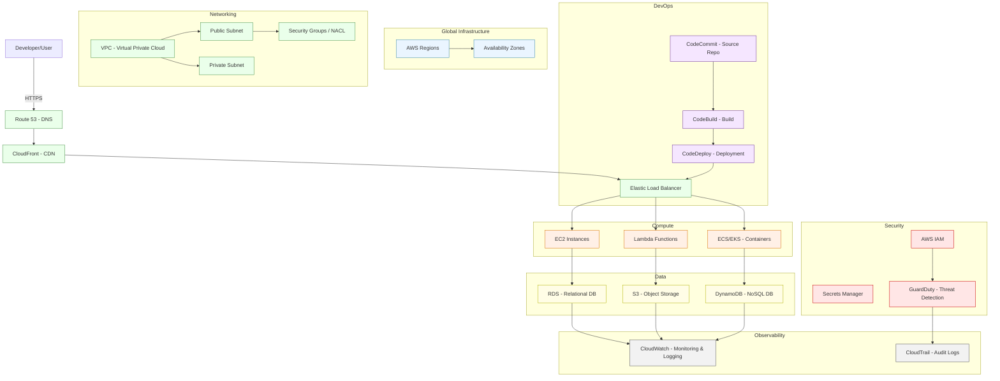
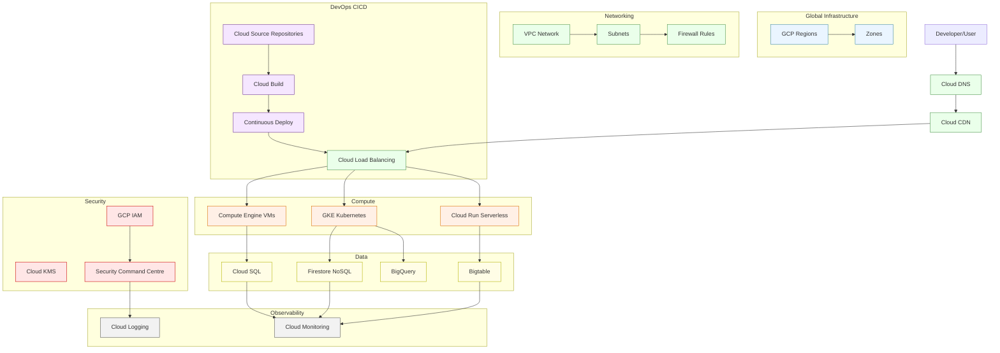
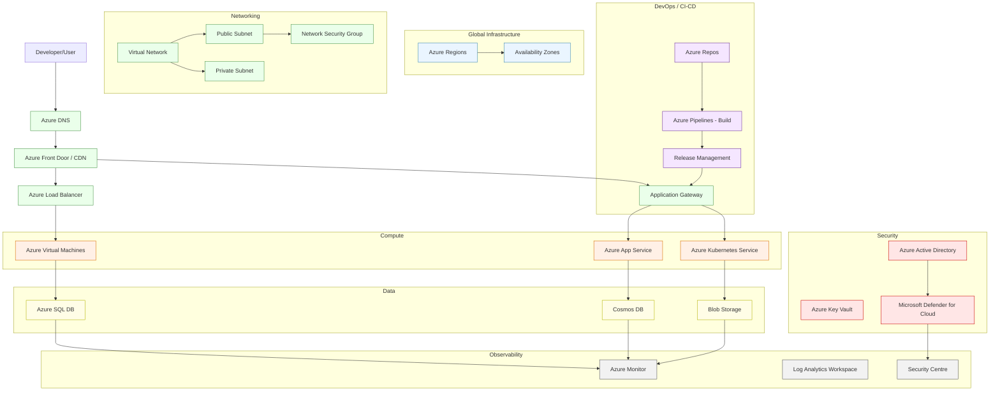

# Architectures of AWS, GCP, Azure

Architectural descriptions of AWS, GCP, and Azure are presented here at a level crafted for my own reference and growing understanding — detailed enough to be meaningful, yet concise enough to avoid cloud-induced vertigo.

**Legend for the diagrams** 

🟦 Global Infrastructure  
🟩 Networking  
🟧 Compute  
🟨 Databases / Storage  
🟪 DevOps  
🟥 Security  
⬜ Observability

***Note:*** Diagrams are conceptual simplifications.

------------------------------------------------------------------------

## AWS Architecture

AWS provides the most mature and expansive ecosystem among the three
major cloud providers, with over 200 services spanning compute, storage,
networking, AI/ML, analytics, and IoT. Its architecture is built around
flexibility, allowing organizations to choose between traditional VMs
(EC2), containers (ECS and EKS), or serverless (Lambda)
depending on workload needs.

A defining feature of AWS is its global infrastructure---multiple
regions, each with multiple availability zones---paired with services
like Route 53 for intelligent DNS routing and CloudFront for
low-latency content delivery. Compared to GCP and Azure, AWS offers the
widest service diversity and a strong track record in enterprise
reliability, though it can also be more complex to navigate due to
sheer scale.  

The following is a simplified representation of the AWS architecture:  

<!-- ALT: AWS architecture diagram showing global infrastructure with regions and availability zones at top. User connects via Route 53 DNS and CloudFront CDN to Elastic Load Balancer, which distributes traffic to compute services: EC2 instances, ECS/EKS containers, and Lambda functions. These connect to data layer containing RDS relational database, DynamoDB NoSQL database, and S3 object storage. DevOps pipeline flows from CodeCommit source repository through CodeBuild and CodeDeploy back to load balancer. Security layer includes AWS IAM, Secrets Manager, and GuardDuty threat detection. Observability provided by CloudWatch monitoring and CloudTrail audit logs. -->  

## GCP Architecture

GCP takes a developer-friendly, data-first approach, with a strong
focus on analytics, AI/ML, and global networking. Services like
BigQuery make it a go-to platform for large-scale analytics, while
AI Platform integrates deeply with TensorFlow and Vertex AI for
machine learning workflows. Its Kubernetes-first mindset is evident
with GKE, widely considered one of the best managed Kubernetes
services.

A standout difference is GCP's global load balancing---offering
worldwide traffic management from a single anycast IP, unlike AWS's
region-based approach. This reduces complexity for multi-region apps.
While GCP's service catalog is smaller than AWS and Azure, it is often
seen as simpler and cleaner for greenfield projects, but it may lack
the enterprise depth and hybrid-cloud features of Azure.

<!-- ALT: GCP architecture diagram showing global infrastructure with regions and zones. User connects through Cloud DNS and Cloud CDN to Cloud Load Balancing, which routes to compute layer: Compute Engine VMs, GKE Kubernetes clusters, and Cloud Run serverless containers. Data layer contains Cloud SQL, Firestore NoSQL, Bigtable, and BigQuery analytics. DevOps flows from Cloud Source Repositories through Cloud Build to continuous deployment back to load balancer. Security managed by GCP IAM, Cloud KMS, and Security Command Centre. Observability through Cloud Monitoring and Cloud Logging. -->  

## Azure Architecture

Azure stands out for its deep Microsoft ecosystem integration,
making it a natural choice for organizations already invested in
Windows Server, Active Directory, and Microsoft 365. Its
architecture supports hybrid-cloud setups exceptionally well through
Azure Arc and ExpressRoute, enabling seamless connectivity
between on-premises and cloud environments. For compute, it offers
flexibility between VMs, App Service for PaaS, and AKS for
container orchestration.

Compared to AWS and GCP, Azure often leads in compliance
certifications, enterprise contracts, and hybrid scenarios.
However, its service naming conventions can be confusing, and it
sometimes lags AWS in early adoption of new service categories. For
enterprises looking for tight integration with Microsoft tools and
hybrid capabilities, Azure is often the top pick.

<!-- ALT: Azure architecture diagram with global regions and availability zones. User connects via Azure DNS and Front Door CDN to Azure Load Balancer and Application Gateway, routing to compute services: Virtual Machines, App Service PaaS, and Azure Kubernetes Service. Data layer includes Azure SQL Database, Cosmos DB NoSQL, and Blob Storage. DevOps pipeline flows from Azure Repos through Azure Pipelines build system to Release Management. Security provided by Azure Active Directory, Key Vault, and Microsoft Defender for Cloud. Observability through Azure Monitor, Log Analytics Workspace, and Security Centre. -->  

