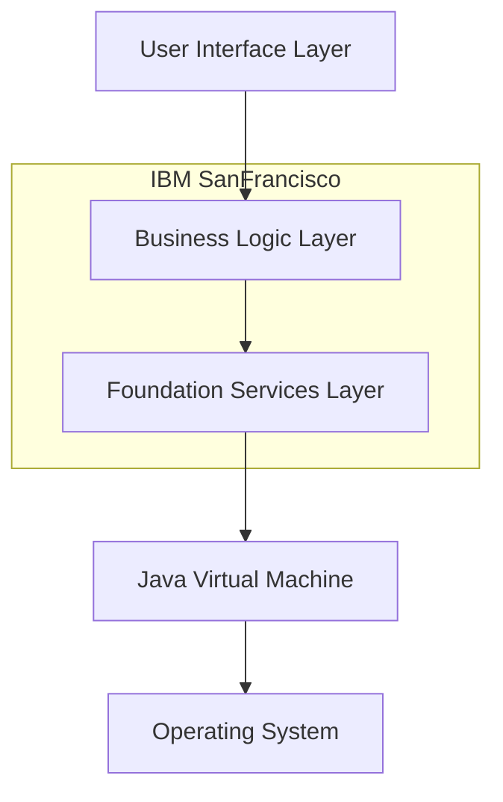
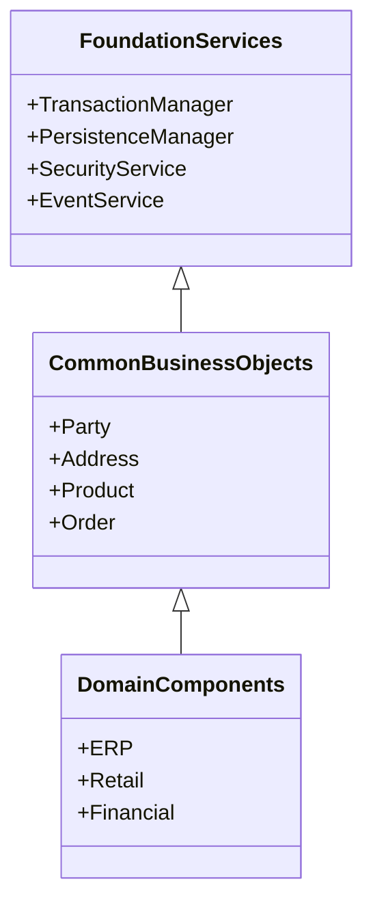
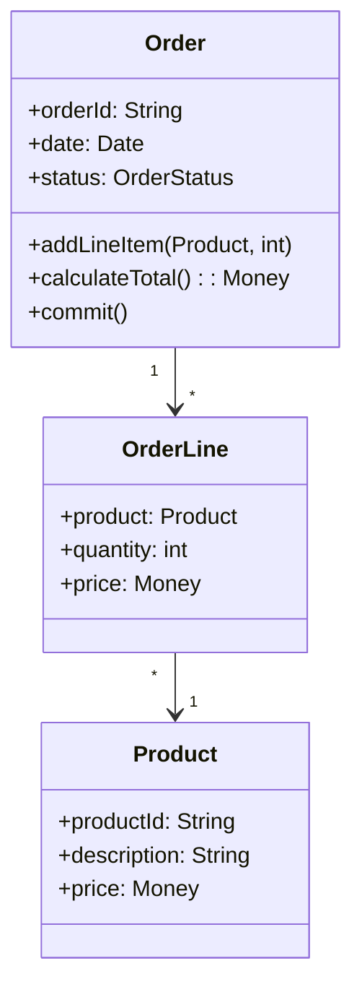
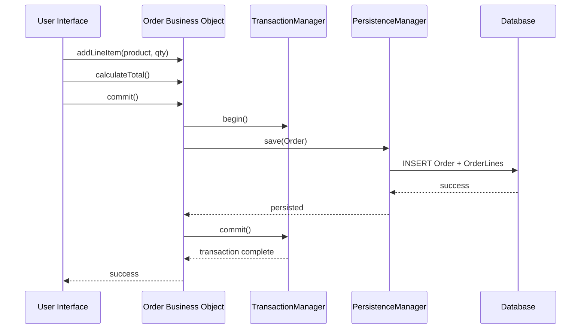
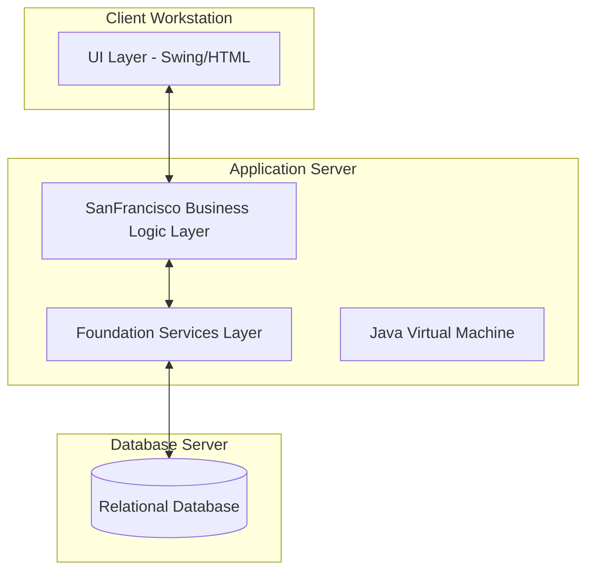
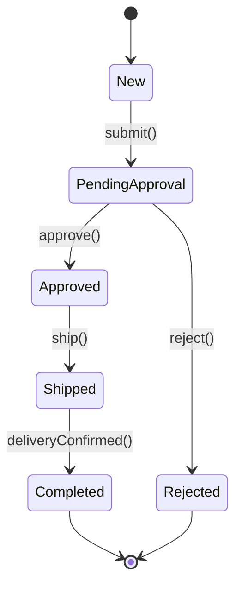

# IBM SanFrancisco — a Technical Memoir

First, hold off — don't reach for your star and flower-spangled hat just yet: SanFrancisco, one word, was the name of a software product. Behind this straightforward name lies a story of early innovation in coarse-grained Java business components — a glimpse into the architectural challenges and creative solutions of a pioneering era.

Back in 2001, while working at the IBM Toronto Lab as an Information Developer (an IBM term for Technical Writer), SanFrancisco was one of the projects that landed on my plate; had to turn emails, memos, notes (perhaps even on *serviettes*) into Redbook material.

By the time, I had been part of an e-commerce development team for a brief period of time, developed some docs and tutorials, taken my part in porting software from C++ to Java, read some Ivor Horton, and had managed to start thinking I knew all there was to know about what and how to write, haha... Well, I was wrong. Why — is another story, but now, here, this is an attempt to reach deep into what's behind that insignificant blurb on my résumé and make sense of what SanFrancisco *really* was, where it had come from, and where it ended up going. A two-in-one writing sample and a technical memoir.

## Introduction

SanFrancisco was an IBM-led product and project, a cross-platform Java application framework that provided reusable, "large-grain business objects” (business components). IBM developed and shipped SanFrancisco in the late-1990s, and the technology was later incorporated into IBM’s WebSphere/Business Components efforts.

SanFrancisco focused on *“large-grain”* components (coarse business objects/frameworks) rather than tiny beans — it tied into CORBA/IIOP, albeit loosely, and IBM tooling (VisualAge) and was positioned as an alternative or complement to EJB-style approaches of the time.

## What Large-Grain Meant

"Large-grain (or coarse-grained) business objects" meant to characterize SanFrancisco as stateful business components that encapsulated whole business *entities* or *processes* rather than tiny technical objects. Say, an **Order** — with lines, taxes, lifecycle, validation, posting to GL — as a *single* component you call with a small number of high-level operations, rather than dozens of low-level `JavaBeans` or single-column `CRUD` calls.

These were long-lived components with application-level state, they were also transaction-aware, and they exposed business semantics (`createOrder`, `postInvoice`, `applyPayment`, etc.) Consequently, the *business API* was bulkier compared with method-level “fine grain” objects.

Why coarse-grain mattered was because they offered fewer remote hops, clearer transaction boundaries, easier composition of business processes, and higher reuse value across applications that shared the same domain semantics (see [Large-Grain Business Object Example](#large-grain-business-object-example)).

## What Made them Reusable

Here are the concrete mechanisms IBM used to make the coarse components reusable and adaptable across enterprises.

### Layered architecture

SanFrancisco provided separation of reuse scopes, its architecture consisted of layers (see [Layer Structure and Component Hierarchy](#layer-structure-and-component-hierarchy:

1. **Foundation** layer: runtime services (naming, factory, transaction, security, notification), distribution plumbing (the *Logical SanFrancisco Network*).
2. **Common Business Object** layer: canonical domain objects (company, account, customer, currency, etc.) — reusable across many apps.
3. **Core Business Process** layer: packaged, higher-level domain subsystems (general ledger, AR, AP, order processing).

The higher the layer, the more domain reuse you got. This layering let vendors reuse just the foundation or pick domain building blocks and mix them.

### Well-defined base classes/interfaces and a consistent object model

SanFrancisco introduced a small set of base classes, for example, `BusinessObject` with `subclasses`, such as `Entity` and `Dependent`, and`Command` for actions (see [Large-Grain Business Object Example](#large-grain-business-object-example)). Framework code and application code spoke the same API and lifecycle semantics — far more effective for reuse than ad-hoc *POJOs*.

### Inherent domain design patterns

SanFrancisco had `PropertyContainer`, `Policy`, `Command`, `Aggregates`, `Specification/Criterion `patterns baked in.

1. **PropertyContainer**: supported dynamic/extensible properties; you could add attributes via configuration rather than recompiling.

* **Policy**, **Strategy**, and **Chain-of-Responsibility**: business rules were replaceable and composable.
* **Command objects and statecharts**: business processes modelled as commands and workflows, providing a standard lifecycle (see [State Diagram for a Business Object’s Lifecycle](#state-diagram-for-a-business-objects-lifecycle)).

  These patterns made components configurable and extensible in predictable ways, which was essential for reuse across different customers.

### Mapping between components and existing schemas

SanFrancisco provided a schema-mapping facility so a reusable business object could be persisted to (or read from) a customer’s existing relational/legacy schema without changing the code of the business object (see [Persistence and Services Interaction (Sequence)](#persistence-and-services-interaction-sequence)). That metadata-driven mapping was a big reuse enabler for enterprise customers with legacy systems.

### Addressable and distributable runtime/network model

The *Logical SanFrancisco Network (LSFN)* included services such as a Global Server Manager, Name Service, Factory Service (object creation/placement), Transaction Service, Security Service, Notification Service, and local Server Managers (see [Deployment Diagram (Runtime Nodes)](#deployment-diagram-runtime-nodes)). That made components locatable, securable, and manageable across a distributed installation while keeping the component’s API the same.

### Tools and scaffolding

IBM shipped tooling to create prototypes and glue components into running scenarios (and to auto-generate bindings/scaffolding). For example, SanFrancisco came with a Business Component Prototyper utility and provided integration with VisualAge, IBM's brand family of IDEs at the time.

## SanFrancisco Component Structure

Below are [attempts of]:

- a sketch of a typical SanFrancisco component at runtime (see [Persistence and Services Interaction (Sequence)](#persistence-and-services-interaction-sequence))
- descriptions of the principal classes/services you would actually interact with

### Base class hierarchy (logical)

* `BusinessObject` (abstract root): shares behaviour and metadata.
  * `Entity` — persistent, transactional objects representing primary business entities.
  * `Dependent` — non-independent objects (child rows/details) that belong to an Entity.
  * `Command` — encapsulated actions/process steps (used to model business operations).

    Containers such as `EntityOwningSet` hold collections of `Entities`. This class hierarchy standardised lifecycle, locking and persistence semantics across all SanFrancisco objects (see [Large-Grain Business Object Example](#large-grain-business-object-example)).

### PropertyContainer and dynamic attributes

Instead of every domain object having a fixed Java field for every attribute, SanFrancisco used a *property container* mechanism (hash-table backed) to attach properties dynamically. That way, vendors/customers could add attributes (e.g., `customer.segment`) via configuration or metadata without changing class files — huge for reuse and productisation. The framework provides accessor patterns and iteration utilities to work with these dynamic properties.

### Policies and extension points

Business rules are not hardwired. SanFrancisco exposes *policy* extension points (Strategy/Template/Chain patterns): implement or deploy a new policy to change rule behavior (pricing, discount rules, tax calc) without changing the base component. Reuse is safer because vendors supply a standard component and customers replace or add policies for local behaviour (see [State Diagram for a Business Object’s Lifecycle](#state-diagram-for-a-business-objects-lifecycle)).

### Queries, keys and collections (how you find objects)

The framework uses access keys / specification keys / criteria objects* and `Iterator`/`CachedSet` abstractions rather than ad-hoc SQL everywhere. Query criteria are expressed as higher-level specification objects that delegate to the persistence layer; results are returned as SanFrancisco collections that can be iterated, cached, and traversed in object form. This makes querying portable and the interface consistent across different back-ends.

### Persistence and schema mapping

SanFrancisco provides an object-to-relational mapping layer. A developer can either manually create mapping metadata or rely on tools to generate mapping from existing schemas. The persistence layer supports delegating complex queries to the DB and mapping result sets back into business objects; it also supports different persistence strategies (local vs. distributed, caching) (see [Persistence and Services Interaction (Sequence)](#persistence-and-services-interaction-sequence)).

### Runtime services

Key services in the Logical SanFrancisco Network (LSFN) support discovery, creation, transactions, and security:

* **Global Server Manager** — knows all object processes and routes client requests.
* **Global Name Service** — holds configuration and namespace info (where to create objects).
* **Factory Service** — provides standard object creation and ownership semantics.
* **Transaction Service** — manages transactional execution and recovery across object servers.
* **Server Security Service / Master Security Service** — handles authentication/authorization.

  Because these services are standard and part of the framework, a component packaged for SanFrancisco behaves consistently in any LSFN deployment (see [Deployment Diagram (Runtime Nodes)](#deployment-diagram-runtime-nodes)).

### Commands, workflows and statecharts

Higher-level business processes are modelled as *Commands* or statecharts: transitions (states) and CA (condition/action) rules control lifecycle. This makes a component’s process behaviour explicit and manipulable (and therefore reusable) — developers don't have to rewrite “how an invoice moves from draft → posted → paid” for each app (see [State Diagram for a Business Object’s Lifecycle](#state-diagram-for-a-business-objects-lifecycle)).

## Example sketch (pseudo API) — simplified

Here is an *intent illustration*, exact API names vary slightly across versions and docs.

```Java
// conceptual — not copy/paste exact SDK code
class OrderEntity extends Entity /* BusinessObject */ {
// dynamic properties via PropertyContainer
Object getProperty(String name) { ... }
void setProperty(String name, Object value) { ... }

// high-level business operation (coarse grain)
void processShipment(CommandContext ctx) {
// validate, reserve inventory, post to GL via other SanFrancisco components
// executed within the Transaction Service
}
}

// client usage: single coarse call that encapsulates lots of work
OrderEntity order = factory.create("Order", ...);
order.setProperty("shippingMethod", "EXPRESS");
order.processShipment(txContext);
```

The point: instead of many remote calls to tweak small fields and call helper services, the client invokes a small set of semantically rich methods that the framework executed atomically, possibly across several servers (see [Persistence and Services Interaction (Sequence)](#persistence-and-services-interaction-sequence)).

## Some Visuals

### High-level Architecture Overview

*(See [Layered architecture](#layered-architecture))*

SanFrancisco sat between application-specific UI/business logic and the JVM, providing reusable services.

<!-- ALT: Flowchart showing IBM SanFrancisco's layered architecture. Arrows connect layers from top to bottom: User Interface → Business Logic → Foundation Services → JVM → Operating System. SanFrancisco encompasses the Business Logic and Foundation layers, positioned between application code and the JVM. -->  


### Layer Structure and Component Hierarchy

*(See [Layered architecture](#layered-architecture))*

The following is a static breakdown of large-grain components, layered from generic to domain-specific:

<!-- ALT: Class diagram illustrating SanFrancisco’s layered component hierarchy. FoundationServices includes core services like TransactionManager and PersistenceManager. CommonBusinessObjects builds on FoundationServices and includes domain-neutral entities like Party and Product. DomainComponents extends CommonBusinessObjects with vertical-specific modules like ERP and Retail. -->  



### Large-Grain Business Object Example

*(See [What Large-Grain Meant](#what-large-grain-meant) and [Base class hierarchy (logical)](#base-class-hierarchy-logical))*

An Illustration of the "large-grain" idea — `Order` encapsulates not just data, but behavior and transactional integrity.

<!-- ALT: Class diagram showing a coarse-grained Order object and its relationships. Order contains attributes and methods for managing line items and totals. It has a one-to-many relationship with OrderLine, which in turn references Product. Emphasizes encapsulation of behavior and data in a single business object. -->  


### Persistence and Services Interaction (Sequence)

*(See [Persistence and schema mapping](#persistence-and-schema-mapping) and [SanFrancisco Component Structure](#sanfrancisco-component-structure))*

Here is a dynamic view of an object interacting with SF foundation services:  

<!-- ALT: Sequence diagram showing object interaction with SF foundation services across 4 swimlanes: Client Object, Business Object, Data Access Object, and Database. Flow shows client creating business object, business object accessing data object, data object querying database, and responses flowing back through the chain. Includes error handling and transaction management patterns typical of enterprise Java applications. -->  


### Deployment Diagram (Runtime Nodes)

*(See [Addressable and distributable runtime/network model](#addressable-and-distributable-runtimenetwork-model) and [Runtime services (LSFN)](#runtime-services))*

SanFrancisco's runtime separation — often deployed in a 3-tier setup.

<!-- ALT: Flowchart depicting SanFrancisco’s 3-tier runtime deployment. ClientNode contains UIClient (Swing/HTML). AppServer includes BusinessLogic, Foundation Services, and JVM. DataServer hosts a relational database. Arrows show bidirectional communication between layers, representing distributed component interaction. -->


### State Diagram for a Business Object’s Lifecycle

*(See [Commands, workflows and statecharts](#commands-workflows-and-statecharts))*

Below is a representation of an `Order`’s lifecycle as managed by SanFrancisco's object framework:  

<!-- ALT: State diagram showing lifecycle transitions for an Order object. Starts at New, proceeds to PendingApproval, then either Approved or Rejected. Approved leads to Shipped, then Completed. Rejected and Completed transition to end state. Models business process flow using explicit states and transitions. -->  


---

## A Rather Long Coda

### Tradeoffs & why SanFrancisco didn’t become the one-size-fits-all winner

- Complexity and heavy weight: the framework and runtime services were large and required buy-in and operational expertise; mapping to messy legacy schemas could still be work-intensive.
- Standards and market competition: EJB and later J2EE, plus CORBA/EJB alliances, plus vendor frameworks, split attention. SanFrancisco was IBM-centric and not a full CORBA ORB; many shops preferred standardized stacks.
- Performance and distribution tradeoffs: coarse grain reduces chattiness but increases the cost of a single call; caching and careful design were required to meet SLAs. IBM documentation contains performance guidance and warnings.

IBM eventually folded the SanFrancisco ideas and some code paths into its WebSphere/business-component story (WebSphere Business Components), and the SanFrancisco name/packaging faded even as many design patterns remained influential.

### What came after

Contemporary cloud computing mechanisms and architectural patterns have made older technologies like EJBs and coarse-grained Java objects less relevant in many scenarios. Here are some key modern alternatives that outperform them in terms of **performance**, **security**, and **reusability**:

#### Microservices & Containerization (Performance & Reusability)

- **Replace** EJBs and coarse-grained components with fine-grained, independently deployable services.  

- **Technologies**, such as Kubernetes and Docker enable lightweight, scalable deployments (vs. heavyweight EJB containers). Modern frameworks, such as Spring Boot, Quarkus, and Micronaut eliminate EJB’s boilerplate while offering better startup times and memory efficiency.  

- **Advantages**: Faster scaling (horizontal, vs. EJB’s vertical scaling); better fault isolation (a failing microservice doesn’t crash the whole app).  

#### Serverless Computing  

- **Replaces** EJB’s long-lived, stateful session beans with ephemeral, stateless functions. 

- **Technologies**, such as AWS Lambda, Azure Functions, Google Cloud Functions execute code on-demand without managing servers.  

- **Advantages**: No need for application server overhead (EJBs require a full Java EE container); pay-per-use cost model (vs. always-on EJB servers).  


#### Cloud-Native Databases & Caching

- **Replace** EJB’s entity beans (CMP/BMP) with modern persistence layers.  

- **Technologies**, such as NoSQL (MongoDB, Cassandra, DynamoDB) scale better than EJB’s JPA/Hibernate for distributed systems; Redis and Elasticache offer low-latency caching (better than EJB’s second-level cache).  

- **Advantages**: Horizontal scalability (vs. EJB’s reliance on monolithic RDBMS); faster read/write performance in distributed environments.  

#### API-First & RESTful Services  

- **Replace** EJB’s RMI-based remote interfaces with lightweight APIs.  

- **Technologies**, such as REST (JAX-RS, Spring WebFlux), GraphQL, and gRPC are more flexible than EJB’s CORBA-style remoting.  

- **Advantages**: Language-agnostic APIs (vs. EJB’s Java-only remoting); better suited for cloud-native, multi-cloud, and hybrid deployments.  

#### Zero-Trust and Cloud-Native Security  

- **Replace** EJB’s JAAS and declarative security with modern cloud security models.  

- **Technologies**, including OAuth2/OpenID Connect (Keycloak, Auth0) are better than EJB role-based security; they externalize auth and allow dynamic, fine-grained acces. Others, such as Service Meshes (Istio, Linkerd), provide mTLS, fine-grained access control (vs. EJB’s coarse-grained security).

- **Advantages**:  Dynamic, policy-based security (vs. static EJB deployment descriptors); better support for distributed identity management.  

#### Event-Driven and Reactive Architectures

- **Replace** EJB’s synchronous, blocking model with async processing.  

- **Technologies**, such as Kafka, RabbitMQ, AWS EventBridge decouple components better than EJB’s JMS, and non-blocking I/O of Reactive Frameworks (Spring WebFlux, Vert.x) outperforms EJB’s thread-per-request model.  

- **Advantages**:  High concurrency is handled much better (EJBs struggled under heavy load); more resilient to failures (reactive systems embrace chaos engineering).  


#### Conclusion

EJBs and coarse-grained Java objects were designed for monolithic, on-premise Java EE apps, whereas modern cloud computing favors lightweight, distributed, and scalable architectures. The shift to microservices, serverless, cloud-native databases, and event-driven systems has rendered EJBs largely obsolete for high-performance, secure, and reusable applications.

## Sources

- IBM press releases and archived Redbooks (~35%)
- The usual suspect — GenAI — with its bottomless pool of resources, including those fed by Universities of Hamburg (love the city) and Dresden, Germany  (~40%)
- My long-term memory (~20%)

---


