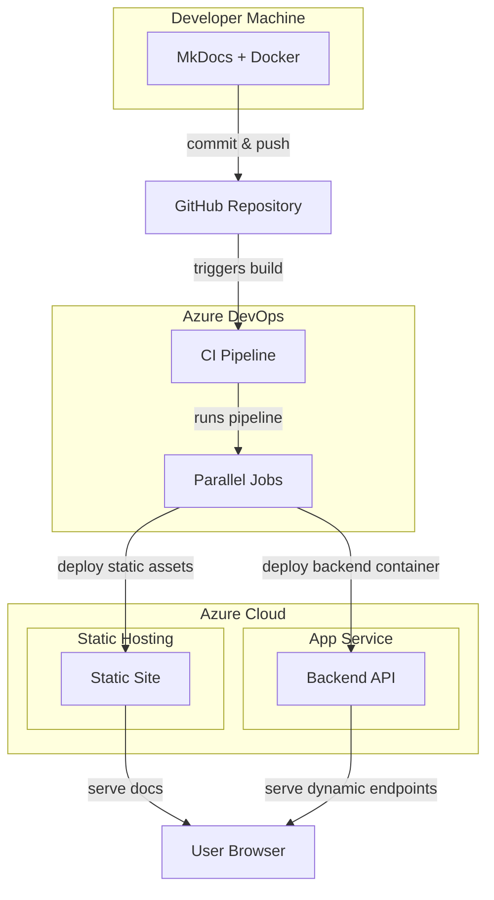

# Welcome

Welcome to Ler's Azure-deployed Documentation Site! Its purpose is multifold:
 
- to brush up my knowledge of Amazon, GCP and Azure cloud platforms
- to concoct a quick technical documentation site for demo and learning purposes
- get OPS folks to view this candidacy favourably lol


# About This Site and Project

## What's in here

- A comparative glossary of cloud/DevOps terms covering AWS, GCP, and Azure
- Other glossaries and cheatsheets I might end up using for work, for fun, or otherwise
  
## How This Site Was Developed and Deployed

### Architecture Overview

This documentation site is deployed using a hybrid static-dynamic architecture, containerized with Docker and served via Azure. The site is built with MkDocs and enhanced with Mermaid.js for diagram rendering.

#### Static Site Layer

- **Framework**: MkDocs with Material theme
- **Content**: Markdown-based documentation rendered into static HTML/CSS/JS
- **Build Process**: Dockerized using a reproducible pipeline with `requirements.txt`
- **Serving Method**: Static assets deployed to Azure CDN or Blob Storage

#### Dynamic Layer

- **Development Server**: MkDocs live reload enabled via polling-based file watcher
- **Environment Variable**: `MKDOCS_WATCHDOG_USE_POLLING=true` set in Dockerfile
- **Live Preview**: Served via `mkdocs serve` inside Docker container
- **Plugin Support**: `mkdocs-mermaid2-plugin` installed and configured for diagram rendering

#### Docker Environment

```Dockerfile
ENV PIP_ROOT_USER_ACTION=ignore
ENV PIP_DISABLE_PIP_VERSION_CHECK=1
ENV MKDOCS_WATCHDOG_USE_POLLING=true
```

- All dependencies installed via requirements.txt
- Clean build logs with suppressed pip notices
- Container exposes port 8000 for local development

#### CI/CD Pipeline (Azure DevOps)

- **Build stage**: Docker image builds for static site and backend container
- **Test stage**: Markdown linting, link checks, container health checks
- **Deployment stage**: Parallel jobs deploy static assets and backend services
- **Monitoring stage**: Azure Application Insights and container logs for observability

#### Deployoment Flow


### Pros

- Cross-platform reproducibility via Docker
- Modular architecture: decoupled frontend/backend
- CI/CD automation and security-first mindset

### Future Enhancements (next phase)

- **Auth Gate**: Azure AD B2C or custom JWT-based login
- **Audit Logging**: Azure Monitor or Application Insights
- **Secrets Management**: Azure Key Vault
- **Backend Extensibility**: Modular API endpoints, possibly containerized
- **Role-based Access**: For editing, viewing, or admin tasks
- **CI/CD Enhancements**: Parallel jobs, conditional stages, test coverage
- **.JS/CSS enhancements**: Perhaps consider, for 'pure' glossaries, making the "active letter highlight" stick until the user scrolls past to the next letter. (Right now, it only changes once the next letter’s row reaches the top of the view.)

## ⚠ Found a Problem?

<p><a href="https://dev.azure.com/lernoy/a-zyoor/_workitems/create/Issue" target="_blank" rel="noopener noreferrer">Report an Azure DevOps Issue</a></p>


