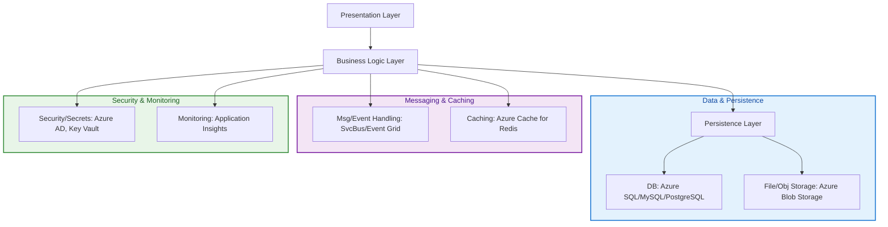
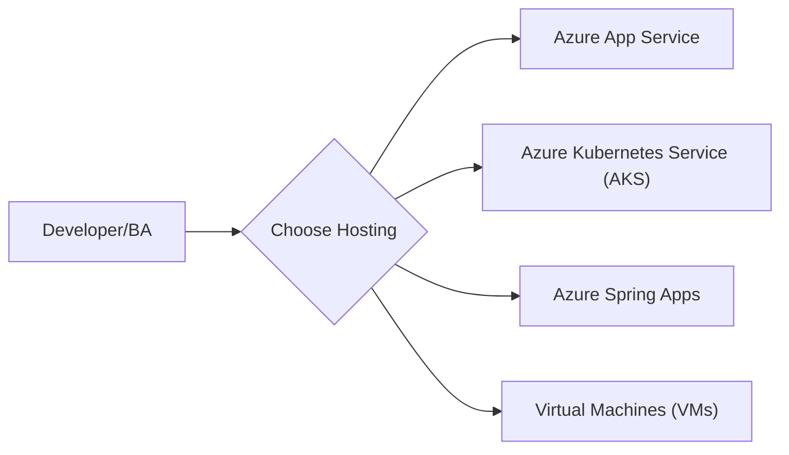
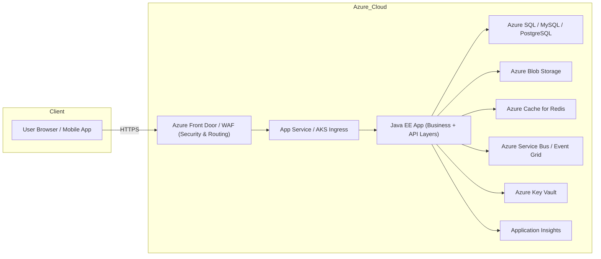
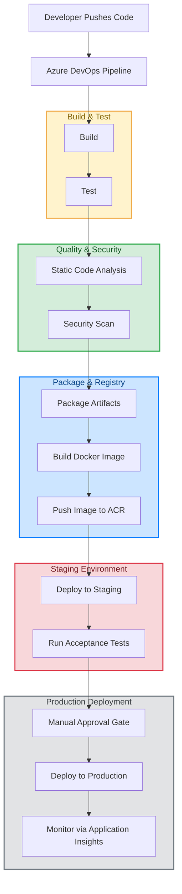
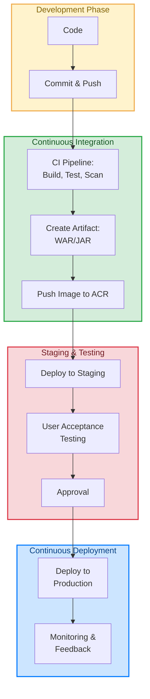

# A Jakarta Enterprise Application on Azure

This is a compact, helicopter-view look at what's involved in building and deploying an *almost realistic* Java (Jakarta EE / Java EE) enterprise web application on Azure + Azure DevOps:

- architecture and components (what pieces to build and why)
- Azure services to host them (options and tradeoffs)
- a typical CI/CD pipeline (YAML) for Maven/Gradle → container → deploy
- security, storage, DB, messaging, monitoring, infra-as-code notes

In other words, technical mockumentation.

## Overview

**Goal:**
We're building a modern enterprise web application in Java EE (Jakarta EE) and deploying it to Microsoft Azure, with an automated CI/CD pipeline in Azure DevOps.

**Why this matters:**
This approach is used in real production systems — from banks to e-commerce — to deliver reliable, secure, and scalable services.

---

## Key Terms

- **Java EE / Jakarta EE**: Java technologies for building large business applications including security and APIs
- **PaaS (Platform-as-a-Service)**: Cloud service that runs our app without managing servers
- **AKS (Azure Kubernetes Service)**: Managed service to run apps inside Docker containers
- **Lift-and-Shift**: Moving our existing app to the cloud without rewriting it
- **CI/CD (Continuous Integration / Continuous Deployment)**: Automated build, test, and deployment processes triggered by code changes
- **Infrastructure as Code (IaC)**: Managing cloud resources using code files instead of manual portal actions
- **Managed Identity**: Azure identity for apps to securely access resources without passwords
- **Blob Storage**: Cloud storage for files like images and videos
- **Service Bus**: Messaging service for sending messages between app components
- **Key Vault**: Secure storage for passwords, certificates, and keys

## Typical Components of a Java EE App on Azure

A Java EE app on Azure will likely comprise multiple, layered components: 

| Layer / Module           | Purpose                                 | Azure Service Example                   | Example Technologies         |
| -------------------------- | ----------------------------------------- | ----------------------------------------- | ------------------------------ |
| Presentation Layer       | User interface and API endpoints        | Azure App Service / AKS                 | JAX-RS REST, JSF, Servlets   |
| Business Logic Layer     | Implements rules and workflows          | Same as above                           | CDI, EJB                     |
| Persistence Layer        | Reads/writes data from a database       | Azure SQL Database / MySQL / PostgreSQL | JPA (Hibernate, EclipseLink) |
| File/Object Storage      | Stores user uploads, documents          | Azure Blob Storage                      | Azure Storage SDK for Java   |
| Messaging/Event Handling | Asynchronous workflows and integrations | Azure Service Bus, Event Grid           | JMS API                      |
| Caching Layer            | Faster data retrieval                   | Azure Cache for Redis                   | Redis API                    |
| Security & Secrets       | Protects app and data                   | Azure AD, Key Vault                     | OAuth2, Managed Identity     |
| Monitoring               | Observes app health and performance     | Application Insights                    | Azure Monitor SDK            |
| Infrastructure           | Provisioning & configuration            | ARM/Bicep/Terraform                     | IaC tools                    |

The following is a visual representation of the layered architecture:
  

---

## Hosting Options on Azure

Azure provides several hosting options, depending on the type and nature of the service or application.

| Option                         | What It Is                                    | Best For                         | Trade-offs                   |
| -------------------------------- | ----------------------------------------------- | ---------------------------------- | ------------------------------ |
| Azure App Service              | Managed web app hosting (Tomcat, JBoss, etc.) | Simple deployment, minimal ops   | Less control over OS/runtime |
| Azure Kubernetes Service (AKS) | Full container orchestration                  | Microservices, complex apps      | More setup/maintenance       |
| Azure Spring Apps              | Managed Spring Boot hosting                   | Spring-heavy projects            | Limited if not using Spring  |
| VMs                            | Full control server hosting                   | Lift-and-shift of legacy Java EE | Highest maintenance          |

---

## High-Level Architecture

---

## CI/CD Pipeline Flow

---

## Security Checklist

| Concern           | What to Ask / Check                                        |
| ------------------- | ------------------------------------------------------------ |
| Authentication    | Is Azure Active Directory used for login?                  |
| Authorization     | Are user roles & permissions clearly defined?              |
| Secret Management | Are passwords/API keys in Key Vault, not in code?          |
| Data in Transit   | Is HTTPS enforced?                                         |
| Data at Rest      | Are databases and blobs encrypted?                         |
| Access Control    | Are Managed Identities used instead of stored credentials? |

---

## Typical Development-to-Deployment Steps

Here is the typical CI/CD flow used in most enterprise software shops today. While nothing in this pipeline is specific to Jakarta EE, it represents the standard approach for delivering reliably and at scale.

---

## Storage & Event Handling Patterns

| Need                         | Service            | Example                             |
| ------------------------------ | -------------------- | ------------------------------------- |
| Store large files            | Azure Blob Storage | User profile pictures               |
| Notify multiple systems      | Azure Event Grid   | New file upload triggers processing |
| Process queued work          | Azure Service Bus  | Payment processing queue            |
| Handle high-volume telemetry | Event Hubs         | IoT device streams                  |

---

## Pitfalls to Avoid

- Skipping staging — Always test in a staging environment first.
- Storing secrets in code — Always use Key Vault + Managed Identity.
- Overengineering too soon — Start with PaaS (App Service) unless we truly need AKS.
- Ignoring monitoring — Without Application Insights, issues are harder to detect.
