# A Sample Data Centre Network

Below is a sample data center netwok topology. Hopefully enough representative of the 2025 technology landscape to analyze and learn, especially from a security perspective.

```mermaid
flowchart TD
  %% Public Zone — S, R
  subgraph Public_Zone["Public Zone (Spoofing, Repudiation)"]
    A[User]
    B[Browser]
    C[DNS Resolver]
  end

  %% Edge Zone — S, T, I, D
  subgraph Edge_Zone["Network Edge Zone (Spoofing, Tampering, Info Disclosure, Denial of Service)"]
    D[HTTPS Request]
    E[Firewall\nIngress ACLs]
    F[Reverse Proxy - Nginx\nHeader Sanitization]
    G[App Gateway\nTLS Termination]
    LB[Load Balancer L7\nRate Limiting]
    VPN[VPN Gateway\nPrivileged Access]
  end

  %% Private Zone — R, I, E
  subgraph Private_Zone["Private App Zone (Repudiation, Info Disclosure, Elevation of Privilege)"]
    WA[Web App\nRBAC + Input Validation]
    DB[Primary Database\nEncrypted at Rest]
    Cache[Redis Cache\nTTL + ACLs]
    Auth[Auth Service\nOAuth2 + JWT]
    Audit[Audit Logger\nImmutable Store]
    Replicas[Read Replicas\nRead-Only]
    IdP[Identity Provider\nFederated Trust]
    SIEM[SIEM Integration\nSecurity Alerts]
  end

  %% Observability — I, R
  subgraph Observability["Monitoring and Tracing (Info Disclosure, Repudiation)"]
    Metrics[Metrics Exporter]
    Traces[Tracing Agent]
    Prometheus[Prometheus\nAccess Controls]
    Jaeger[Jaeger\nTrace Retention]
  end

  %% CI/CD — T, E
  subgraph CI_CD["CI/CD Pipeline (Tampering, Elevation of Privilege)"]
    Git[Git Repository\nBranch Protections]
    Runner[Build Agent\nSandboxed]
    Registry[Container Registry\nSigned Images]
    Deploy[Deployment Job\nRole Separation]
  end

  %% Traffic Flow
  A -->|North-South| B --> C --> D --> E --> F --> G --> LB --> WA
  VPN -->|Privileged Tunnel| WA
  WA -->|East-West| DB --> Replicas
  WA -->|East-West| Cache
  WA -->|East-West| Auth --> IdP
  WA -->|East-West| Audit --> SIEM
  WA -->|Telemetry| Metrics --> Prometheus
  WA -->|Telemetry| Traces --> Jaeger

  %% CI/CD Integration
  Git --> Runner --> Registry --> Deploy --> WA
```

## Public Zone

- **User** interacts via a Browser, initiating requests.
- **DNS Resolver** translates domain names to IP addresses.
- Traffic enters the system via **HTTPS Request**, marking the boundary of public access.

## Network Edge Zone

- **Firewall** filters incoming traffic based on rules.
- **Reverse Proxy (Nginx)** handles SSL termination and routing.
- **App Gateway** applies additional routing logic and security policies.
- **Load Balancer (L7)** distributes traffic across app instances.
- **VPN Gateway** allows secure remote access for internal users or services.

## Private App Zone

- **Web App** is the core application layer, serving dynamic content. It connects to:
  - **Primary Database** and Read Replicas for data storage and scaling.
  - **Redis Cache** for performance optimization.
  - **Auth Service** for identity verification, which delegates to an Identity Provider.
  - **Audit Logger** for compliance and traceability, forwarding logs to a SIEM system.

## Observability (Monitoring & Tracing)

- **Metrics Exporter** and Tracing Agent collect telemetry.
- Data flows to **Prometheus** (metrics) and **Jaeger** (traces) for monitoring and debugging.

## CI/CD Pipeline

- **Git Repo** stores source code.
- **Build Agent** compiles and tests the code.
- **Container Registry** stores built images.
- **Deployment Job** pushes updates to the **Web App**, completing the automation loop.

## Access Control Highlights

- **Public Zone**: No authentication; DNS and browser-level interactions.
- **Edge Zone**: First line of defense; includes firewall, proxy, and gateway logic.
- **Private Zone**: All services require authentication and authorization.
- **VPN Gateway**: Bypasses public ingress for privileged users (e.g. ops or staging testers).

## Traffic Types

- **North-South**: External user traffic entering the system.
- **East-West**: Internal service-to-service communication.
- **Telemetry**: Observability traffic for metrics and tracing.

## Environment Overlays

CI/CD pipeline supports branch-based staging, with promotion to production gated by deployment jobs.
This could be extended with environment-specific secrets, feature flags, or blue/green deployments if needed.
