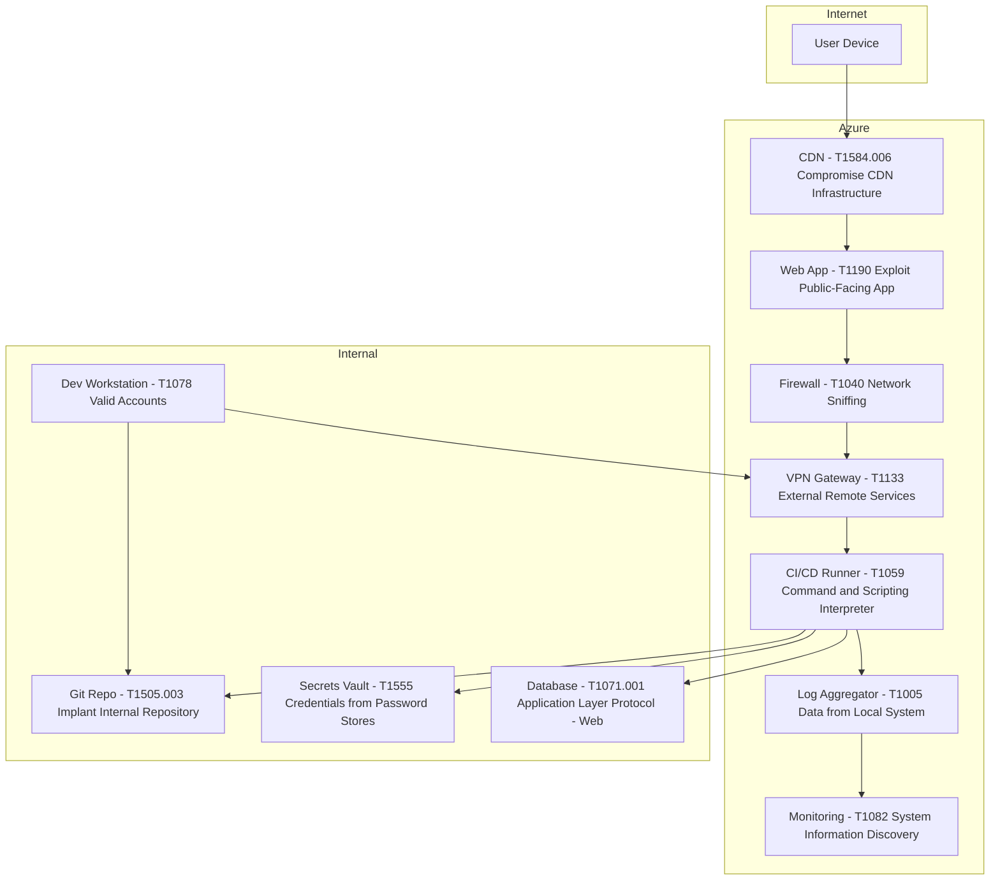

# Network Security and Threat Modeling — MITRE ATT&CK

MITRE ATT&CK is a comprehensive framework that catalogs tactics, techniques, and procedures used by cyber adversaries, aiding organizations in understanding and defending against various attack methods.

## Our Hypothetical Data Centre Network, with MITRE ATT&CK Annotations

## Highlights of ATT&CK Mapping

| Component             | ATT&CK Technique                           | Description                                        |
| ----------------------- | -------------------------------------------- | ---------------------------------------------------- |
| Web App               | T1190 – Exploit Public-Facing App         | Entry point for attackers via vulnerable endpoints |
| VPN Gateway           | T1133 – External Remote Services          | Target for credential stuffing or VPN exploits     |
| CI/CD Runner          | T1059 – Command and Scripting Interpreter | Abuse of build scripts or injected commands        |
| Secrets Vault         | T1555 – Credentials from Password Stores  | Target for secret exfiltration                     |
| Git Repo              | T1505.003 – Implant Internal Repository   | Malicious code or backdoors in source control      |
| CDN                   | T1584.006 – Compromise CDN Infrastructure | Supply chain risk via third-party CDN              |
| Firewall              | T1040 – Network Sniffing                  | Potential for traffic inspection or bypass         |
| Monitoring Service    | T1082 – System Information Discovery      | Reconnaissance via telemetry                       |
| Log Aggregator        | T1005 – Data from Local System            | Target for log tampering or data theft             |
| Developer Workstation | T1078 – Valid Accounts                    | Abuse of developer credentials                     |

## Architecture Threat Mapping

### Public & Edge Zones

| Component     | ATT&CK Tactics            | Techniques                                      | Defenses                                 |
| --------------- | --------------------------- | ------------------------------------------------- | ------------------------------------------ |
| DNS Resolver  | Initial Access            | DNS Spoofing (T1565.001)                        | DNSSEC, trusted resolvers                |
| Reverse Proxy | Defense Evasion           | Proxy Configuration Tampering (T1556.007)       | Header sanitization, config immutability |
| App Gateway   | Initial Access, Execution | Exploit Public-Facing App (T1190)               | WAF rules, TLS termination               |
| VPN Gateway   | Lateral Movement          | Valid Accounts (T1078), Remote Services (T1021) | MFA, IP allowlists, session logging      |

### Private App Zone

| Component         | ATT&CK Tactics                  | Techniques                                                                    | Defenses                                           |
| ------------------- | --------------------------------- | ------------------------------------------------------------------------------- | ---------------------------------------------------- |
| Web App           | Execution, Privilege Escalation | Command-Line Interface (T1059), Exploitation for Privilege Escalation (T1068) | RBAC, input validation, container isolation        |
| Auth Service      | Credential Access               | Brute Force (T1110), Credential Dumping (T1003)                               | Rate limiting, JWT expiration, audit logging       |
| Database          | Collection, Exfiltration        | Data from Information Repositories (T1213), Automated Exfiltration (T1020)    | Encryption at rest, query logging, role separation |
| Audit Logger      | Impact                          | Inhibit System Recovery (T1490)                                               | Immutable logs, off-host storage                   |
| Identity Provider | Initial Access                  | External Remote Services (T1133), Valid Accounts (T1078)                      | SAML/OIDC hardening, federation trust boundaries   |

### Observability & CI/CD

| Component          | ATT&CK Tactics         | Techniques                                         | Defenses                          |
| -------------------- | ------------------------ | ---------------------------------------------------- | ----------------------------------- |
| Metrics Exporter   | Information Disclosure | Automated Collection (T1119)                       | ACLs, metric filtering            |
| CI/CD Runner       | Execution, Persistence | Compiled HTML File (T1223), Scheduled Task (T1053) | Sandbox builds, ephemeral runners |
| Container Registry | Defense Evasion        | Signed Binary Proxy Execution (T1218)              | Image signing, access controls    |
| Deployment Job     | Privilege Escalation   | Abuse Elevation Control Mechanism (T1548)          | Role separation, audit trails     |

## Defensive Enhancements to Consider

* **SIEM Enrichment** : Map logs to ATT&CK techniques for faster triage.
* **Threat Detection Rules** : Use Sigma or MITRE D3FEND to write detection logic.
* **Red Team Scenarios** : Simulate TTPs like T1078 (Valid Accounts) or T1190 (Exploit Public-Facing App).
* **Purple Teaming** : Validate defenses by emulating known adversary behavior (e.g. APT29, FIN7).
