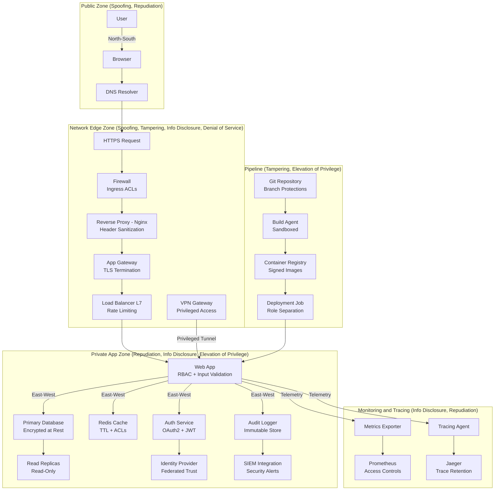

# Network Security and Threat Modeling — STRIDE  

STRIDE is a threat modeling framework developed by Microsoft that helps identify potential security threats in software systems, focusing on categories like Spoofing, Tampering, Repudiation, Information disclosure, Denial of service, and Elevation of privilege.  

## Our Hypothetical Data Center Network, STRIDE-Annotated

## Stride Breakdown

| Threat                     | Examples in Diagram              | Mitigations                                                   |
| ---------------------------- | ---------------------------------- | --------------------------------------------------------------- |
| **Spoofing**               | Fake user/IP, DNS poisoning      | TLS everywhere, VPN for privileged access, DNSSEC             |
| **Tampering**              | Malicious config/image injection | Signed containers, branch protections, proxy header scrubbing |
| **Repudiation**            | No audit trail for actions       | Immutable audit logs, SIEM integration                        |
| **Information Disclosure** | Leaky metrics, exposed headers   | RBAC, encrypted storage, observability ACLs                   |
| **Denial of Service**      | Traffic floods, cache exhaustion | Rate limiting, load balancing, firewall rules                 |
| **Elevation of Privilege** | CI/CD abuse, misconfigured roles | Role separation, scoped tokens, RBAC enforcement              |
