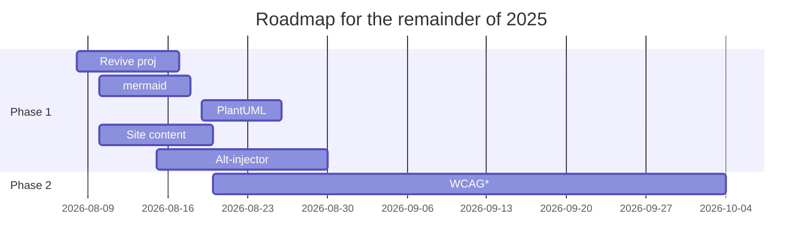

# Rough Roadmap

*within the 'WCAG' timeframe: semantic headings, skip links, color contrast check, screen-reader test, alt text, ARIA landmarks

# Changelog

- 2025.08.19 Added some visuals to the concept note; enabled some accessibility-related theme features
- 2025.08.18 Added a rough roadmap and a "concept note" based on the AI-augmented accessibility idea
- 2025.08.17 Added another first-ever; a 'technical daydream' on AI-augmented accessibility
- 2025.08.14 Site live via GitHub Pages
- 2025.08.13 Azure DevOps integration abandoned for technical reasons; GitHub Actions set up
- 2025.08.12 Added my first-ever 'technical memoir' on a pre-cloud-era Java project
- 2025.08.08 Revival; attempting to connect with Azure DevOps; added a several 'contemporary' topics
- 2025.05.16 Attempt to revive the project and resume some GitHub activity
- 2021.01.24 Initial commit with a couple of glossaries for own use and to learn GitHub; shelved 2021.05.17
