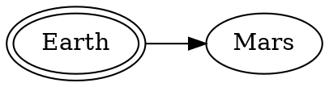
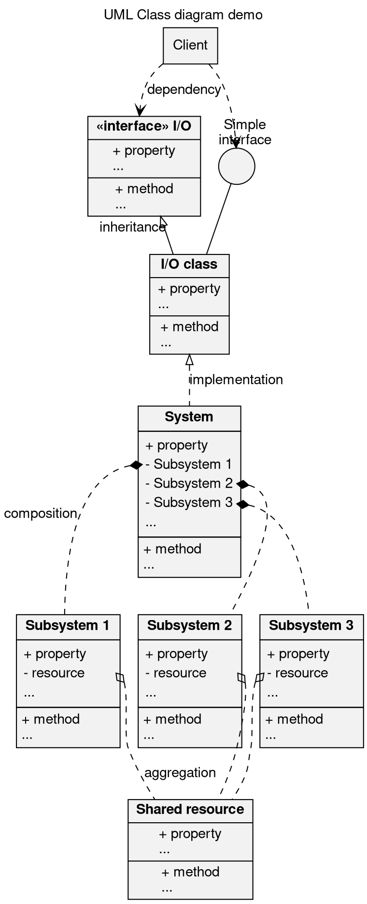
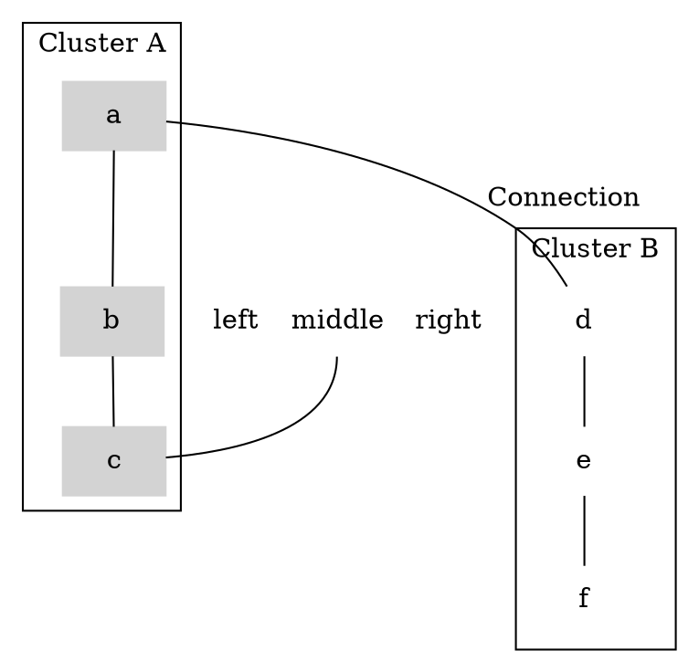
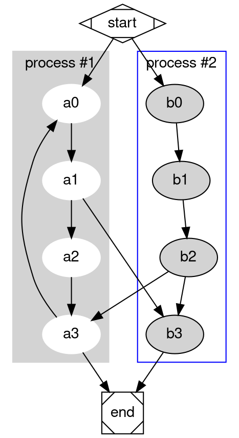
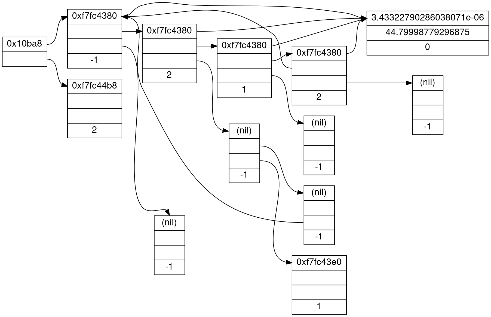
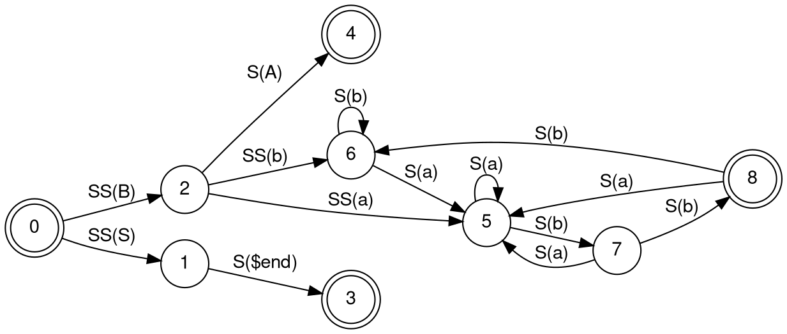
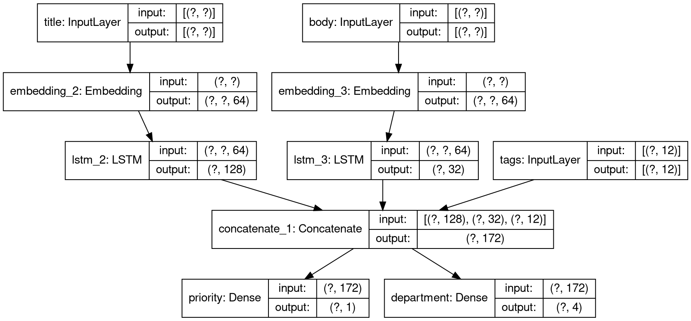

# Graphviz Diagrams

## Vendor's first examples for svg:

## UML Class Diagram

## Cluster 1

## Cluster 2 

## Git — Basic Concepts and Operations

```dot
digraph git_basics {
	graph [
		label = "Basic git concepts and operations\n\n"
		labelloc = t
		fontname = "Helvetica,Arial,sans-serif"
		fontsize = 20
		layout = dot
		rankdir = LR
		newrank = true
	]
	node [
		style=filled
		shape=rect
		pencolor="#00000044" // frames color
		fontname="Helvetica,Arial,sans-serif"
		shape=plaintext
	]
	edge [
		arrowsize=0.5
		fontname="Helvetica,Arial,sans-serif"
		labeldistance=3
		labelfontcolor="#00000080"
		penwidth=2
		style=dotted // dotted style symbolizes data transfer
	]
	changes [
		color="#88000022"
		label=<<table border="0" cellborder="1" cellspacing="0" cellpadding="4">
			<tr> <td> <b>changes</b><br/>in the working tree </td> </tr>
			<tr> <td align="left"><i>To view: </i><br align="left"/>
			git diff
			<br align="left"/></td> </tr>
		</table>>
		shape=plain
	]
	staging [
		fillcolor="#ff880022"
		label=<<table border="0" cellborder="1" cellspacing="0" cellpadding="4">
			<tr> <td> <b>staging area</b><br/>(cache, index)</td> </tr>
			<tr> <td align="left"><i>To view: </i><br align="left"/>
			git diff --staged
			<br align="left"/></td> </tr>
		</table>>
		shape=plain
	]
	staging -> HEAD:push [label="git commit" weight=1000 color="#88000088"]
	stash [
		fillcolor="#0044ff22"
		label=<<table border="0" cellborder="1" cellspacing="0" cellpadding="4">
			<tr> <td> <b>stash</b></td> </tr>
			<tr> <td align="left"><i>To view:</i><br align="left"/>
			git stash list
			<br align="left"/></td> </tr>
		</table>>
		shape=plain
	]
	stash_push [
		label="git stash [push]"
		style=""
		shape=plain
		color="#00008844"
	]
	{
		edge [arrowhead=none color="#00008844"]
		changes ->  stash_push
		stash_push -> staging
	}
	changes -> stash [
		dir=back
		xlabel="git stash pop"
		color="#00000088" weight=0]
	stash_push -> stash [xdir=back color="#00008844" minlen=0]
	HEAD [
		fillcolor="#88ff0022"
		label=<<table border="0" cellborder="1" cellspacing="0" cellpadding="3">
			<tr> <td port="push" sides="ltr"> <b>HEAD </b>of</td> </tr>
			<tr> <td port="pull" sides="lbr"> the current branch</td> </tr>
			<tr> <td port="switch" align="left">
				<i>To view:</i>
				<br align="left"/>
				git show<br align="left"/>
				git log
				<br align="left"/>
			</td> </tr>
			<tr> <td align="left">
				<i>To change branch:</i><br align="left"/>
				git switch ...
				<br align="left"/>
				git checkout ...
				<br align="left"/>
			</td> </tr>
		</table>>
		shape=plain
	]
	remote [
		label="remote branch"
		shape=box
		color="#00000022"
		fillcolor="#00ff0022"
	]

	HEAD:push -> remote [label="git push" color="#88000088"]
	HEAD:pull -> remote [dir=back label="git pull" color="#00440088"]
	branches [
		fillcolor="#00888822"
		label=<<table border="0" cellborder="1" cellspacing="0" cellpadding="4">
			<tr> <td> <b>local branches</b> </td> </tr>
			<tr> <td align="left"><i>To view:</i><br align="left"/>
			git branch [--list]
			<br align="left"/></td> </tr>
			</table>>
		shape=plain
	]
	changes -> staging [label="git add ...    \ngit reset      " color="#88000088"]
	discard [shape=plaintext style=""]
	changes -> discard [label="git restore ..." color="#88000088"]
	{rank=same changes discard}
	// UML style aggregation
	HEAD:switch -> branches [
		dir=back
		style=""
		penwidth=1
		arrowtail=odiamond
		arrowhead=none
		color="#00000088"
	]
}
// © 2022 Costa Shulyupin, licensed under EPL
```

## Data Structures

## Family Tree

```dot
/*
Note: All images in the file is found at

http://www.graphviz.org/Gallery/directed/images/

-----------

from Kaarle Kaila:


I have implemented Genealogic descendant and ancestor graphs using Graphviz in FinFamily. I have made som description on how to use it with FinFamily at FinFamily wiki-pages at

http://www.finfamily.fi/index.php/Handbook

I attach a descendant graph from Joseph Patrick Kennedy and an ancestor graph from Caroline Bouvier Kennedy as samples from FinFamily. The file georg.jpg is a descendant graph w/o pictures from an imaginary person Georg af Charlow (who has some common attributes with my father) from my testdatabase like the person Charles Charlow has some resemblance to myself.

If you wish to display the attached pictures or wish me to create another ones then feel free to do so. I wish to thank you for Graphviz that let's me create such nice graphs with FinFamily.

regards
Kaarle Kaila

I have this little kennedy database as a sample gedcom file on the download webpage to give international users a few wellknown persons to play with  if they wish to try out my software. I originally got it from Michael Kay who is among others Editor at http://www.w3.org/TR/xslt20/. I added the pictures and some data myself.

Attached are both the kennedyanc and kennedydesc files as you requested. I made them as zip-files so that they contain both source and destination files. As you email server does not accept zip-files I renamed them to anc.zip ->anc.files and desc.zip to desc.files. Hope these com through your filters.

Graphviz dot program is called from within FinFamily with a command line such as:

dot -Tjpeg kennedyanc.txt -o kennedyanc.jpg

On page http://www.finfamily.fi/index.php/Graphviz is a description on the different colors together with instructions for finFamily users how to create Graphviz reports.

Kaarle Kaila


Colors and forms symbolize following

    * Blue box - man
    * Red ellipse - woman
    * Blue line - Father/Child relation
    * Red line - Mother/Child relation
    * Green line - Spouse relation
    * Orange line - Ancestors (other) children
    * Violet line - Ancestors (other) spouse 





*/

/* ancestor graph from Caroline Bouvier Kennedy */

graph G {
fontname="Helvetica,Arial,sans-serif"
node [fontname="Helvetica,Arial,sans-serif"]
edge [fontname="Helvetica,Arial,sans-serif"]
I5 [shape=ellipse,color=red,style=bold,label="Caroline Bouvier Kennedy\nb. 27.11.1957 New York",image="images/165px-Caroline_Kennedy.jpg",labelloc=b];
I1 [shape=box,color=blue,style=bold,label="John Fitzgerald Kennedy\nb. 29.5.1917 Brookline\nd. 22.11.1963 Dallas",image="images/kennedyface.jpg",labelloc=b];
I6 [shape=box,color=blue,style=bold,label="John Fitzgerald Kennedy\nb. 25.11.1960 Washington\nd. 16.7.1999 over the Atlantic Ocean, near Aquinnah, MA, USA",image="images/180px-JFKJr2.jpg",labelloc=b];
I7 [shape=box,color=blue,style=bold,label="Patrick Bouvier Kennedy\nb. 7.8.1963\nd. 9.8.1963"];
I2 [shape=ellipse,color=red,style=bold,label="Jaqueline Lee Bouvier\nb. 28.7.1929 Southampton\nd. 19.5.1994 New York City",image="images/jacqueline-kennedy-onassis.jpg",labelloc=b];
I8 [shape=box,color=blue,style=bold,label="Joseph Patrick Kennedy\nb. 6.9.1888 East Boston\nd. 16.11.1969 Hyannis Port",image="images/1025901671.jpg",labelloc=b];
I10 [shape=box,color=blue,style=bold,label="Joseph Patrick Kennedy Jr\nb. 1915\nd. 1944"];
I11 [shape=ellipse,color=red,style=bold,label="Rosemary Kennedy\nb. 13.9.1918\nd. 7.1.2005",image="images/rosemary.jpg",labelloc=b];
I12 [shape=ellipse,color=red,style=bold,label="Kathleen Kennedy\nb. 1920\nd. 1948"];
I13 [shape=ellipse,color=red,style=bold,label="Eunice Mary Kennedy\nb. 10.7.1921 Brookline"];
I9 [shape=ellipse,color=red,style=bold,label="Rose Elizabeth Fitzgerald\nb. 22.7.1890 Boston\nd. 22.1.1995 Hyannis Port",image="images/Rose_kennedy.JPG",labelloc=b];
I15 [shape=box,color=blue,style=bold,label="Aristotle Onassis"];
I3 [shape=box,color=blue,style=bold,label="John Vernou Bouvier III\nb. 1891\nd. 1957",image="images/BE037819.jpg",labelloc=b];
I4 [shape=ellipse,color=red,style=bold,label="Janet Norton Lee\nb. 2.10.1877\nd. 3.1.1968",image="images/n48862003257_1275276_1366.jpg",labelloc=b];
 I1 -- I5  [style=bold,color=blue]; 
 I1 -- I6  [style=bold,color=orange]; 
 I2 -- I6  [style=bold,color=orange]; 
 I1 -- I7  [style=bold,color=orange]; 
 I2 -- I7  [style=bold,color=orange]; 
 I1 -- I2  [style=bold,color=violet]; 
 I8 -- I1  [style=bold,color=blue]; 
 I8 -- I10  [style=bold,color=orange]; 
 I9 -- I10  [style=bold,color=orange]; 
 I8 -- I11  [style=bold,color=orange]; 
 I9 -- I11  [style=bold,color=orange]; 
 I8 -- I12  [style=bold,color=orange]; 
 I9 -- I12  [style=bold,color=orange]; 
 I8 -- I13  [style=bold,color=orange]; 
 I9 -- I13  [style=bold,color=orange]; 
 I8 -- I9  [style=bold,color=violet]; 
 I9 -- I1  [style=bold,color=red]; 
 I2 -- I5  [style=bold,color=red]; 
 I2 -- I15  [style=bold,color=violet]; 
 I3 -- I2  [style=bold,color=blue]; 
 I3 -- I4  [style=bold,color=violet]; 
 I4 -- I2  [style=bold,color=red]; 
}
```

## Finite Automation

## Linux Kernel

```dot
digraph "Linux_kernel_diagram" {
	fontname="Helvetica,Arial,sans-serif"
	node [fontname="Helvetica,Arial,sans-serif"]
	edge [fontname="Helvetica,Arial,sans-serif"]
	graph [
		newrank = true,
		nodesep = 0.3,
		ranksep = 0.2,
		overlap = true,
		splines = false,
	]
	node [
		fixedsize = false,
		fontsize = 24,
		height = 1,
		shape = box,
		style = "filled,setlinewidth(5)",
		width = 2.2
	]
	edge [
		arrowhead = none,
		arrowsize = 0.5,
		labelfontname = "Ubuntu",
		weight = 10,
		style = "filled,setlinewidth(5)"
	]
	subgraph system {
		node [color = "#e27dd6ff"]
		edge [color = "#e27dd6ff"]
		system_ [
			fixedsize = true,
			height = 0,
			shape = point,
			style = invis,
			shape = point
		]
		system [
			URL = "https://en.wikibooks.org/wiki/The_Linux_Kernel/System",
			fillcolor = white,
			fixedsize = true,
			height = 0.6,
			row = func,
			width = 2]
		system -> system_ [
			arrowhead = "",
			row = func];
		SCI [
			URL = "https://en.wikibooks.org/wiki/The_Linux_Kernel/Syscalls",
			fillcolor = "#d9e7ee",
			fixedsize = true,
			label = "System calls",
			row = usr,
			shape = ellipse]
		sysfs [
			fillcolor = "#b2d3e4",
			label = "proc & sysfs\nfile systems"]
		SCI -> sysfs
		DM [
			fillcolor = "#91b5c9",
			fixedsize = true,
			fontsize = 20,
			height = 0.8,
			label = "Device\nModel",
			shape = octagon,
			width = 2]
		sysfs -> DM
		log_sys [
			fillcolor = "#6a9ab1",
			fontsize = 20,
			label = "system run,\nmodules,\ngeneric\nHW access "]
		DM -> log_sys
		bus_drv [
			fillcolor = "#71809b",
			label = "bus drivers"]
		log_sys -> bus_drv
		buses [
			fillcolor = "#777777",
			fontcolor = white,
			fontsize = 20,
			label = "buses:\nPCI, USB ...",
			row = chip]
		bus_drv -> buses
	}
	subgraph networking {
		node [color = "#61c2c5"]
		edge [color = "#61c2c5"]
		networking_ [
			fixedsize = true,
			height = 0,
			shape = point,
			style = invis,
			shape = point
				width = 0]
		networking [
			URL = "https://en.wikibooks.org/wiki/The_Linux_Kernel/Networking",
			fillcolor = white,
			fixedsize = true,
			height = 0.6,
			row = func,
			width = 2]
		networking -> networking_ [
			arrowhead = "",
			row = func]
		sock [
			fillcolor = "#d9e7ee",
			fixedsize = true,
			label = Sockets,
			row = usr,
			shape = ellipse]
		prot_fam [
			fillcolor = "#b2d3e4",
			label = "protocol\nfamilies"]
		sock -> prot_fam
		log_prot [
			fillcolor = "#6a9ab1",
			label = "protocols:\nTCP, UDP, IP"]
		prot_fam -> log_prot
		netif [
			fillcolor = "#71809b",
			fontsize = 20,
			label = "network\ninterfaces\nand drivers"]
		log_prot -> netif
		net_hw [
			fillcolor = "#777777",
			fontcolor = white,
			fontsize = 20,
			label = "network:\nEthernet, WiFi ...",
			row = chip]
		netif -> net_hw
		NFS [
			color = "#8383cc",
			fillcolor = "#91b5c9",
			fixedsize = true,
			height = 0.8,
			label = NFS,
			shape = octagon,
			width = 1.2]
		NFS -> log_prot [weight = 0]
	}
	subgraph processing {
		node [color = "#c46747"]
		edge [color = "#c46747"]
		processing_ [
			fixedsize = true,
			height = 0,
			shape = point
				style = invis,
			width = 0]
		processing [
			URL = "https://en.wikibooks.org/wiki/The_Linux_Kernel/Processing",
			fillcolor = white,
			fixedsize = true,
			height = 0.6,
			row = func,
			width = 2]
		processing -> processing_ [
			arrowhead = "",
			row = func]
		proc [
			fillcolor = "#d9e7ee",
			fixedsize = true,
			label = Processes,
			row = usr,
			shape = ellipse]
		Tasks [
			fillcolor = "#b2d3e4"]
		proc -> Tasks
		sync [
			fillcolor = "#91b5c9",
			fixedsize = true,
			fontsize = 20,
			fontname = "Arial Narrow"
			label = synchronization,
			height = 0.7,
			//width = 2,
			shape = octagon]
		Tasks -> sync
		sched [
			fillcolor = "#6a9ab1",
			label = Scheduler]
		sync -> sched
		IRQ [
			fillcolor = "#71809b",
			fontsize = 20,
			label = "interrupts\ncore,\nCPU arch"]
		sched -> IRQ
		CPU [
			fillcolor = "#777777",
			fontcolor = white,
			fontsize = 20,
			row = chip]
		IRQ -> CPU
	}	// processing
	subgraph mem {
		node [
			color = "#51bf5b",
			height = 1
		]
		edge [color = "#51bf5b"]
		MA [
			color = "#51bf5b",
			fillcolor = "#d9e7ee",
			fixedsize = true,
			label = "memory\naccess",
			row = usr,
			height = 1,
			shape = ellipse]
		MA -> VM
		mmap [
			fillcolor = "#91b5c9",
			fixedsize = true,
			fontsize = 20,
			height = 0.8,
			label = "memory\nmapping",
			shape = octagon,
			width = 2]
		mmap -> log_mem
		log_mem -> PA
		SW [
			color = "#8383cc",
			fillcolor = "#91b5c9",
			fixedsize = true,
			label = Swap,
			height = 0.8,
			shape = octagon,
			width = 1.2]
		mmap -> SW [weight = 1]
		SW -> block [
			color = "#8383cc", weight = 1]
		PA [
			fillcolor = "#71809b",
			label = "Page\nAllocator"
		]
		PC -> PA [weight = 0 color="#51bf5b"]
		RAM [
			color = "#51bf5b",
			fillcolor = "#777777",
			fontcolor = white,
			fontsize = 20,
			label = "MMU, RAM",
			height = 1,
			row = chip]
		PA -> RAM
		memory -> memory_ [
			arrowhead = "",
			row = func]
		VM -> mmap
	}	// mem
	subgraph storage {
		node [color = "#8383cc"]
		edge [color = "#8383cc"]
		NFS;
		storage_ [
			shape = point,
			fixedsize = true,
			height = 0,
			style = invis,
			width = 0]
		storage [
			URL = "https://en.wikibooks.org/wiki/The_Linux_Kernel/Storage",
			fillcolor = white,
			fixedsize = true,
			height = 0.6,
			row = func,
			width = 2]
		storage -> storage_ [
			arrowhead = "",
			row = func]
		FS [
			fillcolor = "#d9e7ee",
			fixedsize = true,
			label = "files and\ndirectories",
			row = usr,
			shape = ellipse]
		VFS [
			fillcolor = "#b2d3e4",
			label = "Virtual\nFile System"]
		FS -> VFS
		VFS -> mmap [weight = 0]
		VFS -> NFS [weight = 0]
		logFS [
			fillcolor = "#6a9ab1",
			fontsize = 20,
			label = "logical\nfilesystems:\next3, xfs ..."]
		VFS -> logFS
		PC [
			fillcolor = "#91b5c9",
			fixedsize = true,
			fontsize = 20,
			height = 0.8,
			label = "page\ncache",
			shape = octagon,
			width = 1.2]
		VFS -> PC [weight = 0]
		block [
			fillcolor = "#71809b",
			fontsize = 20,
			label = "Block\ndevices\nand drivers"]
		logFS -> block
		SD [
			fillcolor = "#777777",
			fontcolor = white,
			fontsize = 20,
			label = "storage devices:\nSCSI, NVMe ...",
			row = chip]
		block -> SD
	}	// storge
	subgraph HI {
		node [color = "#cfbf57ff"]
		edge [
			color = "#cfbf57ff",
			weight = 10
		]
		HI_ [
			fixedsize = true,
			height = 0,
			shape = point,
			style = invis,
			width = 0]
		HI [
			URL = "https://en.wikibooks.org/wiki/The_Linux_Kernel/Human_interfaces",
			fillcolor = white,
			fixedsize = true,
			fontsize = 12,
			height = 0.6,
			label = "human\ninterface",
			row = func,
			width = 2]
		HI -> HI_ [
			arrowhead = "",
			row = func]
		char [
			fillcolor = "#d9e7ee",
			fixedsize = true,
			label = "char\ndevices",
			row = usr,
			shape = ellipse]
		input [
			fillcolor = "#b2d3e4",
			label = "input\nsubsystem"]
		char -> input
		F7 [
			fillcolor = "#6a9ab1",
			label = "HI class\ndrivers"]
		input -> F7
		HID [
			fillcolor = "#71809b",
			fontsize = 20,
			URL = "https://www.kernel.org/doc/html/latest/hid/",
			label = "HI\nperipherals\ndrivers"]
		F7 -> HID
		display [
			fillcolor = "#777777",
			fontcolor = white,
			fontsize = 19,
			label = "keyboard, mouse,\ndisplay, audio",
			row = chip]
		HID -> display
	} // HI
	subgraph functions {
		graph [rank = same]
		edge [
			style = invis,
			weight = 1
		]
		system;
		networking;
		system -> processing [weight = 1]
		storage -> networking [weight = 1]
		memory [
			color = "#51bf5b",
			URL = "https://en.wikibooks.org/wiki/The_Linux_Kernel/Memory",
			fillcolor = white,
			fixedsize = true,
			height = 0.6,
			row = func,
			width = 2]
		memory -> storage [weight = 1]
		processing -> memory [weight = 1]
		functions_ [
			fixedsize = true,
			height = 0,
			shape = point
			style = invis,
			width = 0]
		functions_ -> HI -> system [weight = 1]
		functions [
			color = gray,
			tooltip = "Columns represent main functionalities of the kernel",
			URL = "http://www.makelinux.net/ldd3/chp-1-sect-2.shtml",
			fillcolor = gray,
			fixedsize = true,
			height = 0.6,
			row = func,
			style = dashed,
			width = 1.6]
		functions -> functions_ [
			arrowhead = "",
			color = gray,
			style = "",
			weight = ""]
	}
	subgraph interfaces {
		graph [rank = same]
		SCI;
		sock;
		FS;
		proc;
		char;
		usr_ [
			fixedsize = true,
			height = 0,
			shape = point
				style = invis,
			width = 0.5]
		usr [
			fillcolor = "#d9e7eeff",
			fixedsize = true,
			label = "user space\ninterfaces",
			row = usr,
			shape = ellipse,
			style = "filled,setlinewidth(0)"]
		MA;
	}
	{
		edge [style = invis weight = 10 ]
		system_;
		SCI;
		system_ -> SCI;
		networking_;
		sock;
		networking_ -> sock;
		storage_;
		FS;
		storage_ -> FS;
		processing_;
		proc;
		processing_ -> proc;
		HI_;
		char;
		HI_ -> char;
		MA;
		memory_ [
			fixedsize = true,
			height = 0,
			shape = point,
			style = invis,
			width = 0]
		memory_ -> MA;
	}
	subgraph virtual {
		graph [rank = same]
		sysfs;
		prot_fam;
		VFS;
		Tasks;
		input;
		D0 [
			fixedsize = true,
			height = 0,
			shape = point,
			style = invis,
			width = 0]
		virt [
			fillcolor = "#b2d3e4",
			label = "virtual\nsubsystems",
			URL = "https://en.wikipedia.org/wiki/Proxy_pattern",
			tooltip = "proxy between standard user space interfaces and internal implementations",
			style = "filled,setlinewidth(0)"]
		VM [
			color = "#51bf5b",
			fillcolor = "#b2d3e4",
			label = "Virtual\nmemory"]
	}
	subgraph bridges {
		graph [rank = same]
		bridges [
			fillcolor = "#91b5c9",
			shape = octagon,
			tooltip = "bridges between uniform virtual interfaces and various implementations",
			URL = "https://en.wikipedia.org/wiki/Bridge_pattern",
			style = "filled,setlinewidth(0)"]
		DM;
		NFS;
		mmap;
		sync;
		E0 [
			fixedsize = true,
			height = 0,
			shape = point,
			style = invis,
			width = 0]
		//PC
	}
	subgraph logical {
		graph [rank = same]
		log_sys;
		log_prot;
		logFS;
		sched;
		F7;
		F0 [
			fixedsize = true,
			height = 0,
			shape = point,
			style = invis,
			width = 0]
		logical [
			fillcolor = "#6a9ab1",
			style = "filled,setlinewidth(0)"]
		log_mem [
			color = "#51bf5b",
			fillcolor = "#6a9ab1",
			label = "logical\nmemory"]
		//SW
	}
	subgraph HWI {
		graph [rank = same]
		HWI [
			fillcolor = "#71809b",
			label = "hardware\ninterfaces",
			style = "filled,setlinewidth(0)"]
		bus_drv;
		netif;
		block;
		//PA;
		IRQ;
		HID;
		G0 [
			fixedsize = true,
			height = 0,
			shape = point,
			style = invis,
			width = 0]
	}
	subgraph HW {
		graph [rank = same]
		HW [
			fillcolor = "#777777",
			fontcolor = white,
			label = "electronics,\nhardware",
			row = chip,
			style = "filled,setlinewidth(0)"]
		buses;
		net_hw;
		SD;
		CPU;
		display;
		H0 [
			fixedsize = true,
			height = 0,
			shape = point,
			style = invis,
			width = 0]
		RAM;
	}
	bottom [
		label = "© 2007-2022 Costa Shulyupin http://www.MakeLinux.net/kernel/diagram",
		URL = "http://www.MakeLinux.net/kernel/diagram",
		shape = plaintext,
		style = ""]
	CPU -> bottom [style = invis]
	layers [
		fillcolor = lightgray,
		tooltip = "Functionalities are divided to common layers. It is approximate division.",
		height = 0.1,
		style = "filled,setlinewidth(0)",
		width = 0.5]
	functions -> layers [style = invis ]
	usr -> usr_ [
		arrowhead = "",
		color = "#d9e7eeff",
		minlen = 2]
	usr -> virt [
		color = "#d9e7eeff"]
	virt -> D0 [
		arrowhead = "",
		color = "#b2d3e4",
		minlen = 2]
	virt -> bridges [
		color = "#b2d3e4"]
	bridges -> E0 [
		arrowhead = "",
		color = "#91b5c9",
		minlen = 2,
		style = "filled,setlinewidth(6)",
		weight = ""]
	bridges -> logical [
		color = "#91b5c9",
		style = "filled,setlinewidth(6)"]
	logical -> F0 [
		arrowhead = "",
		color = "#6a9ab1",
		minlen = 2,
		row = logical,
		style = "filled,setlinewidth(6)",
		weight = ""]
	logical -> HWI [
		color = "#6a9ab1",
		row = logical,
		style = "filled,setlinewidth(6)"]
	HWI -> G0 [
		arrowhead = "",
		color = "#71809b",
		minlen = 2,
		row = HWI,
		style = "filled,setlinewidth(6)",
		weight = ""]
	HWI -> HW [
		color = "#71809b",
		row = HWI,
		style = "filled,setlinewidth(6)"]
	HW -> H0 [
		arrowhead = "",
		color = "#777777",
		minlen = 2,
		row = chip,
		style = "filled,setlinewidth(6)",
		weight = ""]
	layers -> usr [
		arrowhead = "",
		color = gray,
		style = "filled,setlinewidth(1)"]
	LKD [
		fontsize = 40,
		label = "Linux kernel diagram",
		shape = plain,
		style = ""]
	LKD -> processing [style = invis]
}
```

## Neural Network

