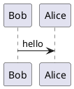
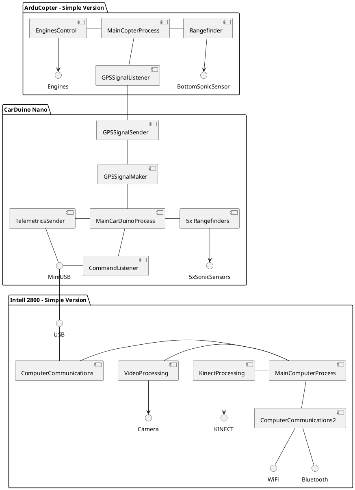
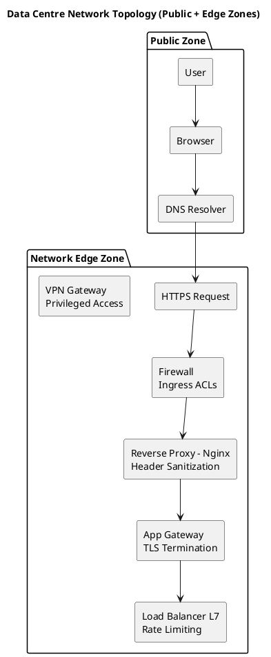
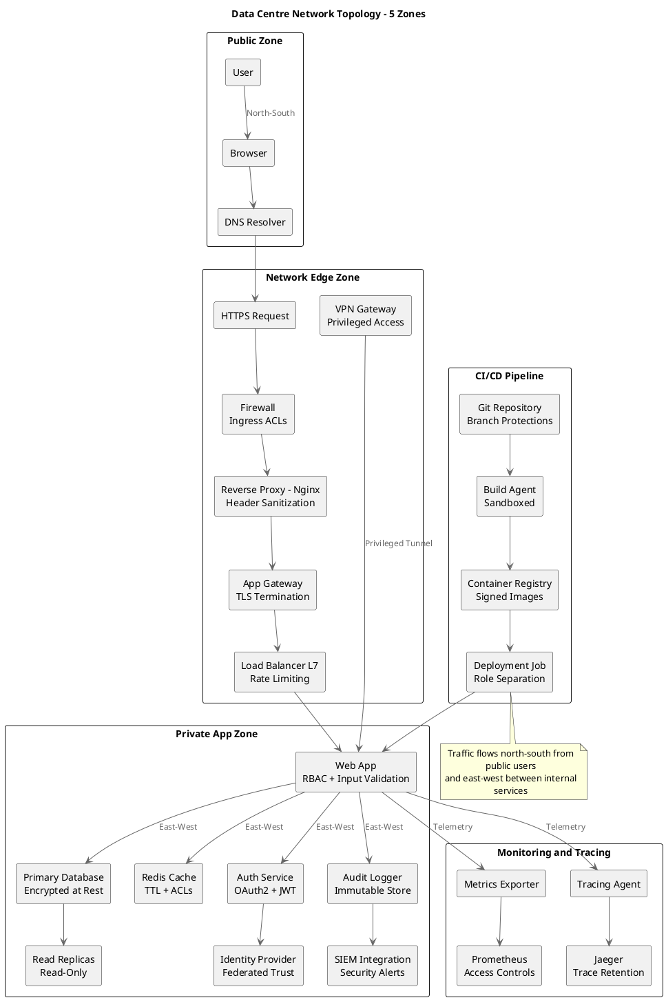

# PlantUML Diagrams

## Basic Sequence

```puml
    @startuml
    Bob -> Alice : hello
    @enduml
```
## Package (?)

```puml
    @startuml
    package "ArduCopter - Simple Version" {
    [EnginesControl] -down-> Engines
    [EnginesControl] - [MainCopterProcess]
    [MainCopterProcess] - [Rangefinder]
    [Rangefinder] -down-> BottomSonicSensor
    [MainCopterProcess] -down- [GPSSignalListener]
    }
    package "CarDuino Nano" {
    [GPSSignalMaker] -down- [MainCarDuinoProcess]
    [MainCarDuinoProcess] -down- [CommandListener]
    [GPSSignalMaker] -up- [GPSSignalSender]
    [MainCarDuinoProcess] - [5x Rangefinders]
    [5x Rangefinders] -down-> 5xSonicSensors
    [TelemetricsSender] - [MainCarDuinoProcess]
    [TelemetricsSender] -down- MiniUSB
    [CommandListener] -left- MiniUSB
    }
    package "Intell 2800 - Simple Version" {
    [ComputerCommunications] -up- USB
    [ComputerCommunications] - [MainComputerProcess]
    [KinectProcessing] -down-> KINECT
    [KinectProcessing] - [MainComputerProcess]
    [VideoProcessing] -down-> Camera
    [VideoProcessing] - [MainComputerProcess] 
    [ComputerCommunications2] -up- [MainComputerProcess]
    [ComputerCommunications2] -down- WiFi
    [ComputerCommunications2] -down- Bluetooth
    }
    [GPSSignalListener] -down- [GPSSignalSender]
    USB -up- MiniUSB
    @enduml
```

## Network (cockpilot)

```puml
    @startuml
    skinparam componentStyle rectangle
    title Data Centre Network Topology (Public + Edge Zones)

    package "Public Zone" {
    [User]
    [Browser]
    [DNS Resolver]
    }

    package "Network Edge Zone" {
    [HTTPS Request]
    [Firewall\nIngress ACLs]
    [Reverse Proxy - Nginx\nHeader Sanitization]
    [App Gateway\nTLS Termination]
    [Load Balancer L7\nRate Limiting]
    [VPN Gateway\nPrivileged Access]
    }

    [User] --> [Browser]
    [Browser] --> [DNS Resolver]
    [DNS Resolver] --> [HTTPS Request]
    [HTTPS Request] --> [Firewall\nIngress ACLs]
    [Firewall\nIngress ACLs] --> [Reverse Proxy - Nginx\nHeader Sanitization]
    [Reverse Proxy - Nginx\nHeader Sanitization] --> [App Gateway\nTLS Termination]
    [App Gateway\nTLS Termination] --> [Load Balancer L7\nRate Limiting]

    @enduml
```

## Network (Klod)

```puml
    @startuml
    !include <C4/C4_Container>

    title Data Centre Network Topology - 5 Zones

    rectangle "Public Zone" {
    rectangle "User" as A
    rectangle "Browser" as B  
    rectangle "DNS Resolver" as C
    }

    rectangle "Network Edge Zone" {
    rectangle "HTTPS Request" as D
    rectangle "Firewall\nIngress ACLs" as E
    rectangle "Reverse Proxy - Nginx\nHeader Sanitization" as F
    rectangle "App Gateway\nTLS Termination" as G
    rectangle "Load Balancer L7\nRate Limiting" as LB
    rectangle "VPN Gateway\nPrivileged Access" as VPN
    }

    rectangle "Private App Zone" {
    rectangle "Web App\nRBAC + Input Validation" as WA
    rectangle "Primary Database\nEncrypted at Rest" as DB
    rectangle "Redis Cache\nTTL + ACLs" as Cache
    rectangle "Auth Service\nOAuth2 + JWT" as Auth
    rectangle "Audit Logger\nImmutable Store" as Audit
    rectangle "Read Replicas\nRead-Only" as Replicas
    rectangle "Identity Provider\nFederated Trust" as IdP
    rectangle "SIEM Integration\nSecurity Alerts" as SIEM
    }

    rectangle "Monitoring and Tracing" {
    rectangle "Metrics Exporter" as Metrics
    rectangle "Tracing Agent" as Traces
    rectangle "Prometheus\nAccess Controls" as Prometheus
    rectangle "Jaeger\nTrace Retention" as Jaeger
    }

    rectangle "CI/CD Pipeline" {
    rectangle "Git Repository\nBranch Protections" as Git
    rectangle "Build Agent\nSandboxed" as Runner
    rectangle "Container Registry\nSigned Images" as Registry
    rectangle "Deployment Job\nRole Separation" as Deploy
    }

    ' North-South Traffic Flow
    A --> B : North-South
    B --> C
    C --> D
    D --> E
    E --> F
    F --> G
    G --> LB
    LB --> WA

    ' Privileged Access
    VPN --> WA : Privileged Tunnel

    ' East-West Traffic Flow
    WA --> DB : East-West
    DB --> Replicas
    WA --> Cache : East-West
    WA --> Auth : East-West
    Auth --> IdP
    WA --> Audit : East-West
    Audit --> SIEM

    ' Telemetry
    WA --> Metrics : Telemetry
    Metrics --> Prometheus
    WA --> Traces : Telemetry
    Traces --> Jaeger

    ' CI/CD Integration
    Git --> Runner
    Runner --> Registry
    Registry --> Deploy
    Deploy --> WA

    note bottom : Traffic flows north-south from public users\nand east-west between internal services

    @enduml
```
