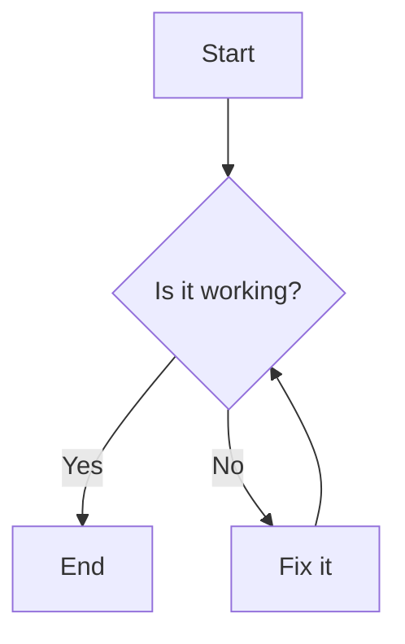
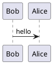
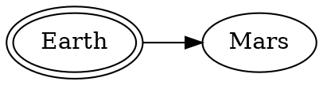

# Three Diagrams in One Markdown

## Mermaid

## PlantUML

<!-- diagram-a11y: title="puml (PlantUML) diagram title" desc="puml (PlantUML) diagram description inected by accessibility-injector.py; courtesy of Ler/GenAI swarm." -->

## Graphviz

<!-- diagram-a11y: title="Digraph Title" desc="Digraph description injected by accessibility-injector.py; courtesy of Ler/GenAI swarm." -->
