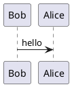
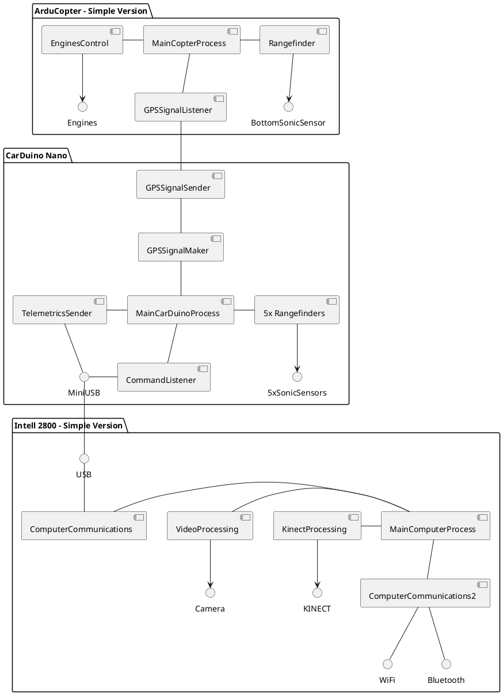
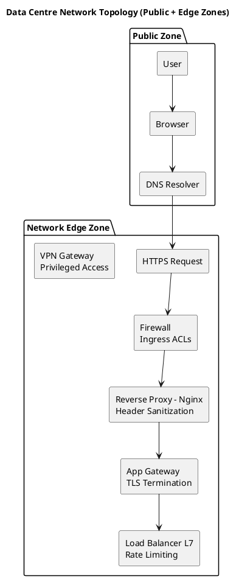
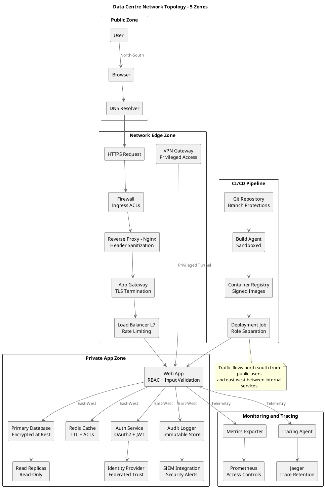
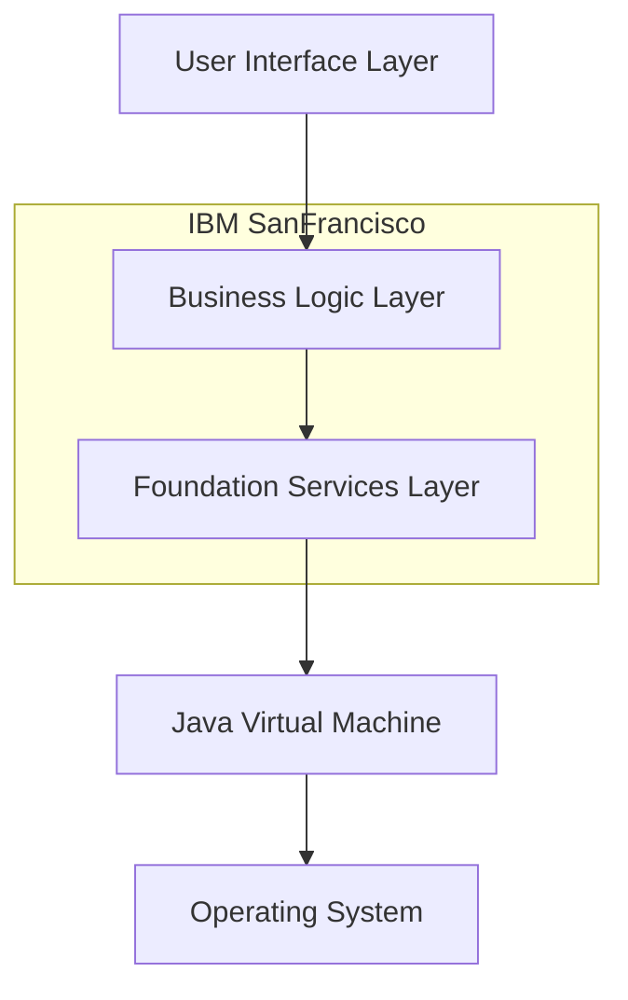
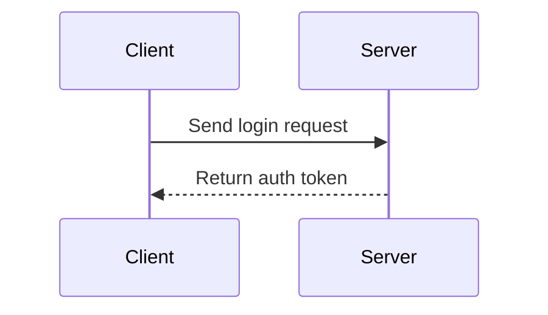
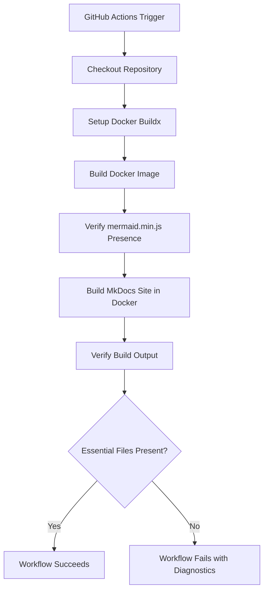

# Taxi
Take it back and forth from dev to preview/live reload.

## Admonitions

!!! tip "Pro Tip"
    Remember to always save your work!

!!! danger
    This action cannot be undone. Proceed with caution.

!!! example "Code Example"
    ```python
    print("Hello, Admonitions!")


Some text before an inline admonition. !!! info inline This is an inline info block. end More text after the inline admonition.

!!! note "Main Topic"
    This is the main content.

    !!! warning "Important Sub-point"
        Don't forget this crucial detail within the main topic.


## PlantUML





## PlantUML for Network Diagram

### Copilot



### Claude



## Mermaid with metadata




## Sequence



## Flowchart  

