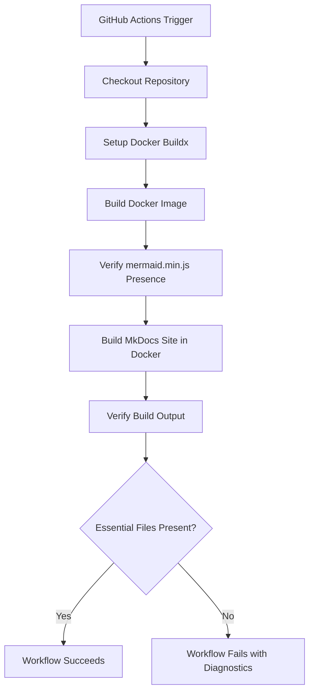

# Workflow Breakdown

The following is a detailed breakdown of my GitHub Actions workflow (`.github/workflow/deploy.yml`).



## 1. **Checkout Code**

```yaml
- uses: actions/checkout@v4
  with:
  fetch-depth: 0
```

- ensures full commit history for changelog integrity and editorial traceability

## 2. Set Up Docker Buildx

```yaml
- uses: docker/setup-buildx-action@v3
```

- enables advanced Docker build features like caching and multi-platform support

## 3. Build Docker Image

```yaml
- uses: docker/build-push-action@v5
  with:
    context: .
    push: false
    tags: mkdocs-builder:latest
    load: true
    cache-from: type=gha
    cache-to: type=gha,mode=max
```

- uilds a local image for MkDocs
- uses GitHub Actions cache to accelerate builds
- `load: true` makes the image available for subsequent steps

## 4. Verify Mermaid Asset

```bash
if [ ! -f "docs/js/mermaid.min.js" ]; then
  echo "ERROR: Mermaid JS asset missing"
  exit 1
fi
sha256sum docs/js/mermaid.min.js
```

- ensures mermaid.min.js is present and uncorrupted
- supports reproducible rendering and theme switching

## 5. Build MkDocs Site

```bash
docker run --rm \
  -v ${{ github.workspace }}:/app \
  -w /app \
  mkdocs-builder:latest \
  mkdocs build --verbose
```

- runs MkDocs inside the Docker container
- ensures consistent environment and dependency isolation

## 6. Verify Build Output

```bash
if [ ! -d "./site" ]; then
  echo "ERROR: MkDocs output folder './site' not found."
  exit 1
fi
```

- confirms successful build
- validates presence of essential editorial and accessibility assets

## 7. Asset Integrity Checks

```bash
essential_files=(...)
for file in "${essential_files[@]}"; do
  if [ -f "./site/$file" ]; then
    echo "Found: $file"
  else
    echo "Missing: $file"
  fi
done
```

- checks for critical JS, CSS, and HTML files
- ensures accessibility scripts and diagram enhancements are present

## 8. Mermaid Usage Audit

```bash
mermaid_count=$(find ./site -name "*.html" -exec grep -l "mermaid" {} \; | wc -l)
echo "Found $mermaid_count HTML files with Mermaid content"
```

- counts Mermaid-enabled pages
- useful for tracking diagram coverage and editorial scope

## 9. JS Size Diagnostic

```bash
js_size=$(stat -c%s "./site/js/alttext-inject.js")
echo "alttext-inject.js size: ${js_size} bytes"
```

- verifies asset integrity and helps catch accidental truncation or corruption

> **Notes**:
>
> - **Theme Adaptability**: `seamaiden-theme-switchr.js` attempts to ensure semantic clarity across light/dark modes without relying on Mermaid’s default heuristics
>
> - **Reproducibility**: Docker layering and explicit asset copying guarantee consistent builds
>
> - **Accessibility**: scripts like `alttext-inject.js` and `diagram-zoom.js` attempt to reinforce my accessibility-curious architecture
>
> **Changelog Cadence**: full Git history and verbose build logs should better support narrative-driven docs/specs

---

## For future consideration  

- add Mermaid rendering tests across themes
- validate diagram accessibility (e.g. alt text injection coverage)
- extend workflow with Markdownlint or YAML linting
- auto-generate changelog diffs for editorial traceability
