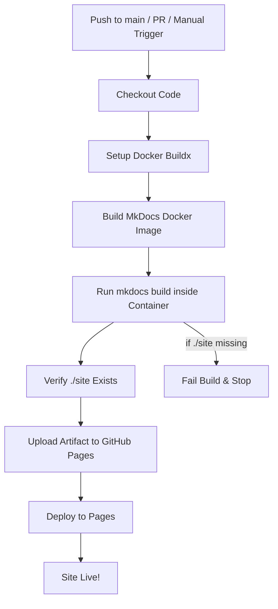

# Detailed Breakdown of My Workflow

Here is a detailed breakdown of my workflow:

## 1. Workflow Metadata

**General:** a CI/CD workflow starts by declaring a **name** and **triggers**

**The start of my workflow**:

```yaml
name: Deploy MkDocs to GitHub Pages
```

- this workflow is named **“Deploy MkDocs to GitHub Pages”**

## 2. Triggers (`on`)

**General:** defines what events start the workflow (push, PR, manual, scheduled)
**My trigger:**

```yaml
on:
  push:
    branches: [main]
  pull_request:
    branches: [main]
  workflow_dispatch:
```

- Runs when:
    - when changes are **pushed** to the `main` branch from either of my two machines
    - a **pull request** targets `main` (haven't had any yet)
    - a deployment is triggered **manually** (`workflow_dispatch`)

This ensures my MkDocs site is always up-to-date after changes.

## 3. Permissions

**General:** workflows declare what they can access (read/write)
**My permissions settings:**

```yaml
permissions:
  contents: read
  pages: write
  id-token: write
```

- can **read repo contents**
- can **write to GitHub Pages** (needed for deployment)
- can use **OIDC tokens** (secure authentication with GitHub)

## 4. Concurrency

**General:** prevents multiple deployments from clashing
**My concurrency settings:**

```yaml
concurrency:
  group: "pages"
  cancel-in-progress: false
```

- only one Pages deployment runs at a time (grouped under `"pages"`)
- ngoing runs are **not canceled** if a new one starts

## 5. Jobs

**General:** a workflow contains jobs; each job has steps
**My workflow job:**

```yaml
jobs:
  build:
    runs-on: ubuntu-latest
```

- a single job called **`build`**
- runs on a GitHub-hosted **Ubuntu Linux VM**

## 6. Steps – Checkout

**General:** first step is usually fetching source code
**The first step in my workflow job:**

```yaml
- name: Checkout code
  uses: actions/checkout@v4
  with:
    fetch-depth: 0
```

- uses the official `checkout` action
- `fetch-depth: 0` = full git history (important for MkDocs plugins like `git-revision-date`)

## 7. Steps – Docker Buildx Setup

**General:** sometimes workflows build Docker containers for repeatable builds
**My Docker setup step:**

```yaml
- name: Set up Docker Buildx
  uses: docker/setup-buildx-action@v3
```

- prepares **Docker Buildx**, which supports advanced builds with caching

## 8. Steps – Build Docker Image

**General:** you can encapsulate build environments into images
**My Docker image build step**:

```yaml
- name: 🏗️ Build Docker image
  uses: docker/build-push-action@v5
  with:
    context: .
    push: false
    tags: mkdocs-builder:latest
    load: true
    cache-from: type=gha
    cache-to: type=gha,mode=max
```

- builds a **local Docker image** (`mkdocs-builder:latest`) containing all tools to build MkDocs
- **Not pushed** to Docker Hub (just used locally)
- uses GitHub cache to speed up rebuilds

## 9. Steps – Build MkDocs Site

**General:** CI compiles source code into an artifact
**My artifact assembly step:**

```yaml
- name: Build MkDocs site
  run: |
    docker run --rm       -v ${{ github.workspace }}:/app       -w /app       mkdocs-builder:latest       mkdocs build --verbose
```

- uns the containerized `mkdocs build` command
- mounts repo into `/app`
- produces output into `./site/`

## 10. Steps – Verify Output

**General:** good practice is to test build artifacts.
**My workflow's verification step:**

```yaml
- name: 🔍 Verify build output
  run: |
    if [ ! -d "./site" ]; then
      echo "ERROR: MkDocs output folder './site' not found."
      ls -la ./
      exit 1
    fi
    echo "Build output verified."
```

- confirms the **`site/` folder** exists
- prevents publishing empty deployments

## 11. Deployment to GitHub Pages

**General:** after building, workflows upload and deploy artifacts
**My workflow's GitHub Pages deployment steps**:

- Use `actions/upload-pages-artifact` to store the `./site` folder.
- Use `actions/deploy-pages` to publish to GitHub Pages.

This finalizes the site, so it's' **live on my GitHub Pages domain**.

# Workflow Visualization



This workflow guarantees a **repeatable, containerized MkDocs build process** and a reliable deployment to GitHub Pages.  

## For future consideration

- add Mermaid rendering tests across themes
- validate diagram accessibility (e.g. alt text injection coverage)
- extend workflow with Markdownlint or YAML linting
- auto-generate changelog diffs for editorial traceability
