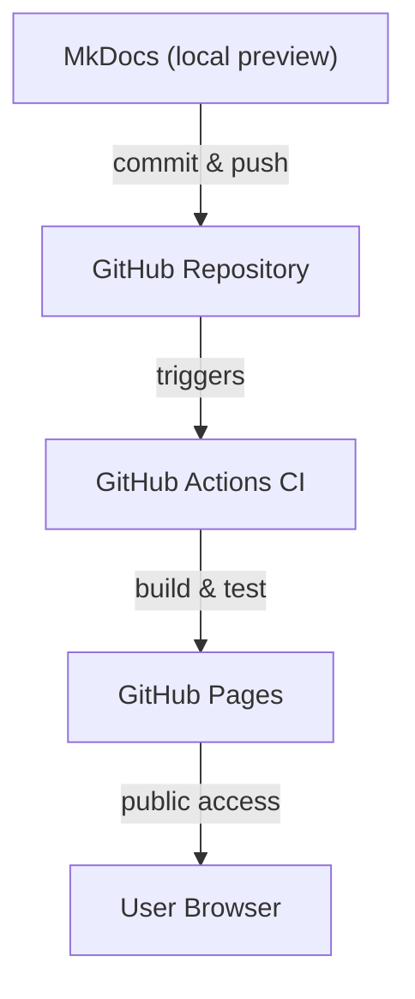

# How This Site Was Developed and Deployed

In August 2025, I revived an old MkDocs-based glossary project and reimagined it as a modular, containerized website, an all-in-one playground, demo, and concept repository. *See* [What's in Here?](whatsinhere.md). 

## Architecture Overview

This site uses a hybrid static-dynamic architecture:

### Static Layer

- **Framework**: MkDocs with Material theme
- **Content**: Markdown rendered into static HTML/CSS/JS
- **Deployment**: GitHub Pages via `gh-pages` branch
- **Enhancements**:
  - Custom JS/CSS for glossary navigation
  - Diagram spotlight/zoom via `diagram-zoom.js`
  - Alt-text injection via `alttext-inject.js` (experimental)
  - Focus ring, skip link, ARIA toggles, keyboard nav (partial)

### Dynamic Layer

- **Live Preview**: `mkdocs serve` inside Docker
- **Environment**: `MKDOCS_WATCHDOG_USE_POLLING=true`
- **Plugin**: 
  - `mkdocs-mermaid2-plugin` for diagram rendering  
  - `mkdocs-awesome-pages-plugin` for semi-automated TOC management and navigation

### Docker Environment

```dockerfile
FROM python:3.11-slim
WORKDIR /app
ENV PIP_ROOT_USER_ACTION=ignore
ENV PIP_DISABLE_PIP_VERSION_CHECK=1
ENV MKDOCS_WATCHDOG_USE_POLLING=true
COPY requirements.txt /app/
RUN pip install --no-cache-dir -r requirements.txt
COPY . /app
EXPOSE 8000
CMD ["mkdocs", "serve", "-a", "0.0.0.0:8000"]
```

* Dependencies cached via `requirements.txt`
* Port 8000 exposed for local development

### CI/CD Pipeline (GitHub Actions)

(for details, check out the deploy.yml file in the project, `.github/workflows/deploy.yml`)

* **Build**: Dockerized `mkdocs build`
* **Test**: Markdown linting, link checks, YAML validation
* **Deploy**: Static site pushed to GitHub Pages
* **Verify**: Artifact checks for essential files
* **Accessibility Test**: Pa11y CLI run against live site (non-blocking)

### Scripts and Assets

All scripts are stored in `docs/assets/js/` and loaded via `extra_javascript` in `mkdocs.yml`:

* `alphabet-auto.js`: in glossary pages, replaces the page-level TOC with a navigable alphabet 
* `diagram-zoom.js`: implements lightbox/zoom for diagrams
* `alttext-inject.js`: alt-text and ARIA role injection (work in progress)

CSS enhancements live in `docs/assets/css/`:

* `alphabet.css`: supports sidebar alphabet navigation
* `diagram-zoom.css`: complements zoom script
* `cm-logo.css`: inline logo styling

### Deployment Flow

Here is a basic representation. For a detailed breakdown, *see* [Workflow Breakdown](about-sitedev-breakdown.md).



## Tools Used

* **macOS**: Docker, VS Code, BBedit, Safari, Firefox
* **Linux**: Docker, VSCodium, xed, Chrome, Firefox

## Future Enhancements

- Try Azure DevOps migration, at least as an academical challenge
- Auth gate
- Audit logging
- Secrets management
- Role-based access
- 

