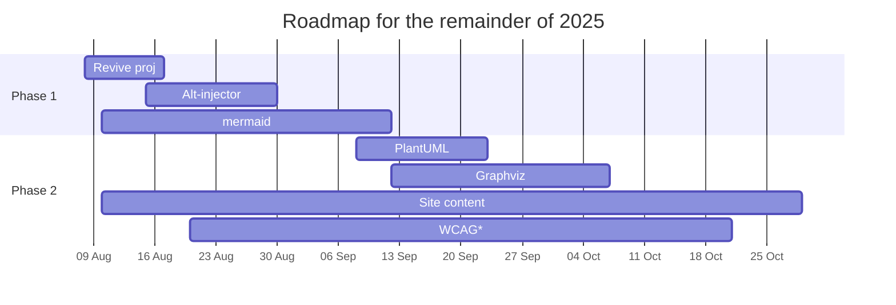

# Roadmap & Changelog

*within the 'WCAG' timeframe: semantic headings, skip links, color contrast check, screen-reader test, alt text, ARIA landmarks

## Changelog

- 2025.10.08 New set of [eHealth-related topics](../sec_ehealth/index.md).
- 2025.10.07 A mid-to-late 2010s [SAML/SSO admin guide](../sec_net-sec/saml-admin.md) for sentimental, aesthetic, and experimentation purposes. 
- 2025.10.05 A [topic](../sec_freeform/identity.md) on digital identity and its ~30-year evolution from password chaos to token sprawl.
- 2025.09.19 New topic — a presentation cheat sheet/report/article on the current [GenAI landscape](../sec_freeform/gen-ai-landscape-primer.md).
- 2025.09.12 Added support for PlantUML, as well as a current state of affairs before I move forward, [Diagram Accessibility in MkDocs Material: Current State & Path Forward](../sec_accss/mkdocs-mermaid-plantuml-graphviz.md).
- 2025.08.27 Dropped JS injector approach in favor of accessibility mechanism in mermaid2; added local version of `mermaid.min.js`, [Breakthrough #1](../sec_accss/mermaid-beyond-reach.md).
- 2025.08.25 Reorganized content in subfolders for the new plugin, `awesome-pages` to semi-automate the navigation
- 2025.08.20 Enabled theme toggler; one last try to make accessibility metadata injector work; 'current state of affairs' as a bloggish piece of text, [Visuals for the Sightless](../sec_accss/visuals-for-the-sightless.md)  
- 2025.08.19 Added some visuals to the AI-augmented Accessibility concept note; enabled some accessibility-related theme features
- 2025.08.18 Added a rough roadmap and a "concept note" based on the AI-augmented accessibility idea
- 2025.08.17 Added another first-ever; a 'technical daydream' on [AI-augmented accessibility](../sec_freeform/ai-accessibility.md)
- 2025.08.14 Site live via GitHub Pages
- 2025.08.13 Azure DevOps integration abandoned for technical reasons; GitHub Actions set up
- 2025.08.12 Added my first-ever 'technical memoir' on a pre-cloud-era Java project, [IBM-SanFrancisco](../sec_freeform/ibm-sanfran.md)
- 2025.08.08 Revival; attempting to connect with Azure DevOps; added a several 'contemporary' topics
- 2025.05.16 Attempt to revive the project and resume some GitHub activity
- 2021.01.24 Initial commit with a couple of glossaries for own use and to learn GitHub; shelved 2021.05.17
