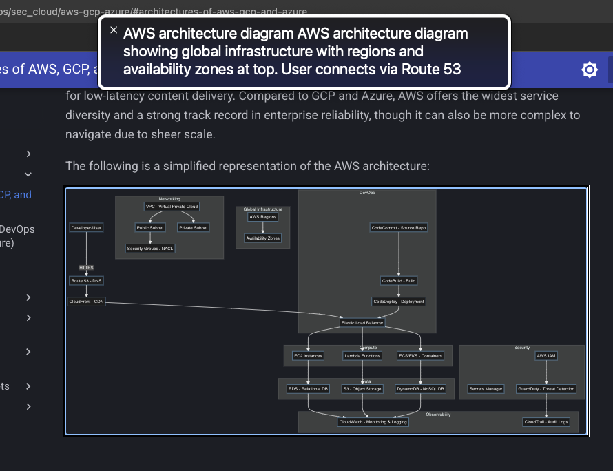

# Mermaid Captured — Finally!

I'll just dump this here as a sticky to-do note, to:

- Find out whether the SVG patcher approach is indeed the optimal, valid, legal, and most graceful one (perhaps there IS an official, developer-sanctioned way to get a Mermaid diagram to have `role="img"` and `tabindex="0"` in addition to `accTitle`and `accDescr`).
- Combine Mermaid diagram-related content into a single reference/cheat sheet.

## The Patcher

So, following a small breakthrough ([An Accessible Mermaid Beyond Reach](breakthru1-mermaid-svg.md)), a post-build patcher got an assistive technology, VoiceOver on macOS, to treat a Mermaid-to-SVG-to-HTML diagram the way I wanted.

## The Patcher

Referenced last in the `extra_javascript:` list of custom script declarations inside `mkdocs.yml`:

```js
// Wait for Mermaid to finish rendering
window.addEventListener('load', function() {
  setTimeout(function() {
    document.querySelectorAll('svg[role="graphics-document document"]').forEach(svg => {
      svg.setAttribute('role', 'img');
      svg.setAttribute('tabindex', '0');
      svg.removeAttribute('aria-roledescription');
    });
  }, 1000); // Adjust delay if needed
});
```

## The Fix:

Here is the VoiceOver app on macOS, reading a diagram description out loud:

- By forcibly switching the `role` to `img`, it tells AT: *“treat this entire `<svg>` as one atomic image, with a single name and description.”*
- With `aria-labelledby` → `title` and `aria-describedby` → `desc`, the accessible name/description calculation becomes:
    - Name: contents of `<title>` (the `accTitle:` value inside the Mermaid block of the source Markdown document)
    - Description: contents of `<desc>` (the `accDescr:` value inside the Mermaid block of the source Markdown document)
- AT announces it exactly as I wanted, e.g.: *“Azure architecture diagram. Azure architecture diagram with global regions and availability zones…\[etc\]”*.

And because `aria-roledescription` is removed, there is nothing to override or confuse the role mapping.

Why `tabindex` matters here:

- Adding `tabindex="0"` makes the `<svg>` keyboard-focusable, so users who navigate by keyboard (screen reader users, sighted keyboard users) can land on the diagram and hear the name/description announced.
- Without focusability, the diagram might be skipped entirely, even if it has valid role/name/description.

## The Basic Test:

