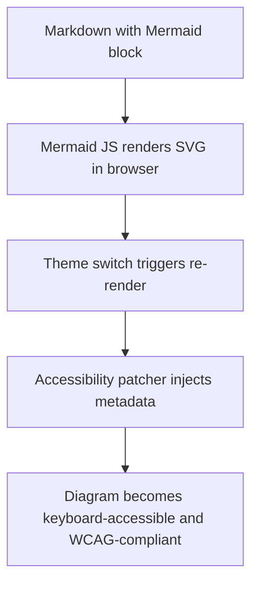
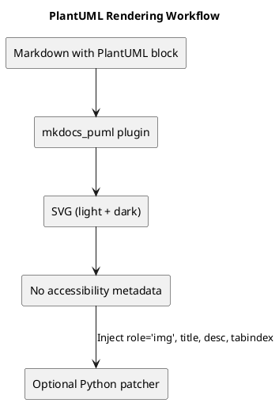

# Diagram Accessibilit   in MkDocs Material: Current State & Path Forward

I have now built (*hopefully*, as usual) a more-or-less robust documentation platform with live diagram rendering, theme switching, and accessibility patching for **Mermaid**. But **PlantUML** and **Graphviz** still lag behind in accessibility and dynamic responsiveness.

---

## Mermaid: Fully Live, Fully Accessible

Mermaid diagrams are rendered client-side using JavaScript. My `seamaiden.js` handles theme switching, and `svg-patcher.js` injects accessibility metadata (`role="img"`, `tabindex="0"`, etc.) after rendering.

### Mermaid Rendering Workflow

This flow is modular, responsive, and editorially controlled.

---

## PlantUML: Static, Theme-Aware, But Not Accessible

PlantUML diagrams are rendered server-side or at build-time via `mkdocs_puml`. The plugin supports dual rendering for light and dark themes, but SVGs lack accessibility metadata unless manually patched.

### PlantUML Rendering Workflow

To match Mermaid’s accessibility, I'll need a Python-based SVG patcher that runs post-build.

---

## Graphviz: Powerful, But Accessibility-Agnostic

Graphviz (DOT language) is rendered at build-time into static SVGs. It’s great for dependency graphs and provenance maps, but:

- No theme responsiveness
- No accessibility metadata
- No live preview

To integrate Graphviz cleanly:
- I could use `mkdocs-diagrams` — for unified rendering
- Pre-render `.dot` files to SVG
- Inject accessibility metadata via Python patcher
- Wrap diagrams in `<figure>` blocks with captions and changelog tags

---

## Summary of Capabilities

| Feature                      | Mermaid            | PlantUML           | Graphviz           |
|-----------------------------|--------------------|--------------------|--------------------|
| Rendering Mode              | Runtime (JS)       | Build-time         | Build-time         |
| Theme Switching             | ✅ Native           | ⚠️ Dual render      | ❌ Manual only      |
| Accessibility Metadata      | ✅ JS patcher       | ⚠️ Python patcher   | ❌ Manual only      |
| Live Preview                | ✅ Yes              | ⚠️ Limited          | ❌ None             |
| Provenance Tagging          | ⚠️ Manual           | ✅ File-based       | ✅ File-based       |
| Editorial Control           | ✅ High             | ✅ Moderate         | ⚠️ Low              |

---

## 🛠️ Rough Plan to Extend Full Support

### 1. **PlantUML Accessibility**
- Write a Python patcher to inject `<title>`, `<desc>`, `role="img"`, and `tabindex="0"` into SVGs
- Run it post-build or in CI/CD pipeline
- Optionally tag diagrams with `data-provenance` and changelog metadata

### 2. **Graphviz Integration**
- Use `mkdocs-diagrams` to unify rendering
- Pre-render `.dot` files to SVG
- Apply same Python patcher for accessibility
- Wrap diagrams in `<figure>` blocks with captions and editorial context

### 3. **Registry and Provenance**
- Create a diagram registry with filenames, changelog tags, and accessibility status
- Use `aria-describedby` to link diagrams to hidden editorial notes
- Ensure all diagrams are keyboard-accessible and theme-aware

---

With this flow, I might end up having full editorial control, accessibility compliance, and modular rendering across all diagram formats — without brittle plugins or runtime flicker.
