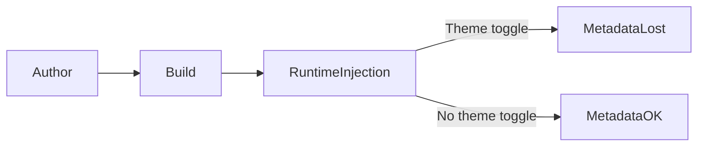

# Visuals for the Sightless (Accessibility, Round Two)

So it looks like I’m diving into accessibility and WCAG for a second time. The first time, way back in 2010, doesn’t really count — I was part of a large org with a techcomm tools engineer, a QA team, and workflows that enforced "almost-full compliance" by default. (To me it sounded a bit off. Like, *you're either Section 508 or WCAG-copliant, or you're not, no?*) But I didn't care to voice it, perhaps also because my mom wasn't sightless yet.

Now I’m solo, building a Dockerized MkDocs Material site with supposedly format-neutral diagram support, hopefully to become, um, *almost fully* accessible some day 😊

This time, accessibility isn’t a checkbox. And the deeper I go, the more I realize how brittle the ecosystem is when you try to retrofit compliance into dynamically rendered content.

## The Mermaid Plugin Trap

The `mkdocs-mermaid2-plugin==1.2.1` lets you author diagrams inline in Markdown and renders them client-side as SVGs. It’s ergonomic, fast, and great for prototyping. But it’s also a compliance minefield.

### Why It’s Problematic


| Concern                       | Description                                                                        |
| ------------------------------- | ------------------------------------------------------------------------------------ |
| **No built-in accessibility** | Mermaid-generated SVGs lack`<title>`, `<desc>`, ARIA roles, or labels.             |
| **Client-side rendering**     | Diagrams are injected after page load, making static accessibility impossible.     |
| **Theme-dependent rendering** | Diagrams repaint based on light/dark mode, often wiping injected metadata.         |
| **No lifecycle hooks**        | There’s no reliable callback to hook into post-render for mutation.               |
| **Silent failures**           | If your script runs too early or too late, nothing happens — and you won’t know. |

## Runtime Injection: A Fragile Strategy

I’ve tried multiple iterations of a post-build accessibility injector. The latest version attempts to pair HTML comments with Mermaid diagrams and inject metadata once the SVG is rendered.

### Current Script (Excerpt)

```js
// Simple ALT comment processor for AODA compliance
// scripts/js/alt-processor.js

document.addEventListener("DOMContentLoaded", () => {
  const walker = document.createTreeWalker(document.body, NodeFilter.SHOW_COMMENT, null, false);
  const altComments = [];

  while (walker.nextNode()) {
    const comment = walker.currentNode;
    const match = comment.nodeValue.trim().match(/^ALT:\s*(.+)$/);
    if (match) {
      altComments.push({ node: comment, text: match[1] });
    }
  }

  altComments.forEach(({ node, text }) => {
    let next = node.nextSibling;
    while (next && !(next.nodeType === 1 && next.classList?.contains("mermaid"))) {
      next = next.nextSibling;
    }

    if (next) {
      const checkForSvg = () => {
        const svg = next.querySelector("svg");
        if (svg) {
          svg.setAttribute("role", "img");
          svg.setAttribute("aria-label", text);
          svg.setAttribute("tabindex", "0");

          const title = document.createElementNS("http://www.w3.org/2000/svg", "title");
          title.textContent = "Diagram";
          const desc = document.createElementNS("http://www.w3.org/2000/svg", "desc");
          desc.textContent = text;

          svg.insertBefore(desc, svg.firstChild);
          svg.insertBefore(title, svg.firstChild);
        } else {
          setTimeout(checkForSvg, 100);
        }
      };
      checkForSvg();
    }
  });
});
```

### Weaknesses in Current Script  

Here is what our GenAI friends say about the script:  

* **Infinite polling risk**: setTimeout loop can run forever if SVG never appears.
* **Metadata duplication**: `<title>`/`<desc>` inserted repeatedly if re-rendered.
* **Theme switch wipes metadata**: No MutationObserver to reapply metadata.
* **Accessibility semantics**: Hardcoded `title = "Diagram"` adds little value.
* **Silent failures**: No logging or error reporting when mutation fails.

### What Breaks  

| Failure Mode            | Cause                          | Result                             |
| ------------------------- | -------------------------------- | ------------------------------------ |
| **Early execution**     | Mermaid hasn’t rendered yet   | No SVG found, no mutation          |
| **Theme switch**        | User toggles light/dark mode   | Mermaid re-renders, metadata wiped |
| **Browser quirks**      | JS blocked or delayed          | Script fails silently              |
| **DOM mutation timing** | Mermaid uses delayed injection | Mutation observer misses target    |

## The Light/Dark Mode Problem

This deserves its own section. Perhaps a book. Mermaid diagrams often repaint when the user toggles their browser’s theme. This is usually done via CSS variables or JS-based theming. But here’s what happens:

1. **Initial render**: Your script injects metadata into the SVG.
2. **User switches theme**: Mermaid re-renders the diagram.
3. **New SVG replaces old one**: Your injected metadata is gone.
4. **No hook to re-run script**: Accessibility is broken again.

### Theme-Sensitive Rendering Table


| Event                      | Diagram Behavior         | Metadata Status                            |
| ---------------------------- | -------------------------- | -------------------------------------------- |
| Page load (light mode)     | Mermaid renders SVG      | Metadata injected if script runs correctly |
| Theme switch to dark       | Mermaid re-renders       | Metadata lost unless script re-runs        |
| Theme switch back to light | Mermaid re-renders again | Metadata lost again                        |
| No mutation observer       | No re-injection          | Accessibility fails                        |



This is a fundamental flaw in relying on runtime injection for compliance. It’s not just fragile, it’s unsustainable.

## The Case for Prebuilt SVGs

After enough frustration, the alternative starts to look like a more sane option: generate SVGs locally, inject metadata before build, and serve them as static assets.

### Benefits

* Full control over `<title>`, `<desc>`, ARIA roles, and provenance.
* No runtime dependency — everything is baked into the source.
* Theme fidelity — generate light and dark variants with guaranteed contrast.
* Reproducibility — no silent failures, no timing issues.

### Tradeoffs


| Tradeoff                         | Impact                                |
| ---------------------------------- | --------------------------------------- |
| No Markdown-native authoring     | Slightly slower iteration             |
| Mermaid plugin becomes redundant | Simplifies production builds          |
| Requires local tooling           | But enables automation and validation |

## So, Now What?

So, now I'm probably going to give the injector logic one last try to get it to work for the moment, at least for the benefit of a cheap, temporary sense of accomplishement. Fingers crossed for my developer friends and all the GenAI engines and agents and assistants I can think of.

Down the road/longer term — perhaps [mobilize some of them 'for real'?](../sec_freeform/ai-accessibility.md)
