# Cross-Platform Cloud & DevOps Glossary (AWS, GCP, Azure)

A compact, comparative reference for core cloud services across AWS, Google Cloud Platform (GCP), and Microsoft Azure. Designed for modular documentation platforms, provenance-tagged workflows, and editorial clarity.

---

## Compute & Orchestration

| Function           | AWS               | GCP                | Azure               |
|--------------------|-------------------|--------------------|---------------------|
| Virtual Machines   | EC2               | Compute Engine     | Virtual Machines    |
| Autoscaling        | Auto Scaling      | Instance Groups    | VM Scale Sets       |
| Kubernetes         | EKS               | GKE                | AKS                 |
| Containers (non-K8s)| ECS / Fargate    | Cloud Run          | ACI / Container Apps|
| Serverless (FaaS)  | Lambda            | Cloud Functions    | Azure Functions     |

---

## CI/CD & Infrastructure as Code

| Function           | AWS                   | GCP                      | Azure                        |
|--------------------|------------------------|---------------------------|-------------------------------|
| CI/CD Pipelines    | CodePipeline / CodeBuild| Cloud Build / Deploy     | Azure DevOps / GitHub Actions|
| IaC Native         | CloudFormation         | Deployment Manager        | ARM / Bicep                  |
| IaC Universal      | Terraform              | Terraform                 | Terraform                    |

---

## Secrets & Identity

| Function           | AWS                   | GCP               | Azure             |
|--------------------|------------------------|--------------------|-------------------|
| Secrets Management | Secrets Manager / SSM | Secret Manager     | Key Vault         |
| IAM                | IAM                   | IAM                | Azure Active Directory |

---

## Storage & Data

| Function           | AWS               | GCP               | Azure             |
|--------------------|-------------------|--------------------|-------------------|
| Object Storage     | S3                | Cloud Storage      | Blob Storage      |
| Block Storage      | EBS               | Persistent Disks   | Managed Disks     |
| File Storage       | EFS               | Filestore          | Azure Files       |

---

## Monitoring & Logging

| Function           | AWS                   | GCP                      | Azure                        |
|--------------------|------------------------|---------------------------|-------------------------------|
| Monitoring         | CloudWatch / X-Ray     | Cloud Monitoring / Trace | Azure Monitor / App Insights |
| Logging            | CloudWatch Logs        | Cloud Logging             | Log Analytics / Diagnostics  |

---

## Service Equivalents, Diagrammatically

```mermaid
 graph TD
     accTitle: Multi-Cloud Service Equivalence Diagram: AWS, GCP, Azure
     accDescr: This diagram compares core cloud services across AWS, Google Cloud Platform, and Microsoft Azure. Each cloud provider is grouped into a labeled subgraph, showing equivalent services for compute, containers, serverless, CI/CD, secrets, storage, and monitoring. Arrows indicate functional parity between platforms to support cross-cloud understanding and modular architecture.
  %% AWS Subgraph
  subgraph AWS [AWS]
    AWS_EC2[EC2]
    AWS_Lambda[Lambda]
    AWS_EKS[EKS]
    AWS_ECS[ECS / Fargate]
    AWS_CodePipeline[CodePipeline]
    AWS_CloudFormation[CloudFormation]
    AWS_SecretsManager[Secrets Manager]
    AWS_S3[S3]
    AWS_EBS[EBS]
    AWS_EFS[EFS]
    AWS_CloudWatch[CloudWatch]
    AWS_CloudWatchLogs[CloudWatch Logs]
  end

  %% GCP Subgraph
  subgraph GCP [Google Cloud Platform]
    GCP_ComputeEngine[Compute Engine]
    GCP_CloudFunctions[Cloud Functions]
    GCP_GKE[GKE]
    GCP_CloudRun[Cloud Run]
    GCP_CloudBuild[Cloud Build]
    GCP_DeploymentManager[Deployment Manager]
    GCP_SecretManager[Secret Manager]
    GCP_CloudStorage[Cloud Storage]
    GCP_PersistentDisk[Persistent Disk]
    GCP_Filestore[Filestore]
    GCP_CloudMonitoring[Cloud Monitoring]
    GCP_CloudLogging[Cloud Logging]
  end

  %% Azure Subgraph
  subgraph Azure [Microsoft Azure]
    Azure_VM[Virtual Machines]
    Azure_Functions[Azure Functions]
    Azure_AKS[AKS]
    Azure_ACI[ACI / Container Apps]
    Azure_DevOps[Azure DevOps]
    Azure_ARM[ARM / Bicep]
    Azure_KeyVault[Key Vault]
    Azure_BlobStorage[Blob Storage]
    Azure_ManagedDisk[Managed Disks]
    Azure_Files[Azure Files]
    Azure_Monitor[Azure Monitor]
    Azure_LogAnalytics[Log Analytics]
  end

  %% Equivalence Links
  AWS_EC2 --> GCP_ComputeEngine --> Azure_VM
  AWS_Lambda --> GCP_CloudFunctions --> Azure_Functions
  AWS_EKS --> GCP_GKE --> Azure_AKS
  AWS_ECS --> GCP_CloudRun --> Azure_ACI
  AWS_CodePipeline --> GCP_CloudBuild --> Azure_DevOps
  AWS_CloudFormation --> GCP_DeploymentManager --> Azure_ARM
  AWS_SecretsManager --> GCP_SecretManager --> Azure_KeyVault
  AWS_S3 --> GCP_CloudStorage --> Azure_BlobStorage
  AWS_EBS --> GCP_PersistentDisk --> Azure_ManagedDisk
  AWS_EFS --> GCP_Filestore --> Azure_Files
  AWS_CloudWatch --> GCP_CloudMonitoring --> Azure_Monitor
  AWS_CloudWatchLogs --> GCP_CloudLogging --> Azure_LogAnalytics
```

## Mnemonic Anchors

- **Kubernetes**: EKS ⇄ GKE ⇄ AKS
- **Serverless**: Lambda ⇄ Cloud Functions ⇄ Azure Functions
- **Storage**: S3 ⇄ Cloud Storage ⇄ Blob Storage
- **Secrets**: Secrets Manager ⇄ Secret Manager ⇄ Key Vault
- **CI/CD**: CodePipeline ⇄ Cloud Build ⇄ Azure DevOps

## 🗂 Editorial Notes

- GCP’s VPCs are global; AWS and Azure default to region-scoped.
- Azure tightly integrates with Windows Server and Active Directory.
- AWS IAM offers granular policy control; Azure AD excels in enterprise federation.
- Terraform remains the lingua franca for cross-cloud IaC.

