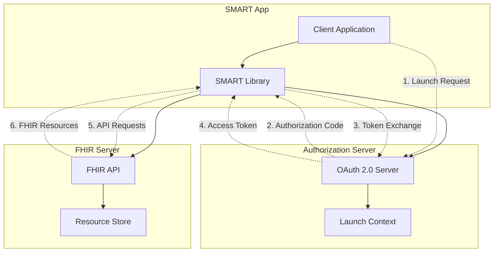

# SMART-on-FHIR Architecture Overview

```mermaid
graph TB
    subgraph "SMART App"
        A[Client Application]
        B[SMART Library]
    end
  
    subgraph "Authorization Server"
        C[OAuth 2.0 Server]
        D[Launch Context]
    end
  
    subgraph "FHIR Server"
        E[FHIR API]
        F[Resource Store]
    end
  
    A --> B
    B --> C
    C --> D
    B --> E
    E --> F
  
    A -.->|1. Launch Request| C
    C -.->|2. Authorization Code| B
    B -.->|3. Token Exchange| C
    C -.->|4. Access Token| B
    B -.->|5. API Requests| E
    E -.->|6. FHIR Resources| B
```