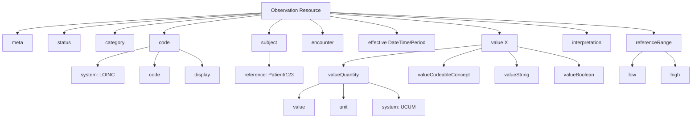
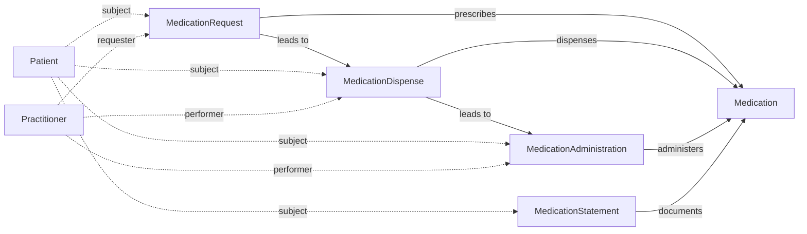

# Key FHIR Resources

## 1. Patient Resource

The Patient resource is the cornerstone of FHIR, representing demographics and administrative information.

**Key Elements:**

* `identifier`: Business identifiers (MRN, SSN)
* `name`: Human names with given/family
* `telecom`: Contact information
* `gender`: Administrative gender
* `birthDate`: Date of birth
* `address`: Physical addresses
* `contact`: Emergency contacts
* `communication`: Languages

## 2. Observation Resource

Observations represent measurements, assessments, and findings.

**Categories:**

* Vital signs (blood pressure, heart rate, temperature)
* Laboratory results (glucose, hemoglobin)
* Social history (smoking status)
* Imaging findings

**Key Elements:**

* `status`: registered, preliminary, final, amended
* `category`: Classification of observation type
* `code`: What was observed (LOINC codes)
* `subject`: Reference to Patient
* `effectiveDateTime`: When observation occurred
* `value[x]`: Result value (Quantity, CodeableConcept, String)

**Observation Resource Structure**

## 3. Condition Resource

Conditions represent diagnoses, problems, or clinical conditions.

**Key Elements:**

* `clinicalStatus`: active, inactive, resolved
* `verificationStatus`: confirmed, provisional, differential
* `category`: problem-list-item, encounter-diagnosis
* `severity`: Subjective severity (mild, moderate, severe)
* `code`: Identification of condition (SNOMED CT, ICD-10)
* `subject`: Patient reference
* `encounter`: Context of condition
* `onset[x]`: When condition began
* `abatement[x]`: When condition resolved

## 4. MedicationRequest Resource

Represents an order or request for medication.

**Key Elements:**

* `status`: active, on-hold, cancelled, completed
* `intent`: proposal, plan, order
* `medication[x]`: What medication (CodeableConcept or Reference)
* `subject`: Patient reference
* `authoredOn`: When request was created
* `requester`: Who ordered the medication
* `dosageInstruction`: How medication should be taken
* `dispenseRequest`: Dispensing details

**Medication Workflow Resources**

## 5. Encounter Resource

Represents interactions between patient and healthcare provider.

**Types:**

* ambulatory (outpatient)
* emergency
* inpatient
* home health
* virtual

**Key Elements:**

* `status`: planned, arrived, in-progress, finished
* `class`: Classification of encounter
* `type`: Specific type of encounter
* `subject`: Patient reference
* `participant`: Healthcare providers involved
* `period`: Start and end time
* `reasonCode`: Why encounter occurred
* `diagnosis`: Diagnoses relevant to encounter
* `hospitalization`: Details if admitted