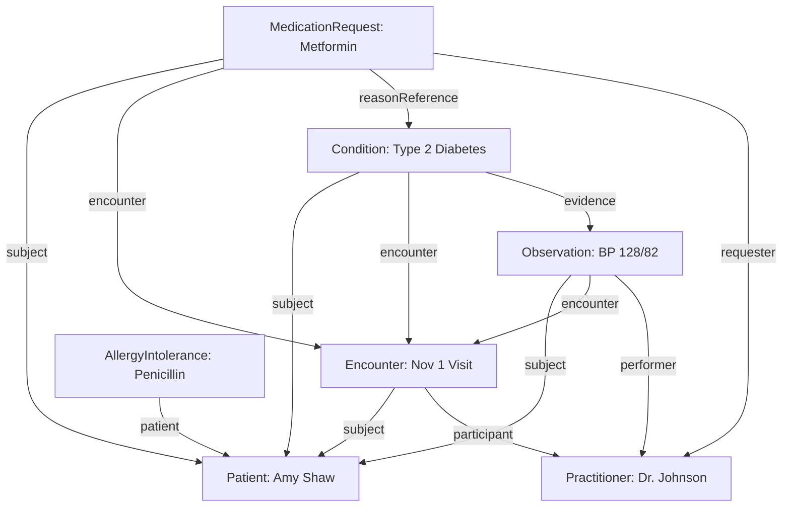
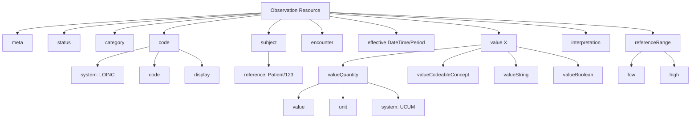
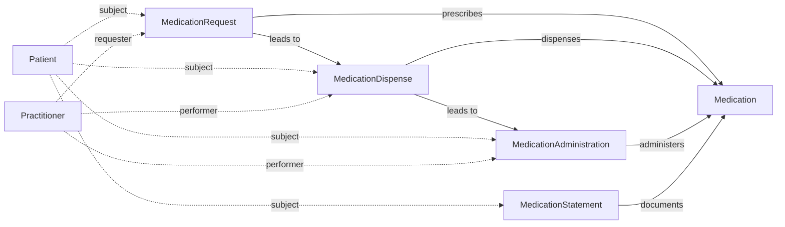

# Key FHIR Resources

## Understanding FHIR's Resource Model

Before diving into specific resources, let's establish a mental model. FHIR resources are like building blocks—atomic units of healthcare data that combine to tell a patient's story. Each resource has:

1. **A defined structure**: Required and optional fields (cardinality rules)
2. **Semantic meaning**: Standard codes and terminologies (LOINC, SNOMED CT)
3. **Relationships**: References to other resources (e.g., Observation → Patient)
4. **Metadata**: Creation time, last update, version, profile conformance

Think of resources as JSON objects with healthcare-specific constraints. Unlike arbitrary API responses, FHIR resources must validate against official schemas.

## The Core Resources Every SMART App Uses

We'll focus on the six resources that appear in nearly every clinical app. Later sections will cover scheduling, documentation, and financial resources, but master these first:

---

## 1. Patient Resource: The Identity Anchor

**Why it matters**: Every clinical resource references a patient. Understanding Patient is foundational.

### What It Represents

A Patient resource captures:

- **Demographics**: Name, gender, birth date, death date
- **Identifiers**: Medical record numbers (MRNs), SSNs, passport numbers
- **Contact info**: Phone, email, addresses
- **Relationships**: Emergency contacts, caregivers, related persons
- **Communication preferences**: Preferred language, interpreter needs
- **Organization linkage**: Which hospital/clinic manages this record

### Real-World Example

```json
{
  "resourceType": "Patient",
  "id": "smart-1288992",
  "meta": {
    "versionId": "3",
    "lastUpdated": "2024-10-15T14:22:00Z",
    "profile": ["http://hl7.org/fhir/us/core/StructureDefinition/us-core-patient"]
  },
  "identifier": [
    {
      "use": "usual",
      "type": {
        "coding": [{
          "system": "http://terminology.hl7.org/CodeSystem/v2-0203",
          "code": "MR",
          "display": "Medical Record Number"
        }]
      },
      "system": "http://hospital.example.org",
      "value": "MRN-123456"
    }
  ],
  "active": true,
  "name": [
    {
      "use": "official",
      "family": "Shaw",
      "given": ["Amy", "V"]
    }
  ],
  "telecom": [
    {
      "system": "phone",
      "value": "555-555-5555",
      "use": "home"
    },
    {
      "system": "email",
      "value": "amy.shaw@example.com"
    }
  ],
  "gender": "female",
  "birthDate": "1987-02-20",
  "address": [
    {
      "use": "home",
      "line": ["123 Main St", "Apt 4B"],
      "city": "Boston",
      "state": "MA",
      "postalCode": "02101",
      "country": "US"
    }
  ],
  "maritalStatus": {
    "coding": [{
      "system": "http://terminology.hl7.org/CodeSystem/v3-MaritalStatus",
      "code": "M",
      "display": "Married"
    }]
  },
  "contact": [
    {
      "relationship": [{
        "coding": [{
          "system": "http://terminology.hl7.org/CodeSystem/v2-0131",
          "code": "C",
          "display": "Emergency Contact"
        }]
      }],
      "name": {
        "family": "Shaw",
        "given": ["Robert"]
      },
      "telecom": [{
        "system": "phone",
        "value": "555-555-6666",
        "use": "mobile"
      }]
    }
  ],
  "communication": [
    {
      "language": {
        "coding": [{
          "system": "urn:ietf:bcp:47",
          "code": "en-US",
          "display": "English (United States)"
        }]
      },
      "preferred": true
    }
  ],
  "managingOrganization": {
    "reference": "Organization/smart-org-123",
    "display": "Example Hospital"
  }
}
```

### Key Elements to Understand

**`identifier`**: Business identifiers are crucial for matching patients across systems. A patient might have:

- An MRN from each hospital they've visited
- A national ID (SSN in US, NHS number in UK)
- Insurance member IDs

The `system` URI disambiguates: `http://hospital.example.org|MRN-123456` vs. `http://another-hospital.org|MRN-123456` are different people.

**`name`**: Can have multiple names with different `use` values:

- `official`: Legal name
- `usual`: Preferred name
- `nickname`: "Bob" vs. "Robert"
- `maiden`: Pre-marriage surname

**`active`**: If `false`, the record is obsolete (perhaps merged with another patient). Apps should warn users.

**`deceased[x]`**: Either `deceasedBoolean: true` or `deceasedDateTime: "2023-05-10"`. Critical for care pathways and billing.

### Common App Use Cases

- **Demographics display**: Show name, DOB, gender in header
- **Contact tracing**: Get phone/email for appointment reminders
- **Identity verification**: Match MRN from external system
- **Population health**: Filter by age, gender, location for cohort studies

---

## 2. Observation Resource: The Measurement Workhorse

**Why it matters**: Observations represent 80%+ of clinical data: vitals, labs, imaging findings, social history, and more.

### What It Represents

An Observation is any measurement or assessment, including:

- **Vital signs**: Blood pressure, heart rate, temperature, oxygen saturation
- **Laboratory results**: Glucose, hemoglobin, cholesterol panels
- **Imaging findings**: "Mass in left lung lobe" from radiology report
- **Social history**: Smoking status, alcohol use, occupation
- **Physical findings**: "Murmur heard on auscultation"
- **Device measurements**: Continuous glucose monitor readings, step counts

### The Observation Lifecycle

```
registered → preliminary → final → amended → corrected → entered-in-error
```

- **registered**: Observation ordered but not yet performed
- **preliminary**: Initial result, subject to change (e.g., "pending confirmation")
- **final**: Verified result, clinically actionable
- **amended**: Final result was changed (with reason)
- **entered-in-error**: Observation should be ignored (not deleted, for audit trail)

### Real-World Example: Blood Pressure

```json
{
  "resourceType": "Observation",
  "id": "bp-20241101",
  "status": "final",
  "category": [{
    "coding": [{
      "system": "http://terminology.hl7.org/CodeSystem/observation-category",
      "code": "vital-signs",
      "display": "Vital Signs"
    }]
  }],
  "code": {
    "coding": [{
      "system": "http://loinc.org",
      "code": "85354-9",
      "display": "Blood pressure panel with all children optional"
    }],
    "text": "Blood Pressure"
  },
  "subject": {
    "reference": "Patient/smart-1288992",
    "display": "Amy V. Shaw"
  },
  "encounter": {
    "reference": "Encounter/smart-enc-456"
  },
  "effectiveDateTime": "2024-11-01T10:30:00-05:00",
  "issued": "2024-11-01T10:35:00-05:00",
  "performer": [{
    "reference": "Practitioner/smart-pract-789",
    "display": "Dr. Sarah Johnson"
  }],
  "component": [
    {
      "code": {
        "coding": [{
          "system": "http://loinc.org",
          "code": "8480-6",
          "display": "Systolic blood pressure"
        }]
      },
      "valueQuantity": {
        "value": 128,
        "unit": "mmHg",
        "system": "http://unitsofmeasure.org",
        "code": "mm[Hg]"
      }
    },
    {
      "code": {
        "coding": [{
          "system": "http://loinc.org",
          "code": "8462-4",
          "display": "Diastolic blood pressure"
        }]
      },
      "valueQuantity": {
        "value": 82,
        "unit": "mmHg",
        "system": "http://unitsofmeasure.org",
        "code": "mm[Hg]"
      }
    }
  ],
  "interpretation": [{
    "coding": [{
      "system": "http://terminology.hl7.org/CodeSystem/v3-ObservationInterpretation",
      "code": "N",
      "display": "Normal"
    }]
  }]
}
```

### Key Elements to Understand

**`category`**: Classifies observations broadly. Common categories:

- `vital-signs`: Temp, BP, pulse, resp rate, SpO2, height, weight
- `laboratory`: All lab tests
- `imaging`: Radiology reports
- `social-history`: Smoking, alcohol, sexual history
- `procedure`: Findings from procedures
- `exam`: Physical exam findings
- `therapy`: Therapeutic interventions

Apps often filter by category to avoid mixing labs with vitals.

**`code`**: What was measured. Uses LOINC codes (gold standard for observations):

- `8867-4`: Heart rate
- `29463-7`: Body weight
- `2093-3`: Total cholesterol
- `72166-2`: Tobacco smoking status

**`value[x]`**: Polymorphic—can be:

- `valueQuantity`: Numeric with unit (e.g., `{"value": 98.6, "unit": "°F"}`)
- `valueCodeableConcept`: Coded answer (e.g., smoking status = "Former smoker")
- `valueString`: Free text (e.g., radiology impression)
- `valueBoolean`: Yes/no (e.g., "Fever present?")
- `valueRange`: Min-max (e.g., blood pressure range over 24 hours)

**`component`**: For observations with multiple parts (like blood pressure having systolic and diastolic). Each component has its own `code` and `value`.

**`referenceRange`**: Normal ranges help interpret results:

```json
"referenceRange": [{
  "low": {"value": 60, "unit": "mmHg"},
  "high": {"value": 100, "unit": "mmHg"},
  "text": "Normal range for diastolic BP"
}]
```

**`effectiveDateTime` vs. `issued`**:

- `effectiveDateTime`: When the observation was made (e.g., blood drawn at 8am)
- `issued`: When the result became available (e.g., lab reported at 2pm)

For vitals, these are usually close. For labs, they can differ by hours or days.

### Common App Use Cases

- **Vital signs trends**: Chart BP over time to detect hypertension
- **Lab result dashboards**: Show latest glucose, HbA1c, lipid panel
- **Alerts**: Flag abnormal results (e.g., potassium <3.5 mEq/L)
- **Risk calculators**: Input observations into clinical decision support algorithms
- **Research cohorts**: Find patients with specific lab values

---

## 3. Condition Resource: Diagnoses and Problems

**Why it matters**: Conditions drive treatment decisions, billing, and care coordination.

### What It Represents

A Condition can be:

- **Diagnosis**: Confirmed disease (e.g., "Type 2 Diabetes")
- **Problem list item**: Active issue tracked long-term
- **Encounter diagnosis**: Reason for a specific visit
- **Symptom**: Patient-reported complaint not yet diagnosed

### Real-World Example: Diabetes

```json
{
  "resourceType": "Condition",
  "id": "condition-diabetes",
  "clinicalStatus": {
    "coding": [{
      "system": "http://terminology.hl7.org/CodeSystem/condition-clinical",
      "code": "active",
      "display": "Active"
    }]
  },
  "verificationStatus": {
    "coding": [{
      "system": "http://terminology.hl7.org/CodeSystem/condition-ver-status",
      "code": "confirmed",
      "display": "Confirmed"
    }]
  },
  "category": [{
    "coding": [{
      "system": "http://terminology.hl7.org/CodeSystem/condition-category",
      "code": "problem-list-item",
      "display": "Problem List Item"
    }]
  }],
  "severity": {
    "coding": [{
      "system": "http://snomed.info/sct",
      "code": "255604002",
      "display": "Mild"
    }]
  },
  "code": {
    "coding": [
      {
        "system": "http://snomed.info/sct",
        "code": "44054006",
        "display": "Type 2 diabetes mellitus"
      },
      {
        "system": "http://hl7.org/fhir/sid/icd-10-cm",
        "code": "E11.9",
        "display": "Type 2 diabetes mellitus without complications"
      }
    ],
    "text": "Type 2 Diabetes"
  },
  "subject": {
    "reference": "Patient/smart-1288992"
  },
  "encounter": {
    "reference": "Encounter/smart-enc-initial-diagnosis"
  },
  "onsetDateTime": "2019-03-15",
  "recordedDate": "2019-03-15T14:30:00Z",
  "recorder": {
    "reference": "Practitioner/smart-pract-789"
  },
  "asserter": {
    "reference": "Practitioner/smart-pract-789"
  },
  "note": [{
    "text": "Patient reports family history of diabetes. Confirmed with HbA1c of 7.2%. Started on metformin."
  }],
  "evidence": [{
    "detail": [{
      "reference": "Observation/hba1c-20190315",
      "display": "HbA1c 7.2%"
    }]
  }]
}
```

### Key Elements to Understand

**`clinicalStatus` vs. `verificationStatus`**: Two separate dimensions:

*Clinical Status* (what's happening to the condition):

- `active`: Condition is ongoing
- `recurrence`: Condition returned after remission
- `relapse`: Condition worsened after improvement
- `inactive`: No longer active but part of history
- `remission`: Symptoms absent but condition may return
- `resolved`: Definitively gone

*Verification Status* (how certain are we):

- `unconfirmed`: Suspected but not verified
- `provisional`: Working diagnosis, pending confirmation
- `differential`: One of several possibilities being considered
- `confirmed`: Definitive diagnosis
- `refuted`: Initially suspected but ruled out
- `entered-in-error`: Should not have been recorded

**`category`**: How the condition is used:

- `problem-list-item`: Long-term tracked issues (diabetes, hypertension)
- `encounter-diagnosis`: Reason for this specific visit (acute bronchitis)
- `health-concern`: Broader concerns beyond diagnoses (e.g., social isolation)

**`severity`**: Subjective clinical impression:

- SNOMED codes: Mild (255604002), Moderate (6736007), Severe (24484000)

**`code`**: Uses SNOMED CT or ICD-10-CM:

- SNOMED: Clinical terms, more granular (e.g., "Type 2 diabetes with neuropathy")
- ICD-10-CM: Billing codes, required in US for claims

Apps often receive both and should display SNOMED (more readable).

**`onset[x]` and `abatement[x]`**: When did it start and end?

- Can be `DateTime`, `Age`, `Period`, or `Range`
- Example: `onsetAge: {"value": 45, "unit": "years"}`

**`evidence`**: Links to supporting observations (labs, imaging). Critical for:

- Clinical decision support (verify diagnosis before triggering alerts)
- Quality measures (diabetes diagnosis requires HbA1c ≥6.5%)
- Legal documentation (malpractice defense)

### Common App Use Cases

- **Problem list display**: Show active chronic conditions
- **Care gap analysis**: Identify patients with diabetes who haven't had eye exams
- **CDS triggers**: Alert if aspirin not prescribed for heart disease
- **Comorbidity scores**: Calculate Charlson index for risk adjustment
- **Condition-specific workflows**: Diabetes patients see glucose trends widget

---

## 4. MedicationRequest Resource: Prescriptions and Orders

**Why it matters**: Medication orders drive pharmacy workflows, adherence tracking, and drug interaction checking.

### What It Represents

A MedicationRequest is an order for medication, covering:

- **Prescriptions**: Outpatient meds picked up at pharmacy
- **Inpatient orders**: Meds administered in hospital
- **Proposals**: Suggested meds not yet ordered (e.g., from CDS)

### Real-World Example: Metformin Prescription

```json
{
  "resourceType": "MedicationRequest",
  "id": "medrx-metformin",
  "status": "active",
  "intent": "order",
  "category": [{
    "coding": [{
      "system": "http://terminology.hl7.org/CodeSystem/medicationrequest-category",
      "code": "outpatient",
      "display": "Outpatient"
    }]
  }],
  "medicationCodeableConcept": {
    "coding": [{
      "system": "http://www.nlm.nih.gov/research/umls/rxnorm",
      "code": "860975",
      "display": "metformin hydrochloride 500 MG Oral Tablet"
    }],
    "text": "Metformin 500mg tablets"
  },
  "subject": {
    "reference": "Patient/smart-1288992"
  },
  "encounter": {
    "reference": "Encounter/smart-enc-456"
  },
  "authoredOn": "2024-11-01T10:45:00-05:00",
  "requester": {
    "reference": "Practitioner/smart-pract-789",
    "display": "Dr. Sarah Johnson"
  },
  "reasonReference": [{
    "reference": "Condition/condition-diabetes",
    "display": "Type 2 Diabetes"
  }],
  "dosageInstruction": [{
    "sequence": 1,
    "text": "Take 1 tablet by mouth twice daily with meals",
    "timing": {
      "repeat": {
        "frequency": 2,
        "period": 1,
        "periodUnit": "d",
        "when": ["CM", "CV"]  // with meals
      }
    },
    "route": {
      "coding": [{
        "system": "http://snomed.info/sct",
        "code": "26643006",
        "display": "Oral route"
      }]
    },
    "doseAndRate": [{
      "type": {
        "coding": [{
          "system": "http://terminology.hl7.org/CodeSystem/dose-rate-type",
          "code": "ordered",
          "display": "Ordered"
        }]
      },
      "doseQuantity": {
        "value": 1,
        "unit": "tablet",
        "system": "http://terminology.hl7.org/CodeSystem/v3-orderableDrugForm",
        "code": "TAB"
      }
    }]
  }],
  "dispenseRequest": {
    "numberOfRepeatsAllowed": 5,
    "quantity": {
      "value": 60,
      "unit": "tablet",
      "system": "http://terminology.hl7.org/CodeSystem/v3-orderableDrugForm",
      "code": "TAB"
    },
    "expectedSupplyDuration": {
      "value": 30,
      "unit": "days",
      "system": "http://unitsofmeasure.org",
      "code": "d"
    }
  }
}
```

### Key Elements to Understand

**`status`**: Prescription lifecycle:

- `active`: Currently valid, can be filled
- `on-hold`: Temporarily suspended (e.g., pending lab results)
- `cancelled`: Voided before being filled
- `completed`: Course finished
- `stopped`: Discontinued early
- `draft`: Being prepared, not yet ordered

**`intent`**: Why this resource exists:

- `proposal`: CDS suggestion ("Consider starting statin")
- `plan`: Intended but not yet ordered ("Plan to start antibiotic if culture positive")
- `order`: Actual prescription or hospital order
- `instance-order`: Specific administration (e.g., "Give dose now")

**`medication[x]`**: Can reference a Medication resource or use a CodeableConcept with RxNorm code:

- RxNorm: US standard for clinical drugs (`860975` = metformin 500mg tablet)
- Apps should display both generic and brand names

**`dosageInstruction`**: Structured "sig" (dosing instructions):

- **`timing`**: When/how often (e.g., twice daily, every 6 hours, once weekly)
- **`route`**: How given (oral, IV, topical, inhaled)
- **`doseQuantity`**: Amount per dose
- **`maxDosePerPeriod`**: Safety limit (e.g., max 4g acetaminophen per day)

The `text` field contains human-readable sig: "Take 1 tablet by mouth twice daily with meals."

**`dispenseRequest`**: Pharmacy instructions:

- `numberOfRepeatsAllowed`: How many refills
- `quantity`: Total tablets/pills to dispense
- `expectedSupplyDuration`: How long supply should last (used to detect early refills)

**`reasonReference`**: Links to Condition or Observation justifying the med. Crucial for:

- Prior authorization (insurance requires diagnosis code)
- Drug utilization review (is this appropriate for the condition?)
- Audit trail (why was opioid prescribed?)

### Common App Use Cases

- **Medication list**: Display active meds with dosing
- **Refill reminders**: Alert when supply duration expires
- **Drug interaction checking**: Cross-check new order against active meds
- **Adherence tracking**: Compare dispense dates to expected usage
- **Deprescribing tools**: Identify potentially inappropriate meds in elderly

---

## 5. Encounter Resource: The Context Container

**Why it matters**: Encounters anchor clinical events to specific visits, admissions, or telehealth sessions.

### What It Represents

An Encounter is any interaction between patient and provider:

- **Outpatient visit**: Office appointment, urgent care
- **Inpatient admission**: Hospital stay
- **Emergency department**: ER visit
- **Telehealth session**: Video visit
- **Home health**: In-home nursing visit
- **Virtual**: Phone call, secure message

### Real-World Example: Office Visit

```json
{
  "resourceType": "Encounter",
  "id": "smart-enc-456",
  "status": "finished",
  "class": {
    "system": "http://terminology.hl7.org/CodeSystem/v3-ActCode",
    "code": "AMB",
    "display": "ambulatory"
  },
  "type": [{
    "coding": [{
      "system": "http://snomed.info/sct",
      "code": "185345009",
      "display": "Follow-up visit"
    }],
    "text": "Diabetes follow-up"
  }],
  "priority": {
    "coding": [{
      "system": "http://terminology.hl7.org/CodeSystem/v3-ActPriority",
      "code": "R",
      "display": "Routine"
    }]
  },
  "subject": {
    "reference": "Patient/smart-1288992"
  },
  "participant": [
    {
      "type": [{
        "coding": [{
          "system": "http://terminology.hl7.org/CodeSystem/v3-ParticipationType",
          "code": "PPRF",
          "display": "Primary Performer"
        }]
      }],
      "individual": {
        "reference": "Practitioner/smart-pract-789",
        "display": "Dr. Sarah Johnson"
      }
    }
  ],
  "period": {
    "start": "2024-11-01T10:00:00-05:00",
    "end": "2024-11-01T11:15:00-05:00"
  },
  "reasonCode": [{
    "coding": [{
      "system": "http://snomed.info/sct",
      "code": "44054006",
      "display": "Type 2 diabetes mellitus"
    }],
    "text": "Diabetes management"
  }],
  "diagnosis": [{
    "condition": {
      "reference": "Condition/condition-diabetes"
    },
    "use": {
      "coding": [{
        "system": "http://terminology.hl7.org/CodeSystem/diagnosis-role",
        "code": "AD",
        "display": "Admission diagnosis"
      }]
    },
    "rank": 1
  }],
  "location": [{
    "location": {
      "reference": "Location/smart-location-clinic",
      "display": "Main Street Clinic, Room 3"
    }
  }],
  "serviceProvider": {
    "reference": "Organization/smart-org-123",
    "display": "Example Hospital"
  }
}
```

### Key Elements to Understand

**`status`**: Encounter state machine:

- `planned`: Scheduled but not started
- `arrived`: Patient checked in
- `in-progress`: Visit ongoing
- `finished`: Completed normally
- `cancelled`: Didn't happen
- `entered-in-error`: Should be ignored

**`class`**: Setting of care:

- `AMB` (ambulatory): Outpatient
- `EMER` (emergency): ER
- `IMP` (inpatient): Hospital admission
- `HH` (home health): Home visit
- `VR` (virtual): Telehealth

**`type`**: Specific visit type (more granular than class):

- Follow-up, initial consult, pre-op, post-op, etc.
- Uses SNOMED or local codes

**`period`**: Start and end times. For inpatient encounters, this spans days. For outpatient, usually 15-60 minutes.

**`reasonCode` vs. `diagnosis`**:

- `reasonCode`: Why the visit was scheduled (chief complaint)
- `diagnosis`: What was found/addressed (can be multiple)

**`participant`**: Who was involved:

- Primary performer (main clinician)
- Consultants
- Residents/students
- Interpreters

**`location`**: Physical or virtual location. Can change during encounter (e.g., ER → ICU).

### Common App Use Cases

- **Context-aware dashboards**: Show observations from current encounter only
- **Visit summaries**: Generate after-visit summary document
- **Billing compliance**: Ensure all procedures link to valid encounter
- **Care coordination**: Alert primary care when specialist encounter occurs
- **Schedule integration**: Show upcoming/past appointments

---

## 6. AllergyIntolerance Resource: Safety Alerts

**Why it matters**: Allergy information prevents adverse drug events—the #1 preventable patient harm.

### What It Represents

Documents allergies and intolerances to:

- **Medications**: Penicillin, aspirin, opioids
- **Foods**: Peanuts, shellfish, dairy
- **Environmental**: Latex, pollen, pet dander
- **Biologicals**: Vaccines, blood products

### Real-World Example: Penicillin Allergy

```json
{
  "resourceType": "AllergyIntolerance",
  "id": "allergy-pcn",
  "clinicalStatus": {
    "coding": [{
      "system": "http://terminology.hl7.org/CodeSystem/allergyintolerance-clinical",
      "code": "active",
      "display": "Active"
    }]
  },
  "verificationStatus": {
    "coding": [{
      "system": "http://terminology.hl7.org/CodeSystem/allergyintolerance-verification",
      "code": "confirmed",
      "display": "Confirmed"
    }]
  },
  "type": "allergy",
  "category": ["medication"],
  "criticality": "high",
  "code": {
    "coding": [{
      "system": "http://www.nlm.nih.gov/research/umls/rxnorm",
      "code": "7980",
      "display": "Penicillin"
    }],
    "text": "Penicillin"
  },
  "patient": {
    "reference": "Patient/smart-1288992"
  },
  "onsetDateTime": "1995-06-12",
  "recordedDate": "2019-03-15T14:30:00Z",
  "recorder": {
    "reference": "Practitioner/smart-pract-789"
  },
  "reaction": [{
    "substance": {
      "coding": [{
        "system": "http://www.nlm.nih.gov/research/umls/rxnorm",
        "code": "7980",
        "display": "Penicillin"
      }]
    },
    "manifestation": [{
      "coding": [{
        "system": "http://snomed.info/sct",
        "code": "271807003",
        "display": "Skin rash"
      }],
      "text": "Hives and rash"
    }],
    "severity": "severe",
    "exposureRoute": {
      "coding": [{
        "system": "http://snomed.info/sct",
        "code": "26643006",
        "display": "Oral route"
      }]
    },
    "note": [{
      "text": "Patient developed hives within 30 minutes of taking oral penicillin. Required antihistamine treatment."
    }]
  }]
}
```

### Key Elements to Understand

**`type`**: Nature of the reaction:

- `allergy`: Immune-mediated (IgE, T-cell)
- `intolerance`: Non-immune (side effect, toxicity)

**`category`**: What class of substance:

- `medication`, `food`, `environment`, `biologic`

**`criticality`**: Risk severity:

- `low`: Annoyance (mild nausea)
- `high`: Life-threatening (anaphylaxis)
- `unable-to-assess`: Unknown risk

**`reaction`**: Detailed reaction history:

- **`manifestation`**: Symptoms (rash, swelling, anaphylaxis)
- **`severity`**: mild, moderate, severe
- **`exposureRoute`**: How substance entered body

### Common App Use Cases

- **CPOE alerts**: Block orders for contraindicated drugs
- **Patient safety summaries**: Display prominently in header
- **Drug interaction checking**: Cross-reference with MedicationRequest
- **Allergy verification**: Prompt clinicians to confirm on each visit

---

## How These Resources Connect

Imagine our patient Amy Shaw's visit:

1. **Patient** (`smart-1288992`): Amy's demographics
2. **Encounter** (`smart-enc-456`): Her diabetes follow-up visit on Nov 1
3. **Condition** (`condition-diabetes`): Type 2 diabetes diagnosis → references Patient
4. **Observation** (`bp-20241101`): Blood pressure taken during encounter → references both Patient and Encounter
5. **MedicationRequest** (`medrx-metformin`): Metformin prescription → references Patient, Encounter, and Condition (as reason)
6. **AllergyIntolerance** (`allergy-pcn`): Penicillin allergy → references Patient

These resources form a web of references that tell Amy's clinical story. Apps navigate these references to build comprehensive views.

## Resource Relationships Visualized


## Reference of Key FHIR Resources

### 1. Patient Resource

The Patient resource is the cornerstone of FHIR, representing demographics and administrative information.

**Key Elements:**

* `identifier`: Business identifiers (MRN, SSN)
* `name`: Human names with given/family
* `telecom`: Contact information
* `gender`: Administrative gender
* `birthDate`: Date of birth
* `address`: Physical addresses
* `contact`: Emergency contacts
* `communication`: Languages

### 2. Observation Resource

Observations represent measurements, assessments, and findings.

**Categories:**

* Vital signs (blood pressure, heart rate, temperature)
* Laboratory results (glucose, hemoglobin)
* Social history (smoking status)
* Imaging findings

**Key Elements:**

* `status`: registered, preliminary, final, amended
* `category`: Classification of observation type
* `code`: What was observed (LOINC codes)
* `subject`: Reference to Patient
* `effectiveDateTime`: When observation occurred
* `value[x]`: Result value (Quantity, CodeableConcept, String)

**Observation Resource Structure**



### 3. Condition Resource

Conditions represent diagnoses, problems, or clinical conditions.

**Key Elements:**

* `clinicalStatus`: active, inactive, resolved
* `verificationStatus`: confirmed, provisional, differential
* `category`: problem-list-item, encounter-diagnosis
* `severity`: Subjective severity (mild, moderate, severe)
* `code`: Identification of condition (SNOMED CT, ICD-10)
* `subject`: Patient reference
* `encounter`: Context of condition
* `onset[x]`: When condition began
* `abatement[x]`: When condition resolved

### 4. MedicationRequest Resource

Represents an order or request for medication.

**Key Elements:**

* `status`: active, on-hold, cancelled, completed
* `intent`: proposal, plan, order
* `medication[x]`: What medication (CodeableConcept or Reference)
* `subject`: Patient reference
* `authoredOn`: When request was created
* `requester`: Who ordered the medication
* `dosageInstruction`: How medication should be taken
* `dispenseRequest`: Dispensing details

**Medication Workflow Resources**



### 5. Encounter Resource

Represents interactions between patient and healthcare provider.

**Types:**

* ambulatory (outpatient)
* emergency
* inpatient
* home health
* virtual

**Key Elements:**

* `status`: planned, arrived, in-progress, finished
* `class`: Classification of encounter
* `type`: Specific type of encounter
* `subject`: Patient reference
* `participant`: Healthcare providers involved
* `period`: Start and end time
* `reasonCode`: Why encounter occurred
* `diagnosis`: Diagnoses relevant to encounter
* `hospitalization`: Details if admitted

## Next Steps

This completes the Foundations section. We covered:

- ✅ what *SMART*, *FHIR*, and *SMART-on-FHIR* are
- ✅ the framework's architecture
- ✅ what FHIR *resources* are

Now, let's explore how FHIR resources use standardized data types and *coding systems* to ensure semantic interoperability.