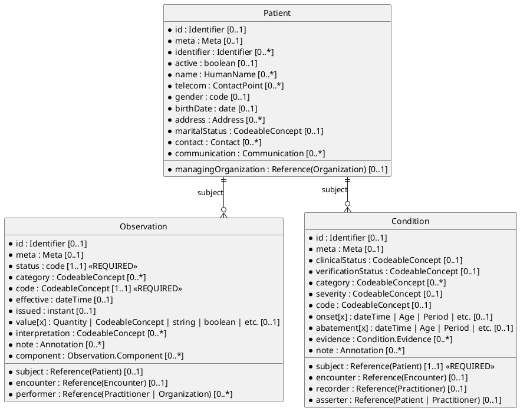

# FHIR Resource Cardinality

## What Is Cardinality?

Cardinality defines how many times an element can appear in a FHIR resource. It answers questions like:

- "Must a Patient have a name?" (**Yes, at least one**: `1..*`)
- "Can an Observation have multiple categories?" (**Yes**: `0..*`)
- "How many subjects can a Condition have?" (**Exactly one**: `1..1`)

Understanding cardinality helps you:

- **Build valid resources**: Know which fields are required
- **Parse resources safely**: Handle missing optional fields without crashing
- **Design UIs**: Make form fields required or optional appropriately
- **Debug validation errors**: Understand why a resource was rejected

Here is a diagram showing cardinality for three fundamental resources, `Patient`, `Observation`, and `Condition`:



## Cardinality Notation

FHIR uses the format `min..max`:

- **`0..1`**: Optional, at most one (e.g., `Patient.deceased[x]`)
- **`1..1`**: Required, exactly one (e.g., `Observation.status`)
- **`0..*`**: Optional, can be multiple (e.g., `Patient.name`)
- **`1..*`**: Required, at least one (e.g., `Patient.name` in US Core)
- **`2..*`**: At least two (rare, e.g., `Ratio.numerator` and `Ratio.denominator` together)

The `*` means "unbounded"—no upper limit.

## Core Resource Cardinality Rules

Let's examine cardinality for the six key resources we covered earlier.

---

### Patient Resource

```
Patient
├─ id: 0..1 (server-assigned)
├─ meta: 0..1
├─ identifier: 0..* ← Multiple business IDs allowed
├─ active: 0..1 ← Optional boolean
├─ name: 0..* ← Can have multiple names
│   ├─ use: 0..1
│   ├─ text: 0..1
│   ├─ family: 0..1 ← Optional! Some cultures don't use family names
│   └─ given: 0..* ← Can have multiple given names
├─ telecom: 0..* ← Multiple contact points
├─ gender: 0..1 ← Optional (administrative gender)
├─ birthDate: 0..1 ← Optional (but usually present)
├─ deceased[x]: 0..1 ← Boolean or dateTime
├─ address: 0..* ← Multiple addresses allowed
├─ maritalStatus: 0..1
├─ contact: 0..* ← Multiple emergency contacts
│   ├─ relationship: 0..* ← Person can have multiple roles
│   ├─ name: 0..1
│   └─ telecom: 0..*
├─ communication: 0..*
│   ├─ language: 1..1 ← If communication element exists, language is required
│   └─ preferred: 0..1
└─ managingOrganization: 0..1 ← Reference to Organization
```

**Key insights**:

- **No required fields** in base FHIR Patient! Even `name` is optional. Profiles (like US Core) add requirements.
- **Arrays are common**: `identifier`, `name`, `telecom`, `address` can all have multiple values.
- **Nested cardinality**: If `contact` exists, its child elements have their own cardinality rules.

**US Core Profile changes**:

- `identifier`: `1..*` (at least one ID required)
- `name`: `1..*` (at least one name required)
- `gender`: `1..1` (required)

**Example showing multiple values**:

```json
{
  "resourceType": "Patient",
  "identifier": [  // 0..*
    {"system": "http://hospital.org", "value": "MRN-123"},
    {"system": "http://hl7.org/fhir/sid/us-ssn", "value": "123-45-6789"}
  ],
  "name": [  // 0..*
    {"use": "official", "family": "Shaw", "given": ["Amy", "Victoria"]},
    {"use": "nickname", "given": ["Vicky"]}
  ],
  "gender": "female",  // 0..1
  "birthDate": "1987-02-20"  // 0..1
}
```

---

### Observation Resource

```
Observation
├─ id: 0..1
├─ status: 1..1 ← REQUIRED (registered | preliminary | final | amended | etc.)
├─ category: 0..* ← Classification (vital-signs, laboratory, etc.)
├─ code: 1..1 ← REQUIRED (what was observed, uses LOINC)
├─ subject: 0..1 ← Reference to Patient (required in most profiles)
├─ encounter: 0..1 ← Reference to Encounter
├─ effective[x]: 0..1 ← When observation was made
│   ├─ effectiveDateTime: 0..1 (most common)
│   ├─ effectivePeriod: 0..1
│   └─ effectiveInstant: 0..1
├─ issued: 0..1 ← When result became available
├─ performer: 0..* ← Who performed observation
├─ value[x]: 0..1 ← THE RESULT (can be absent if status=registered)
│   ├─ valueQuantity: 0..1 (most common for labs/vitals)
│   ├─ valueCodeableConcept: 0..1
│   ├─ valueString: 0..1
│   └─ ... (many other types)
├─ dataAbsentReason: 0..1 ← WHY value is missing (if applicable)
├─ interpretation: 0..* ← Normal, High, Low, etc.
├─ note: 0..* ← Comments
├─ bodySite: 0..1 ← Where on body
├─ method: 0..1 ← How measured
├─ specimen: 0..1 ← Reference to Specimen
├─ referenceRange: 0..*
│   ├─ low: 0..1 ← Quantity
│   ├─ high: 0..1 ← Quantity
│   ├─ type: 0..1
│   └─ text: 0..1
├─ hasMember: 0..* ← References to related observations
├─ derivedFrom: 0..* ← Source observations
└─ component: 0..* ← Sub-results (e.g., BP systolic & diastolic)
    ├─ code: 1..1 ← REQUIRED for each component
    ├─ value[x]: 0..1
    └─ dataAbsentReason: 0..1
```

**Key insights**:

- **`status` and `code` are required**: You must know WHAT was observed and its STATUS.
- **`value[x]` is optional**: Observations can exist without results (e.g., ordered but not yet performed).
- **`dataAbsentReason` explains missing values**: "Patient refused", "Equipment malfunction", etc.
- **Components each have their own cardinality**: If you include `component`, each must have a `code` (1..1).

**Example with components (blood pressure)**:

```json
{
  "resourceType": "Observation",
  "status": "final",  // 1..1 REQUIRED
  "code": {  // 1..1 REQUIRED
    "coding": [{
      "system": "http://loinc.org",
      "code": "85354-9",
      "display": "Blood pressure panel"
    }]
  },
  "subject": {"reference": "Patient/123"},  // 0..1
  "effectiveDateTime": "2024-11-01T10:30:00Z",  // 0..1
  "component": [  // 0..*
    {
      "code": {  // 1..1 REQUIRED within component
        "coding": [{"system": "http://loinc.org", "code": "8480-6"}]
      },
      "valueQuantity": {"value": 128, "unit": "mmHg"}  // 0..1
    },
    {
      "code": {  // 1..1 REQUIRED within component
        "coding": [{"system": "http://loinc.org", "code": "8462-4"}]
      },
      "valueQuantity": {"value": 82, "unit": "mmHg"}
    }
  ]
}
```

**Validation error example**:

```json
{
  "resourceType": "Observation",
  "code": {
    "coding": [{"system": "http://loinc.org", "code": "85354-9"}]
  },
  // MISSING status (1..1) - will fail validation!
  "component": [
    {
      // MISSING code (1..1 within component) - will fail!
      "valueQuantity": {"value": 128, "unit": "mmHg"}
    }
  ]
}
```

---

### Condition Resource

```
Condition
├─ id: 0..1
├─ clinicalStatus: 0..1 ← Active, inactive, resolved (required if verificationStatus != entered-in-error)
├─ verificationStatus: 0..1 ← Confirmed, provisional, refuted
├─ category: 0..* ← problem-list-item, encounter-diagnosis
├─ severity: 0..1 ← Mild, moderate, severe
├─ code: 0..1 ← WHAT condition (SNOMED, ICD-10) - required in most profiles
├─ bodySite: 0..* ← Where on body
├─ subject: 1..1 ← REQUIRED Reference to Patient
├─ encounter: 0..1 ← Context encounter
├─ onset[x]: 0..1 ← When it started
│   ├─ onsetDateTime: 0..1
│   ├─ onsetAge: 0..1
│   ├─ onsetPeriod: 0..1
│   └─ onsetString: 0..1
├─ abatement[x]: 0..1 ← When it ended
├─ recordedDate: 0..1 ← When recorded in system
├─ recorder: 0..1 ← Who recorded
├─ asserter: 0..1 ← Who asserted diagnosis
├─ stage: 0..*
│   ├─ summary: 0..1
│   └─ assessment: 0..*
├─ evidence: 0..*
│   ├─ code: 0..*
│   └─ detail: 0..* ← References to Observations
└─ note: 0..*
```

**Key insights**:

- **Only `subject` is required** in base spec (must have a patient).
- **`clinicalStatus` is conditionally required**: Not needed if `verificationStatus` is `entered-in-error`.
- **Profiles add requirements**: US Core requires `code`, `clinicalStatus`, and `verificationStatus`.

**Conditional requirement logic**:

```
IF verificationStatus != "entered-in-error" THEN clinicalStatus is REQUIRED
```

This prevents illogical combinations like "active entered-in-error condition."

**US Core Profile changes**:

- `clinicalStatus`: `1..1` (required)
- `verificationStatus`: `1..1` (required)
- `category`: `1..*` (at least one category)
- `code`: `1..1` (required)

---

### MedicationRequest Resource

```
MedicationRequest
├─ id: 0..1
├─ status: 1..1 ← REQUIRED (active, completed, stopped, etc.)
├─ intent: 1..1 ← REQUIRED (proposal, plan, order)
├─ category: 0..*
├─ priority: 0..1
├─ medication[x]: 1..1 ← REQUIRED (CodeableConcept or Reference to Medication)
├─ subject: 1..1 ← REQUIRED Reference to Patient
├─ encounter: 0..1
├─ supportingInformation: 0..*
├─ authoredOn: 0..1 ← When request was created
├─ requester: 0..1 ← Who requested
├─ performer: 0..1 ← Who should perform
├─ performerType: 0..1
├─ recorder: 0..1
├─ reasonCode: 0..* ← Why prescribed (codes)
├─ reasonReference: 0..* ← References to Conditions
├─ note: 0..*
├─ dosageInstruction: 0..*
│   ├─ sequence: 0..1
│   ├─ text: 0..1 ← Human-readable sig
│   ├─ timing: 0..1
│   │   └─ repeat: 0..1
│   │       ├─ frequency: 0..1
│   │       ├─ period: 0..1
│   │       └─ periodUnit: 0..1
│   ├─ route: 0..1
│   ├─ method: 0..1
│   └─ doseAndRate: 0..*
│       ├─ type: 0..1
│       ├─ doseQuantity: 0..1
│       └─ rateQuantity: 0..1
├─ dispenseRequest: 0..1
│   ├─ numberOfRepeatsAllowed: 0..1
│   ├─ quantity: 0..1
│   ├─ expectedSupplyDuration: 0..1
│   └─ validityPeriod: 0..1
└─ substitution: 0..1
    ├─ allowed[x]: 1..1 ← REQUIRED if substitution present
    └─ reason: 0..1
```

**Key insights**:

- **Four required fields**: `status`, `intent`, `medication[x]`, `subject`.
- **Nested conditional requirements**: If `substitution` exists, `allowed[x]` is required (1..1).
- **Complex dosing**: `dosageInstruction` is optional but has many nested optional fields.

**Minimal valid MedicationRequest**:

```json
{
  "resourceType": "MedicationRequest",
  "status": "active",  // 1..1
  "intent": "order",  // 1..1
  "medicationCodeableConcept": {  // 1..1
    "coding": [{
      "system": "http://www.nlm.nih.gov/research/umls/rxnorm",
      "code": "860975"
    }]
  },
  "subject": {"reference": "Patient/123"}  // 1..1
}
```

Everything else is optional!

---

### Encounter Resource

```
Encounter
├─ id: 0..1
├─ status: 1..1 ← REQUIRED (planned, arrived, in-progress, finished, etc.)
├─ class: 1..1 ← REQUIRED (AMB, EMER, IMP, etc.)
├─ type: 0..*
├─ serviceType: 0..1
├─ priority: 0..1
├─ subject: 0..1 ← Reference to Patient (required in profiles)
├─ participant: 0..*
│   ├─ type: 0..*
│   ├─ period: 0..1
│   └─ individual: 0..1 ← Reference to Practitioner
├─ period: 0..1 ← Start and end times
├─ length: 0..1 ← Duration
├─ reasonCode: 0..*
├─ reasonReference: 0..* ← References to Conditions
├─ diagnosis: 0..*
│   ├─ condition: 1..1 ← REQUIRED if diagnosis present
│   ├─ use: 0..1
│   └─ rank: 0..1
├─ account: 0..*
├─ hospitalization: 0..1
│   ├─ admitSource: 0..1
│   ├─ reAdmission: 0..1
│   ├─ dischargeDisposition: 0..1
│   └─ origin: 0..1
├─ location: 0..*
│   ├─ location: 1..1 ← REQUIRED if location present
│   ├─ status: 0..1
│   └─ period: 0..1
└─ serviceProvider: 0..1 ← Reference to Organization
```

**Key insights**:

- **`status` and `class` are required**: Minimum to create an encounter.
- **Nested arrays with conditionals**: `diagnosis` is optional, but if present, each must have a `condition` (1..1).
- **`subject` often required by profiles**: Base spec allows encounters without patients (e.g., group encounters).

---

### AllergyIntolerance Resource

```
AllergyIntolerance
├─ id: 0..1
├─ clinicalStatus: 0..1 ← Active, inactive, resolved
├─ verificationStatus: 0..1 ← Unconfirmed, confirmed, refuted
├─ type: 0..1 ← Allergy vs. intolerance
├─ category: 0..* ← Food, medication, environment, biologic
├─ criticality: 0..1 ← Low, high, unable-to-assess
├─ code: 0..1 ← What substance (required in profiles)
├─ patient: 1..1 ← REQUIRED Reference to Patient
├─ encounter: 0..1
├─ onset[x]: 0..1
├─ recordedDate: 0..1
├─ recorder: 0..1
├─ asserter: 0..1
├─ lastOccurrence: 0..1
├─ note: 0..*
└─ reaction: 0..*
    ├─ substance: 0..1
    ├─ manifestation: 1..* ← REQUIRED if reaction present (symptoms)
    ├─ description: 0..1
    ├─ onset: 0..1
    ├─ severity: 0..1
    ├─ exposureRoute: 0..1
    └─ note: 0..*
```

**Key insights**:

- **Only `patient` is required** in base spec.
- **Nested requirement**: If `reaction` exists, it must have at least one `manifestation` (1..*).
- **Profiles add requirements**: US Core requires `code` and `patient`.

---

## Common Cardinality Patterns

### Pattern 1: At Least One Required

**Notation**: `1..*`

**Example**: Patient names in US Core.

```
Patient.name: 1..*
```

**Validation**: Must have at least one name. Can have multiple.

**Valid**:

```json
{"name": [{"family": "Shaw"}]}
{"name": [{"family": "Shaw"}, {"use": "nickname", "given": ["Vicky"]}]}
```

**Invalid**:

```json
{"name": []}  // Empty array not allowed
// Missing name field entirely
```

---

### Pattern 2: Exactly One

**Notation**: `1..1`

**Example**: Observation status.
```
Observation.status: 1..1
```

**Validation**: Must be present, cannot be array.

**Valid**:

```json
{"status": "final"}
```

**Invalid**:

```json
{"status": ["final", "amended"]}  // Cannot be array
// Missing status entirely
```

---

### Pattern 3: Optional Single Value

**Notation**: `0..1`

**Example**: Patient birth date.

```
Patient.birthDate: 0..1
```

**Validation**: Can be absent or present once. Cannot be array.

**Valid**:

```json
{"birthDate": "1987-02-20"}
// Missing birthDate entirely is also valid
```

**Invalid**:
```json
{"birthDate": ["1987-02-20", "1988-01-01"]}  // Cannot be array
```

---

### Pattern 4: Optional Multiple Values

**Notation**: `0..*`

**Example**: Patient identifiers.

```
Patient.identifier: 0..*
```

**Validation**: Can be absent, or have one or more values.

**Valid**:

```json
// Missing entirely
{"identifier": []}  // Empty array (semantically useless but valid)
{"identifier": [{"system": "http://hospital.org", "value": "MRN-123"}]}
{"identifier": [{"system": "http://hospital.org", "value": "MRN-123"}, {"system": "http://hl7.org/fhir/sid/us-ssn", "value": "123-45-6789"}]}
```

---

### Pattern 5: Conditional Requirements

**Example**: Observation value vs. dataAbsentReason.

**Rule**: If `value[x]` is absent, `dataAbsentReason` SHOULD be present (to explain why).

**Invariant**: `value[x].exists() or dataAbsentReason.exists()`

**Valid**:

```json
{"status": "final", "code": {...}, "valueQuantity": {"value": 95}}
{"status": "final", "code": {...}, "dataAbsentReason": {"coding": [{"code": "patient-refused"}]}}
```

**Questionable** (valid but unhelpful):

```json
{"status": "final", "code": {...}}  // No value, no reason why
```

---

## Handling Cardinality in Code

### Parsing: Always Check for Existence

**Bad code** (assumes single name):

```javascript
const familyName = patient.name[0].family;  // Crashes if name is missing or empty
```

**Good code**:

```javascript
const familyName = patient.name?.[0]?.family || "Unknown";
```

**Better code** (handle multiple names):

```javascript
function getOfficialName(patient) {
  const officialName = patient.name?.find(n => n.use === "official");
  const anyName = patient.name?.[0];
  return (officialName || anyName)?.family || "Unknown";
}
```

---

### Building Resources: Respect Minimums

**Bad**:

```javascript
const obs = {
  resourceType: "Observation",
  code: {coding: [{system: "http://loinc.org", code: "2345-7"}]},
  // Missing status (1..1) - will fail validation!
  subject: {reference: "Patient/123"}
};
```

**Good**:

```javascript
const obs = {
  resourceType: "Observation",
  status: "final",  // Required 1..1
  code: {coding: [{system: "http://loinc.org", code: "2345-7"}]},  // Required 1..1
  subject: {reference: "Patient/123"}  // Optional in base, but good practice
};
```

---

### Validation Libraries

Use FHIR validators to catch cardinality errors:

**JavaScript** (using HAPI FHIR Validator):

```javascript
import { Validator } from 'fhir-validator';

const validator = new Validator();
const result = validator.validate(myResource, 'Patient');

if (!result.valid) {
  console.error(result.messages);
  // Example: "Patient.name: minimum cardinality is 1, but found 0"
}
```

---

## Profile-Specific Cardinality

Base FHIR is intentionally loose (many fields are `0..1` or `0..*`). **Profiles** tighten these rules for specific use cases.

### Example: US Core Patient Profile

**Base FHIR**:

```
Patient.identifier: 0..*
Patient.name: 0..*
Patient.gender: 0..1
```

**US Core Profile**:

```
Patient.identifier: 1..* (MustSupport)
Patient.name: 1..* (MustSupport)
Patient.gender: 1..1 (MustSupport)
```

**Impact**: A Patient resource valid in base FHIR might fail US Core validation if missing a name or identifier.

### Checking Profile Conformance

Resources declare conformance via `meta.profile`:

```json
{
  "resourceType": "Patient",
  "meta": {
    "profile": ["http://hl7.org/fhir/us/core/StructureDefinition/us-core-patient"]
  },
  "identifier": [{"system": "http://hospital.org", "value": "MRN-123"}],
  "name": [{"family": "Shaw", "given": ["Amy"]}],
  "gender": "female"
}
```

Validators check against the declared profile's cardinality rules.

---

## Cardinality Visualization: Key Relationships

For a comprehensive diagram showing cardinality across 20+ resources, see:  
→ [Comprehensive FHIR Resource Relationships](../eh-dd-03-fhir-resource-relationships/deepdive-fhir-resource-relationships-comprehensive.md)

That diagram includes cardinality annotations like:

- `Patient → managingOrganization [0..1]`
- `Encounter → participant [0..*]`
- `MedicationRequest → subject [1..1]`

---

## Next Steps

We explored data types and cardinality, and now let's see a complete, real-world resource example that puts everything together.