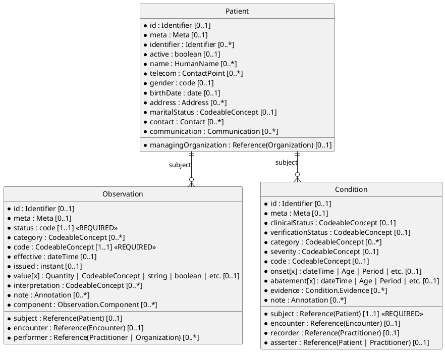

# FHIR Resource Cardinality

## Resource Element Cardinality (diagram)

> See also [Comprehensive FHIR Resource Relationships](../eh-dd-03-fhir-resource-relationships/deepdive-fhir-resource-relationships-comprehensive.md) for a focused cardinality diagram that covers some 20+ resources across domains.

### Version1 (mermaid graph TD)

```mermaid
graph TD
    Patient[Patient Resource]
    
    Patient --> id[id 0..1]
    Patient --> meta[meta 0..1]
    Patient --> identifier[identifier 0..*]
    Patient --> active[active 0..1]
    Patient --> name[name 0..*]
    Patient --> telecom[telecom 0..*]
    Patient --> gender[gender 0..1]
    Patient --> birthDate[birthDate 0..1]
    Patient --> address[address 0..*]
    Patient --> maritalStatus[maritalStatus 0..1]
    Patient --> contact[contact 0..*]
    Patient --> communication[communication 0..*]
    Patient --> managingOrg[managingOrganization 0..1]
    
    Observation[Observation Resource]
    
    Observation --> Oid[id 0..1]
    Observation --> Ometa[meta 0..1]
    Observation --> Ostatus[status 1..1 REQUIRED]
    Observation --> Ocategory[category 0..*]
    Observation --> Ocode[code 1..1 REQUIRED]
    Observation --> Osubject[subject 0..1]
    Observation --> Oencounter[encounter 0..1]
    Observation --> Oeffective[effective 0..1]
    Observation --> Oissued[issued 0..1]
    Observation --> Operformer[performer 0..*]
    Observation --> Ovalue[value 0..1]
    Observation --> Ointerpretation[interpretation 0..*]
    Observation --> Onote[note 0..*]
    Observation --> Ocomponent[component 0..*]
    
    Condition[Condition Resource]
    
    Condition --> Cid[id 0..1]
    Condition --> Cmeta[meta 0..1]
    Condition --> CclinicalStatus[clinicalStatus 0..1]
    Condition --> CverificationStatus[verificationStatus 0..1]
    Condition --> Ccategory[category 0..*]
    Condition --> Cseverity[severity 0..1]
    Condition --> Ccode[code 0..1]
    Condition --> Csubject[subject 1..1 REQUIRED]
    Condition --> Cencounter[encounter 0..1]
    Condition --> Conset[onset 0..1]
    Condition --> Cabatement[abatement 0..1]
    Condition --> Crecorder[recorder 0..1]
    Condition --> Casserter[asserter 0..1]
    Condition --> Cevidence[evidence 0..*]
    Condition --> Cnote[note 0..*]
```

### Version2 (puml ERD)

