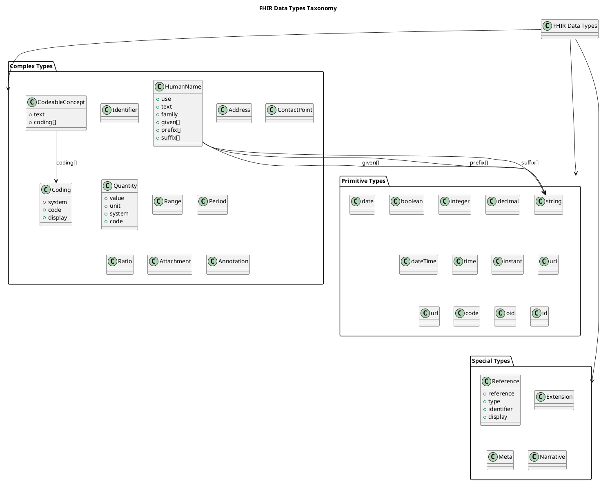

# FHIR Data Types

**FHIR Data Types Hierarchy**

```puml
@startuml FHIR_Data_Types
title FHIR Data Types Taxonomy

' Root container
class "FHIR Data Types" as DataType {
}

' Primitive Types
package "Primitive Types" {
  class boolean
  class integer
  class string
  class decimal
  class date
  class dateTime
  class time
  class instant
  class uri
  class url
  class code
  class oid
  class id
}

DataType --> "Primitive Types"

' Complex Types
package "Complex Types" {
  class Identifier
  class HumanName {
    +use
    +text
    +family
    +given[]
    +prefix[]
    +suffix[]
  }
  class Address
  class ContactPoint
  class CodeableConcept {
    +text
    +coding[]
  }
  class Coding {
    +system
    +code
    +display
  }
  class Quantity {
    +value
    +unit
    +system
    +code
  }
  class Range
  class Period
  class Ratio
  class Attachment
  class Annotation
}

DataType --> "Complex Types"

' Special Types
package "Special Types" {
  class Reference {
    +reference
    +type
    +identifier
    +display
  }
  class Extension
  class Meta
  class Narrative
}

DataType --> "Special Types"

' Internal links for nested structures
CodeableConcept --> Coding : coding[]
HumanName --> string : given[]
HumanName --> string : prefix[]
HumanName --> string : suffix[]

@enduml
```