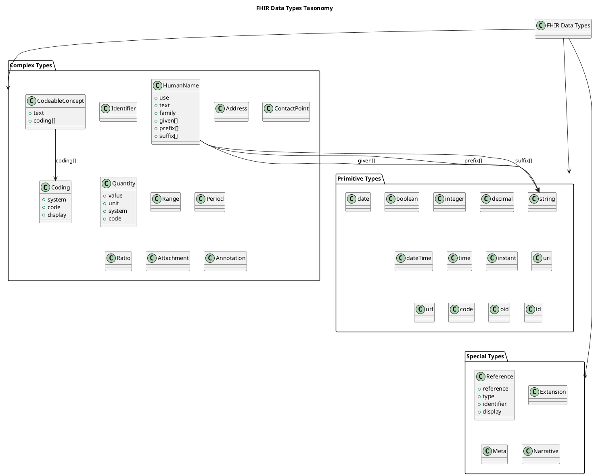

# FHIR Data Types

## Why Data Types Matter

When you're building a SMART app, you'll constantly encounter FHIR's data types. Unlike arbitrary JSON where a "name" could be a string, an object, or an array depending on the developer's mood, FHIR enforces strict typing. This consistency is what makes interoperability possible—when you read `Patient.name`, you always know it's a `HumanName` array, not a random string.

Understanding data types helps you:

- **Parse responses correctly**: Know what fields to expect
- **Construct valid requests**: Build resources that pass validation
- **Handle edge cases**: Deal with missing data, multiple values, extensions
- **Leverage tooling**: Use FHIR libraries that handle type conversions automatically

## The Data Type Hierarchy

FHIR organizes data types into categories:

### Primitive Types

Simple atomic values like strings, numbers, booleans. These map directly to JSON primitives but with FHIR-specific validation rules.

### Complex Types (General Use)

Reusable structures that appear across many resources (e.g., `HumanName`, `Address`, `Identifier`).

### Complex Types (Metadata)

Types that describe resources themselves rather than clinical data (e.g., `Meta`, `Narrative`).

### Special Types

Unique constructs like `Reference` (links between resources) and `Extension` (custom data elements).

Let's dive into the most important ones you'll use daily.

---

## Primitive Types: The Building Blocks

### string

**What it is**: Plain text of any length.

**Validation**: Must be valid Unicode. No length limit in spec, but servers may impose practical limits (e.g., 1MB).

**Examples**:

```json
{
  "resourceType": "Patient",
  "name": [{
    "text": "Amy V. Shaw"  // string
  }]
}
```

**Common uses**: Names, addresses, free-text notes, narrative content.

!!! note "Important"
    Empty strings (`""`) are valid but semantically meaningless—prefer omitting the field entirely.
    
---

### boolean

**What it is**: True or false.

**Validation**: Must be lowercase JSON boolean (`true` or `false`, not `"true"` string).

**Examples**:

```json
{
  "resourceType": "Patient",
  "active": true,  // boolean
  "deceasedBoolean": false
}
```

**Common uses**: Active flags, deceased status, yes/no clinical observations.

!!! note "Important"
    `null` or missing is NOT the same as `false`. Missing means "unknown."
    
---

### integer

**What it is**: Signed 32-bit integer.

**Validation**: Range -2,147,483,648 to 2,147,483,647. No decimals allowed.

**Examples**:

```json
{
  "resourceType": "MedicationRequest",
  "dispenseRequest": {
    "numberOfRepeatsAllowed": 5  // integer
  }
}
```

**Common uses**: Counts (refills, repeats), sequence numbers, ages in years.

!!! note "Important"
    Don't use for measurements—use `decimal` or `Quantity` instead.
    
---

### decimal

**What it is**: Arbitrary precision decimal number.

**Validation**: No exponent notation. Can have up to 18 significant digits.

**Examples**:
```json
{
  "resourceType": "Observation",
  "valueQuantity": {
    "value": 98.6  // decimal
  }
}
```

**Common uses**: Lab values, vital signs, dosage amounts.

!!! note "Important"
    Never use for currency (use `Money` type). Avoid for ratios (use `Ratio` type).
    
---

### dateTime

**What it is**: Date and time with optional timezone.

**Validation**: Follows ISO 8601 format. Precision can vary:
- `2024`: Year only
- `2024-11`: Year and month
- `2024-11-01`: Date
- `2024-11-01T10:30:00Z`: Date, time, UTC
- `2024-11-01T10:30:00-05:00`: Date, time, timezone offset

**Examples**:

```json
{
  "resourceType": "Observation",
  "effectiveDateTime": "2024-11-01T10:30:00-05:00",  // dateTime
  "issued": "2024-11-01T14:15:00Z"
}
```

**Common uses**: When things happened (observations, procedures, encounters).

**Critical gotcha**: Always store with timezone when available. `2024-11-01T10:00:00` without a timezone is ambiguous—was that EST or PST? For historical data where timezone is unknown, document this in a note.

---

### date

**What it is**: Calendar date without time.

**Validation**: `YYYY`, `YYYY-MM`, or `YYYY-MM-DD`.

**Examples**:

```json
{
  "resourceType": "Patient",
  "birthDate": "1987-02-20"  // date
}
```

**Common uses**: Birth dates, diagnosis onset dates, death dates.

!!! note "Important"
    No partial dates like "February 1987" in the value itself—use `YYYY-MM` format and document precision loss.
    
---

### time

**What it is**: Time of day without date.

**Validation**: `HH:MM:SS` (24-hour format). Fractional seconds allowed.

**Examples**:

```json
{
  "resourceType": "MedicationRequest",
  "dosageInstruction": [{
    "timing": {
      "repeat": {
        "timeOfDay": ["08:00:00", "20:00:00"]  // time array
      }
    }
  }]
}
```

**Common uses**: Medication schedules ("take at 8am and 8pm"), appointment times.

!!! note "Important"
    No timezone—assumes local time in context.
    
---

### uri and url

**What they are**: 

- `uri`: Uniform Resource Identifier (can be URL or URN)
- `url`: Must be a resolvable URL

**Validation**: Must follow RFC 3986.

**Examples**:

```json
{
  "resourceType": "Observation",
  "code": {
    "coding": [{
      "system": "http://loinc.org",  // uri
      "code": "8480-6"
    }]
  },
  "meta": {
    "profile": [
      "http://hl7.org/fhir/us/core/StructureDefinition/us-core-observation-lab"  // url (canonical)
    ]
  }
}
```

**Common uses**: Code system identifiers, profile URLs, extension definitions.

!!! note "Important"
    URLs don't need to be "live" HTTP endpoints—they're identifiers, not links. `http://loinc.org` identifies LOINC codes; it's not a page you visit.
    
---

### code

**What it is**: String from a fixed set of values.

**Validation**: Must match regex `[^\s]+(\s[^\s]+)*` (no leading/trailing whitespace, single spaces between words). Case-sensitive.

**Examples**:

```json
{
  "resourceType": "Observation",
  "status": "final"  // code (from fixed valueset)
}
```

**Common uses**: Status fields (`active`, `completed`, `cancelled`), enumerated values.

!!! note "Important"
    `code` is for FHIR-defined codes. For terminology codes (LOINC, SNOMED), use `CodeableConcept`.
    
---

### id

**What it is**: Logical identifier for a resource on a server.

**Validation**: 1-64 characters, regex `[A-Za-z0-9\-\.]{1,64}`. Case-sensitive.

**Examples**:

```json
{
  "resourceType": "Patient",
  "id": "smart-1288992"  // id
}
```

**Common uses**: Resource IDs in URLs (`/Patient/smart-1288992`).

!!! note "Important"
    `id` is server-assigned. Don't confuse with `identifier` (business identifiers like MRN).
    
---

## Complex Types: The Workhorses

### HumanName

**What it is**: Structured representation of a person's name.

**Structure**:
```json
{
  "use": "official",  // official | usual | temp | nickname | anonymous | old | maiden
  "text": "Amy Victoria Shaw",  // Full name as it should be displayed
  "family": "Shaw",  // Surname/last name
  "given": ["Amy", "Victoria"],  // Given names (array)
  "prefix": ["Dr."],  // Titles (Dr., Mr., Mrs.)
  "suffix": ["Jr.", "MD"],  // Suffixes
  "period": {  // When this name was/is valid
    "start": "1987-02-20",
    "end": "2010-06-15"  // e.g., maiden name end date
  }
}
```

**Real-world example**:
```json
{
  "resourceType": "Patient",
  "name": [
    {
      "use": "official",
      "family": "Shaw",
      "given": ["Amy", "Victoria"]
    },
    {
      "use": "nickname",
      "given": ["Vicky"]
    },
    {
      "use": "maiden",
      "family": "Johnson",
      "period": {
        "end": "2010-06-15"
      }
    }
  ]
}
```

**Why it's an array**: People have multiple names (legal, preferred, previous).

**Display logic**: 
1. First, try to find a name with `use: "usual"`
2. If none, use `use: "official"`
3. If multiple, take the first without an `end` date
4. Always display `text` if present (it's pre-formatted)

!!! note "Important"
    Don't concatenate `given[0] + " " + family` for display—use `text` field, or build full name respecting cultural conventions (some cultures put family name first).
    
---

### Address
**What it is**: Physical or postal address.

**Structure**:
```json
{
  "use": "home",  // home | work | temp | old | billing
  "type": "physical",  // postal | physical | both
  "text": "123 Main St, Apt 4B, Boston, MA 02101",  // Full address string
  "line": ["123 Main St", "Apt 4B"],  // Street address (array)
  "city": "Boston",
  "district": "Suffolk County",  // County/region
  "state": "MA",
  "postalCode": "02101",
  "country": "US",
  "period": {
    "start": "2019-03-01"
  }
}
```

**Why it's an array**: People have home, work, billing, previous addresses.

**Geocoding**: FHIR doesn't include lat/lon—use an extension or separate geolocation service.

!!! note "Important"
    `line` is an array because some addresses have multiple lines (street + apartment + building). Don't assume `line[0]` is the full address.
    
---

### ContactPoint

**What it is**: Phone, email, fax, pager, etc.

**Structure**:
```json
{
  "system": "phone",  // phone | fax | email | pager | url | sms | other
  "value": "555-555-5555",
  "use": "home",  // home | work | temp | old | mobile
  "rank": 1,  // Preference order (1 = highest)
  "period": {
    "start": "2019-03-01"
  }
}
```

**Real-world example**:
```json
{
  "resourceType": "Patient",
  "telecom": [
    {
      "system": "phone",
      "value": "555-555-5555",
      "use": "home",
      "rank": 1
    },
    {
      "system": "phone",
      "value": "555-555-6666",
      "use": "mobile",
      "rank": 2
    },
    {
      "system": "email",
      "value": "amy.shaw@example.com",
      "use": "home"
    }
  ]
}
```

**Use `rank` for**: Determining primary contact method (lowest number = highest priority).

!!! note "Important"
    `value` is not validated—"555-5555" and "+1 (555) 555-5555" are both valid. Normalize before comparing.
    
---

### Identifier

**What it is**: Business identifier like MRN, SSN, driver's license number.

**Structure**:
```json
{
  "use": "official",  // usual | official | temp | secondary | old
  "type": {
    "coding": [{
      "system": "http://terminology.hl7.org/CodeSystem/v2-0203",
      "code": "MR",
      "display": "Medical Record Number"
    }]
  },
  "system": "http://hospital.example.org",  // Namespace URI
  "value": "MRN-123456",  // Actual identifier
  "period": {
    "start": "2019-03-01"
  },
  "assigner": {
    "display": "Example Hospital"
  }
}
```

**Key concept**: The `system` + `value` pair is globally unique. Two patients at different hospitals can both have MRN "123456", but their `system` URIs differ.

**Real-world example** (patient with MRN and SSN):

```json
{
  "resourceType": "Patient",
  "identifier": [
    {
      "use": "official",
      "type": {
        "coding": [{
          "system": "http://terminology.hl7.org/CodeSystem/v2-0203",
          "code": "MR"
        }]
      },
      "system": "http://hospital.example.org",
      "value": "MRN-123456"
    },
    {
      "use": "official",
      "type": {
        "coding": [{
          "system": "http://terminology.hl7.org/CodeSystem/v2-0203",
          "code": "SS"
        }]
      },
      "system": "http://hl7.org/fhir/sid/us-ssn",
      "value": "123-45-6789"
    }
  ]
}
```

**Searching by identifier**: Use `[resourceType]?identifier=[system]|[value]`

```http
GET /Patient?identifier=http://hospital.example.org|MRN-123456
```

!!! note "Important"
    Don't assume `identifier[0]` is the "primary" one—check `use: "official"` or `type.code: "MR"`.
    
---

### CodeableConcept

**What it is**: A value from a terminology system (LOINC, SNOMED, ICD-10) with optional text.

**Structure**:

```json
{
  "coding": [
    {
      "system": "http://snomed.info/sct",
      "code": "44054006",
      "display": "Type 2 diabetes mellitus"
    },
    {
      "system": "http://hl7.org/fhir/sid/icd-10-cm",
      "code": "E11.9",
      "display": "Type 2 diabetes mellitus without complications"
    }
  ],
  "text": "Type 2 Diabetes"  // Human-readable fallback
}
```

**Why `coding` is an array**: Resources can include multiple codes for the same concept (SNOMED + ICD-10, or pre-coordinated + post-coordinated codes).

**Display logic**:

1. Show `text` if present (most readable)
2. Else, show `coding[0].display`
3. If no display, show `coding[0].code` (less readable but better than nothing)

**Matching codes**: Check all `coding` entries, not just the first:

```javascript
function hasCode(codeableConcept, system, code) {
  return codeableConcept.coding?.some(c => 
    c.system === system && c.code === code
  );
}

// Usage
if (hasCode(condition.code, 'http://snomed.info/sct', '44054006')) {
  // This is diabetes
}
```

!!! note "Important"
    `text` can differ from `display`—prefer `text` for UI, use `coding` for logic.
    
---

### Quantity

**What it is**: A measured amount with unit.

**Structure**:

```json
{
  "value": 98.6,  // decimal
  "comparator": "<",  // < | <= | >= | > (optional)
  "unit": "°F",  // Human-readable unit
  "system": "http://unitsofmeasure.org",  // UCUM
  "code": "[degF]"  // UCUM code
}
```

**Real-world example** (blood pressure component):

```json
{
  "resourceType": "Observation",
  "component": [
    {
      "code": {
        "coding": [{
          "system": "http://loinc.org",
          "code": "8480-6"
        }]
      },
      "valueQuantity": {
        "value": 128,
        "unit": "mmHg",
        "system": "http://unitsofmeasure.org",
        "code": "mm[Hg]"
      }
    }
  ]
}
```

**Units system**: Almost always use UCUM (Unified Code for Units of Measure). Common codes:

- `kg`: kilograms
- `[lb_av]`: pounds
- `cm`: centimeters
- `[in_i]`: inches
- `Cel`: Celsius
- `[degF]`: Fahrenheit
- `mm[Hg]`: millimeters of mercury

**Comparators**: Used when exact value unknown:

- `<`: Less than (e.g., "Glucose <50 mg/dL")
- `>=`: At least (e.g., "Viral load ≥1,000,000 copies/mL")

!!! note "Important"
    Don't compare `value` fields without checking units. 98.6°F ≠ 98.6°C. Use a unit conversion library.
    
---

### Reference

**What it is**: Link from one resource to another.

**Structure**:

```json
{
  "reference": "Patient/smart-1288992",  // Relative or absolute URL
  "type": "Patient",  // Resource type (optional but helpful)
  "identifier": {  // Alternative to reference (logical identifier)
    "system": "http://hospital.example.org",
    "value": "MRN-123456"
  },
  "display": "Amy V. Shaw"  // Human-readable description
}
```

**Three ways to reference**:

**1. Relative reference** (same server):

```json
{"reference": "Patient/smart-1288992"}
```

**2. Absolute URL** (different server):

```json
{"reference": "https://other-server.org/fhir/Patient/xyz"}
```

**3. Logical identifier** (when you don't know the server ID):

```json
{
  "identifier": {
    "system": "http://hospital.example.org",
    "value": "MRN-123456"
  }
}
```

**Resolving references**: To fetch the referenced resource:

```http
GET /Patient/smart-1288992
```

Or if using absolute URL:

```http
GET https://other-server.org/fhir/Patient/xyz
```

**Contained resources**: Alternatively, embed the resource inline:

```json
{
  "resourceType": "Observation",
  "contained": [
    {
      "resourceType": "Patient",
      "id": "patient-inline",
      "name": [{"text": "Amy Shaw"}]
    }
  ],
  "subject": {
    "reference": "#patient-inline"
  }
}
```

**When to use contained**: Only when the referenced resource has no independent existence (e.g., a temporary patient record for lab results not yet matched to real patient).

!!! note "Important"
    Always check if reference is populated before dereferencing. Null references are valid (e.g., "observation performer unknown").
    
---

### Period

**What it is**: Time interval with start and end.

**Structure**:

```json
{
  "start": "2024-11-01T10:00:00-05:00",  // dateTime
  "end": "2024-11-01T11:15:00-05:00"     // dateTime
}
```

**Usage**:

- Encounter duration
- Name validity period
- Medication course dates
- Employment period for PractitionerRole

**Rules**:

- `start` without `end`: Ongoing (e.g., current job)
- `end` without `start`: "Until this date" (rare)
- If both present, `start` ≤ `end`

!!! note "Important"
    An encounter with only `start` might still be ongoing—check `status: "in-progress"`.
    
---

### Range

**What it is**: Min-max values.

**Structure**:

```json
{
  "low": {
    "value": 60,
    "unit": "mmHg",
    "system": "http://unitsofmeasure.org",
    "code": "mm[Hg]"
  },
  "high": {
    "value": 100,
    "unit": "mmHg",
    "system": "http://unitsofmeasure.org",
    "code": "mm[Hg]"
  }
}
```

**Usage**:

- Reference ranges for lab results
- Dose ranges ("5-10mg")
- Age ranges in population criteria

!!! note "Important"
    `low` and `high` are both optional—a Range with only `low` means "at least X", only `high` means "at most X".
    
---

### Ratio

**What it is**: Relationship between two quantities.

**Structure**:

```json
{
  "numerator": {
    "value": 1,
    "unit": "mg"
  },
  "denominator": {
    "value": 1,
    "unit": "mL"
  }
}
```

**Usage**:

- Medication concentrations (1mg/mL)
- Dosing by weight (5mg/kg)
- Test results (INR ratio)

!!! note "Important"
    Don't divide `numerator.value / denominator.value` without considering units.
    
---

## Polymorphic Types: The [x] Suffix

Many FHIR elements use the `[x]` suffix to indicate the field can be one of several types. Examples:

### value[x] in Observation

Can be:

- `valueQuantity`: Numeric measurement
- `valueCodeableConcept`: Coded result
- `valueString`: Free text
- `valueBoolean`: Yes/no
- `valueInteger`, `valueRange`, `valueRatio`, etc.

**In JSON**, the `[x]` is replaced with the actual type:

```json
{
  "resourceType": "Observation",
  "valueQuantity": {"value": 98.6, "unit": "°F"}
}
```

NOT:

```json
{
  "value": {"value": 98.6, "unit": "°F"}  // WRONG!
}
```

### onset[x] in Condition

Can be:

- `onsetDateTime`: Specific date
- `onsetAge`: Age when started
- `onsetPeriod`: Date range
- `onsetRange`: Age range
- `onsetString`: Narrative (e.g., "childhood")

**Parsing logic**:

```javascript
function getOnset(condition) {
  if (condition.onsetDateTime) return condition.onsetDateTime;
  if (condition.onsetAge) return `Age ${condition.onsetAge.value} ${condition.onsetAge.unit}`;
  if (condition.onsetPeriod) return condition.onsetPeriod.start;
  if (condition.onsetString) return condition.onsetString;
  return "Unknown";
}
```

---

## Extension: Adding Custom Data

**What it is**: Way to add elements not in base FHIR.

**Structure**:

```json
{
  "extension": [
    {
      "url": "http://hl7.org/fhir/us/core/StructureDefinition/us-core-race",
      "extension": [
        {
          "url": "ombCategory",
          "valueCoding": {
            "system": "urn:oid:2.16.840.1.113883.6.238",
            "code": "2106-3",
            "display": "White"
          }
        },
        {
          "url": "text",
          "valueString": "White"
        }
      ]
    }
  ]
}
```

**When to use**: Only for data not supported in base spec (e.g., US Core race/ethnicity, custom quality measures).

**Finding extensions**: Look in StructureDefinitions or profile documentation.

!!! note "Important"
    Extensions are optional—always check if present before accessing. Don't assume all servers support the same extensions.
    
---

## Putting It Together: Reading a Complete Resource

Let's dissect a real Observation to see how these types combine:

```json
{
  "resourceType": "Observation",
  "id": "glucose-20241101",
  "meta": {
    "versionId": "1",
    "lastUpdated": "2024-11-01T14:30:00Z",
    "profile": ["http://hl7.org/fhir/us/core/StructureDefinition/us-core-observation-lab"]
  },
  "status": "final",  // code
  "category": [{  // Array of CodeableConcept
    "coding": [{
      "system": "http://terminology.hl7.org/CodeSystem/observation-category",  // uri
      "code": "laboratory",  // code
      "display": "Laboratory"  // string
    }]
  }],
  "code": {  // CodeableConcept
    "coding": [{
      "system": "http://loinc.org",
      "code": "2345-7",
      "display": "Glucose [Mass/volume] in Serum or Plasma"
    }],
    "text": "Glucose"
  },
  "subject": {  // Reference
    "reference": "Patient/smart-1288992",
    "display": "Amy V. Shaw"
  },
  "effectiveDateTime": "2024-11-01T08:00:00-05:00",  // dateTime
  "issued": "2024-11-01T14:15:00Z",
  "performer": [{  // Array of Reference
    "reference": "Practitioner/smart-pract-lab-tech",
    "display": "Lab Technician"
  }],
  "valueQuantity": {  // Quantity
    "value": 95,  // decimal
    "unit": "mg/dL",  // string
    "system": "http://unitsofmeasure.org",  // uri
    "code": "mg/dL"  // code
  },
  "referenceRange": [{
    "low": {  // Quantity
      "value": 70,
      "unit": "mg/dL"
    },
    "high": {
      "value": 100,
      "unit": "mg/dL"
    },
    "text": "Normal fasting glucose"  // string
  }],
  "interpretation": [{  // Array of CodeableConcept
    "coding": [{
      "system": "http://terminology.hl7.org/CodeSystem/v3-ObservationInterpretation",
      "code": "N",
      "display": "Normal"
    }]
  }]
}
```

**Types used**:

- **Primitives**: `code`, `string`, `decimal`, `dateTime`, `uri`, `id`
- **Complex**: `CodeableConcept`, `Reference`, `Quantity`, `Meta`
- **Arrays**: `category`, `performer`, `interpretation`, `referenceRange`

---

## FHIR Data Types Hierarchy (Diagram)

Here is a diagram showing the hierarchy of FHIR data types, use it as a reference.



## Next Steps

Having hopefully covered how FHIR structures data, let's explore the standardized terminology systems that give this data meaning.

