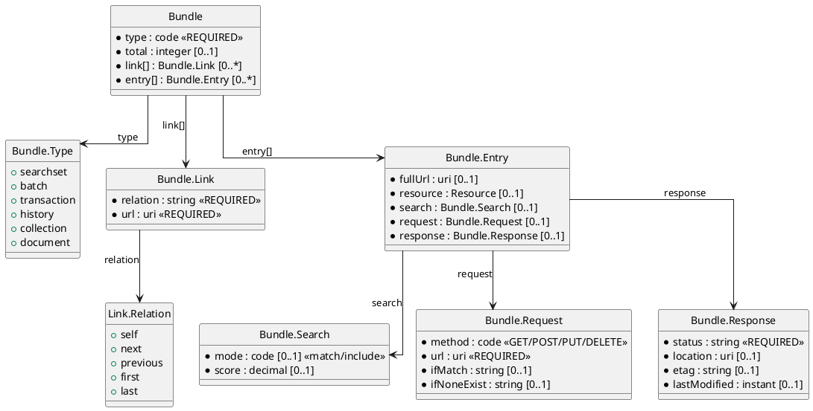

```mermaid
graph TD
    Bundle[Bundle Resource]
  
    Bundle --> Type[type]
    Bundle --> Total[total]
    Bundle --> Link[link array]
    Bundle --> Entry[entry array]
  
    Type --> TypeSearch[searchset]
    Type --> TypeBatch[batch]
    Type --> TypeTransaction[transaction]
    Type --> TypeHistory[history]
    Type --> TypeCollection[collection]
    Type --> TypeDocument[document]
  
    Link --> LinkSelf[self]
    Link --> LinkNext[next]
    Link --> LinkPrev[previous]
    Link --> LinkFirst[first]
    Link --> LinkLast[last]
  
    Entry --> FullUrl[fullUrl]
    Entry --> Resource[resource]
    Entry --> Search[search]
    Entry --> Request[request]
    Entry --> Response[response]
  
    Search --> SearchMode[mode: match/include]
    Search --> SearchScore[score]
  
    Request --> ReqMethod[method: GET/POST/PUT/DELETE]
    Request --> ReqUrl[url]
    Request --> ReqIfMatch[ifMatch]
    Request --> ReqIfNoneExist[ifNoneExist]
  
    Response --> RespStatus[status]
    Response --> RespLocation[location]
    Response --> RespEtag[etag]
    Response --> RespLastMod[lastModified]
```

# FHIR Resource Bundles

## What Are Bundles?

A Bundle is FHIR's container for grouping multiple resources together. Think of it as an envelope that holds related resources and metadata about how they should be processed. Bundles solve several critical problems:

- **Search results**: Return multiple matching resources in one HTTP response
- **Batch operations**: Submit multiple create/update/delete requests atomically
- **Documents**: Package a complete clinical document with all referenced resources
- **Messages**: Send event notifications with relevant context
- **Data export**: Transfer large datasets efficiently

Without bundles, apps would need hundreds of individual HTTP requests to fetch a patient's complete record. Bundles reduce network round-trips and enable atomic transactions.

## Bundle Types and Structures Matrix (Diagram)

The following is a diagram of bundle types and structures for visual reference.

> diagram version1 (TBD::archive)



> diagram version2 (TBD::placement)



Let's explore: 

- When to use each bundle type
- How to construct entries
- What the server does with each type
- Real-world use cases

---

## Bundle Types: The Five Patterns

FHIR defines five bundle types, each optimized for different use cases:

### 1. searchset - Search Results

**When used**: Server response to search queries

**Characteristics**:

- Contains resources matching search criteria
- Includes pagination links (next, previous, last)
- Each entry has a search score and mode
- Total count indicates full result set size

**Example**: Search for a patient's lab observations

**Request**:

```http
GET /Observation?patient=smart-1288992&category=laboratory&_count=10
```

**Response**:

```json
{
  "resourceType": "Bundle",
  "type": "searchset",
  "total": 47,
  "link": [
    {
      "relation": "self",
      "url": "https://fhir.example.org/Observation?patient=smart-1288992&category=laboratory&_count=10"
    },
    {
      "relation": "next",
      "url": "https://fhir.example.org/Observation?patient=smart-1288992&category=laboratory&_count=10&_offset=10"
    }
  ],
  "entry": [
    {
      "fullUrl": "https://fhir.example.org/Observation/glucose-20241101",
      "resource": {
        "resourceType": "Observation",
        "id": "glucose-20241101",
        "status": "final",
        "code": {
          "coding": [{
            "system": "http://loinc.org",
            "code": "2345-7",
            "display": "Glucose"
          }]
        },
        "subject": {"reference": "Patient/smart-1288992"},
        "valueQuantity": {"value": 95, "unit": "mg/dL"}
      },
      "search": {
        "mode": "match",
        "score": 1.0
      }
    },
    {
      "fullUrl": "https://fhir.example.org/Observation/hba1c-20241101",
      "resource": {
        "resourceType": "Observation",
        "id": "hba1c-20241101",
        "status": "final",
        "code": {
          "coding": [{
            "system": "http://loinc.org",
            "code": "4548-4",
            "display": "Hemoglobin A1c"
          }]
        },
        "subject": {"reference": "Patient/smart-1288992"},
        "valueQuantity": {"value": 7.2, "unit": "%"}
      },
      "search": {
        "mode": "match",
        "score": 1.0
      }
    }
    // ... 8 more entries
  ]
}
```

**Key elements**:

- **`total`**: 47 total results exist (showing first 10)
- **`link[relation="next"]`**: URL to fetch next page
- **`entry[].search.mode`**: "match" (directly matched query) vs. "include" (referenced resource via `_include`)
- **`entry[].search.score`**: Relevance score (1.0 = exact match)

**Pagination handling**:

```javascript
async function fetchAllResults(initialUrl) {
  let results = [];
  let url = initialUrl;
  
  while (url) {
    const bundle = await fetch(url);
    results.push(...bundle.entry.map(e => e.resource));
    
    const nextLink = bundle.link?.find(l => l.relation === "next");
    url = nextLink?.url;
  }
  
  return results;
}

// Usage
const allLabs = await fetchAllResults(
  "/Observation?patient=smart-1288992&category=laboratory&_count=10"
);
console.log(`Fetched ${allLabs.length} lab results`);
```

---

### 2. transaction - Atomic Operations

**When used**: Client wants multiple operations to succeed or fail together

**Characteristics**:

- All-or-nothing semantics (database transaction)
- Server validates all entries before processing any
- If one entry fails, entire transaction rolls back
- Supports create, update, delete operations
- Enables conditional operations (e.g., "create if not exists")

**Example**: Create a patient and initial observation together

**Request**:

```http
POST /
Content-Type: application/fhir+json
```

**Body**:

```json
{
  "resourceType": "Bundle",
  "type": "transaction",
  "entry": [
    {
      "fullUrl": "urn:uuid:patient-temp-id",
      "resource": {
        "resourceType": "Patient",
        "name": [{"family": "Doe", "given": ["Jane"]}],
        "gender": "female",
        "birthDate": "1990-05-15"
      },
      "request": {
        "method": "POST",
        "url": "Patient"
      }
    },
    {
      "fullUrl": "urn:uuid:observation-temp-id",
      "resource": {
        "resourceType": "Observation",
        "status": "final",
        "code": {
          "coding": [{
            "system": "http://loinc.org",
            "code": "8310-5",
            "display": "Body temperature"
          }]
        },
        "subject": {
          "reference": "urn:uuid:patient-temp-id"
        },
        "valueQuantity": {
          "value": 98.6,
          "unit": "°F",
          "system": "http://unitsofmeasure.org",
          "code": "[degF]"
        }
      },
      "request": {
        "method": "POST",
        "url": "Observation"
      }
    }
  ]
}
```

**Response** (on success):

```json
{
  "resourceType": "Bundle",
  "type": "transaction-response",
  "entry": [
    {
      "response": {
        "status": "201 Created",
        "location": "Patient/new-patient-123/_history/1",
        "etag": "W/\"1\"",
        "lastModified": "2024-11-06T10:30:00Z"
      },
      "resource": {
        "resourceType": "Patient",
        "id": "new-patient-123",
        "meta": {
          "versionId": "1",
          "lastUpdated": "2024-11-06T10:30:00Z"
        },
        "name": [{"family": "Doe", "given": ["Jane"]}],
        "gender": "female",
        "birthDate": "1990-05-15"
      }
    },
    {
      "response": {
        "status": "201 Created",
        "location": "Observation/new-obs-456/_history/1",
        "etag": "W/\"1\"",
        "lastModified": "2024-11-06T10:30:00Z"
      },
      "resource": {
        "resourceType": "Observation",
        "id": "new-obs-456",
        "meta": {
          "versionId": "1",
          "lastUpdated": "2024-11-06T10:30:00Z"
        },
        "status": "final",
        "code": {
          "coding": [{
            "system": "http://loinc.org",
            "code": "8310-5",
            "display": "Body temperature"
          }]
        },
        "subject": {
          "reference": "Patient/new-patient-123"
        },
        "valueQuantity": {
          "value": 98.6,
          "unit": "°F",
          "system": "http://unitsofmeasure.org",
          "code": "[degF]"
        }
      }
    }
  ]
}
```

**Key features**:

- **Temporary references**: `urn:uuid:patient-temp-id` is replaced with actual server-assigned ID (`Patient/new-patient-123`)
- **Atomicity**: If patient creation failed validation, observation wouldn't be created either
- **Response bundle**: Contains status codes and newly created resources with IDs

**Use cases**:

- Importing data from external system (create multiple resources as unit)
- Clinical documentation (create encounter + observations + conditions together)
- Data integrity (ensure referential integrity across resources)

---

### 3. batch - Independent Operations

**When used**: Client wants multiple operations executed, but failures are independent

**Characteristics**:

- Each entry processed independently
- One failure doesn't affect others
- No cross-references between entries (can't use temp IDs)
- Faster than individual requests (single HTTP round-trip)

**Example**: Update multiple observations' status

**Request**:

```http
POST /
Content-Type: application/fhir+json
```

**Body**:

```json
{
  "resourceType": "Bundle",
  "type": "batch",
  "entry": [
    {
      "request": {
        "method": "GET",
        "url": "Patient/smart-1288992"
      }
    },
    {
      "request": {
        "method": "PATCH",
        "url": "Observation/obs-123"
      },
      "resource": {
        "resourceType": "Parameters",
        "parameter": [
          {
            "name": "operation",
            "part": [
              {"name": "type", "valueCode": "replace"},
              {"name": "path", "valueString": "status"},
              {"name": "value", "valueCode": "final"}
            ]
          }
        ]
      }
    },
    {
      "request": {
        "method": "DELETE",
        "url": "Observation/obs-456"
      }
    }
  ]
}
```

**Response**:

```json
{
  "resourceType": "Bundle",
  "type": "batch-response",
  "entry": [
    {
      "response": {
        "status": "200 OK",
        "etag": "W/\"3\"",
        "lastModified": "2024-11-01T10:00:00Z"
      },
      "resource": {
        "resourceType": "Patient",
        "id": "smart-1288992",
        "name": [{"family": "Shaw", "given": ["Amy"]}]
        // ... full patient resource
      }
    },
    {
      "response": {
        "status": "200 OK",
        "etag": "W/\"2\"",
        "lastModified": "2024-11-06T10:35:00Z"
      }
    },
    {
      "response": {
        "status": "404 Not Found"
      },
      "resource": {
        "resourceType": "OperationOutcome",
        "issue": [{
          "severity": "error",
          "code": "not-found",
          "diagnostics": "Observation/obs-456 not found"
        }]
      }
    }
  ]
}
```

**Key differences from transaction**:

- Entry 3 failed (404), but entries 1 and 2 still succeeded
- Each entry's response is independent
- No temporary reference resolution

**Use cases**:

- Bulk status updates (mark multiple observations as "amended")
- Mixed read/write operations
- Fire-and-forget deletes (don't care if some already deleted)

---

### 4. document - Clinical Documents

**When used**: Packaging a complete clinical document (like a discharge summary)

**Characteristics**:

- First entry MUST be a Composition resource
- Composition references all other resources in bundle
- Bundle is immutable snapshot (signed, timestamped)
- Self-contained (no external references)

**Example**: Discharge summary document

**Bundle**:

```json
{
  "resourceType": "Bundle",
  "type": "document",
  "timestamp": "2024-11-06T10:00:00Z",
  "identifier": {
    "system": "http://hospital.example.org/documents",
    "value": "DISCHARGE-SUMMARY-789"
  },
  "entry": [
    {
      "fullUrl": "urn:uuid:composition-1",
      "resource": {
        "resourceType": "Composition",
        "id": "composition-1",
        "status": "final",
        "type": {
          "coding": [{
            "system": "http://loinc.org",
            "code": "18842-5",
            "display": "Discharge summary"
          }]
        },
        "subject": {"reference": "urn:uuid:patient-1"},
        "encounter": {"reference": "urn:uuid:encounter-1"},
        "date": "2024-11-06T10:00:00Z",
        "author": [{"reference": "urn:uuid:practitioner-1"}],
        "title": "Discharge Summary - Amy Shaw",
        "section": [
          {
            "title": "Hospital Course",
            "code": {
              "coding": [{
                "system": "http://loinc.org",
                "code": "8648-8",
                "display": "Hospital course"
              }]
            },
            "text": {
              "status": "generated",
              "div": "<div xmlns=\"http://www.w3.org/1999/xhtml\"><p>Patient admitted for diabetic ketoacidosis. Treated with IV fluids and insulin. Condition stabilized.</p></div>"
            }
          },
          {
            "title": "Discharge Medications",
            "entry": [
              {"reference": "urn:uuid:medication-1"}
            ]
          },
          {
            "title": "Discharge Diagnoses",
            "entry": [
              {"reference": "urn:uuid:condition-1"}
            ]
          }
        ]
      }
    },
    {
      "fullUrl": "urn:uuid:patient-1",
      "resource": {
        "resourceType": "Patient",
        "name": [{"family": "Shaw", "given": ["Amy"]}],
        "gender": "female",
        "birthDate": "1987-02-20"
      }
    },
    {
      "fullUrl": "urn:uuid:encounter-1",
      "resource": {
        "resourceType": "Encounter",
        "status": "finished",
        "class": {
          "system": "http://terminology.hl7.org/CodeSystem/v3-ActCode",
          "code": "IMP",
          "display": "inpatient encounter"
        },
        "subject": {"reference": "urn:uuid:patient-1"},
        "period": {
          "start": "2024-11-01T08:00:00Z",
          "end": "2024-11-05T14:00:00Z"
        }
      }
    },
    {
      "fullUrl": "urn:uuid:practitioner-1",
      "resource": {
        "resourceType": "Practitioner",
        "name": [{"family": "Johnson", "given": ["Sarah"]}]
      }
    },
    {
      "fullUrl": "urn:uuid:medication-1",
      "resource": {
        "resourceType": "MedicationRequest",
        "status": "active",
        "intent": "order",
        "medicationCodeableConcept": {
          "coding": [{
            "system": "http://www.nlm.nih.gov/research/umls/rxnorm",
            "code": "860975",
            "display": "Metformin 500mg tablet"
          }]
        },
        "subject": {"reference": "urn:uuid:patient-1"}
      }
    },
    {
      "fullUrl": "urn:uuid:condition-1",
      "resource": {
        "resourceType": "Condition",
        "code": {
          "coding": [{
            "system": "http://snomed.info/sct",
            "code": "420422005",
            "display": "Diabetic ketoacidosis"
          }]
        },
        "subject": {"reference": "urn:uuid:patient-1"},
        "encounter": {"reference": "urn:uuid:encounter-1"}
      }
    }
  ]
}
```

**Key features**:

- **Self-contained**: All references use `urn:uuid` within the bundle (no external lookups needed)
- **Immutable**: Bundle.timestamp + identifier make it a fixed snapshot
- **Signable**: Can add digital signature to entire bundle for legal authenticity
- **Portable**: Can be transmitted as single file, stored in document repository

**Use cases**:

- C-CDA replacement (structured clinical documents)
- Legal medical records (court submissions)
- Patient access (Blue Button export)
- Health information exchange (sending to another hospital)

---

### 5. message - Event Notifications

**When used**: Asynchronous messaging between systems

**Characteristics**:

- First entry MUST be a MessageHeader
- MessageHeader describes event type and routing
- Supports request/response pattern
- Enables pub/sub architectures

**Example**: New lab result notification

**Bundle**:

```json
{
  "resourceType": "Bundle",
  "type": "message",
  "timestamp": "2024-11-06T10:30:00Z",
  "entry": [
    {
      "fullUrl": "urn:uuid:message-header-1",
      "resource": {
        "resourceType": "MessageHeader",
        "id": "message-header-1",
        "eventCoding": {
          "system": "http://terminology.hl7.org/CodeSystem/message-events",
          "code": "observation-provide",
          "display": "Provide Observation"
        },
        "source": {
          "name": "Lab Interface Engine",
          "software": "Mirth Connect",
          "version": "4.0",
          "endpoint": "https://lab.example.org/fhir"
        },
        "destination": [{
          "name": "EHR System",
          "endpoint": "https://ehr.example.org/fhir"
        }],
        "focus": [
          {"reference": "urn:uuid:observation-1"}
        ]
      }
    },
    {
      "fullUrl": "urn:uuid:observation-1",
      "resource": {
        "resourceType": "Observation",
        "status": "final",
        "code": {
          "coding": [{
            "system": "http://loinc.org",
            "code": "2345-7",
            "display": "Glucose"
          }]
        },
        "subject": {"reference": "Patient/smart-1288992"},
        "valueQuantity": {"value": 95, "unit": "mg/dL"}
      }
    }
  ]
}
```

**MessageHeader elements**:

- **`eventCoding`**: What happened (new observation, patient admission, discharge, etc.)
- **`source`**: Who sent the message
- **`destination`**: Who should receive it
- **`focus`**: The primary resource(s) this message is about

**Use cases**:

- Lab result interfaces (HL7 v2 replacement)
- Admission/Discharge/Transfer (ADT) notifications
- Prescription routing to pharmacy
- Clinical decision support alerts

---

## Working with Bundles: Practical Patterns

### Pattern 1: Processing Search Results

```javascript
function processSearchBundle(bundle) {
  if (bundle.type !== "searchset") {
    throw new Error("Expected searchset bundle");
  }
  
  const resources = bundle.entry
    ?.filter(e => e.search?.mode === "match")
    .map(e => e.resource) || [];
  
  const included = bundle.entry
    ?.filter(e => e.search?.mode === "include")
    .map(e => e.resource) || [];
  
  return {
    resources,
    included,
    total: bundle.total,
    hasMore: bundle.link?.some(l => l.relation === "next")
  };
}
```

---

### Pattern 2: Building Transaction Bundles

```javascript
function createTransactionBundle(operations) {
  const entries = operations.map(op => {
    const entry = {
      request: {
        method: op.method, // POST, PUT, DELETE, GET
        url: op.url
      }
    };
    
    if (op.resource) {
      entry.resource = op.resource;
    }
    
    if (op.tempId) {
      entry.fullUrl = `urn:uuid:${op.tempId}`;
    }
    
    return entry;
  });
  
  return {
    resourceType: "Bundle",
    type: "transaction",
    entry: entries
  };
}

// Usage
const bundle = createTransactionBundle([
  {
    method: "POST",
    url: "Patient",
    tempId: "patient-1",
    resource: {
      resourceType: "Patient",
      name: [{"family": "Doe", "given": ["Jane"]}]
    }
  },
  {
    method: "POST",
    url: "Observation",
    resource: {
      resourceType: "Observation",
      status: "final",
      subject: {reference: "urn:uuid:patient-1"},
      code: {coding: [{system: "http://loinc.org", code: "8310-5"}]},
      valueQuantity: {value: 98.6, unit: "°F"}
    }
  }
]);

const response = await fetch("/", {
  method: "POST",
  headers: {"Content-Type": "application/fhir+json"},
  body: JSON.stringify(bundle)
});
```

---

### Pattern 3: Extracting Transaction Results

```javascript
function extractTransactionResults(responseBundle) {
  if (responseBundle.type !== "transaction-response") {
    throw new Error("Expected transaction-response bundle");
  }
  
  const results = {
    succeeded: [],
    failed: []
  };
  
  responseBundle.entry.forEach((entry, index) => {
    const statusCode = parseInt(entry.response.status.split(' ')[0]);
    
    if (statusCode >= 200 && statusCode < 300) {
      results.succeeded.push({
        index,
        status: entry.response.status,
        location: entry.response.location,
        resource: entry.resource
      });
    } else {
      results.failed.push({
        index,
        status: entry.response.status,
        outcome: entry.resource // OperationOutcome
      });
    }
  });
  
  return results;
}
```

---

### Pattern 4: Bundle Size Management

Large bundles can cause:

- Network timeouts
- Server memory exhaustion
- Client parsing delays

**Best practices**:

```javascript
const MAX_BUNDLE_SIZE = 100; // entries

function chunkTransactionBundle(operations) {
  const chunks = [];
  for (let i = 0; i < operations.length; i += MAX_BUNDLE_SIZE) {
    chunks.push(operations.slice(i, i + MAX_BUNDLE_SIZE));
  }
  return chunks;
}

async function submitLargeTransaction(operations) {
  const chunks = chunkTransactionBundle(operations);
  const results = [];
  
  for (const chunk of chunks) {
    const bundle = createTransactionBundle(chunk);
    const response = await fetch("/", {
      method: "POST",
      body: JSON.stringify(bundle)
    });
    results.push(extractTransactionResults(response));
  }
  
  return results.flat();
}
```

---

### Pattern 5: Resolving References Within Bundles

```javascript
function resolveReferences(bundle) {
  // Build index of resources by fullUrl
  const resourceMap = new Map();
  bundle.entry?.forEach(entry => {
    if (entry.fullUrl && entry.resource) {
      resourceMap.set(entry.fullUrl, entry.resource);
      
      // Also index by resource type/id for relative references
      const resource = entry.resource;
      if (resource.id) {
        resourceMap.set(`${resource.resourceType}/${resource.id}`, resource);
      }
    }
  });
  
  // Helper function to resolve a reference
  function resolve(reference) {
    if (!reference) return null;
    
    // Try fullUrl first
    if (resourceMap.has(reference.reference)) {
      return resourceMap.get(reference.reference);
    }
    
    // Try relative reference
    const relativeRef = reference.reference.replace(/^https?:\/\/[^/]+\//, '');
    return resourceMap.get(relativeRef) || null;
  }
  
  return resolve;
}

// Usage
const bundle = /* ... fetch bundle ... */;
const resolve = resolveReferences(bundle);

bundle.entry.forEach(entry => {
  const resource = entry.resource;
  if (resource.resourceType === "Observation" && resource.subject) {
    const patient = resolve(resource.subject);
    console.log(`Observation for patient: ${patient?.name?.[0]?.family}`);
  }
});
```

---

## Bundle Validation Checklist

Before submitting bundles:

**All bundles**:

- [ ] `resourceType: "Bundle"` present
- [ ] `type` is one of: searchset, transaction, batch, document, message
- [ ] `entry` is array (or omitted if empty)

**Transaction bundles**:

- [ ] Each entry has `request` object
- [ ] `request.method` is valid HTTP verb
- [ ] `request.url` is valid resource path
- [ ] Temporary references use `urn:uuid:` format
- [ ] No circular dependencies in temp references

**Document bundles**:

- [ ] First entry is Composition
- [ ] All Composition references resolved within bundle
- [ ] `timestamp` present
- [ ] Optional: `identifier` for document tracking

**Message bundles**:

- [ ] First entry is MessageHeader
- [ ] `eventCoding` or `eventUri` present
- [ ] `source.endpoint` defined
- [ ] At least one `destination` (unless broadcast)

---

## Common Bundle Errors

### Error 1: Wrong Bundle Type

**Symptom**: Server rejects bundle with "Bundle type mismatch"

**Cause**: Submitted `type: "searchset"` to transaction endpoint

**Fix**: Use correct type for operation:

- POST with create/update → `type: "transaction"` or `type: "batch"`
- GET response → `type: "searchset"` (server sets this)

---

### Error 2: Unresolved Temporary Reference

**Symptom**: "Reference urn:uuid:abc123 not found in bundle"

**Cause**: Observation references `urn:uuid:patient-1`, but no entry has that `fullUrl`

**Fix**: Ensure every `urn:uuid` reference has matching `fullUrl` entry:

```json
{
  "entry": [
    {
      "fullUrl": "urn:uuid:patient-1",  // Must match reference below
      "resource": {/* Patient resource */},
      "request": {"method": "POST", "url": "Patient"}
    },
    {
      "resource": {
        "resourceType": "Observation",
        "subject": {"reference": "urn:uuid:patient-1"}  // This UUID must exist above
      },
      "request": {"method": "POST", "url": "Observation"}
    }
  ]
}
```

---

### Error 3: Batch vs. Transaction Confusion

**Symptom**: Transaction rolls back unexpectedly

**Cause**: Used `type: "transaction"` when one entry was expected to fail

**Fix**: Use `type: "batch"` if independent operations:

```json
{
  "type": "batch",  // Failures are isolated
  "entry": [
    {"request": {"method": "DELETE", "url": "Observation/might-not-exist"}},
    {"request": {"method": "PUT", "url": "Patient/123"}, "resource": {/*...*/}}
  ]
}
```

---

## Next Steps

We covered:

- ✅ How resources relate to each other (references)
- ✅ How resources are grouped and transmitted (bundles)

Next, we'll explore the comprehensive relationship map showing cardinality across all major resources.

→ [Comprehensive Resource Relationships](deepdive-fhir-resource-relationships-comprehensive.md)