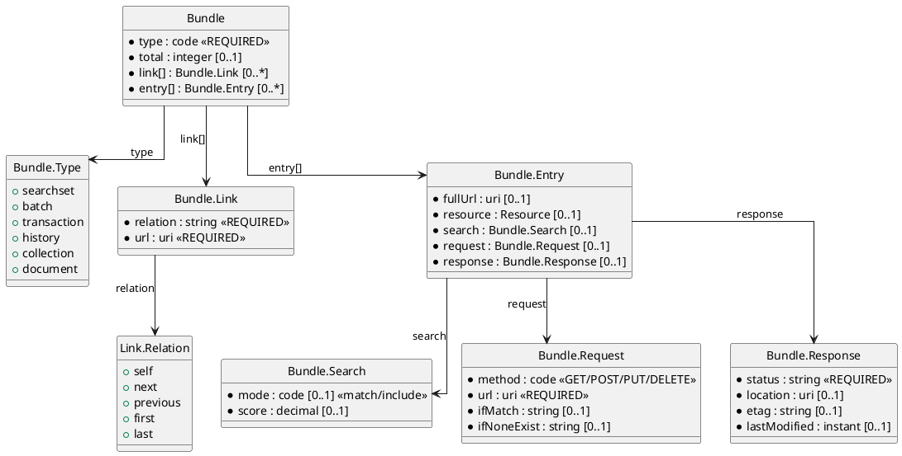

# FHIR Resource Bundles

Bundles are collections of resources used for search results, batch operations, and transactions.

## FHIR Bundle Types and Structure

### Diagram (version1)

```mermaid
graph TD
    Bundle[Bundle Resource]
  
    Bundle --> Type[type]
    Bundle --> Total[total]
    Bundle --> Link[link array]
    Bundle --> Entry[entry array]
  
    Type --> TypeSearch[searchset]
    Type --> TypeBatch[batch]
    Type --> TypeTransaction[transaction]
    Type --> TypeHistory[history]
    Type --> TypeCollection[collection]
    Type --> TypeDocument[document]
  
    Link --> LinkSelf[self]
    Link --> LinkNext[next]
    Link --> LinkPrev[previous]
    Link --> LinkFirst[first]
    Link --> LinkLast[last]
  
    Entry --> FullUrl[fullUrl]
    Entry --> Resource[resource]
    Entry --> Search[search]
    Entry --> Request[request]
    Entry --> Response[response]
  
    Search --> SearchMode[mode: match/include]
    Search --> SearchScore[score]
  
    Request --> ReqMethod[method: GET/POST/PUT/DELETE]
    Request --> ReqUrl[url]
    Request --> ReqIfMatch[ifMatch]
    Request --> ReqIfNoneExist[ifNoneExist]
  
    Response --> RespStatus[status]
    Response --> RespLocation[location]
    Response --> RespEtag[etag]
    Response --> RespLastMod[lastModified]
```

### Diagram (version 2)

