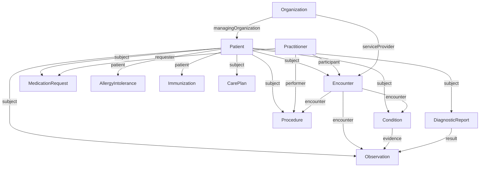

## Core FHIR Resource Relationship

```mermaid
graph TD
    Patient[Patient]
    Practitioner[Practitioner]
    Organization[Organization]
    Encounter[Encounter]
    Condition[Condition]
    Observation[Observation]
    MedicationRequest[MedicationRequest]
    Procedure[Procedure]
    AllergyIntolerance[AllergyIntolerance]
    DiagnosticReport[DiagnosticReport]
    Immunization[Immunization]
    CarePlan[CarePlan]
  
    Patient -->|subject| Condition
    Patient -->|subject| Observation
    Patient -->|subject| MedicationRequest
    Patient -->|subject| Procedure
    Patient -->|patient| AllergyIntolerance
    Patient -->|subject| Encounter
    Patient -->|subject| DiagnosticReport
    Patient -->|patient| Immunization
    Patient -->|subject| CarePlan
  
    Practitioner -->|performer| Procedure
    Practitioner -->|requester| MedicationRequest
    Practitioner -->|participant| Encounter
  
    Organization -->|managingOrganization| Patient
    Organization -->|serviceProvider| Encounter
  
    Encounter -->|encounter| Condition
    Encounter -->|encounter| Observation
    Encounter -->|encounter| Procedure
  
    Condition -->|evidence| Observation
    DiagnosticReport -->|result| Observation
```