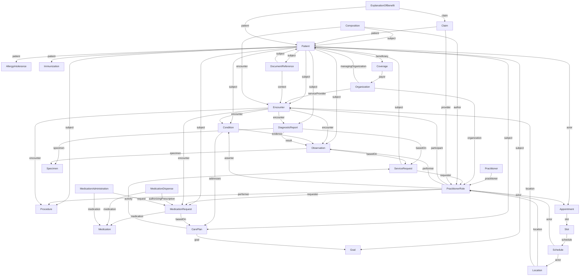
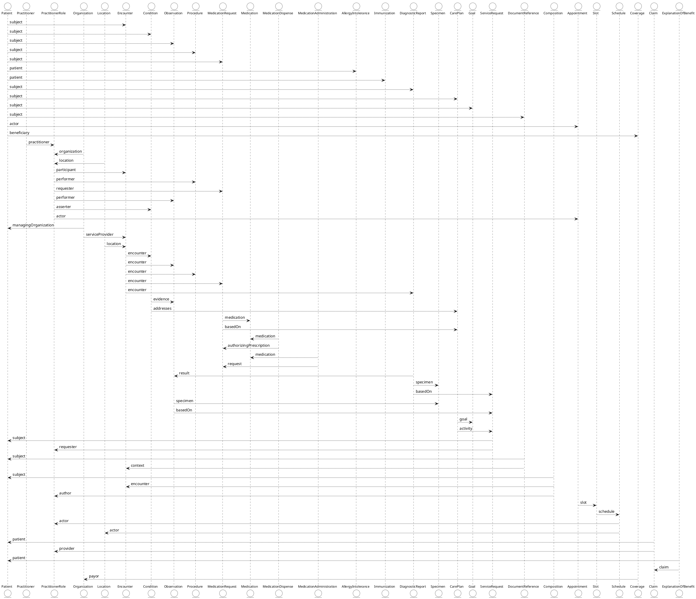
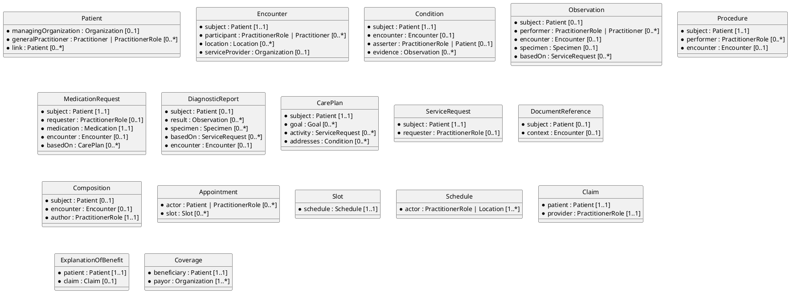

# FHIR Comprehensive Resource Relationships

## The Full Picture

You've seen domain-specific relationship diagrams (clinical, medication, scheduling, etc.). This page brings them all together into one comprehensive map. Think of this as the "master blueprint" showing how all 20+ major FHIR resources interconnect across clinical, administrative, and financial domains.

This diagram is intentionally dense. Don't try to memorize it—use it as:

- **Reference map**: When building features, trace dependencies to know what to fetch
- **Data model guide**: Understand cardinality constraints when designing database schemas  
- **Query planner**: Identify which `_include` and `_revinclude` parameters you'll need
- **Integration checklist**: Ensure your interfaces support all necessary resources

---

### FHIR Resource Relationships Matrix (Diagram)

> diagram version1 (TBD::archive)



> diagram version2 (TBD::placement)



Let's delve into WHY each relationship exists and how to use it.

---

## Domain Breakdown with Clinical Context

### Actors and Identity

**Resources**: Patient, Practitioner, PractitionerRole, Organization, Location

**The central insight**: PractitionerRole is the glue that binds people to places and organizations.

**Key relationships**:

```
Practitioner → PractitionerRole [practitioner: 1..1]
Organization → PractitionerRole [organization: 0..1]
Location → PractitionerRole [location: 0..*]
Organization → Patient [managingOrganization: 0..1]
```

**Why this matters**:

A Practitioner resource represents a physical person (Dr. Sarah Johnson). But she wears multiple hats:

- Monday–Wednesday: Internist at Main Street Clinic
- Thursday–Friday: ER physician at County Hospital

Each "hat" is a separate PractitionerRole:

```
PractitionerRole/dr-johnson-main-clinic
  practitioner: Practitioner/dr-johnson
  organization: Organization/main-street-clinic
  location: [Location/room-3]
  specialty: Internal Medicine
  availableTime: Mon-Wed 8am-5pm

PractitionerRole/dr-johnson-county-er
  practitioner: Practitioner/dr-johnson
  organization: Organization/county-hospital
  location: [Location/er-bay-2]
  specialty: Emergency Medicine
  availableTime: Thu-Fri 7pm-7am
```

**App usage pattern**:

```javascript
async function getProviderContext(practitionerRoleId) {
  const role = await fetch(`/PractitionerRole/${practitionerRoleId}?_include=PractitionerRole:practitioner&_include=PractitionerRole:organization&_include=PractitionerRole:location`);
  
  // Bundle contains: PractitionerRole + Practitioner + Organization + Location(s)
  const person = role.entry.find(e => e.resource.resourceType === "Practitioner").resource;
  const org = role.entry.find(e => e.resource.resourceType === "Organization").resource;
  const locations = role.entry.filter(e => e.resource.resourceType === "Location").map(e => e.resource);
  
  return {
    name: person.name[0].text,
    organization: org.name,
    locations: locations.map(l => l.name)
  };
}

// Display: "Dr. Sarah Johnson at Main Street Clinic (Room 3)"
```

---

### Clinical Events

**Resources**: Encounter, Condition, Observation, Procedure, DiagnosticReport, Specimen

**The central insight**: Encounter is the temporal and billing spine. Almost everything clinical references it.

**Key relationships**:

```
Patient → Encounter [subject: 1..1]
Encounter → Condition [encounter: 0..1]
Encounter → Observation [encounter: 0..1]
Encounter → Procedure [encounter: 0..1]
Encounter → DiagnosticReport [encounter: 0..1]
Condition → Observation [evidence: 0..*]
DiagnosticReport → Observation [result: 0..*]
DiagnosticReport → Specimen [specimen: 0..*]
Observation → Specimen [specimen: 0..1]
```

**Cardinality insight**: Notice `Encounter → Condition` is `0..1` (each Condition links to at most one Encounter), but `Condition` can appear in multiple Encounters over time. Each instance is a separate Condition resource with different encounter references.

**Clinical scenario**: Amy Shaw's diabetes management

```
Encounter/visit-2024-03-15 (initial diagnosis)
  ├─ Condition/diabetes (onsetDateTime: 2024-03-15)
  │   └─ evidence: Observation/hba1c-2024-03-15 (7.2%)
  ├─ Observation/hba1c-2024-03-15
  │   └─ basedOn: ServiceRequest/hba1c-order-2024-03-15
  └─ MedicationRequest/metformin-initial

Encounter/visit-2024-06-15 (3-month follow-up)
  ├─ Observation/hba1c-2024-06-15 (6.8% - improved)
  └─ MedicationRequest/metformin-increase

Encounter/visit-2024-09-15 (6-month follow-up)
  └─ Observation/hba1c-2024-09-15 (6.5% - at goal)
```

**Query pattern**: Show diabetes trajectory

```http
GET /Condition?patient=smart-1288992&code=http://snomed.info/sct|44054006&_include=Condition:evidence
```

Returns Condition + all evidence Observations. Then:

```javascript
const observations = bundle.entry
  .filter(e => e.resource.resourceType === "Observation")
  .sort((a, b) => new Date(a.resource.effectiveDateTime) - new Date(b.resource.effectiveDateTime));

observations.forEach(obs => {
  console.log(`${obs.resource.effectiveDateTime}: HbA1c ${obs.resource.valueQuantity.value}%`);
});

// Output:
// 2024-03-15T09:00:00Z: HbA1c 7.2%
// 2024-06-15T09:00:00Z: HbA1c 6.8%
// 2024-09-15T09:00:00Z: HbA1c 6.5%
```

---

### Medication Flow

**Resources**: MedicationRequest, Medication, MedicationDispense, MedicationAdministration, AllergyIntolerance, Immunization

**The central insight**: Four lifecycle stages, each a separate resource.

**Key relationships**:

```
Patient → MedicationRequest [subject: 1..1]
MedicationRequest → Medication [medication: 1..1]
MedicationRequest → Encounter [encounter: 0..1]
MedicationRequest → CarePlan [basedOn: 0..*]
MedicationDispense → Medication [medication: 1..1]
MedicationDispense → MedicationRequest [authorizingPrescription: 0..*]
MedicationAdministration → Medication [medication: 1..1]
MedicationAdministration → MedicationRequest [request: 0..1]
Patient → AllergyIntolerance [patient: 1..1]
Patient → Immunization [patient: 1..1]
```

**Cardinality gotcha**: `MedicationDispense → MedicationRequest` is `0..*` (one dispense can fulfill multiple requests, e.g., renewal + initial order combined).

**Clinical scenario**: Metformin lifecycle

```
Nov 1: MedicationRequest/order-123 created
  status: active
  intent: order
  dosageInstruction: "500mg BID"

Nov 2: MedicationDispense/dispense-456 created
  authorizingPrescription: [MedicationRequest/order-123]
  quantity: 60 tablets
  whenHandedOver: 2024-11-02T15:30:00Z

Nov 2, 8pm: MedicationAdministration/admin-001
  request: MedicationRequest/order-123
  effectiveDateTime: 2024-11-02T20:00:00Z

Nov 3, 8am: MedicationAdministration/admin-002
  request: MedicationRequest/order-123
  effectiveDateTime: 2024-11-03T08:00:00Z
  
... (continue daily)

Dec 2 (30 days later): Check adherence
  Expected administrations: 60 (2 per day × 30 days)
  Actual administrations: Query count
```

**Adherence query**:

```http
GET /MedicationAdministration?request=MedicationRequest/order-123&date=ge2024-11-02&date=le2024-12-02&_summary=count
```

Returns `total: 55`. Patient took 55/60 doses = 91.7% adherence.

---

### Care Planning

**Resources**: CarePlan, Goal, ServiceRequest

**The central insight**: CarePlan orchestrates, Goals define success, ServiceRequests execute.

**Key relationships**:

```
Patient → CarePlan [subject: 1..1]
CarePlan → Goal [goal: 0..*]
CarePlan → ServiceRequest [activity: 0..*]
ServiceRequest → CarePlan [basedOn: 0..*]
Patient → Goal [subject: 1..1]
Patient → ServiceRequest [subject: 1..1]
Condition → CarePlan [addresses: 0..*]
```

**Cardinality note**: `ServiceRequest → CarePlan [basedOn: 0..*]` means a single service request can be part of multiple care plans (e.g., HbA1c test appears in both diabetes care plan and cardiovascular care plan).

**Clinical scenario**: Comprehensive diabetes care plan

```
CarePlan/diabetes-mgmt-2024
  subject: Patient/smart-1288992
  category: Diabetes self-management
  period: 2024-01-01 to 2024-12-31
  addresses: [Condition/diabetes]
  goal: [
    Goal/hba1c-target,
    Goal/bp-target,
    Goal/ldl-target,
    Goal/weight-loss
  ]
  activity: [
    ServiceRequest/hba1c-q3mo,
    ServiceRequest/lipid-annual,
    ServiceRequest/eye-exam-annual,
    ServiceRequest/nutrition-consult
  ]

Goal/hba1c-target
  lifecycleStatus: active
  achievementStatus: in-progress
  description: "HbA1c < 7.0%"
  target.measure: LOINC 4548-4
  target.detailQuantity.value: 7.0
  target.detailQuantity.comparator: "<"
  target.dueDate: 2025-02-01

ServiceRequest/hba1c-q3mo
  status: active
  intent: plan
  code: LOINC 4548-4 (HbA1c)
  subject: Patient/smart-1288992
  occurrenceTiming.repeat.frequency: 1
  occurrenceTiming.repeat.period: 3
  occurrenceTiming.repeat.periodUnit: "mo"
  basedOn: [CarePlan/diabetes-mgmt-2024]
```

**Goal tracking query**:

```javascript
async function evaluateCarePlanProgress(carePlanId) {
  // Get care plan with goals
  const carePlanBundle = await fetch(`/CarePlan/${carePlanId}?_include=CarePlan:goal`);
  const carePlan = carePlanBundle.entry.find(e => e.resource.resourceType === "CarePlan").resource;
  const goals = carePlanBundle.entry.filter(e => e.resource.resourceType === "Goal").map(e => e.resource);
  
  const progress = [];
  
  for (const goal of goals) {
    const targetMeasure = goal.target[0].measure.coding[0].code;
    const targetValue = goal.target[0].detailQuantity.value;
    const comparator = goal.target[0].detailQuantity.comparator;
    
    // Find most recent observation for this measure
    const observations = await fetch(`/Observation?patient=${carePlan.subject.reference}&code=${targetMeasure}&_sort=-date&_count=1`);
    
    if (observations.total > 0) {
      const latestObs = observations.entry[0].resource;
      const currentValue = latestObs.valueQuantity.value;
      
      let achieved = false;
      switch (comparator) {
        case "<":
          achieved = currentValue < targetValue;
          break;
        case "<=":
          achieved = currentValue <= targetValue;
          break;
        case ">":
          achieved = currentValue > targetValue;
          break;
        case ">=":
          achieved = currentValue >= targetValue;
          break;
      }
      
      progress.push({
        goal: goal.description.text,
        target: `${comparator} ${targetValue}`,
        current: currentValue,
        achieved
      });
    }
  }
  
  return progress;
}

// Usage
const progress = await evaluateCarePlanProgress("diabetes-mgmt-2024");
console.log(progress);
// [
//   {goal: "HbA1c < 7.0%", target: "< 7.0", current: 6.5, achieved: true},
//   {goal: "BP < 130/80", target: "< 130", current: 128, achieved: true},
//   {goal: "LDL < 100", target: "< 100", current: 105, achieved: false}
// ]
```

---

### Documentation

**Resources**: DocumentReference, Composition

**The central insight**: DocumentReference wraps binary documents, Composition structures narrative + data.

**Key relationships**:

```
Patient → DocumentReference [subject: 0..1]
DocumentReference → Encounter [context: 0..1]
Patient → Composition [subject: 0..1]
Composition → Encounter [encounter: 0..1]
Composition → PractitionerRole [author: 1..1]
```

**Use case distinction**:

- **DocumentReference**: "Here's a PDF of the discharge summary" (binary blob + metadata)
- **Composition**: "Here's a structured discharge summary with sections and references" (FHIR-native document)

**Example**: Storing external records

```
DocumentReference/external-records-2020
  subject: Patient/smart-1288992
  type: LOINC 11506-3 "Progress note"
  content.attachment.contentType: "application/pdf"
  content.attachment.url: "https://records.example.org/patient-123/note-2020-05-15.pdf"
  content.attachment.title: "Cardiology Consult Note - May 15, 2020"
  context.encounter: [Encounter/cardio-consult-2020]
  context.period: 2020-05-15 to 2020-05-15
```

**Query pattern**: Get all documents for patient

```http
GET /DocumentReference?subject=Patient/smart-1288992&_sort=-date
```

Display as downloadable list in patient portal.

---

### Scheduling

**Resources**: Appointment, Slot, Schedule

**The central insight**: Three-tier hierarchy enables resource sharing and conflict prevention.

**Key relationships**:

```
Appointment → Slot [slot: 0..*]
Slot → Schedule [schedule: 1..1]
Schedule → PractitionerRole [actor: 1..*]
Schedule → Location [actor: 1..*]
Appointment → Patient [participant: 0..*]
Appointment → PractitionerRole [participant: 0..*]
```

**Cardinality note**: `Schedule → actor [1..*]` means a Schedule can represent a provider, a room, or both (e.g., "Dr. Johnson's schedule in Room 3" has two actors).

**Booking workflow**:

```
1. Define Schedule
   Schedule/dr-johnson-nov-2024
     actor: [PractitionerRole/dr-johnson-main-clinic, Location/room-3]
     planningHorizon: 2024-11-01 to 2024-11-30

2. Create Slots (usually automated)
   Slot/slot-nov-5-10am
     schedule: Schedule/dr-johnson-nov-2024
     start: 2024-11-05T10:00:00-05:00
     end: 2024-11-05T10:30:00-05:00
     status: free
   
   Slot/slot-nov-5-1030am
     schedule: Schedule/dr-johnson-nov-2024
     start: 2024-11-05T10:30:00-05:00
     end: 2024-11-05T11:00:00-05:00
     status: free
   
   ... (repeat for all time blocks)

3. Patient books appointment
   POST /Appointment
   {
     status: "booked",
     slot: [{reference: "Slot/slot-nov-5-10am"}],
     participant: [
       {actor: {reference: "Patient/smart-1288992"}, required: "required", status: "accepted"},
       {actor: {reference: "PractitionerRole/dr-johnson-main-clinic"}, required: "required", status: "accepted"}
     ]
   }

4. Server marks Slot as busy
   PUT /Slot/slot-nov-5-10am
   {status: "busy"}
```

**Conflict prevention**: If two patients try to book the same Slot simultaneously, only the first POST succeeds. Second gets `409 Conflict`.

**Search available slots**:

```http
GET /Slot?schedule=dr-johnson-nov-2024&status=free&start=ge2024-11-05&start=le2024-11-30&_count=20
```

Returns next 20 available 30-minute blocks.

---

### Financial

**Resources**: Coverage, Claim, ExplanationOfBenefit

**The central insight**: Coverage → Claim → EOB is the billing pipeline.

**Key relationships**:

```
Patient → Coverage [beneficiary: 1..1]
Coverage → Organization [payor: 1..*]
Patient → Claim [patient: 1..1]
Claim → PractitionerRole [provider: 1..1]
Claim → Coverage [insurance: 1..*]
ExplanationOfBenefit → Patient [patient: 1..1]
ExplanationOfBenefit → Claim [claim: 0..1]
```

**Cardinality note**: `Claim → Coverage [1..*]` allows coordination of benefits (multiple insurances—primary, secondary, tertiary).

**Billing flow**:

```
1. Verify coverage before visit
   GET /Coverage?beneficiary=Patient/smart-1288992&status=active

2. After visit, create Claim
   POST /Claim
   {
     patient: {reference: "Patient/smart-1288992"},
     provider: {reference: "PractitionerRole/dr-johnson-main-clinic"},
     insurance: [{
       sequence: 1,
       focal: true,
       coverage: {reference: "Coverage/patient-bcbs"}
     }],
     item: [
       {sequence: 1, productOrService: CPT 99213, unitPrice: 150.00},
       {sequence: 2, productOrService: CPT 83036, unitPrice: 45.00}
     ],
     total: {value: 195.00, currency: "USD"}
   }

3. Payer processes, returns EOB
   POST /ExplanationOfBenefit
   {
     claim: {reference: "Claim/claim-456"},
     patient: {reference: "Patient/smart-1288992"},
     outcome: "complete",
     item: [
       {
         productOrService: CPT 99213,
         adjudication: [
           {category: "submitted", amount: 150.00},
           {category: "benefit", amount: 120.00},
           {category: "copay", amount: 30.00}
         ]
       },
       {
         productOrService: CPT 83036,
         adjudication: [
           {category: "submitted", amount: 45.00},
           {category: "benefit", amount: 36.00},
           {category: "copay", amount: 9.00}
         ]
       }
     ],
     total: [
       {category: "submitted", amount: 195.00},
       {category: "benefit", amount: 156.00}
     ],
     payment: {
       type: "complete",
       amount: 156.00
     }
   }

4. Patient statement generation
   Query: GET /ExplanationOfBenefit?patient=smart-1288992&claim=claim-456
   
   Display:
     Billed: $195.00
     Insurance paid: $156.00
     Your responsibility: $39.00 (copay)
```

---

## Cardinality Scaffold (Diagram)

Below is a diagram with cardinality annotations you can use as a reference for:

- **Database schema design**: Know which foreign keys are required vs. optional
- **Validation rules**: Enforce cardinality in your app before submitting to server
- **Query optimization**: Required fields can use NOT NULL indexes

## Resource Cardinality Scaffold

> See also [FHIR Resource Cardinality](../eh-dd-02-fhir-data-fundamentals/deepdive-fhir-cardinality.md) for a focused cardinality diagram for three core resources: `Patient`, `Observation`, and `Condition`.



---

## Putting It All Together: Complete Patient View

Let's trace how all these relationships come together for a single patient visit:

**Amy Shaw's Nov 1, 2024 diabetes follow-up**

```
Patient/smart-1288992 (Amy V. Shaw)
  └─ managingOrganization: Organization/main-street-clinic

Encounter/visit-2024-11-01
  ├─ subject: Patient/smart-1288992
  ├─ participant: PractitionerRole/dr-johnson-main-clinic
  │   ├─ practitioner: Practitioner/dr-johnson
  │   ├─ organization: Organization/main-street-clinic
  │   └─ location: Location/room-3
  ├─ serviceProvider: Organization/main-street-clinic
  └─ appointment: Appointment/appt-2024-11-01
      └─ slot: Slot/slot-2024-11-01-10am
          └─ schedule: Schedule/dr-johnson-nov-2024

Observation/hba1c-2024-11-01
  ├─ subject: Patient/smart-1288992
  ├─ encounter: Encounter/visit-2024-11-01
  ├─ performer: Organization/example-lab
  └─ basedOn: ServiceRequest/hba1c-order
      └─ basedOn: CarePlan/diabetes-mgmt-2024
          ├─ addresses: Condition/diabetes
          │   └─ evidence: Observation/hba1c-2024-03-15 (original diagnosis)
          └─ goal: Goal/hba1c-target

MedicationRequest/metformin-increase
  ├─ subject: Patient/smart-1288992
  ├─ encounter: Encounter/visit-2024-11-01
  ├─ requester: PractitionerRole/dr-johnson-main-clinic
  └─ reasonReference: Condition/diabetes

Claim/claim-2024-11-01
  ├─ patient: Patient/smart-1288992
  ├─ provider: PractitionerRole/dr-johnson-main-clinic
  └─ insurance: Coverage/patient-bcbs
      └─ payor: Organization/blue-cross

ExplanationOfBenefit/eob-2024-11-01
  ├─ patient: Patient/smart-1288992
  ├─ claim: Claim/claim-2024-11-01
  └─ insurer: Organization/blue-cross
```

**Query to fetch entire visit context**:

```http
GET /Encounter/visit-2024-11-01?
  _include=Encounter:subject&
  _include=Encounter:participant&
  _revinclude=Observation:encounter&
  _revinclude=Condition:encounter&
  _revinclude=MedicationRequest:encounter&
  _revinclude=Procedure:encounter
```

Returns Bundle with 10–20 resources covering the complete visit.

---

## Next Steps

This completes Section 3 (Resource Relationships). We covered:

- ✅ How resources reference each other
- ✅ How bundles group resources
- ✅ The complete relationship map across all domains
- ✅ Cardinality constraints and their implications

Next, we'll explore how to interact with these resources through FHIR's REST API.

→ [Working with FHIR APIs](../eh-dd-04-working-with-fhir-apis/index.md)