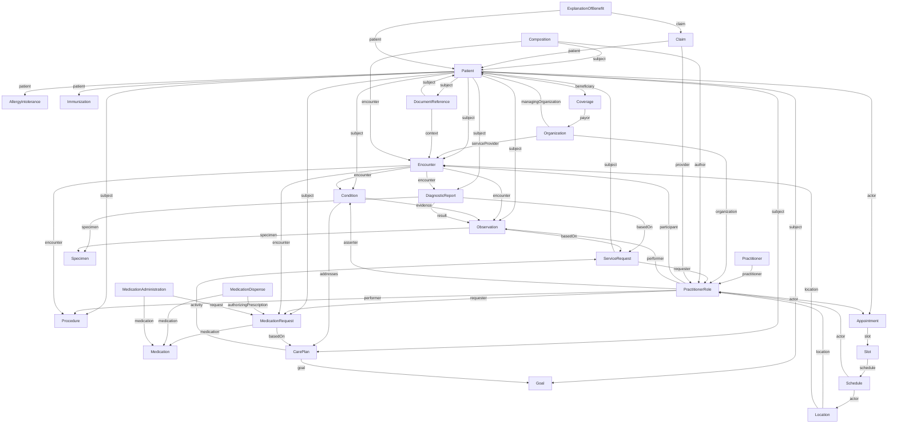
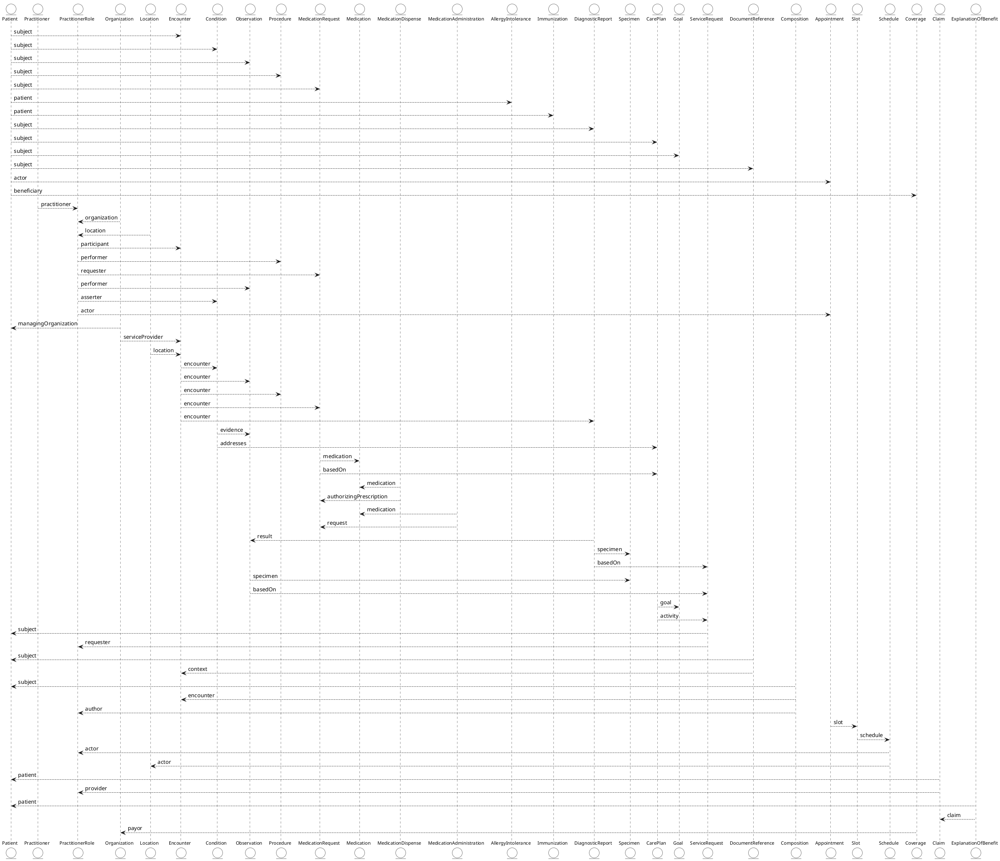
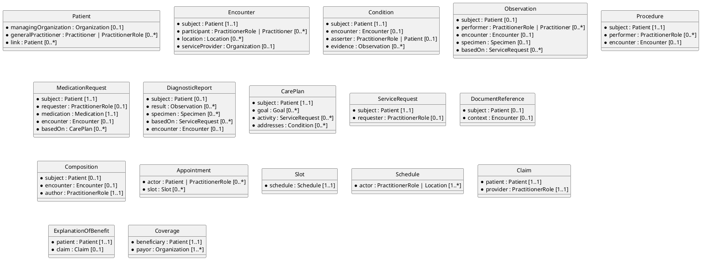

# FHIR Comprehensive Resource Relationships

## Comprehensive Diagram of FHIR Resource Relationships

### Diagram (version 1)  

### Diagram (version 2)  

#### Resource Cardinality Scaffold  

> See also [FHIR Resource Cardinality](../eh-dd-02-fhir-data-fundamentals/deepdive-fhir-cardinality.md) for a focused cardinality diagram for three core resources: `Patient`, `Observation`, and `Condition`.

