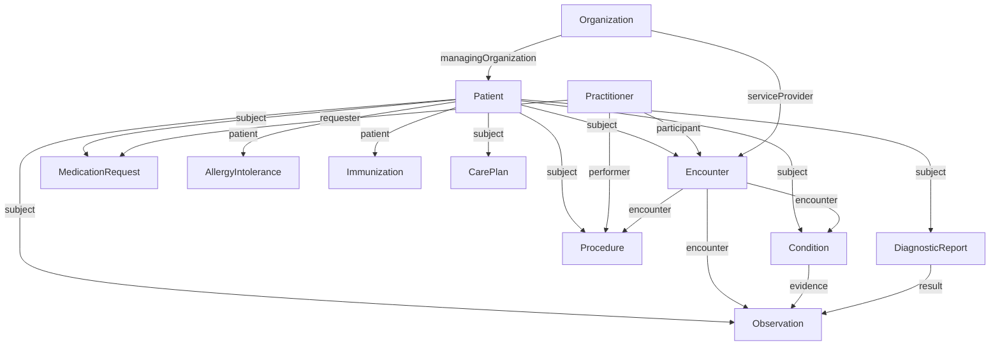
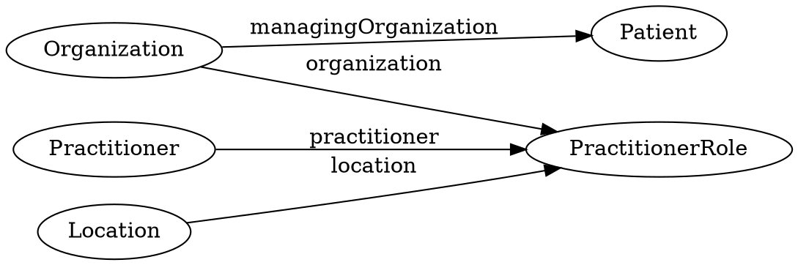
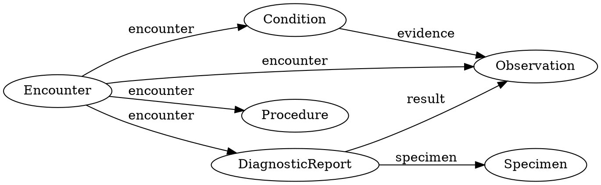
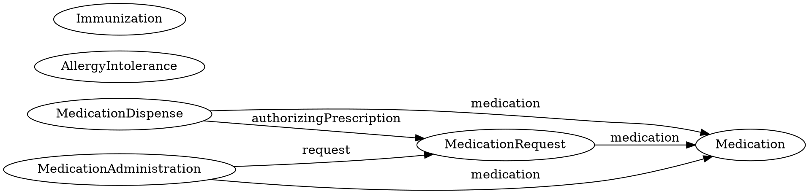
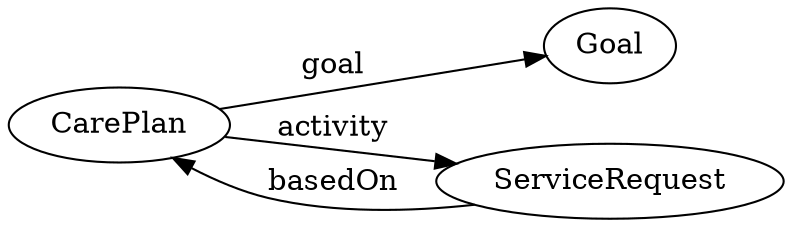
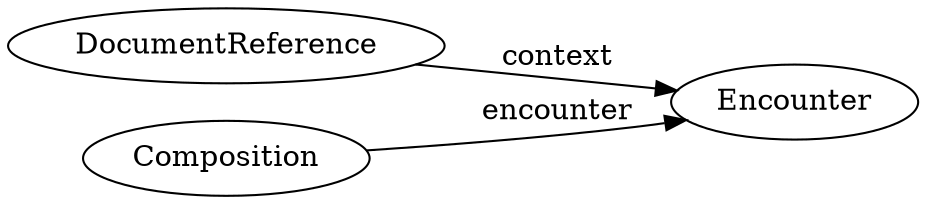
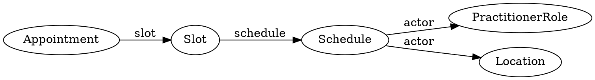
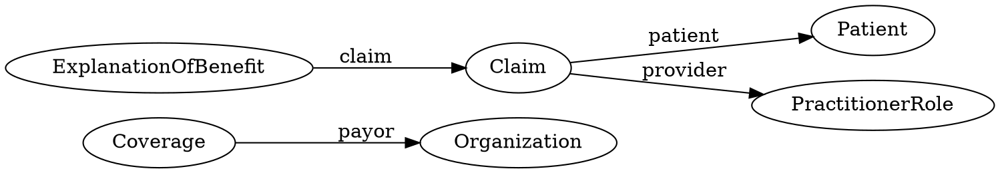

## Core FHIR Resource Relationships

> \<lead-in::resource-relationships> TBD

## Resource Relationships by Domain

### Actors

### Clinical

!!! note "Diagram Overview" 
    This graph shows how Encounter anchors multiple clinical resources. It’s the temporal spine of most patient interactions.

### Medication

### Care Planning

### Documentation

### Scheduling

### Financial

