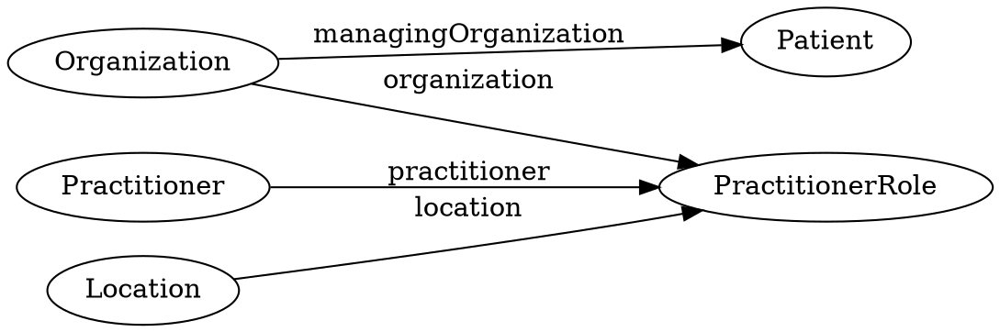
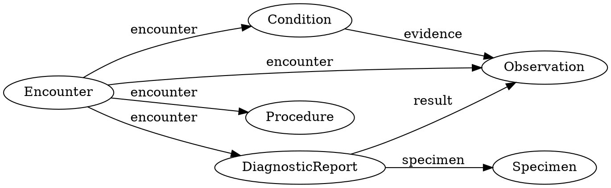
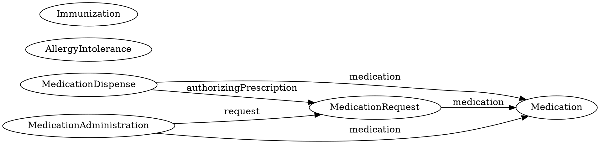
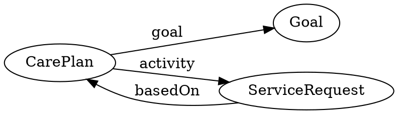
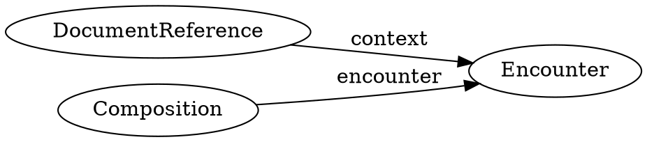
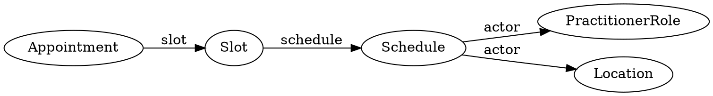
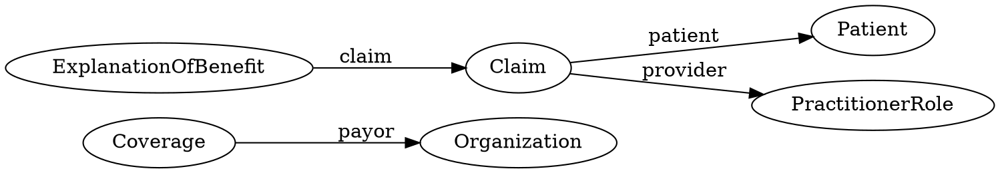
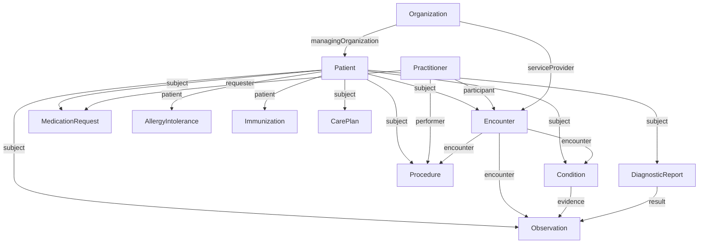

# FHIR Resource Relationships

## Understanding the Web of Healthcare Data

In FHIR, no resource stands alone. A patient's health story emerges from the connections between resources—Observations linked to Encounters, MedicationRequests justified by Conditions, DiagnosticReports containing multiple Observations. Understanding these relationships is crucial for building apps that present complete, contextualized clinical information.

Think of FHIR resources as nodes in a graph. The edges (references) between them create meaning:

- A blood pressure reading without a patient reference is meaningless data
- A diagnosis without supporting observations lacks clinical justification
- A medication order without an encounter context can't be billed properly

This section explores how resources connect and why those connections matter.

---

## The Core Relationship: References

Every significant relationship in FHIR uses the **Reference** data type. A Reference is a pointer from one resource to another, like a hyperlink:

```json
{
  "subject": {
    "reference": "Patient/smart-1288992",
    "display": "Amy V. Shaw"
  }
}
```

**Anatomy of a Reference**:

- **`reference`**: The URL or logical ID of the target resource
- **`type`**: Resource type (optional but recommended for validation)
- **`identifier`**: Business identifier as fallback (when you don't know the server ID)
- **`display`**: Human-readable description (helps with debugging and logs)

### Reference Resolution

When your app encounters a reference, you can:

**1. Follow it immediately** (eager loading):

```http
GET /Observation/bp-20241101
```

Response includes `subject.reference: "Patient/smart-1288992"`. Then fetch:

```http
GET /Patient/smart-1288992
```

**2. Use `_include` to get both at once**:

```http
GET /Observation/bp-20241101?_include=Observation:subject
```

Returns a Bundle with both Observation and Patient.

**3. Use `_revinclude` to traverse backwards**:

```http
GET /Patient/smart-1288992?_revinclude=Observation:patient
```

Returns Patient plus all Observations referencing that patient.

---

## The Relationship Map: By Domain

Let's explore some key resource relationships by domain.

### Actors and Identity



**What this means clinically**:

**PractitionerRole is the hub**: It's not enough to know "Dr. Johnson" exists. You need to know:

- Where does she work? (Organization: "Main Street Clinic")
- What's her role? (PractitionerRole.code: "Internal Medicine Physician")
- When is she available? (PractitionerRole.availableTime)
- Where does she see patients? (Location: "Room 3")

A single Practitioner can have multiple PractitionerRoles:

- Dr. Johnson works at Main Street Clinic (Monday–Wednesday)
- Dr. Johnson also covers at County Hospital ER (Thursday–Friday)
- Different Organizations, Locations, and specialties—same person

**Patient.managingOrganization**: Which organization "owns" this patient record? Crucial for:

- Data access control (Organization A can't see Organization B's patients)
- Transfer of care (when patient moves to new provider)
- Billing (who gets reimbursed for care?)

**Real-world example**:

```json
{
  "resourceType": "Encounter",
  "subject": {"reference": "Patient/smart-1288992"},
  "participant": [{
    "individual": {"reference": "PractitionerRole/dr-johnson-main-clinic"}
  }]
}
```

Fetching `PractitionerRole/dr-johnson-main-clinic` reveals:

```json
{
  "resourceType": "PractitionerRole",
  "practitioner": {"reference": "Practitioner/dr-johnson"},
  "organization": {"reference": "Organization/main-street-clinic"},
  "location": [{"reference": "Location/room-3"}],
  "code": [{
    "coding": [{
      "system": "http://snomed.info/sct",
      "code": "309343006",
      "display": "Physician"
    }]
  }],
  "specialty": [{
    "coding": [{
      "system": "http://snomed.info/sct",
      "code": "419192003",
      "display": "Internal medicine"
    }]
  }]
}
```

Now you know WHO saw the patient, WHERE, and in WHAT CAPACITY.

---

### Clinical Domain



**What this means clinically**:

**Encounter is the temporal spine**: Most clinical resources reference the Encounter where they occurred. This enables:

- **Chart review**: "Show me everything from the Nov 1 visit"
- **Billing**: Link charges to specific visit
- **Care coordination**: Alert primary care when specialist encounter occurs
- **Quality measures**: "Was HbA1c checked during diabetes follow-up?"

**DiagnosticReport aggregates Observations**: A "Complete Blood Count" DiagnosticReport contains multiple Observation results:

- White blood cell count
- Red blood cell count
- Hemoglobin
- Hematocrit
- Platelet count

```json
{
  "resourceType": "DiagnosticReport",
  "code": {
    "coding": [{
      "system": "http://loinc.org",
      "code": "58410-2",
      "display": "Complete blood count"
    }]
  },
  "result": [
    {"reference": "Observation/wbc-count"},
    {"reference": "Observation/rbc-count"},
    {"reference": "Observation/hemoglobin"},
    {"reference": "Observation/hematocrit"},
    {"reference": "Observation/platelet-count"}
  ]
}
```

Apps can display the report as a panel, grouping related results.

**Condition.evidence links to supporting Observations**: A diabetes diagnosis (Condition) should reference the HbA1c result (Observation) that confirmed it:

```json
{
  "resourceType": "Condition",
  "code": {
    "coding": [{
      "system": "http://snomed.info/sct",
      "code": "44054006",
      "display": "Type 2 diabetes mellitus"
    }]
  },
  "evidence": [{
    "detail": [{
      "reference": "Observation/hba1c-20190315",
      "display": "HbA1c 7.2%"
    }]
  }]
}
```

**Why it matters**:

- Clinical decision support can verify diagnosis before triggering alerts
- Quality measures require documented evidence (not just assertion)
- Malpractice defense: "How did you diagnose this?" → "Based on these lab results"

---

### Medication Domain



**What this means clinically**:

**The medication lifecycle**:

1. **MedicationRequest** (order/prescription): Physician writes order
2. **MedicationDispense** (pharmacy fulfillment): Pharmacy fills prescription
3. **MedicationAdministration** (actual intake): Patient takes dose (or nurse administers in hospital)

**Each references the same Medication resource**:

```json
{
  "resourceType": "Medication",
  "id": "metformin-500",
  "code": {
    "coding": [{
      "system": "http://www.nlm.nih.gov/research/umls/rxnorm",
      "code": "860975",
      "display": "metformin hydrochloride 500 MG Oral Tablet"
    }]
  }
}
```

**Tracing the chain**:

**Step 1 - Order**:

```json
{
  "resourceType": "MedicationRequest",
  "id": "order-123",
  "status": "active",
  "intent": "order",
  "medicationReference": {"reference": "Medication/metformin-500"},
  "subject": {"reference": "Patient/smart-1288992"},
  "dosageInstruction": [{
    "text": "Take 1 tablet by mouth twice daily"
  }]
}
```

**Step 2 - Dispense**:

```json
{
  "resourceType": "MedicationDispense",
  "id": "dispense-456",
  "status": "completed",
  "medicationReference": {"reference": "Medication/metformin-500"},
  "authorizingPrescription": [{"reference": "MedicationRequest/order-123"}],
  "subject": {"reference": "Patient/smart-1288992"},
  "quantity": {"value": 60, "unit": "tablet"},
  "whenHandedOver": "2024-11-02T15:30:00Z"
}
```

**Step 3 - Administration**:

```json
{
  "resourceType": "MedicationAdministration",
  "id": "admin-789",
  "status": "completed",
  "medicationReference": {"reference": "Medication/metformin-500"},
  "request": {"reference": "MedicationRequest/order-123"},
  "subject": {"reference": "Patient/smart-1288992"},
  "effectiveDateTime": "2024-11-02T20:00:00Z"
}
```

**Use cases**:

- **Adherence tracking**: Compare dispense dates to expected duration. If patient should need refill every 30 days but it's been 45 days, flag non-adherence.
- **Drug interaction checking**: When new MedicationRequest is created, check against active MedicationAdministration records.
- **Billing reconciliation**: Ensure every billed dispense links to a valid order.

**AllergyIntolerance integration**: Before creating MedicationRequest, check:

```javascript
function checkAllergies(patientId, medicationCode) {
  // Fetch allergies
  const allergies = await fetch(
    `/AllergyIntolerance?patient=${patientId}&clinical-status=active`
  );
  
  // Check if new med conflicts
  for (const allergy of allergies.entry.map(e => e.resource)) {
    if (isContraindicated(allergy.code, medicationCode)) {
      return {
        alert: true,
        message: `Patient allergic to ${allergy.code.text}. Cannot prescribe ${medicationCode.text}.`
      };
    }
  }
  
  return {alert: false};
}
```

---

### Care Planning Domain



**What this means clinically**:

**CarePlan orchestrates care**: A diabetes management CarePlan might include:

**Goals**:

- HbA1c < 7.0%
- LDL cholesterol < 100 mg/dL
- Blood pressure < 130/80 mmHg

**Activities (ServiceRequests)**:

- Order HbA1c every 3 months
- Order lipid panel annually
- Refer to nutritionist
- Refer to ophthalmologist for eye exam

```json
{
  "resourceType": "CarePlan",
  "status": "active",
  "intent": "plan",
  "subject": {"reference": "Patient/smart-1288992"},
  "category": [{
    "coding": [{
      "system": "http://snomed.info/sct",
      "code": "698358001",
      "display": "Diabetes self-management plan"
    }]
  }],
  "goal": [
    {"reference": "Goal/hba1c-target"},
    {"reference": "Goal/ldl-target"},
    {"reference": "Goal/bp-target"}
  ],
  "activity": [{
    "reference": {"reference": "ServiceRequest/hba1c-every-3mo"},
    "detail": {
      "status": "in-progress",
      "description": "Check HbA1c every 3 months"
    }
  }, {
    "reference": {"reference": "ServiceRequest/lipid-panel-annual"},
    "detail": {
      "status": "in-progress",
      "description": "Annual lipid panel"
    }
  }]
}
```

**Goal detail**:

```json
{
  "resourceType": "Goal",
  "id": "hba1c-target",
  "lifecycleStatus": "active",
  "achievementStatus": {
    "coding": [{
      "system": "http://terminology.hl7.org/CodeSystem/goal-achievement",
      "code": "in-progress",
      "display": "In Progress"
    }]
  },
  "description": {
    "text": "HbA1c less than 7.0%"
  },
  "subject": {"reference": "Patient/smart-1288992"},
  "target": [{
    "measure": {
      "coding": [{
        "system": "http://loinc.org",
        "code": "4548-4",
        "display": "Hemoglobin A1c"
      }]
    },
    "detailQuantity": {
      "value": 7.0,
      "comparator": "<",
      "unit": "%",
      "system": "http://unitsofmeasure.org",
      "code": "%"
    },
    "dueDate": "2025-02-01"
  }]
}
```

**Tracking progress**:

```javascript
async function evaluateGoalProgress(goalId) {
  const goal = await fetch(`/Goal/${goalId}`);
  const targetCode = goal.target[0].measure.coding[0].code;
  const targetValue = goal.target[0].detailQuantity.value;
  
  // Find most recent observation for this measure
  const observations = await fetch(
    `/Observation?patient=${goal.subject.reference}&code=${targetCode}&_sort=-date&_count=1`
  );
  
  const latestObs = observations.entry[0].resource;
  const currentValue = latestObs.valueQuantity.value;
  
  if (currentValue < targetValue) {
    return {
      status: "achieved",
      message: `Goal met! Current HbA1c: ${currentValue}%`
    };
  } else {
    return {
      status: "in-progress",
      message: `Goal not yet met. Current: ${currentValue}%, Target: <${targetValue}%`
    };
  }
}
```

---

### Documentation Domain



**What this means clinically**:

**DocumentReference** points to external documents (PDFs, images, videos):

- Scanned consent forms
- External records (from another hospital)
- Imaging studies (DICOM images, radiology reports)
- Patient-uploaded documents (home blood pressure logs)

```json
{
  "resourceType": "DocumentReference",
  "status": "current",
  "type": {
    "coding": [{
      "system": "http://loinc.org",
      "code": "34133-9",
      "display": "Summary of episode note"
    }]
  },
  "subject": {"reference": "Patient/smart-1288992"},
  "context": {
    "encounter": [{"reference": "Encounter/smart-enc-456"}],
    "period": {
      "start": "2024-11-01T10:00:00-05:00",
      "end": "2024-11-01T11:15:00-05:00"
    }
  },
  "content": [{
    "attachment": {
      "contentType": "application/pdf",
      "url": "https://ehr.example.org/documents/visit-summary-456.pdf",
      "title": "After-Visit Summary - Nov 1, 2024",
      "creation": "2024-11-01T11:20:00Z"
    }
  }]
}
```

**Composition** is a structured clinical document (like a CDA):

- Discharge summary
- Progress note
- Referral letter
- Consultation note

```json
{
  "resourceType": "Composition",
  "status": "final",
  "type": {
    "coding": [{
      "system": "http://loinc.org",
      "code": "34133-9",
      "display": "Summary of episode note"
    }]
  },
  "subject": {"reference": "Patient/smart-1288992"},
  "encounter": {"reference": "Encounter/smart-enc-456"},
  "date": "2024-11-01T11:15:00-05:00",
  "author": [{"reference": "Practitioner/smart-pract-789"}],
  "title": "Diabetes Follow-up Visit Note",
  "section": [{
    "title": "Chief Complaint",
    "text": {
      "status": "generated",
      "div": "<div xmlns=\"http://www.w3.org/1999/xhtml\"><p>Follow-up for Type 2 diabetes management</p></div>"
    }
  }, {
    "title": "Assessment and Plan",
    "entry": [
      {"reference": "Condition/condition-diabetes"},
      {"reference": "MedicationRequest/medrx-metformin"}
    ],
    "text": {
      "status": "generated",
      "div": "<div xmlns=\"http://www.w3.org/1999/xhtml\"><p>HbA1c elevated at 7.2%. Increase metformin to 1000mg BID. Recheck in 3 months.</p></div>"
    }
  }]
}
```

**Key difference**:

- **DocumentReference**: Wrapper around a binary document (PDF, DICOM)
- **Composition**: Structured narrative with references to other FHIR resources

---

### Scheduling Domain



**What this means clinically**:

**The scheduling hierarchy**:

1. **Schedule**: Defines availability (e.g., "Dr. Johnson's outpatient clinic schedule")
2. **Slot**: Specific time block (e.g., "Tuesday, Nov 5, 10:00–10:30 AM")
3. **Appointment**: Booked slot with patient (e.g., "Amy Shaw's follow-up")

**Schedule**:

```json
{
  "resourceType": "Schedule",
  "id": "dr-johnson-clinic",
  "active": true,
  "serviceType": [{
    "coding": [{
      "system": "http://snomed.info/sct",
      "code": "310000008",
      "display": "Internal medicine clinic"
    }]
  }],
  "actor": [
    {"reference": "PractitionerRole/dr-johnson-main-clinic"},
    {"reference": "Location/room-3"}
  ],
  "planningHorizon": {
    "start": "2024-11-01",
    "end": "2024-12-31"
  },
  "comment": "Dr. Johnson's clinic schedule for Q4 2024"
}
```

**Slot** (part of the schedule):

```json
{
  "resourceType": "Slot",
  "id": "slot-12345",
  "schedule": {"reference": "Schedule/dr-johnson-clinic"},
  "status": "free",
  "start": "2024-11-05T10:00:00-05:00",
  "end": "2024-11-05T10:30:00-05:00"
}
```

**Appointment** (books the slot):

```json
{
  "resourceType": "Appointment",
  "status": "booked",
  "serviceType": [{
    "coding": [{
      "system": "http://snomed.info/sct",
      "code": "310000008",
      "display": "Internal medicine clinic"
    }]
  }],
  "appointmentType": {
    "coding": [{
      "system": "http://terminology.hl7.org/CodeSystem/v2-0276",
      "code": "FOLLOWUP",
      "display": "Follow-up"
    }]
  },
  "reasonReference": [{"reference": "Condition/condition-diabetes"}],
  "description": "Diabetes follow-up - review HbA1c results",
  "start": "2024-11-05T10:00:00-05:00",
  "end": "2024-11-05T10:30:00-05:00",
  "participant": [
    {
      "actor": {"reference": "Patient/smart-1288992"},
      "required": "required",
      "status": "accepted"
    },
    {
      "actor": {"reference": "PractitionerRole/dr-johnson-main-clinic"},
      "required": "required",
      "status": "accepted"
    },
    {
      "actor": {"reference": "Location/room-3"},
      "required": "required",
      "status": "accepted"
    }
  ],
  "slot": [{"reference": "Slot/slot-12345"}]
}
```

**Booking workflow**:

1. Search available Slots: `GET /Slot?schedule=dr-johnson-clinic&status=free&start=ge2024-11-05`
2. Create Appointment: `POST /Appointment` (body as above)
3. Server marks Slot as `busy`: `PUT /Slot/slot-12345` (status: "busy")

**Why this matters**:

- Prevents double-booking (Slot can only have one Appointment)
- Supports resource scheduling (rooms, equipment)
- Enables waitlist management (cancelled Appointment frees Slot)

---

### Financial Domain



**What this means clinically**:

**Coverage** (insurance card information):

```json
{
  "resourceType": "Coverage",
  "status": "active",
  "type": {
    "coding": [{
      "system": "http://terminology.hl7.org/CodeSystem/v3-ActCode",
      "code": "HIP",
      "display": "Health Insurance Plan"
    }]
  },
  "subscriber": {"reference": "Patient/smart-1288992"},
  "subscriberId": "ABC123456789",
  "beneficiary": {"reference": "Patient/smart-1288992"},
  "relationship": {
    "coding": [{
      "system": "http://terminology.hl7.org/CodeSystem/subscriber-relationship",
      "code": "self",
      "display": "Self"
    }]
  },
  "period": {
    "start": "2024-01-01",
    "end": "2024-12-31"
  },
  "payor": [{"reference": "Organization/blue-cross"}],
  "class": [{
    "type": {
      "coding": [{
        "system": "http://terminology.hl7.org/CodeSystem/coverage-class",
        "code": "group",
        "display": "Group"
      }]
    },
    "value": "EMPLOYER-GROUP-001",
    "name": "Example Employer Health Plan"
  }]
}
```

**Claim** (bill submitted to insurance):

```json
{
  "resourceType": "Claim",
  "status": "active",
  "type": {
    "coding": [{
      "system": "http://terminology.hl7.org/CodeSystem/claim-type",
      "code": "professional",
      "display": "Professional"
    }]
  },
  "use": "claim",
  "patient": {"reference": "Patient/smart-1288992"},
  "created": "2024-11-01T12:00:00Z",
  "provider": {"reference": "PractitionerRole/dr-johnson-main-clinic"},
  "priority": {
    "coding": [{
      "system": "http://terminology.hl7.org/CodeSystem/processpriority",
      "code": "normal"
    }]
  },
  "insurance": [{
    "sequence": 1,
    "focal": true,
    "coverage": {"reference": "Coverage/patient-coverage-123"}
  }],
  "item": [{
    "sequence": 1,
    "productOrService": {
      "coding": [{
        "system": "http://www.ama-assn.org/go/cpt",
        "code": "99213",
        "display": "Office visit, established patient, level 3"
      }]
    },
    "servicedDate": "2024-11-01",
    "unitPrice": {
      "value": 150.00,
      "currency": "USD"
    },
    "net": {
      "value": 150.00,
      "currency": "USD"
    }
  }, {
    "sequence": 2,
    "productOrService": {
      "coding": [{
        "system": "http://www.ama-assn.org/go/cpt",
        "code": "83036",
        "display": "Hemoglobin A1c"
      }]
    },
    "servicedDate": "2024-11-01",
    "unitPrice": {
      "value": 45.00,
      "currency": "USD"
    },
    "net": {
      "value": 45.00,
      "currency": "USD"
    }
  }],
  "total": {
    "value": 195.00,
    "currency": "USD"
  }
}
```

**ExplanationOfBenefit** (insurance response):

```json
{
  "resourceType": "ExplanationOfBenefit",
  "status": "active",
  "type": {
    "coding": [{
      "system": "http://terminology.hl7.org/CodeSystem/claim-type",
      "code": "professional"
    }]
  },
  "use": "claim",
  "patient": {"reference": "Patient/smart-1288992"},
  "created": "2024-11-15T10:00:00Z",
  "insurer": {"reference": "Organization/blue-cross"},
  "provider": {"reference": "PractitionerRole/dr-johnson-main-clinic"},
  "claim": {"reference": "Claim/claim-456"},
  "outcome": "complete",
  "item": [{
    "sequence": 1,
    "productOrService": {
      "coding": [{
        "system": "http://www.ama-assn.org/go/cpt",
        "code": "99213"
      }]
    },
    "adjudication": [{
      "category": {
        "coding": [{
          "system": "http://terminology.hl7.org/CodeSystem/adjudication",
          "code": "submitted",
          "display": "Submitted Amount"
        }]
      },
      "amount": {
        "value": 150.00,
        "currency": "USD"
      }
    }, {
      "category": {
        "coding": [{
          "code": "benefit",
          "display": "Benefit Amount"
        }]
      },
      "amount": {
        "value": 120.00,
        "currency": "USD"
      }
    }, {
      "category": {
        "coding": [{
          "code": "copay",
          "display": "Copay"
        }]
      },
      "amount": {
        "value": 30.00,
        "currency": "USD"
      }
    }]
  }],
  "total": [{
    "category": {
      "coding": [{
        "code": "submitted"
      }]
    },
    "amount": {
      "value": 195.00,
      "currency": "USD"
    }
  }, {
    "category": {
      "coding": [{
        "code": "benefit"
      }]
    },
    "amount": {
      "value": 156.00,
      "currency": "USD"
    }
  }],
  "payment": {
    "type": {
      "coding": [{
        "system": "http://terminology.hl7.org/CodeSystem/ex-paymenttype",
        "code": "complete",
        "display": "Complete"
      }]
    },
    "amount": {
      "value": 156.00,
      "currency": "USD"
    }
  }
}
```

**The flow**:

1. Patient has Coverage (insurance)
2. Provider submits Claim ($195 for visit + lab)
3. Insurer processes and returns ExplanationOfBenefit (pays $156, patient owes $39 copay)

---

## The Comprehensive Relationship Diagram

Here is a comprehensive diagram showing all these relationships together — as a visual reference.



The diagram shows:

- Patient at the center, referenced by nearly everything
- Encounter anchoring clinical events
- PractitionerRole mediating actor relationships
- CarePlan connecting goals and activities
- Claim linking to Coverage and ExplanationOfBenefit

**How to use the diagram**:

1. **Planning data models**: Identify which references your app needs to traverse
2. **Optimizing queries**: Use `_include` for frequently co-accessed resources
3. **Debugging**: Trace unexpected nulls back to missing references
4. **Documentation**: Share with stakeholders to explain FHIR's interconnectedness

---

## Practical Traversal Patterns

### Pattern 1: Patient-Centric View

**Goal**: Show everything about a patient

```http
GET /Patient/smart-1288992?
  _revinclude=Observation:patient&
  _revinclude=Condition:patient&
  _revinclude=MedicationRequest:patient&
  _revinclude=Encounter:patient&
  _revinclude=AllergyIntolerance:patient
```

Returns a Bundle with Patient plus all related resources. Apps then filter/group by type.

**Limitation**: Can be huge (thousands of resources). Better approach: lazy load by category.

---

### Pattern 2: Encounter-Centric View

**Goal**: Show everything from a specific visit

```http
GET /Encounter/smart-enc-456?
  _revinclude=Observation:encounter&
  _revinclude=Condition:encounter&
  _revinclude=Procedure:encounter&
  _revinclude=MedicationRequest:encounter&
  _include=Encounter:participant
```

Returns Encounter plus:

- All observations performed during visit
- Diagnoses made during visit
- Procedures performed
- Medications ordered
- Providers who participated

**Use case**: After-visit summary, billing worksheet, chart review.

---

### Pattern 3: Condition-Centric View

**Goal**: See all evidence and treatments for a diagnosis

**Step 1**: Get the condition with evidence

```http
GET /Condition/condition-diabetes?_include=Condition:evidence
```

Returns Condition plus referenced Observations (HbA1c results).

**Step 2**: Get related treatments

```http
GET /MedicationRequest?reason-reference=Condition/condition-diabetes
```

Returns all meds prescribed for this diagnosis.

**Step 3**: Get related care plans

```http
GET /CarePlan?addresses=Condition/condition-diabetes&_include=CarePlan:goal
```

Returns CarePlans addressing diabetes plus their Goals.

**Combined view**: App displays condition with supporting evidence, current treatments, and care plan goals.

---

### Pattern 4: Medication Lifecycle Trace

**Goal**: Track a medication from order to administration

**Step 1**: Find the order

```http
GET /MedicationRequest/order-123
```

**Step 2**: Find dispenses for this order

```http
GET /MedicationDispense?prescription=MedicationRequest/order-123
```

**Step 3**: Find administrations referencing the order

```http
GET /MedicationAdministration?request=MedicationRequest/order-123
```

**Timeline view**:

```
Nov 1, 10:45 AM - Ordered (MedicationRequest)
Nov 2, 3:30 PM  - Dispensed (MedicationDispense) - 60 tablets
Nov 2, 8:00 PM  - First dose (MedicationAdministration)
Nov 3, 8:00 AM  - Second dose (MedicationAdministration)
...
```

---

### Pattern 5: Diagnostic Report Expansion

**Goal**: Show a lab report with all results

```http
GET /DiagnosticReport/cbc-report?_include=DiagnosticReport:result
```

Returns DiagnosticReport plus all referenced Observations (WBC, RBC, hemoglobin, etc.).

**Display logic**:

```javascript
function displayDiagnosticReport(bundle) {
  const report = bundle.entry.find(e => e.resource.resourceType === "DiagnosticReport").resource;
  const observations = bundle.entry
    .filter(e => e.resource.resourceType === "Observation")
    .map(e => e.resource);
  
  console.log(`Report: ${report.code.text}`);
  console.log(`Issued: ${report.issued}`);
  console.log("\nResults:");
  
  observations.forEach(obs => {
    const name = obs.code.text;
    const value = obs.valueQuantity.value;
    const unit = obs.valueQuantity.unit;
    const interpretation = obs.interpretation?.[0]?.coding?.[0]?.code || "N";
    const flag = interpretation === "H" ? "↑" : interpretation === "L" ? "↓" : "";
    
    console.log(`  ${name}: ${value} ${unit} ${flag}`);
  });
}
```

Output:

```
Report: Complete Blood Count
Issued: 2024-11-01T16:30:00Z

Results:
  White Blood Cell Count: 7.5 K/uL
  Red Blood Cell Count: 4.8 M/uL
  Hemoglobin: 14.2 g/dL
  Hematocrit: 42.1 %
  Platelet Count: 185 K/uL
```

---

## Reference Integrity and Error Handling

### Broken References

**Scenario**: An Observation references `Patient/deleted-123`, but that patient was deleted.

**What happens**:

```http
GET /Observation/obs-456
```

Response includes:

```json
{
  "subject": {
    "reference": "Patient/deleted-123",
    "display": "John Doe (deleted)"
  }
}
```

Attempting to resolve:

```http
GET /Patient/deleted-123
```

Returns `410 Gone` or `404 Not Found`.

**App handling**:

```javascript
async function fetchObservationWithPatient(obsId) {
  const obs = await fetch(`/Observation/${obsId}`);
  
  try {
    const patient = await fetch(`/${obs.subject.reference}`);
    return {observation: obs, patient};
  } catch (error) {
    if (error.status === 410 || error.status === 404) {
      return {
        observation: obs,
        patient: null,
        error: "Patient record no longer available"
      };
    }
    throw error;
  }
}
```

**Display**: Show observation with placeholder "(Patient Unavailable)" instead of crashing.

---

### Contained Resources: When to Use

**Contained resources** embed referenced resources inline:

```json
{
  "resourceType": "Observation",
  "contained": [
    {
      "resourceType": "Practitioner",
      "id": "contained-pract",
      "name": [{"text": "Dr. Sarah Johnson"}]
    }
  ],
  "performer": [
    {"reference": "#contained-pract"}
  ]
}
```

**When to use contained**:

- Referenced resource has no independent existence (temporary entity)
- Referenced resource is from another system and you only have partial data
- Performance optimization (avoid extra HTTP requests)

**When NOT to use contained**:

- Resource needs to be searchable independently
- Resource is referenced by multiple other resources
- Resource needs version history

**Best practice**: Use regular references by default. Use contained only when necessary.

---

## Circular References and Infinite Loops

**Scenario**: Observation → Encounter → DiagnosticReport → Observation (circular!)

**What happens with `_include`**:

```http
GET /Observation/obs-123?_include=Observation:encounter&_include=Encounter:diagnosis
```

FHIR servers prevent infinite loops by:

1. **Not following includes recursively** (only one level deep by default)
2. **Detecting cycles** and breaking them
3. **Limiting bundle size** (max entries per bundle)

**App strategy**: Build a visited set:

```javascript
async function fetchResourceTree(resourceType, id, visited = new Set()) {
  const key = `${resourceType}/${id}`;
  if (visited.has(key)) return null; // Already visited
  
  visited.add(key);
  const resource = await fetch(`/${resourceType}/${id}`);
  
  // Process references
  const references = extractReferences(resource);
  for (const ref of references) {
    const [refType, refId] = ref.reference.split('/');
    await fetchResourceTree(refType, refId, visited);
  }
  
  return resource;
}
```

---

## Next Steps

Now that you understand how resources connect, let's see how they're grouped and transmitted together.

→ [FHIR Resource Bundles](deepdive-fhir-resource-bundles.md)