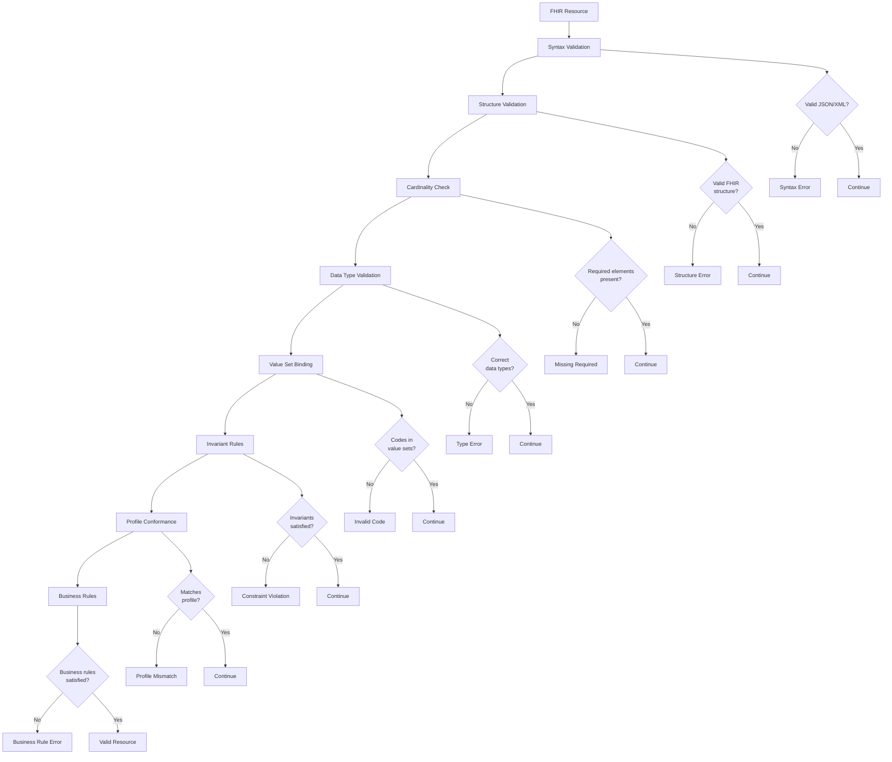

# FHIR Validation

## Why Validation Matters

FHIR validation ensures resources conform to specifications before they enter production systems. Without validation:

- **Data corruption**: Invalid resources cause downstream parsing errors
- **Interoperability failures**: Non-conformant resources rejected by other systems
- **Clinical safety issues**: Missing required fields (like MedicationRequest.status) create ambiguity
- **Compliance violations**: Profiles like US Core mandate specific fields for certification

Validation happens at multiple levels, forming a quality gate that catches errors before they propagate.

---

## The Validation Pipeline



### Stage 1: Syntax Validation

**What it checks**: Is this valid JSON or XML?

**Example failure**:

```json
{
  "resourceType": "Patient",
  "name": [{"family": "Shaw"}]
  // Missing closing brace
```

**Error**:

```json
{
  "resourceType": "OperationOutcome",
  "issue": [{
    "severity": "fatal",
    "code": "invalid",
    "diagnostics": "Syntax error: unexpected end of JSON input at line 4"
  }]
}
```

**HTTP Status**: 400 Bad Request

**When it happens**: Immediately upon receiving HTTP request body.

---

### Stage 2: Structure Validation

**What it checks**: Is this a valid FHIR resource with correct structure?

**Rules**:

- `resourceType` field present and recognized (Patient, Observation, etc.)
- Field names match FHIR spec (no typos like `patientId` instead of `patient`)
- No extra fields not defined in FHIR (unless extensions)

**Example failure**:

```json
{
  "resourceType": "Patient",
  "patientIdentifier": "123",  // Wrong field name
  "name": [{"family": "Shaw"}]
}
```

**Error**:

```json
{
  "resourceType": "OperationOutcome",
  "issue": [{
    "severity": "error",
    "code": "structure",
    "diagnostics": "Unknown element 'patientIdentifier'. Did you mean 'identifier'?",
    "location": ["Patient.patientIdentifier"]
  }]
}
```

**HTTP Status**: 422 Unprocessable Entity

---

### Stage 3: Cardinality Check

**What it checks**: Required fields present, arrays within bounds

**Rules**:

- Required fields (1..1 or 1..*) must exist
- Single-value fields (0..1 or 1..1) cannot be arrays
- At least one value for 1..* fields

**Example failure**:

```json
{
  "resourceType": "Observation",
  "code": {
    "coding": [{
      "system": "http://loinc.org",
      "code": "2345-7"
    }]
  },
  "subject": {"reference": "Patient/123"}
  // Missing required field: status (1..1)
}
```

**Error**:

```json
{
  "resourceType": "OperationOutcome",
  "issue": [{
    "severity": "error",
    "code": "required",
    "diagnostics": "Observation.status: minimum cardinality is 1, but only found 0",
    "location": ["Observation"],
    "expression": ["Observation.status"]
  }]
}
```

**Example failure (wrong cardinality)**:

```json
{
  "resourceType": "Patient",
  "birthDate": ["1987-02-20", "1990-05-15"]  // birthDate is 0..1 (single value)
}
```

**Error**:

```json
{
  "resourceType": "OperationOutcome",
  "issue": [{
    "severity": "error",
    "code": "structure",
    "diagnostics": "Patient.birthDate: maximum cardinality is 1, but found 2",
    "location": ["Patient.birthDate"]
  }]
}
```

---

### Stage 4: Data Type Validation

**What it checks**: Fields use correct data types

**Rules**:

- `string` fields contain valid Unicode strings
- `date` fields follow YYYY, YYYY-MM, or YYYY-MM-DD format
- `dateTime` follows ISO 8601 with optional timezone
- `boolean` is true/false (not "true" string)
- `integer` is whole number within range
- `decimal` has reasonable precision
- Complex types (HumanName, Address, etc.) have correct sub-structure

**Example failures**:

```json
{
  "resourceType": "Patient",
  "birthDate": "1987-13-40",  // Invalid month and day
  "active": "true"  // Should be boolean, not string
}
```

**Errors**:

```json
{
  "resourceType": "OperationOutcome",
  "issue": [
    {
      "severity": "error",
      "code": "value",
      "diagnostics": "Patient.birthDate '1987-13-40' is not a valid date (month must be 01-12, day must be 01-31)",
      "location": ["Patient.birthDate"]
    },
    {
      "severity": "error",
      "code": "structure",
      "diagnostics": "Patient.active must be boolean, got string",
      "location": ["Patient.active"]
    }
  ]
}
```

---

### Stage 5: Value Set Binding

**What it checks**: Coded values come from specified value sets

**Binding strengths**:

- **Required**: MUST use code from this ValueSet (validation fails if not)
- **Extensible**: SHOULD use code from this ValueSet, but others allowed if needed
- **Preferred**: Nice to use, but not enforced
- **Example**: Just a suggestion

**Example (required binding)**:

```json
{
  "resourceType": "Observation",
  "status": "preliminary",
  "code": {
    "coding": [{
      "system": "http://loinc.org",
      "code": "2345-7"
    }]
  },
  "subject": {"reference": "Patient/123"},
  "valueQuantity": {
    "value": 95,
    "unit": "mg/dL",
    "system": "http://unitsofmeasure.org",
    "code": "mg/dL"  // Correct UCUM code
  }
}
```

**Valid** (status from ObservationStatus ValueSet).

**Example (invalid code)**:

```json
{
  "resourceType": "Observation",
  "status": "completed",  // Not a valid ObservationStatus code
  "code": {
    "coding": [{
      "system": "http://loinc.org",
      "code": "2345-7"
    }]
  },
  "subject": {"reference": "Patient/123"}
}
```

**Error**:

```json
{
  "resourceType": "OperationOutcome",
  "issue": [{
    "severity": "error",
    "code": "code-invalid",
    "diagnostics": "Observation.status: 'completed' is not in required ValueSet ObservationStatus (valid codes: registered, preliminary, final, amended, corrected, cancelled, entered-in-error, unknown)",
    "location": ["Observation.status"]
  }]
}
```

---

### Stage 6: Invariant Rules

**What it checks**: Cross-field constraints (FHIRPath expressions)

**Examples of invariants**:

**obs-7**: If Observation.code is from vital-signs, category must include vital-signs

```json
{
  "resourceType": "Observation",
  "status": "final",
  "category": [{
    "coding": [{
      "system": "http://terminology.hl7.org/CodeSystem/observation-category",
      "code": "laboratory"  // WRONG: should be vital-signs
    }]
  }],
  "code": {
    "coding": [{
      "system": "http://loinc.org",
      "code": "8480-6",  // Systolic BP (vital sign)
      "display": "Systolic blood pressure"
    }]
  },
  "subject": {"reference": "Patient/123"},
  "valueQuantity": {"value": 120, "unit": "mmHg"}
}
```

**Error**:

```json
{
  "resourceType": "OperationOutcome",
  "issue": [{
    "severity": "error",
    "code": "invariant",
    "diagnostics": "obs-7: If Observation.code is vital-signs, category must be vital-signs",
    "expression": ["Observation"],
    "location": ["Observation"]
  }]
}
```

**dom-3**: If resource has narrative text, text.status must be present

```json
{
  "resourceType": "Patient",
  "text": {
    // Missing status field
    "div": "<div xmlns=\"http://www.w3.org/1999/xhtml\"><p>Amy Shaw</p></div>"
  },
  "name": [{"family": "Shaw"}]
}
```

**Error**:

```json
{
  "resourceType": "OperationOutcome",
  "issue": [{
    "severity": "error",
    "code": "invariant",
    "diagnostics": "dom-3: If narrative is present, text.status must be provided",
    "expression": ["Patient.text"],
    "location": ["Patient.text"]
  }]
}
```

---

### Stage 7: Profile Conformance

**What it checks**: Resource conforms to declared profile(s)

**Example: US Core Patient Profile**

**Base FHIR Patient** allows:

- No identifier (0..*)
- No name (0..*)
- No gender (0..1)

**US Core Patient Profile** requires:

- At least one identifier (1..*)
- At least one name (1..*)
- Gender (1..1)
- Race extension (0..1 but MustSupport)
- Ethnicity extension (0..1 but MustSupport)

**Example (fails US Core validation)**:

```json
{
  "resourceType": "Patient",
  "meta": {
    "profile": ["http://hl7.org/fhir/us/core/StructureDefinition/us-core-patient"]
  },
  "name": [{"family": "Shaw"}]
  // Missing: identifier (required by US Core)
  // Missing: gender (required by US Core)
}
```

**Errors**:

```json
{
  "resourceType": "OperationOutcome",
  "issue": [
    {
      "severity": "error",
      "code": "required",
      "diagnostics": "US Core Patient Profile: identifier is required (min cardinality 1)",
      "location": ["Patient.identifier"]
    },
    {
      "severity": "error",
      "code": "required",
      "diagnostics": "US Core Patient Profile: gender is required",
      "location": ["Patient.gender"]
    }
  ]
}
```

---

### Stage 8: Business Rules

**What it checks**: Organization-specific or clinical logic rules

**Examples**:

**Rule**: Cannot prescribe controlled substances without valid DEA number

```json
{
  "resourceType": "MedicationRequest",
  "status": "active",
  "intent": "order",
  "medicationCodeableConcept": {
    "coding": [{
      "system": "http://www.nlm.nih.gov/research/umls/rxnorm",
      "code": "1049502",
      "display": "Oxycodone 10 MG Oral Tablet"  // Schedule II controlled substance
    }]
  },
  "subject": {"reference": "Patient/123"},
  "requester": {"reference": "Practitioner/dr-smith"}
  // Dr. Smith's Practitioner resource has no DEA identifier
}
```

**Error**:

```json
{
  "resourceType": "OperationOutcome",
  "issue": [{
    "severity": "error",
    "code": "business-rule",
    "diagnostics": "Controlled substance prescription requires valid DEA number. Practitioner/dr-smith has no DEA identifier.",
    "location": ["MedicationRequest.requester"]
  }]
}
```

**Rule**: Pediatric patients (age < 18) must have guardian contact

```json
{
  "resourceType": "Patient",
  "name": [{"family": "Doe", "given": ["Jane"]}],
  "gender": "female",
  "birthDate": "2015-03-15"  // 9 years old
  // Missing: contact with relationship=guardian
}
```

**Warning** (not error, business preference):

```json
{
  "resourceType": "OperationOutcome",
  "issue": [{
    "severity": "warning",
    "code": "business-rule",
    "diagnostics": "Patient age indicates pediatric patient (9 years). Consider adding guardian contact information.",
    "location": ["Patient.contact"]
  }]
}
```

---

## The Validation Process Diagram

**Keep your existing Mermaid diagram** (`deepdive-fhir-validation.md`). It shows the flow:

```
Resource → Syntax Check → Structure Check → Cardinality → Data Type → 
Value Set → Invariant → Profile → Business Rules → Valid/Invalid
```

Each stage has decision points that either pass to next stage or return OperationOutcome.

---

## Server-Side vs. Client-Side Validation

### Server-Side Validation

**Always happens**: Servers MUST validate before persisting resources.

**Advantages**:

- Authoritative (definitive pass/fail)
- Up-to-date with latest profiles
- Consistent across all clients

**Disadvantages**:

- Requires network round-trip
- Increases server load
- Slower feedback

---

### Client-Side Validation

**Optional but recommended**: Catch errors before submitting to server.

**Advantages**:

- Instant feedback (no network latency)
- Better UX (highlight errors as user types)
- Reduces server load

**Disadvantages**:

- Must keep validation logic in sync with server
- Profiles may differ by server
- Not authoritative (server is final arbiter)

**Implementation**:

```javascript
import {Validator} from 'fhir-validator';

const validator = new Validator();

function validatePatient(patient) {
  const result = validator.validate(patient, {
    profile: 'http://hl7.org/fhir/us/core/StructureDefinition/us-core-patient'
  });
  
  if (!result.valid) {
    const errors = result.messages.filter(m => m.severity === 'error');
    const warnings = result.messages.filter(m => m.severity === 'warning');
    
    return {
      valid: false,
      errors: errors.map(e => ({
        field: e.location,
        message: e.message
      })),
      warnings: warnings.map(w => ({
        field: w.location,
        message: w.message
      }))
    };
  }
  
  return {valid: true};
}

// Usage
const patient = {
  resourceType: "Patient",
  name: [{family: "Shaw"}]
  // Missing identifier, gender (US Core requirements)
};

const validation = validatePatient(patient);
if (!validation.valid) {
  validation.errors.forEach(err => {
    showFieldError(err.field, err.message);
  });
}
```

---

## The $validate Operation

FHIR servers provide a `$validate` operation for explicit validation without creating resources.

**Endpoint**: `POST [base]/[type]/$validate`

**Example**: Validate a patient resource

```http
POST /Patient/$validate
Content-Type: application/fhir+json
```

**Body**:

```json
{
  "resourceType": "Parameters",
  "parameter": [
    {
      "name": "resource",
      "resource": {
        "resourceType": "Patient",
        "name": [{"family": "Shaw"}],
        "gender": "female",
        "birthDate": "1987-02-20"
      }
    },
    {
      "name": "profile",
      "valueUri": "http://hl7.org/fhir/us/core/StructureDefinition/us-core-patient"
    }
  ]
}
```

**Response** (422 Unprocessable Entity):

```json
{
  "resourceType": "OperationOutcome",
  "issue": [{
    "severity": "error",
    "code": "required",
    "diagnostics": "US Core Patient: identifier is required (minimum 1)",
    "location": ["Patient.identifier"]
  }]
}
```

**Use case**: Test resources before submitting for real

```javascript
async function testValidation(resource, profile) {
  const params = {
    resourceType: "Parameters",
    parameter: [
      {name: "resource", resource},
      {name: "profile", valueUri: profile}
    ]
  };
  
  const response = await fetch(`/${resource.resourceType}/$validate`, {
    method: 'POST',
    headers: {'Content-Type': 'application/fhir+json'},
    body: JSON.stringify(params)
  });
  
  const outcome = await response.json();
  
  if (outcome.issue.some(i => i.severity === 'error')) {
    console.log("Validation failed:");
    outcome.issue.forEach(issue => {
      console.log(`- ${issue.diagnostics}`);
    });
    return false;
  }
  
  console.log("Validation passed!");
  return true;
}

// Usage
const isValid = await testValidation(myPatient, 'http://hl7.org/fhir/us/core/StructureDefinition/us-core-patient');
if (isValid) {
  // Safe to submit
  await createPatient(myPatient);
}
```

---

## Common Validation Pitfalls

### Pitfall 1: Forgetting Required Fields

**Mistake**: Submitting minimal resources

```json
{
  "resourceType": "Observation",
  "code": {
    "coding": [{
      "system": "http://loinc.org",
      "code": "2345-7"
    }]
  }
  // Missing: status (required), subject (required in profiles)
}
```

**Fix**: Always include required base fields + profile requirements

```json
{
  "resourceType": "Observation",
  "status": "final",  // Required
  "code": {
    "coding": [{
      "system": "http://loinc.org",
      "code": "2345-7"
    }]
  },
  "subject": {"reference": "Patient/123"}  // Required by US Core
}
```

---

### Pitfall 2: Wrong Data Types

**Mistake**: Using string instead of number

```json
{
  "resourceType": "Observation",
  "status": "final",
  "code": {
    "coding": [{
      "system": "http://loinc.org",
      "code": "2345-7"
    }]
  },
  "subject": {"reference": "Patient/123"},
  "valueQuantity": {
    "value": "95",  // WRONG: should be number, not string
    "unit": "mg/dL"
  }
}
```

**Fix**: Use correct types

```json
"valueQuantity": {
  "value": 95,  // Number
  "unit": "mg/dL"
}
```

---

### Pitfall 3: Invalid Codes

**Mistake**: Making up codes

```json
{
  "resourceType": "Observation",
  "status": "final",
  "code": {
    "coding": [{
      "system": "http://loinc.org",
      "code": "GLUCOSE",  // Invalid LOINC code (should be numeric)
      "display": "Glucose"
    }]
  },
  "subject": {"reference": "Patient/123"}
}
```

**Fix**: Use valid codes from recognized systems

```json
"code": {
  "coding": [{
    "system": "http://loinc.org",
    "code": "2345-7",  // Valid LOINC code
    "display": "Glucose [Mass/volume] in Serum or Plasma"
  }]
}
```

---

### Pitfall 4: Ignoring Invariants

**Mistake**: Blood pressure observation without components

```json
{
  "resourceType": "Observation",
  "status": "final",
  "code": {
    "coding": [{
      "system": "http://loinc.org",
      "code": "85354-9",  // Blood pressure panel
      "display": "Blood pressure panel"
    }]
  },
  "subject": {"reference": "Patient/123"},
  "valueQuantity": {"value": 128, "unit": "mmHg"}  // WRONG: BP should use components
}
```

**Fix**: Use components for multi-part observations

```json
{
  "resourceType": "Observation",
  "status": "final",
  "code": {
    "coding": [{
      "system": "http://loinc.org",
      "code": "85354-9"
    }]
  },
  "subject": {"reference": "Patient/123"},
  "component": [
    {
      "code": {
        "coding": [{
          "system": "http://loinc.org",
          "code": "8480-6",
          "display": "Systolic"
        }]
      },
      "valueQuantity": {"value": 128, "unit": "mmHg"}
    },
    {
      "code": {
        "coding": [{
          "system": "http://loinc.org",
          "code": "8462-4",
          "display": "Diastolic"
        }]
      },
      "valueQuantity": {"value": 82, "unit": "mmHg"}
    }
  ]
}
```

---

## Validation Tools

### HAPI FHIR Validator (Java/JavaScript)

**Java**:

```java
FhirContext ctx = FhirContext.forR4();
FhirValidator validator = ctx.newValidator();

IValidatorModule module = new FhirInstanceValidator(ctx);
validator.registerValidatorModule(module);

ValidationResult result = validator.validateWithResult(patient);

if (!result.isSuccessful()) {
    for (SingleValidationMessage msg : result.getMessages()) {
        System.out.println(msg.getSeverity() + ": " + msg.getMessage());
    }
}
```

**JavaScript/Node.js**:

```javascript
const {FhirValidator} = require('fhir-validator');

const validator = new FhirValidator();
const result = validator.validate(patient, 'Patient');

if (!result.valid) {
  result.messages.forEach(msg => {
    console.log(`${msg.severity}: ${msg.message} at ${msg.location}`);
  });
}
```

---

### Online Validators

- **FHIR Validator** (official): https://validator.fhir.org
- **Simplifier**: https://simplifier.net/validate
- **Inferno**: https://inferno.healthit.gov (US Core validation)

**Use case**: Quick validation during development

---

## Next Steps

This completes **Section 4 - Working with FHIR APIs**. We covered:

- ✅ REST operations (READ, CREATE, UPDATE, DELETE, SEARCH)
- ✅ Search parameters and modifiers
- ✅ Error handling with OperationOutcome
- ✅ Validation pipeline and best practices

Next, we'll explore advanced FHIR concepts like profiles and extensions.

→ [Advanced FHIR Concepts](../eh-dd-05-advanced-fhir-concepts/index.md)
