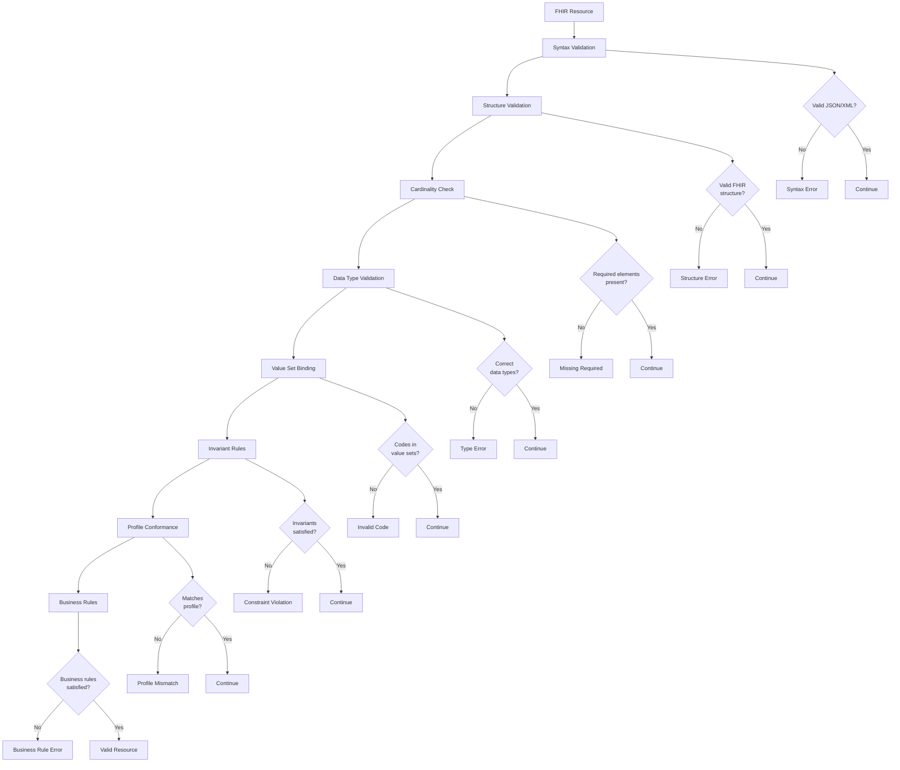

# FHIR Validation

## FHIR Validation Process (diagram)

```mermaid
graph TD
    Resource[FHIR Resource]
    
    Resource --> Syntax[Syntax Validation]
    Syntax --> Structure[Structure Validation]
    Structure --> Cardinality[Cardinality Check]
    Cardinality --> DataType[Data Type Validation]
    DataType --> ValueSet[Value Set Binding]
    ValueSet --> Invariant[Invariant Rules]
    Invariant --> Profile[Profile Conformance]
    Profile --> Business[Business Rules]
    
    Syntax --> SyntaxCheck{Valid JSON/XML?}
    SyntaxCheck -->|No| SyntaxError[Syntax Error]
    SyntaxCheck -->|Yes| Continue1[Continue]
    
    Structure --> StructCheck{Valid FHIR<br/>structure?}
    StructCheck -->|No| StructError[Structure Error]
    StructCheck -->|Yes| Continue2[Continue]
    
    Cardinality --> CardCheck{Required elements<br/>present?}
    CardCheck -->|No| CardError[Missing Required]
    CardCheck -->|Yes| Continue3[Continue]
    
    DataType --> TypeCheck{Correct<br/>data types?}
    TypeCheck -->|No| TypeError[Type Error]
    TypeCheck -->|Yes| Continue4[Continue]
    
    ValueSet --> VSCheck{Codes in<br/>value sets?}
    VSCheck -->|No| VSError[Invalid Code]
    VSCheck -->|Yes| Continue5[Continue]
    
    Invariant --> InvCheck{Invariants<br/>satisfied?}
    InvCheck -->|No| InvError[Constraint Violation]
    InvCheck -->|Yes| Continue6[Continue]
    
    Profile --> ProfCheck{Matches<br/>profile?}
    ProfCheck -->|No| ProfError[Profile Mismatch]
    ProfCheck -->|Yes| Continue7[Continue]
    
    Business --> BizCheck{Business rules<br/>satisfied?}
    BizCheck -->|No| BizError[Business Rule Error]
    BizCheck -->|Yes| Valid[Valid Resource]
```

