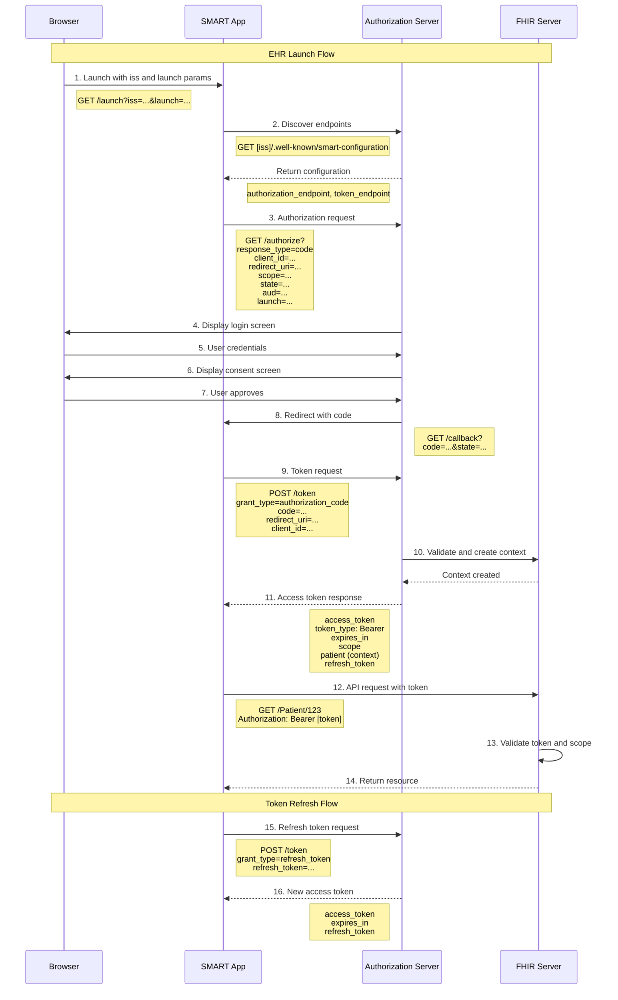

# OAuth 2.0 Flow 

## OAuth 2.0 Flow Details (diagram)

```mermaid
sequenceDiagram
    participant Browser
    participant App as SMART App
    participant Auth as Authorization Server
    participant FHIR as FHIR Server

    Note over Browser,FHIR: EHR Launch Flow
    
    Browser->>App: 1. Launch with iss and launch params
    Note right of Browser: GET /launch?iss=...&launch=...
    
    App->>Auth: 2. Discover endpoints
    Note right of App: GET [iss]/.well-known/smart-configuration
    Auth-->>App: Return configuration
    Note left of Auth: authorization_endpoint, token_endpoint
    
    App->>Auth: 3. Authorization request
    Note right of App: GET /authorize?<br/>response_type=code<br/>client_id=...<br/>redirect_uri=...<br/>scope=...<br/>state=...<br/>aud=...<br/>launch=...
    
    Auth->>Browser: 4. Display login screen
    Browser->>Auth: 5. User credentials
    
    Auth->>Browser: 6. Display consent screen
    Browser->>Auth: 7. User approves
    
    Auth->>App: 8. Redirect with code
    Note right of Auth: GET /callback?<br/>code=...&state=...
    
    App->>Auth: 9. Token request
    Note right of App: POST /token<br/>grant_type=authorization_code<br/>code=...<br/>redirect_uri=...<br/>client_id=...
    
    Auth->>FHIR: 10. Validate and create context
    FHIR-->>Auth: Context created
    
    Auth-->>App: 11. Access token response
    Note left of Auth: access_token<br/>token_type: Bearer<br/>expires_in<br/>scope<br/>patient (context)<br/>refresh_token
    
    App->>FHIR: 12. API request with token
    Note right of App: GET /Patient/123<br/>Authorization: Bearer [token]
    
    FHIR->>FHIR: 13. Validate token and scope
    FHIR-->>App: 14. Return resource
    
    Note over Browser,FHIR: Token Refresh Flow
    
    App->>Auth: 15. Refresh token request
    Note right of App: POST /token<br/>grant_type=refresh_token<br/>refresh_token=...
    
    Auth-->>App: 16. New access token
    Note left of Auth: access_token<br/>expires_in<br/>refresh_token
```