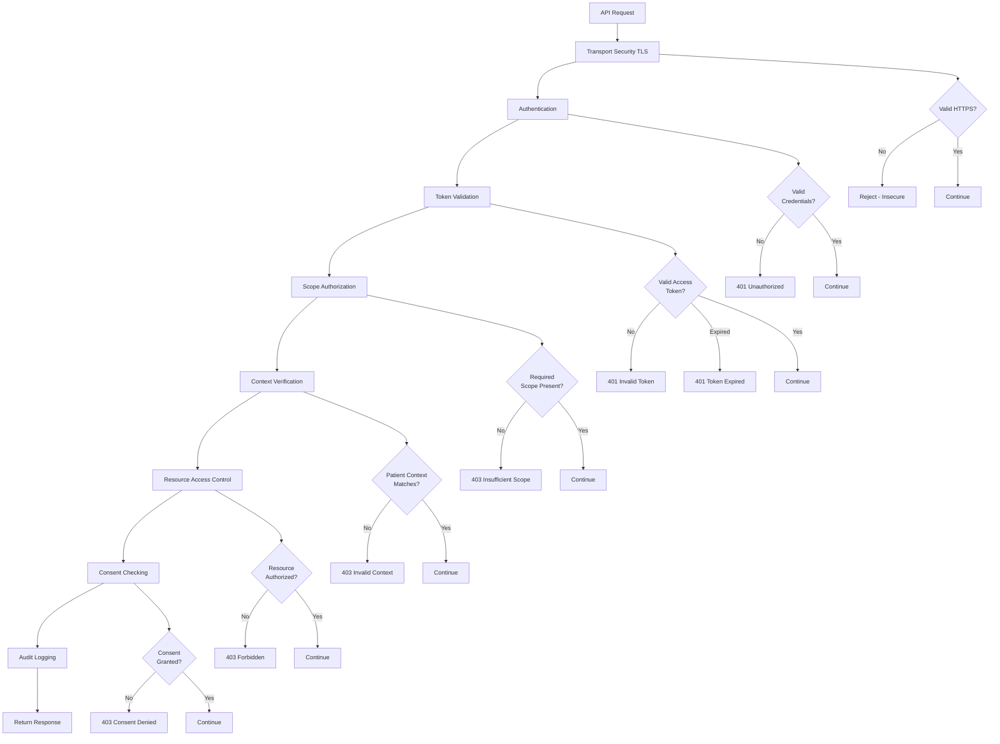

# Security and Access Control

## SMART Security Layers (diagram)

```mermaid
graph TD
    Request[API Request]
    
    Request --> TLS[Transport Security TLS]
    TLS --> Auth[Authentication]
    Auth --> Token[Token Validation]
    Token --> Scope[Scope Authorization]
    Scope --> Context[Context Verification]
    Context --> Resource[Resource Access Control]
    Resource --> Consent[Consent Checking]
    Consent --> Audit[Audit Logging]
    Audit --> Response[Return Response]
    
    TLS --> TLSCheck{Valid HTTPS?}
    TLSCheck -->|No| Reject1[Reject - Insecure]
    TLSCheck -->|Yes| AuthCont[Continue]
    
    Auth --> AuthCheck{Valid<br/>Credentials?}
    AuthCheck -->|No| Reject2[401 Unauthorized]
    AuthCheck -->|Yes| TokenCont[Continue]
    
    Token --> TokenCheck{Valid Access<br/>Token?}
    TokenCheck -->|No| Reject3[401 Invalid Token]
    TokenCheck -->|Expired| Reject4[401 Token Expired]
    TokenCheck -->|Yes| ScopeCont[Continue]
    
    Scope --> ScopeCheck{Required<br/>Scope Present?}
    ScopeCheck -->|No| Reject5[403 Insufficient Scope]
    ScopeCheck -->|Yes| ContextCont[Continue]
    
    Context --> ContextCheck{Patient Context<br/>Matches?}
    ContextCheck -->|No| Reject6[403 Invalid Context]
    ContextCheck -->|Yes| ResourceCont[Continue]
    
    Resource --> ResourceCheck{Resource<br/>Authorized?}
    ResourceCheck -->|No| Reject7[403 Forbidden]
    ResourceCheck -->|Yes| ConsentCont[Continue]
    
    Consent --> ConsentCheck{Consent<br/>Granted?}
    ConsentCheck -->|No| Reject8[403 Consent Denied]
    ConsentCheck -->|Yes| AuditCont[Continue]
```

