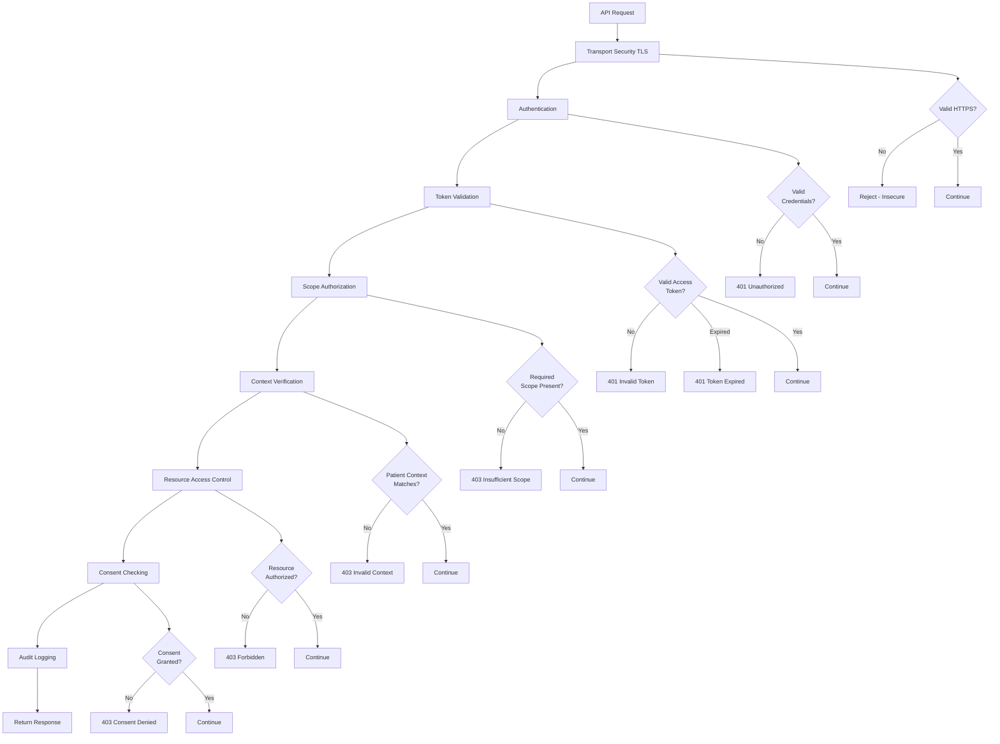

# Security and Access Control

## Defense in Depth: Multiple Layers of Protection

Healthcare data is the most sensitive personal information. SMART-on-FHIR implements **defense in depth**—multiple independent security layers that protect data even if one layer fails.

Think of it like securing a bank vault:
- 🔒 Outer door (TLS encryption)
- 🔑 Authentication (proving who you are)
- 🎫 Authorization tokens (permission tickets)
- 🚧 Scope checking (what you can do)
- 🏥 Resource access control (additional restrictions)
- 📝 Audit logging (recording all access)

Each layer adds protection. An attacker must defeat ALL layers to access data.

---

## The Security Layers 

Let's dive right into the deep end by taking a look at the complete security flow:



Let's examine each layer:

### Layer 1: Transport Security (TLS)

**What it does**: Encrypts all data in transit.

**Requirement**: All FHIR servers MUST use HTTPS (TLS 1.2 or higher).

**Protection**:
- Prevents eavesdropping on network traffic
- Ensures data integrity (can't be modified in transit)
- Authenticates server identity (prevents impersonation)

**Failure mode**: Without TLS, attacker could intercept tokens and patient data.

**Check**: Is URL `https://`?

```javascript
if (!fhirUrl.startsWith('https://')) {
  throw new Error('FHIR server must use HTTPS');
}
```

---

### Layer 2: User Authentication

**What it does**: Verifies user identity before granting access.

**Methods**:
- Username/password
- Multi-factor authentication (MFA)
- Smart cards, biometrics
- Single sign-on (SSO) via SAML, OpenID Connect

**Protection**: Ensures only authorized users can initiate sessions.

**Failure mode**: Without authentication, anyone could access the system.

**Response codes**:
- `401 Unauthorized`: No credentials provided or invalid credentials

---

### Layer 3: Token Validation

**What it does**: Validates OAuth access token on every API request.

**Checks**:

1. **Token exists**: Authorization header present
2. **Signature valid**: JWT signature verifiable using server's public key
3. **Not expired**: Current time < token `exp` claim
4. **Correct audience**: Token `aud` claim matches FHIR server URL
5. **Not revoked**: Token not in revocation list

**Protection**: Stolen or forged tokens are rejected.

**Failure modes**:
- `401 Unauthorized`: Missing, invalid, or expired token
- `401 Token Expired`: Token expired (client should refresh)

**Example validation** (server-side):

```python
import jwt
from datetime import datetime

def validate_token(token, public_key, audience):
    try:
        # Decode and verify JWT
        payload = jwt.decode(
            token,
            public_key,
            algorithms=['RS256'],
            audience=audience
        )
        
        # Check expiration
        exp = payload.get('exp')
        if exp and datetime.utcnow().timestamp() > exp:
            raise Exception('Token expired')
        
        return payload
    except jwt.InvalidTokenError as e:
        raise Exception(f'Invalid token: {e}')
```

---

### Layer 4: Scope Authorization

**What it does**: Verifies token has required scope for operation.

**Logic**:

```python
def check_scope(token_scopes, required_scope):
    scopes = token_scopes.split(' ')
    
    # Exact match
    if required_scope in scopes:
        return True
    
    # Wildcard match (patient/*.read includes patient/Observation.read)
    context, resource_action = required_scope.split('/')
    resource, action = resource_action.split('.')
    
    if f"{context}/*.{action}" in scopes:
        return True
    if f"{context}/*.*" in scopes:
        return True
    
    # .write implies .read
    if action == 'read':
        write_scope = required_scope.replace('.read', '.write')
        if write_scope in scopes:
            return True
    
    return False
```

**Protection**: Prevents apps from accessing data beyond granted permissions.

**Failure mode**:
- `403 Forbidden`: Insufficient scope

**Example**:

```
Token scope: "patient/Observation.read"
Request: GET /MedicationRequest/123
Result: 403 Forbidden (need patient/MedicationRequest.read)
```

---

### Layer 5: Context Verification

**What it does**: Ensures requested resource matches token's patient context.

**Check**:

```python
def verify_patient_context(token_patient_id, requested_patient_id):
    if token_patient_id != requested_patient_id:
        raise ForbiddenError('Patient context mismatch')
```

**Protection**: Prevents apps from accessing wrong patient's data.

**Example**:

```
Token patient: "smart-1288992"
Request: GET /Observation?patient=smart-1032702
Result: 403 Forbidden (token scoped to different patient)
```

**Special case: `user/` scopes**: Context check uses EHR's access control list instead of token patient claim.

---

### Layer 6: Resource Access Control

**What it does**: Applies EHR's existing access control policies.

**Checks**:
- Does user have permission in EHR to view this patient?
- Is data flagged as sensitive (e.g., mental health, HIV status)?
- Are there break-the-glass requirements?
- Do organizational policies restrict access?

**Protection**: OAuth tokens don't bypass EHR security—they layer on top.

**Failure mode**:
- `403 Forbidden`: Resource not allowed for user

**Example**:

```
User: Dr. Smith (cardiologist)
Request: GET /Observation/psych-eval-123 (mental health observation)
Result: 403 Forbidden (not Dr. Smith's department)
```

---

### Layer 7: Consent Checking

**What it does**: Respects patient consent directives.

**Scenarios**:
- Patient opted out of data sharing with research apps
- Patient restricted access to specific encounters
- Patient granted access only to certain resource types
- Minor patient's guardian consent required

**Protection**: Enforces patient privacy preferences.

**Failure mode**:
- `403 Forbidden`: Consent denied

**Example**:

```
Patient opt-out: No sharing with third-party apps
Request: Third-party app tries to access data
Result: 403 Forbidden (consent not granted)
```

---

### Layer 8: Audit Logging

**What it does**: Records all access for accountability.

**Logged information**:
- Who accessed (user ID, app ID)
- What was accessed (resource type, ID)
- When (timestamp)
- From where (IP address)
- Result (success/failure)
- Purpose of use (if provided)

**Protection**: Detects unauthorized access after the fact. Enables investigation.

**Example log entry**:

```json
{
  "timestamp": "2024-11-06T15:30:00Z",
  "user": "Practitioner/dr-johnson",
  "app": "cardiac-risk-calculator",
  "action": "read",
  "resource": "Patient/smart-1288992",
  "result": "success",
  "ip": "192.168.1.100",
  "scopes": ["patient/Patient.read", "patient/Observation.read"]
}
```

**Compliance**: Required by HIPAA, GDPR, and other regulations.

---

## Common Attack Vectors and Mitigations

### Attack: Token Theft

**Scenario**: Attacker intercepts access token (e.g., from browser localStorage via XSS).

**Mitigations**:
1. **Short token lifetime** (1 hour typical) - Limits damage window
2. **Refresh tokens** - Stored more securely than access tokens
3. **Token rotation** - New tokens on each refresh
4. **Revocation** - Ability to invalidate compromised tokens

---

### Attack: CSRF (Cross-Site Request Forgery)

**Scenario**: Malicious site tricks user into authorizing attacker's app session.

**Mitigation**: `state` parameter

```javascript
// App generates random state
const state = generateRandomString();
sessionStorage.setItem('oauth_state', state);

// Include in authorization request
window.location.href = `${authEndpoint}?...&state=${state}`;

// Validate on callback
const returnedState = new URLSearchParams(window.location.search).get('state');
if (returnedState !== sessionStorage.getItem('oauth_state')) {
  throw new Error('CSRF detected');
}
```

---

### Attack: Authorization Code Interception

**Scenario**: Attacker intercepts authorization code from redirect URI.

**Mitigation**: PKCE (Proof Key for Code Exchange)

```javascript
// Generate verifier
const verifier = generateRandomString(128);
sessionStorage.setItem('code_verifier', verifier);

// Generate challenge
const challenge = base64url(sha256(verifier));

// Include in authorization request
const authUrl = `${authEndpoint}?...&code_challenge=${challenge}&code_challenge_method=S256`;

// Send verifier in token request
const tokenResponse = await fetch(tokenEndpoint, {
  method: 'POST',
  body: new URLSearchParams({
    grant_type: 'authorization_code',
    code: authCode,
    code_verifier: verifier
  })
});
```

---

### Attack: Phishing

**Scenario**: Fake authorization server tricks user into entering credentials.

**Mitigations**:
1. **User education**: Verify authorization server URL
2. **Branded consent screens**: Recognizable design
3. **Domain validation**: Check authorization endpoint domain
4. **Certificate pinning** (mobile apps): Validate server certificate

---

### Attack: Scope Creep

**Scenario**: App requests excessive permissions, hoping user won't notice.

**Mitigations**:
1. **Explicit consent**: Show requested scopes in plain language
2. **Granular approval**: Let users approve subset of scopes
3. **Audit requests**: Log scope requests for review
4. **Principle of least privilege**: Apps should request minimum needed

---

## Security Best Practices for Apps

### 1. Never Store Tokens in LocalStorage

**Vulnerable to XSS attacks**:

```javascript
// BAD
localStorage.setItem('access_token', token);

// GOOD (access tokens)
// Store in memory only
let accessToken = tokenResponse.access_token;

// GOOD (refresh tokens - server-side app)
// Store in httpOnly cookie
res.cookie('refresh_token', refreshToken, {
  httpOnly: true,
  secure: true,
  sameSite: 'strict'
});
```

---

### 2. Implement Token Refresh Before Expiration

```javascript
class TokenManager {
  constructor() {
    this.accessToken = null;
    this.expiresAt = null;
    this.refreshToken = null;
  }
  
  setTokens(tokenResponse) {
    this.accessToken = tokenResponse.access_token;
    this.refreshToken = tokenResponse.refresh_token;
    this.expiresAt = Date.now() + (tokenResponse.expires_in * 1000);
    
    // Schedule refresh 5 minutes before expiration
    this.scheduleRefresh();
  }
  
  scheduleRefresh() {
    const refreshAt = this.expiresAt - (5 * 60 * 1000); // 5 min before
    const delay = refreshAt - Date.now();
    
    if (delay > 0) {
      setTimeout(() => this.refresh(), delay);
    }
  }
  
  async refresh() {
    const response = await fetch(tokenEndpoint, {
      method: 'POST',
      body: new URLSearchParams({
        grant_type: 'refresh_token',
        refresh_token: this.refreshToken
      })
    });
    
    const tokenResponse = await response.json();
    this.setTokens(tokenResponse);
  }
  
  async getValidToken() {
    if (Date.now() >= this.expiresAt) {
      await this.refresh();
    }
    return this.accessToken;
  }
}
```

---

### 3. Validate All Server Responses

```javascript
async function secureFetch(url, options = {}) {
  const token = await tokenManager.getValidToken();
  
  const response = await fetch(url, {
    ...options,
    headers: {
      ...options.headers,
      'Authorization': `Bearer ${token}`
    }
  });
  
  if (response.status === 401) {
    // Token invalid/expired
    await handleReauthorization();
    return; // Redirect to login
  }
  
  if (response.status === 403) {
    const outcome = await response.json();
    console.error('Access denied:', outcome);
    showError('You don't have permission to access this resource');
    return;
  }
  
  if (!response.ok) {
    const outcome = await response.json();
    throw new Error(outcome.issue[0].diagnostics);
  }
  
  return response.json();
}
```

---

### 4. Use PKCE for Public Clients

**Always use PKCE** for mobile apps and single-page apps:

```javascript
// Required for public clients
const usePKCE = true;

if (usePKCE) {
  const verifier = generateCodeVerifier();
  const challenge = await generateCodeChallenge(verifier);
  
  sessionStorage.setItem('pkce_verifier', verifier);
  
  authUrl += `&code_challenge=${challenge}&code_challenge_method=S256`;
}
```

---

### 5. Clear Tokens on Logout

```javascript
function logout() {
  // Clear tokens
  tokenManager.accessToken = null;
  tokenManager.refreshToken = null;
  
  // Clear session storage
  sessionStorage.clear();
  
  // Revoke tokens on server (if revocation endpoint available)
  if (config.revocation_endpoint) {
    fetch(config.revocation_endpoint, {
      method: 'POST',
      body: new URLSearchParams({
        token: tokenManager.refreshToken,
        token_type_hint: 'refresh_token'
      })
    });
  }
  
  // Redirect to logout page
  window.location.href = '/logout';
}
```

---

## Security Checklist

**Before deploying your SMART app**:

- [ ] All requests use HTTPS (never HTTP)
- [ ] Access tokens stored in memory only
- [ ] Refresh tokens stored securely (httpOnly cookies or encrypted storage)
- [ ] PKCE implemented for public clients
- [ ] State parameter used for CSRF protection
- [ ] Token expiration handled gracefully
- [ ] 401/403 errors trigger appropriate user messaging
- [ ] Tokens revoked on logout
- [ ] Audit logging implemented (if applicable)
- [ ] Security review completed
- [ ] Penetration testing performed (for production apps)

---

## Summary

SMART-on-FHIR security is **defense in depth**. Your diagram shows all layers work together:

1. TLS encrypts transit
2. Authentication proves identity
3. Tokens provide delegated access
4. Scopes limit permissions
5. Context ensures correct patient
6. ACLs enforce organizational policies
7. Consent respects patient wishes
8. Audit logs track all access

**No single layer is perfect**, but together they provide robust protection for healthcare data.

---

## Next Steps

This completes the SMART Authorization section. We covered:

- ✅ OAuth 2.0 authorization flow
- ✅ EHR and standalone launch patterns
- ✅ SMART scopes and permissions
- ✅ Configuration discovery
- ✅ Multi-layer security architecture

Next, let's put this into practice with hands-on examples.


