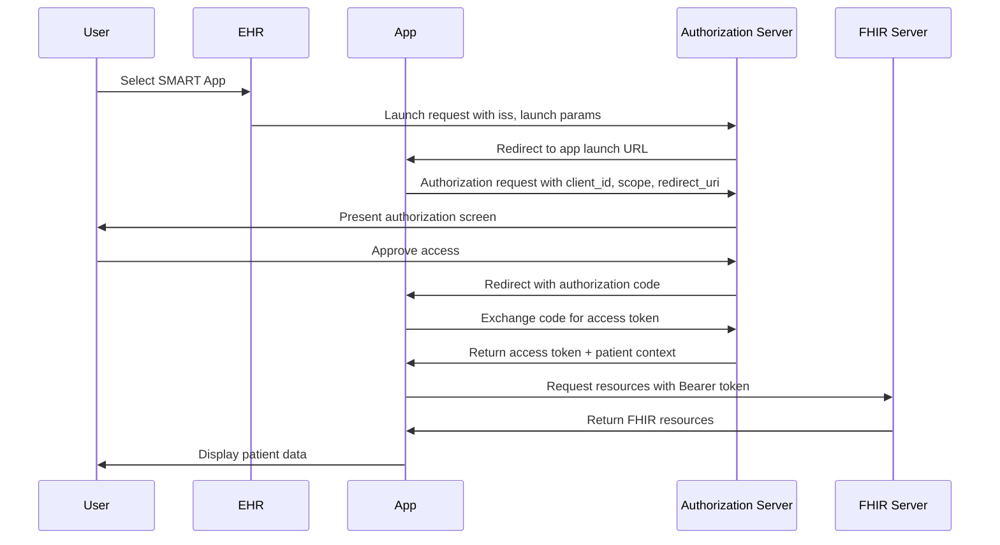

# SMART Launch Flow

SMART Launch Sequence Diagram

```mermaid
sequenceDiagram
    participant User
    participant EHR
    participant App
    participant Auth as Authorization Server
    participant FHIR as FHIR Server

    User->>EHR: Select SMART App
    EHR->>Auth: Launch request with iss, launch params
    Auth->>App: Redirect to app launch URL
    App->>Auth: Authorization request with client_id, scope, redirect_uri
    Auth->>User: Present authorization screen
    User->>Auth: Approve access
    Auth->>App: Redirect with authorization code
    App->>Auth: Exchange code for access token
    Auth->>App: Return access token + patient context
    App->>FHIR: Request resources with Bearer token
    FHIR->>App: Return FHIR resources
    App->>User: Display patient data
```
