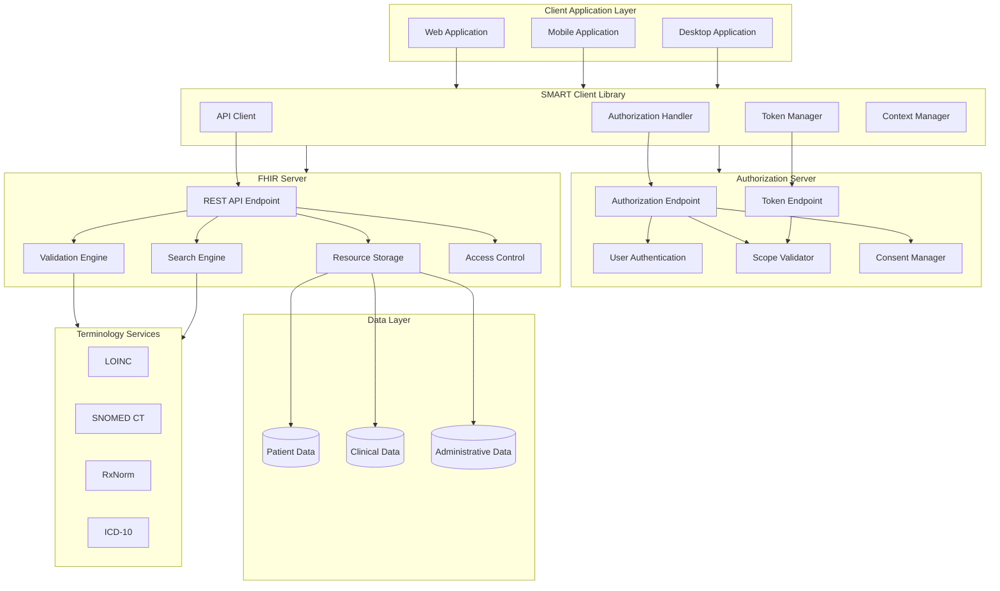

# Summary 

## SMART-on-FHIR Complete Architecture (diagram)

```mermaid
graph TB
    subgraph Client["Client Application Layer"]
        WebApp[Web Application]
        MobileApp[Mobile Application]
        NativeApp[Desktop Application]
    end
    
    subgraph SMARTLib["SMART Client Library"]
        AuthHandler[Authorization Handler]
        TokenMgr[Token Manager]
        APIClient[API Client]
        ContextMgr[Context Manager]
    end
    
    subgraph AuthServer["Authorization Server"]
        AuthEndpoint[Authorization Endpoint]
        TokenEndpoint[Token Endpoint]
        UserAuth[User Authentication]
        ScopeValidator[Scope Validator]
        ConsentMgr[Consent Manager]
    end
    
    subgraph FHIRServer["FHIR Server"]
        RESTEndpoint[REST API Endpoint]
        ResourceStore[Resource Storage]
        SearchEngine[Search Engine]
        ValidationEngine[Validation Engine]
        AccessControl[Access Control]
    end
    
    subgraph DataLayer["Data Layer"]
        PatientData[(Patient Data)]
        ClinicalData[(Clinical Data)]
        AdminData[(Administrative Data)]
    end
    
    subgraph Terminology["Terminology Services"]
        LOINC[LOINC]
        SNOMED[SNOMED CT]
        RxNorm[RxNorm]
        ICD10[ICD-10]
    end
    
    WebApp --> SMARTLib
    MobileApp --> SMARTLib
    NativeApp --> SMARTLib
    
    SMARTLib --> AuthServer
    SMARTLib --> FHIRServer
    
    AuthHandler --> AuthEndpoint
    TokenMgr --> TokenEndpoint
    APIClient --> RESTEndpoint
    
    AuthEndpoint --> UserAuth
    AuthEndpoint --> ScopeValidator
    AuthEndpoint --> ConsentMgr
    
    TokenEndpoint --> ScopeValidator
    
    RESTEndpoint --> SearchEngine
    RESTEndpoint --> ValidationEngine
    RESTEndpoint --> AccessControl
    RESTEndpoint --> ResourceStore
    
    ResourceStore --> PatientData
    ResourceStore --> ClinicalData
    ResourceStore --> AdminData
    
    ValidationEngine --> Terminology
    SearchEngine --> Terminology
```