# SMART-on-FHIR and Integration — Visuals

## SMART-on-FHIR EHR Launch Flow

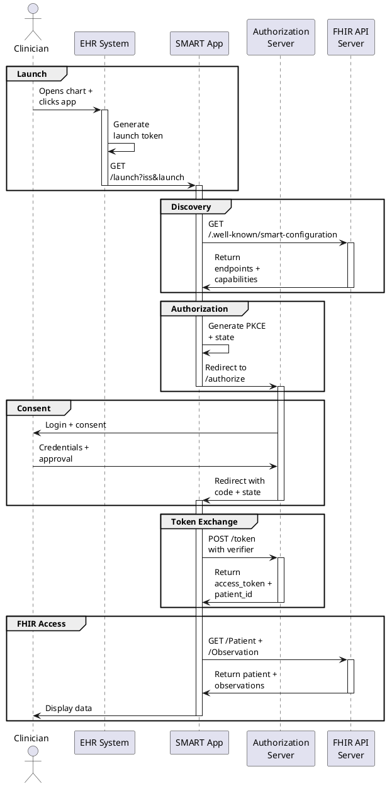

## SMART-on-FHIR Standalone Launch Flow

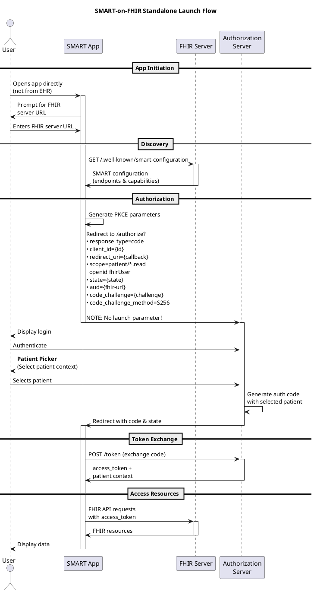

## SMART-on-FHIR Token Refresh Flow

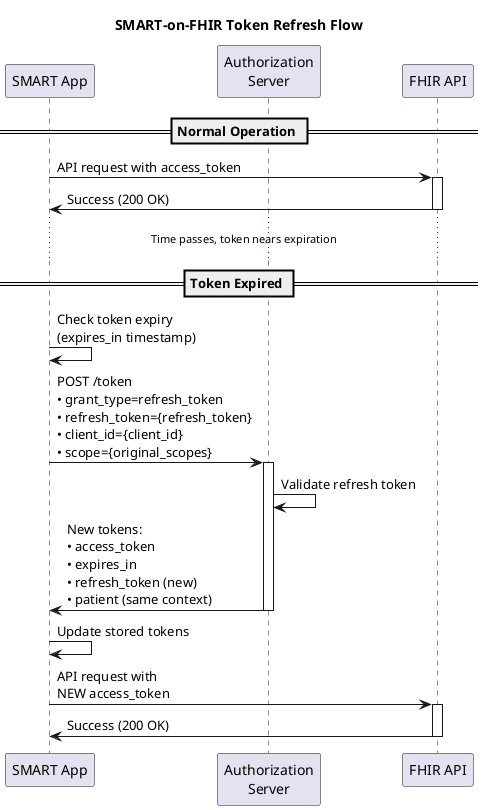

## PKCE Flow

The following diagram shows the PKCE (Proof Key for Code Exchange) flow.

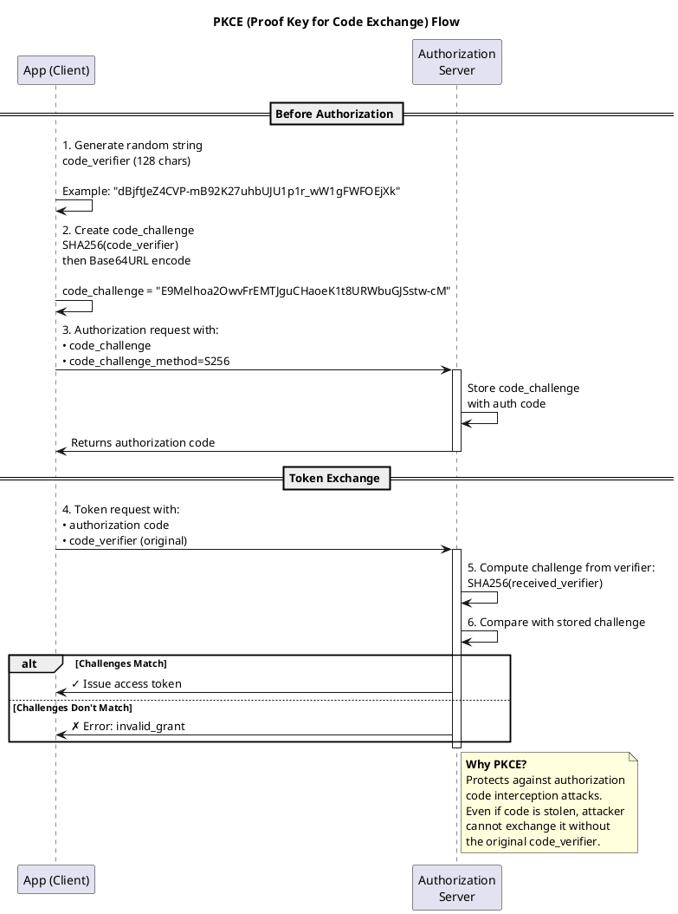

## SMART Scope Hierarchy and Contexts

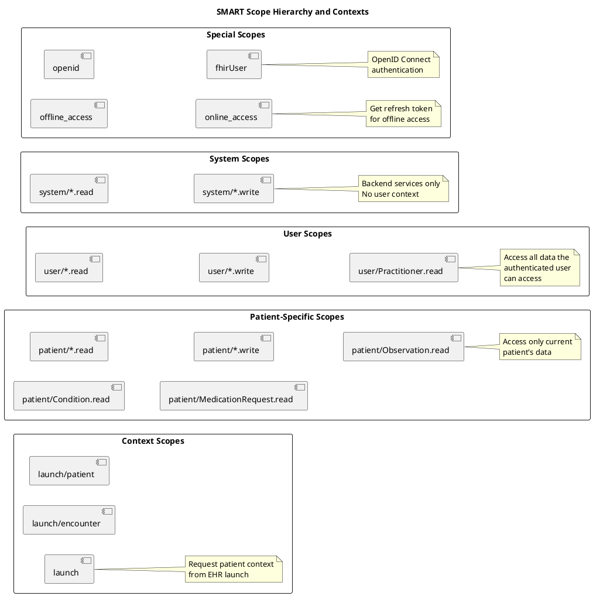

## SMART-on-FHIR Error Handling Patterns

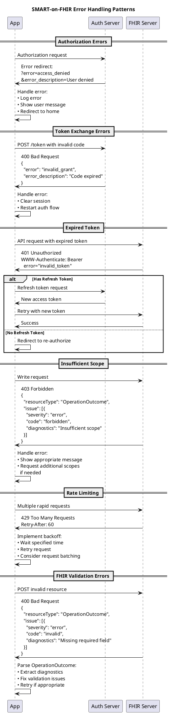

## SMART-on-FHIR Architecture

### 1. SMART-on-FHIR Architecture, System Context

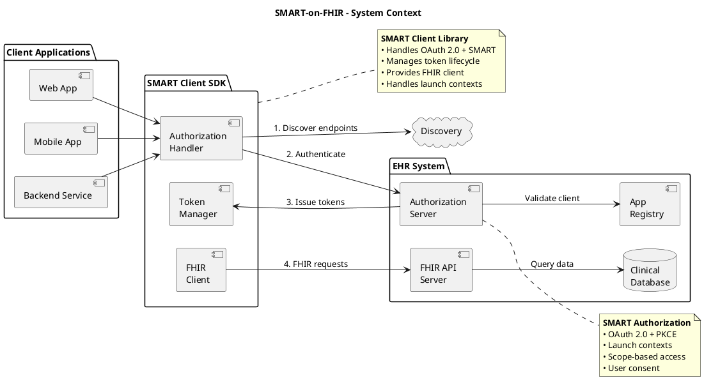

### 2. SMART-on-FHIR Architecture, Authorization Server Components

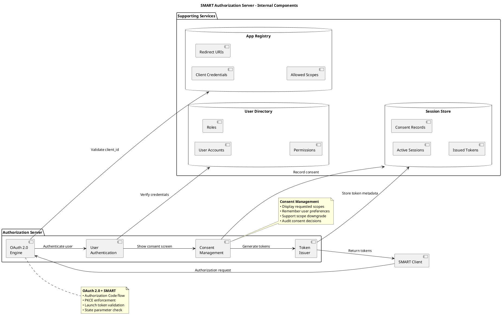

### 3. SMART-on-FHIR Architecture, FHIR API Server Components

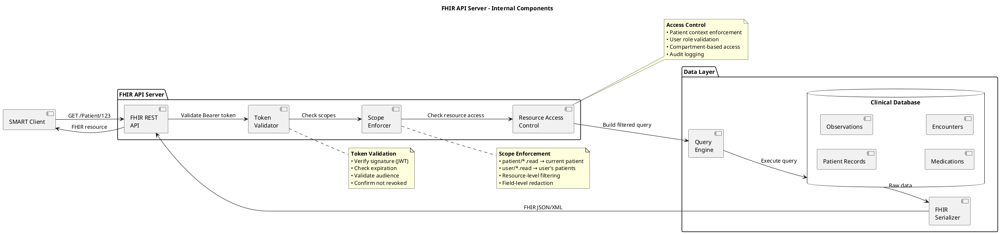

### 4. SMART-on-FHIR Architecture, Smart API Request Flow
 
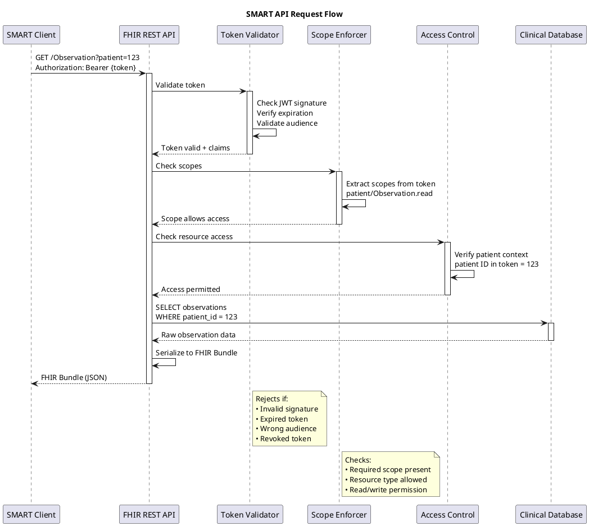

### 5. SMART-on-FHIR Architecture, SMART Discovery Process

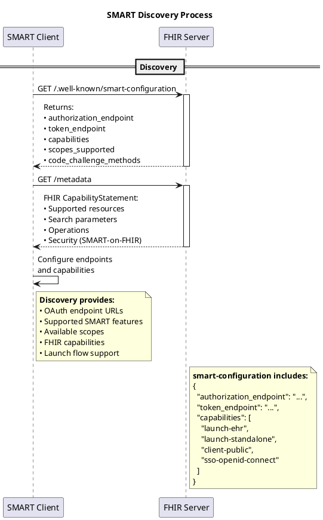

---

## HALO SMART Integration Architecture

### 1. HALO SMART Integration, High-Level Architecture (Context)

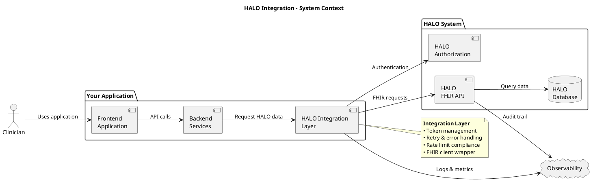

### 2. HALO SMART Integration, Authentication Flow

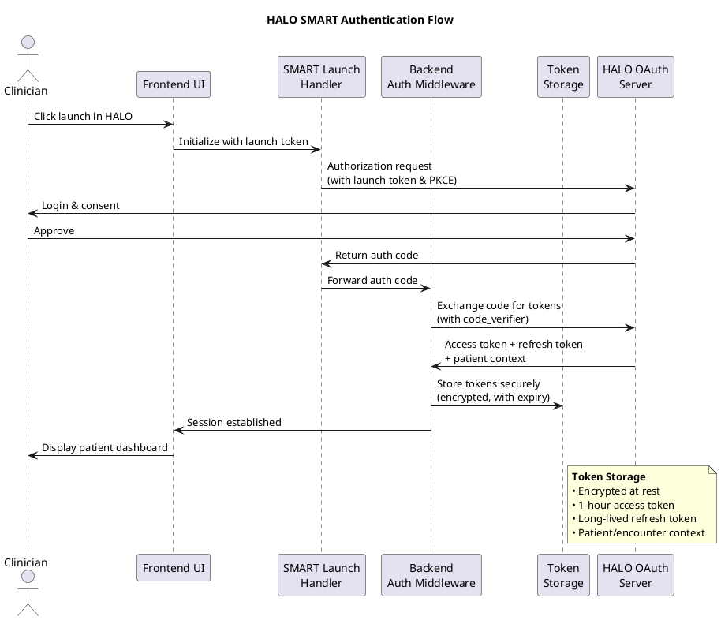

### 3. HALO SMART Integration, Data Access Flow

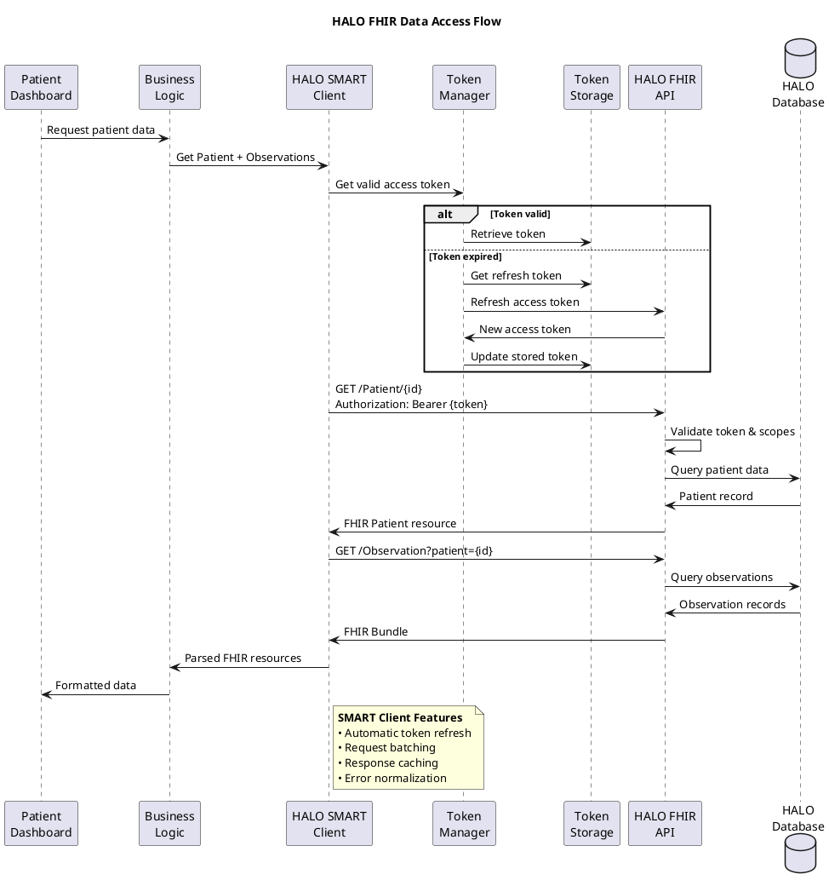

## Security Best Practices

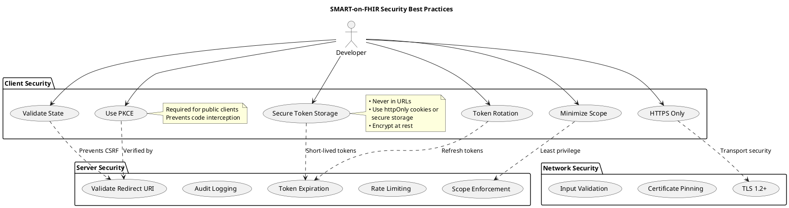

## SMART-on-FHIR Data Flow

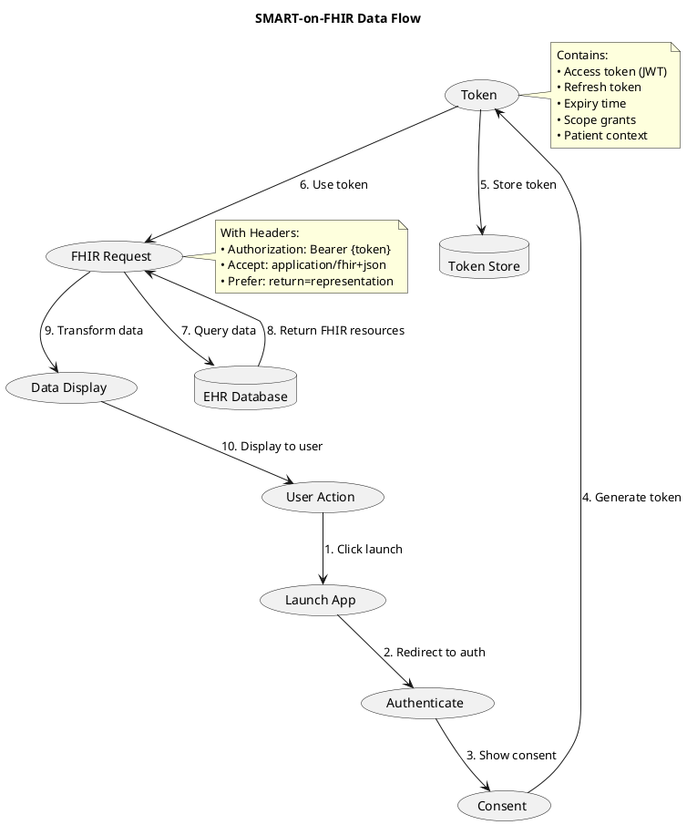